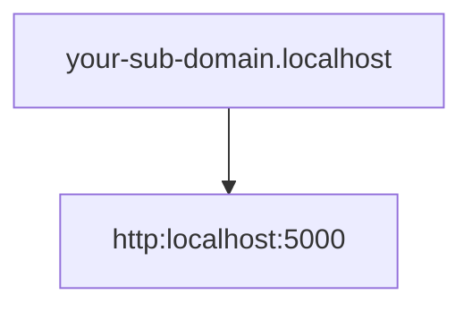

---
aliases:
- /es/la-manera-mas-facil-de-usar-https-en-localhost/
- /es/linux/la-manera-mas-facil-de-usar-https-en-localhost/
authors:
- Eduardo Zepeda
categories:
- linux
- go
coverImage: images/how-to-use-https-in-localhost.jpg
date: '2025-02-26'
description: Ejecuta un servidor local que use https en lugar de http en su máquina
  localhost, incluso sin saber sobre netstat, utilizando un proxy inverso y caddy
keyword: https en localhost
keywords:
- https
- localhost
- caddy
- nginx
- linux
- golang
- go
slug: /linux/la-manera-mas-facil-de-usar-https-en-localhost-mi-opinion/
title: La Manera Más Fácil De Usar Https en Localhost (mi opinión)
---

¿Cómo usar Localhost con https en lugar de http sin necesidad de lidiar con el comando netstat, ni emitir certificados SSL de manera manual? 

## ¿Por qué usar https en localhost lugar de http?

Es bastante común realizar integraciones donde probamos Oauth o algún tipo de integración con alguna aplicación de terceros, y muchas son bastante restrictivas al respecto, por lo que no aceptan integraciones o enviar callbacks a direcciones que no usen https.

Por ejemplo en la creación de apps en las plataformas de desarrollador de X (antes Twitter) o Facebook. ~~Te odiamos zucaritas.~~



Existen múltiples soluciones para usar https en localhost, una de ellas es firmar nuestros propios certificados de manera manual, pero vamos a hacer esto de la manera rápida y fácil.



## Servidor con https en localhost usando Caddy

[Caddy](https://github.com/caddyserver/caddy#?) es un servidor escrito en el [lenguaje de programación Go](), conocido por ser muy sencillo de configurar (pan comido en comparación con [una configuración de Nginx](/es/linux/nginx-keepalive-gzip-http2-mejor-rendimiento-en-tu-sitio-web/)), y que además incluye *https* por defecto.


Es tan sencillo de configurar que solo requiere un simple archivo llamado Caddyfile, sin extensión. Puedes pensar en el archivo anterior como el equivalente de un [Dockerfile en Docker.]()

Instálalo de acuerdo a las instrucciones de tu SO y crea el *Caddyfile*.

``` bash
your-sub-domain.localhost {
    reverse_proxy http://localhost:5000
}

```

El subdominio es solo para poder aislarla del resto de aplicaciones que sirven en localhost. 

La configuración anterior creará un reverse proxy o proxy inverso que redigirá el tráfico en *your-sub-domain.localhost* hacia el puerto 5000 de localhost. Recuerda reemplazar el puerto por el que prefieras.



Finalmente solo basta correr *caddy run*, o *caddy start*, si quieres una ejecución en terminal o detached, respectivamente, en el directorio donde se localiza el *Caddyfile* y caddy creará un *proxy inverso* hacia tu localhost en el puerto que especificaste. Y voilá, estaremos usando https en localhost.

### Solución al error: Caddy "listen tcp :<port_number>: bind: permission denied"

Si al intentar correr caddy obtienes un error de permiso denegado, se debe a que Linux impide que procesos no-root escuchen los puertos principales como el 443 o el 80.

Para permitir que [linux asigne el permiso]() de escuchar en esos puertos a caddy, corre el siguiente comando.


``` bash
sudo setcap CAP_NET_BIND_SERVICE=+eip $(which caddy)
```

### Solución 2 al error: Caddy “listen tcp :<port_number>: bind: permission denied”.

Otra posibilidad es que caddy ya se esté ejecutando, sobre todo si al instalarlo empezó a correr como un servicio, ante lo cual basta con detenerlo y volverlo a ejecutar.

``` bash
caddy stop
caddy start
```

Tras esto deberías poder acceder a your-sub-domain.localhost o a your-sub-domain.localhost:443 a través de *https* en tu navegador, [el comando curl]() o la herramienta que prefieras usar.