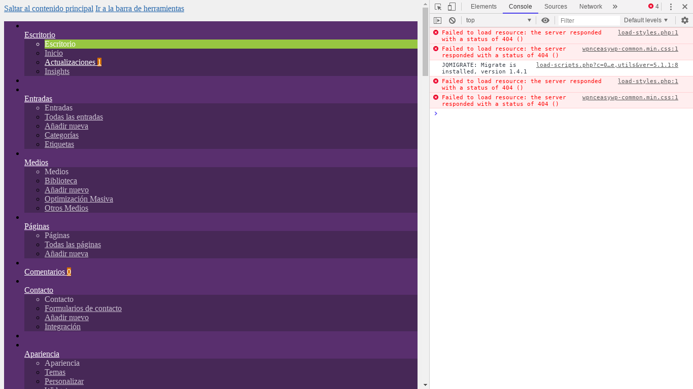

---
aliases:
- /mi-experiencia-con-namecheap-y-easywp
- /mi-experiencia-usando-easywp-y-namecheap
- /es/mi-experiencia-usando-easywp-y-namecheap/
authors:
- Eduardo Zepeda
categories:
- linux
- opinion
coverImage: images/mi_experiencia_con_easy_wp.jpg
date: '2019-05-02'
description: ¿Estás pensando en usar easywp? Entra para leer mi experiencia usando
  la aplicación de easywp para hostear un blog en namecheap.
keywords:
- easywp
- namecheap
- opinion
title: Mi experiencia usando EasyWP y namecheap
---

Hace unas semanas mi SO decidió empezar un blog sobre cafeterías en Wordpress. Tras una corta plática sobre las ventajas y desventajas de las plataformas de registro más populares y resistirse a mi insistentes recomendaciones de usar [DigitalOcean](https://m.do.co/c/a22240ebb8e7#?) o [AWS](https://aws.amazon.com/#?), se dirigió a registrar su dominio en namecheap. Pasados unos minutos de iniciado el proceso de registro en namecheap un banner capturó su atención: [EasyWP](https://www.easywp.com/#?). En las siguientes lineas te cuento mi experiencia usando namecheap con EasyWP

EasyWP prometía un despliegue de WordPress sencillo y sin problemas:

"Imagínate estar en linea en minutos, con todo listo para empezar. Sin preocupaciones sobre tu hosting, navegando viejas interfaces o preguntándote como instalar WordPress. Hacemos todo eso para ti, en un solo click. Con nuestro servicio de hosting administrado de WordPress ahorras tiempo y dinero."

¿Suena bastante convincente no? Ya no más terminals por SSH, instalación de paquetes en GNU/Linux ni bases de datos. Un simple click en la página web de namecheap y todo quedaría listo.

Menú de servicio en easyWP

Tras completar la instalación, mi SO ya tenia funcionando su [blog de WordPress](https://latteporlaciudad.com/#?) y accesible desde cualquier navegador web, hasta ahora todo era miel sobre hojuelas. El siguiente paso en su lista era instalar un certificado SSL, de preferencia uno de Let's Encrypt. Es aquí donde empieza la pesadilla.

## La instalación de EasyWP es sencilla pero restrictiva

[WordPress](https://wordpress.org/#?) es un sistema de gestión de contenidos (CMS) que automatiza y vuelve extremadamente sencillas todas las tareas comunes en el despliegue de un sitio web. Hay plugins para casi todo: SEO, listas de suscripción, prevención de spam, web analytics, certificados SSL, etc. Este último era el que necesitaba usar, pero, una vez instalado el plugin, el certificado SSL era imposible de implementar, el plugin mostraba un error en la pantalla, una y otra vez. Tras verla sufrir por un rato, decidí ayudarla con la instalación, pero fallé.

La instalación de EasyWP no es una instalación normal, es una instalación preconfigurada y que tiene ciertas restricciones; es imposible acceder a otros directorios que no sean los de la instalación de WordPress, por lo que no es posible utilizar el método de ./well-know, **no cuenta con el clásico cPanel ni te permite acceso por SSH.**

Tras un par de horas de investigación me dí cuenta de que la implementación de un certificado SSL proveniente de Let's encrypt era imposible, y que este problema era una situación recurrente en los foros de namecheap. Para no perder más tiempo del necesario en una tarea tan trivial mi SO decidió arrojarle dinero al problema y comprar un certificado SSL directo en namecheap. Que decepción.



## EasyWP tiene problemas con algunos plugins

El siguiente problema ocurrió cuando mi SO decidió personalizar la apariencia de su blog utilizando [GeneratePress](https://generatepress.com/?ref=2020#?). GeneratePress es un plugin que cuenta con una libreria de sitios, estos pueden tomarse como un punto de partida para empezar a modificarlos. [GeneratePress](https://generatepress.com/?ref=2020#?) funciona perfectamente en mi sitio. Sin embargo, por culpa de EasyWP, un "error 400" aparece en la pantalla al intentar instalar un tema de la libreria de sitios. El tema carga, pero con numerosos errores, sin imágenes y con un CSS defectuoso que se comporta diferente si lo comparamos con la previsualización del mismo tema. Una vez más a investigar en los foros y en el buscador. ¿El resultado?, un par de hilos en los foros, ambos sin solucionar, y un cliente bastante molesto. Contactamos con el servicio de atención a clientes pero no pudieron solucionar el error.

Para empeorar aún más la situación, unos días después del reclamo, el día 23 de abril, los servidores que usaban wordpress y easywp estaban teniendo problemas. No se podía acceder al sitio. El problema se solucionó en menos de 24 horas, pero dejó numerosos errores en la instalación nuevamente, esta vez en el los archivos css de la instalación.

Error de carga de archvios css en easywp

## Mi opinión

No recomiendo para nada EasyWP, presenta demasiadas limitaciones que complican el proceso de puesta en marcha y personalización de un sitio de wordpress. Es mejor la clásica instalación tradicional y el acceso a una terminal de comandos. Por otro lado, namecheap como proveedor de nombres de dominio está bastante decente. Es fácil de usar, cuenta con una interfaz amigable y un servicio al cliente bastante atento y amable.

Desconozco la experiencia que otras personas hayan tenido con EasyWP. La experiencia que yo he tenido con EasyWP ha sido decepcionante. Yo recomiendo mil veces una instalación tradicional, ya sea escribiendo el código necesario en la linea de comandos, usando un droplet de [Digital Ocean](https://m.do.co/c/a22240ebb8e7#?) o [AWS](https://aws.amazon.com/#?), o hasta registrando directamente el sitio web en Wordpress. Entra aquí para leer [mi experiencia usando digital ocean](/es/software-architecture/digital-ocean-analisis-y-mi-experiencia-como-usuario/).