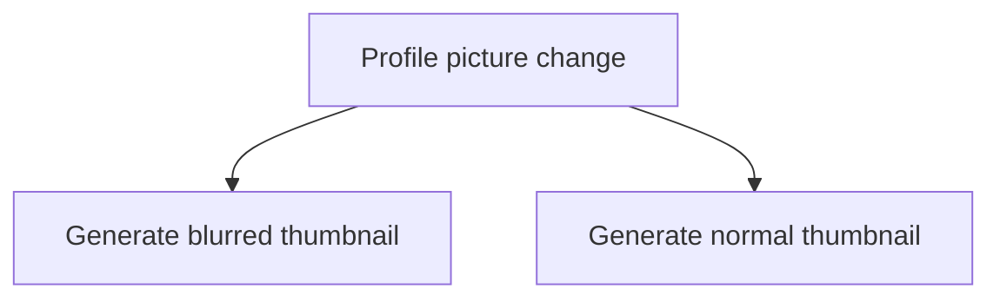

Mientras usaba una app de citas estilo Tinder, de esas en las que, tras un like mutuo, la aplicación pone en contacto a los involucrados, pude notar que, para promocionar su plan premium, usaban fotografías difuminadas para presentarte a las personas que habían presionado el botón de Like en tu perfil.

Tras tener un par de matches pude notar que las fotografías difuminadas pertenecian a cuentas reales, es decir, no eran un set de imágenes genéricas o placeholders.


Sonaba demasiado obvio, de igual forma, abrí la consola de desarrollador de mi navegador y me dirigí al código CSS para comprobar mis sospechas. ¡No puede ser que cometieran un error tan simple!—pensé—Están protegiendo la identidad de las fotografías con un simple *filter: blur*  de CSS.

``` css
.hidden-image {
    filter: blur(4px);
}
```

## Procesamiento de imágenes de esta app de citas

Las imágenes reales eran servidas por el CDN de esta aplicación y posteriormente aplicaban un filtro para ocultarlas, por lo que, para saber quien te había dado like, bastaba con remover el filtro. 

Desafortunadamente era imposible obtener otro dato a partir de las fotografías o de la estructura la URL, [llamadas a la API](/es/caracteristicas-basicas-de-una-api-rest/), o cualquier otro dado; ni el nombre, ni el perfil ni alguna otra información era accesible más que la imagen de perfil.

## ¿Cómo ocultar imágenes en apps de citas?

Ciertamente este era un error de arquitectura, es cierto que es muy sencillo realizar el tratamiento de las imágenes en el frontend, con CSS, pero una mejor opción hubiera sido usar un set de imágenes genéricas para todas las cuentas. 

Otra alternativa hubiera sido generar un thumbnail (o c[ambiar el formato, ejemplo: webp](/es/como-convertir-jpg-a-webp-en-gnu-linux/)) automáticamente cada vez que un usuario actualice su imagen principal de perfil; consume un poco más de espacio pero mantiene las imágenes reales seguras y personaliza la experiencia de cada usuario.



## Explotando el error con una extensión de navegador

Para aprovecharme del error, cree un pequeño script en Javascript y lo integré a una extensión para automatizar el proceso de desbloquearlas cada vez que entraba a la página.

Este pequeño descuido por parte de los desarrolladores duró activo cerca de dos años. Actualmente ya ha sido solucionado por lo que si intentas buscar el error en las páginas principales de citas, ya no lo encontrarás, y esta es también la razón principal por la que decidí publicar sobre ello.

La aplicación modificó el código para su versión web, dejando casi intacta el resto de la UI y escogió crear un thumbnail protegido para cada cuenta, pero procesándolo desde el backend, para que sea completamente imposible conseguir la imagen real.

