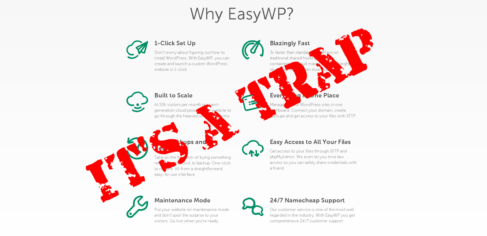
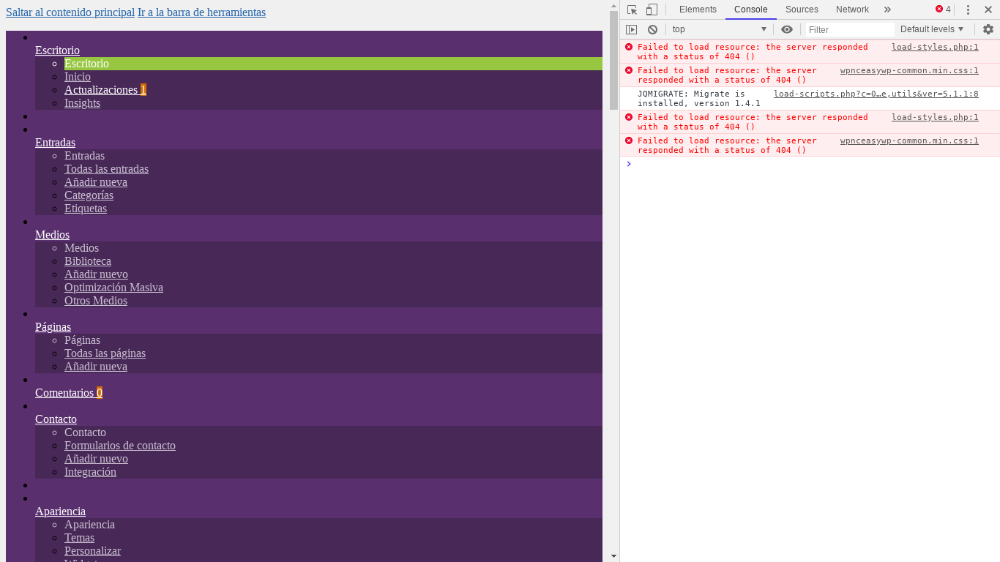

A few weeks ago my SO decided to start a blog about coffee shops on Wordpress. After a short talk about the advantages and disadvantages of the most popular registration platforms and resisting my insistent recommendations to use [DigitalOcean](https://m.do.co/c/a22240ebb8e7) or [AWS](https://aws.amazon.com/), he went to register his domain at namecheap. A few minutes after starting the namecheap registration process, a banner caught his attention: [EasyWP](https://www.easywp.com/). In the following lines I will tell you my experience using namecheap with EasyWP

EasyWP promised a smooth and easy WordPress deployment:

"Imagine being online in minutes, with everything ready to go. No worries about hosting, navigating old interfaces or wondering how to install WordPress. We do all that for you, in one click. With our managed WordPress hosting service you save time and money."

Sounds pretty convincing, doesn't it? No more SSH terminals, GNU/Linux package installation or databases. A simple click on the namecheap web page and everything would be ready.

Service menu in easyWP

After completing the installation, my SO had his [WordPress blog](https://latteporlaciudad.com/) up and running and accessible from any web browser, so far so good. The next step on his list was to install an SSL certificate, preferably one from Let's Encrypt. This is where the nightmare begins.

## EasyWP installation is simple but restrictive.

[WordPress](https://wordpress.org/) is a content management system (CMS) that automates and makes extremely simple all common tasks in the deployment of a website. There are plugins for almost everything: SEO, subscription lists, spam prevention, web analytics, SSL certificates, etc. The latter was the one I needed to use, but, once the plugin was installed, the SSL certificate was impossible to deploy, the plugin displayed an error on the screen, over and over again. After watching her suffer for a while, I decided to help her with the installation, but I failed.

The EasyWP installation is not a normal installation, it is a preconfigured installation with certain restrictions; it is impossible to access directories other than those of the WordPress installation, so it is not possible to use the ./well-know method, **it does not have the classic cPanel nor does it allow access via SSH.

After a couple of hours of research I realized that implementing an SSL certificate from Let's encrypt was impossible, and that this problem was a recurring situation on the namecheap forums. In order not to waste more time than necessary on such a trivial task my SO decided to throw money at the problem and buy an SSL certificate directly from namecheap. What a disappointment.

## EasyWP has problems with some plugins

The following problem occurred when my SO decided to customize the appearance of his blog using [GeneratePress](https://generatepress.com/?ref=2020). GeneratePress is a plugin that has a library of sites, these can be taken as a starting point to start modifying them. [GeneratePress](https://generatepress.com/?ref=2020) works perfectly on my site. However, because of EasyWP, an "error 400" appears on the screen when trying to install a theme from the library of sites. The theme loads, but with numerous errors, no images and a faulty CSS that behaves differently when compared to the preview of the same theme. Once again we investigated in the forums and in the search engine, resulting in a couple of threads in the forums, both unsolved, and a very annoyed customer. We contacted customer service but they were unable to fix the error.

To make the situation even worse, a few days after the claim, on April 23rd, the servers using wordpress and easywp were having problems. The site could not be accessed. The problem was fixed in less than 24 hours, but left numerous errors in the installation again, this time in the installation css files.

Easywp css file loading error

## My opinion

I do not recommend EasyWP at all, it has too many limitations that complicate the process of setting up and customizing a wordpress site. It is better the classic traditional installation and access to a command terminal. On the other hand, namecheap as a domain name provider is pretty decent. It is easy to use, has a user-friendly interface and quite attentive and friendly customer service.

I do not know the experience that other people have had with EasyWP. The experience I have had with EasyWP has been disappointing. I recommend a thousand times a traditional installation, either writing the necessary code in the command line, using a droplet from [Digital Ocean](https://m.do.co/c/a22240ebb8e7) or [AWS](https://aws.amazon.com/), or even registering the website directly in Wordpress. Click here to read [my experience using digital ocean](/digital-ocean-analysis-and-my-experience/).