---
aliases:
- /en/i-explain-the-model-context-protocol-or-mcp-used-to-interact-with-llms/
date: '2025-03-31T18:00:32-06:00'
title: 'Understand the Model Context Protocol or MCP once and for all'
categories:
- artificial intelligence
- software architecture
coverImage: "images/context-model-protocol-explanation.jpg"
description: If you have difficulties understanding the Model Context Protocol (MCP), I will explain why it was created, what it is used for and also how it works internally
keyword: model context protocol
keywords:
- artificial intelligence
- mcp
- llm
- fine tuning
- ai
authors:
- 'Eduardo Zepeda'
---

If you're struggling to understand the Model Context Protocol, I feel you, I watched a lot of videos on it, but I just couldn't understand it, so I took my notes about it and turned it into a post so you can understand it effortless.

## Why was the Model Context Protocol created?

One of the most convenient uses of LLMs is to use them to analyse or process our own data, for which there are several options, such as [LLM fine-tuning](/en/fine-tuning-a-llm-small-practical-guide-with-resources/) or RAG, or manually passing our data as context as part of the prompt.

Anthropic members noticed this and proposed to standardise this process by creating a protocol for providing context to LLMs. This protocol, called the Model Context Protocol, is being sold as the next AI revolution, will it be [another AI bubble](/en/the-rise-and-fall-of-the-ai-bubble/) or a completely groundbreaking paradigm?

MCP exists to act as a bridge between an LLM and contextual information, in a standardised and agnostic way. The key word here is *standardisation*.

## How does the Model Context Protocol or MCP work?

The MCP conforms to a client-server architecture.

### Client role in MCP

A client that implements the Model Context Protocol can connect to an LLM and a set of MCP services or servers that provide it with the appropriate context it needs.


A MCP client represents the user interface to which we would normally pass our prompts; this interface may be Claude Desktop or some other equivalent.

``` mermaid
architecture-beta
    group api(logos:anthropic-icon)[MCP]

    service llm(logos:serverless)[LLM] in api
    service whatsapp(logos:whatsapp-icon)[MCP server Whatsapp] in api
    service mcp(logos:anthropic-icon)[MCP Client] in api
    service telegram(logos:telegram)[MCP server Telegram] in api
    service github(logos:github-icon)[MCP server Github] in api
    junction junctionCenter

    llm:L <--> R:mcp
    mcp:L <-- R:junctionCenter
    whatsapp:B <-- T:junctionCenter
    telegram:T <-- B:junctionCenter
    github:R <-- L:junctionCenter
```



### Server role in MCP

A server is responsible for reading information, whether from a file, a database, a web service (via an API), or any other accessible source. To do this, it will use certain predefined resources or tools that restrict what the client can or cannot read or do.

``` mermaid
architecture-beta
    group api(logos:anthropic-icon)[MCP]

    service server(server)[Whatsapp Server] in api
    service whatsapp(logos:whatsapp-icon)[MCP Whatsapp] in api


    server:L <--> R:whatsapp
```



#### How does the MCP know what it can read or do from a server?

To know what resources a service or server can access or modify, they implement a similar functionality [Reflect in Go and GraphQL](/en/go-with-reflect-discover-how-reflect-can-boost-your-programs-flexibility/), with which they expose information about themselves.

For example, in the [CCM Github repository](https://github.com/modelcontextprotocol/servers/tree/main/src/github) we see the list of actions that can be performed, as well as the required inputs for each of them.


Internally there is no magic at all, the services interact with the servers or information sources through their respective APIs. Take a look at the code that executes the *listCommits* action shown in the image above.

Notice how there is an initial validation using the familiar *Zod* library, but at the end of the snippet there is a function call that makes a request to a Github URL.

``` javascript
import { z } from "zod";
import { githubRequest, buildUrl } from "../common/utils.js";

export const ListCommitsSchema = z.object({
  owner: z.string(),
  repo: z.string(),
  sha: z.string().optional(),
  page: z.number().optional(),
  perPage: z.number().optional()
});

export async function listCommits(
  owner: string,
  repo: string,
  page?: number,
  perPage?: number,
  sha?: string
) {
  return githubRequest(
    buildUrl(`https://api.github.com/repos/${owner}/${repo}/commits`, {
      page: page?.toString(),
      per_page: perPage?.toString(),
      sha
    })
  );
}
```

So far I have been talking about resources and actions, but in the CMP these two actions which are in charge of giving context to an LLM have names. Of course they were not going to miss the opportunity to give some branding to their protocol.



## Context types: Resources and Tools in the Model Context Protocol

The MCP context types are divided into:
- **Resources**.
- **Tools**.
- Sampling, performs queries to other models, less common.
- Prompts, prompts templates, less common.

### What is the Resources context type?

You can think of Resources as [a *GET* request to a REST API](/en/basic-characteristics-of-an-api-rest-api/), **intended to get information, without modifying anything**. 

### What is the type of context Tools?

On the other hand, a tool would be the equivalent of a *POST*, *UPDATE*, *DELETE* or *PATCH* request.

Think of tools as a mechanism to allow a client to make modifications to your servers or services. 

If you are more familiar with [GraphQL-like APIs](/en/how-to-create-a-graphql-api-in-django-rapidly-using-graphene/), you can think of resources and tools as queries and mutations, respectively.

## How does the MCP communicate with servers?

The MCP has two communication paradigms, one is via STDIO or Standard Input Output, ~~right out of your C programming nightmares #include <stdio.h>~~ ideal for local communication, for example with a local database such as Postgres or SQLite.

The other type is SSE or Server Sent Events, which does *POST* request streaming (similar [to the gRPC streaming requests I've already told you about](/en/fast-and-performant-apis-using-grpc-and-protobuffers/)), ideal of course for communications that are not in the same environment.

## The MCP protocol is stateful 

Another aspect worth noting is that, to date, [the protocol requires a persistent connection between client and server](https://github.com/modelcontextprotocol/specification/discussions/102#?), so this can be a drawback for auto-scalable architectures that adapt to demand, as well as moving in the opposite direction in a world that is striving to become stateless.

Just as a reminder:

| Aspect          | Stateless Application                                                                     | Stateful Application                           |
| --------------- | ----------------------------------------------------------------------------------------- | ---------------------------------------------- |
| Server State    | No stored client state between requests                                                   | Maintains client state across requests         |
| Session Data    | Client-side storage (e.g., cookies, tokens)                                               | Server-side storage (e.g., session DB, memory) |
| Scalability     | Horizontally scalable (no affinity needed)                                                | Requires sticky sessions or state replication  |
| Complexity      | Simpler to implement and scale                                                            | More complex due to state management           |
| Fault Tolerance | Resilient (failed requests can go to any server)                                          | Vulnerable to server failures                  |
| Examples        | [REST APIs (when properly designed), HTTP/HTTPS](/en/rest-api-best-practices-and-design/) | Traditional monoliths, WebSocket apps          |


At the moment it is a matter of debate whether it will stay that way, there is no certainty whether stateless versions will be implemented or if there will be changes to it. After all, this protocol is new and who knows what the future holds for the AI world, giants can rise and fall in months, [as Devin AI](/en/devin-ai-the-supposed-replacement-for-programmers/) and Rabbit R1 did.

If you want to know more read the [official Model Context Protocol documentation](https://github.com/modelcontextprotocol) and the introduction to the [MCP](https://www.anthropic.com/news/model-context-protocol)