Uno de los usos más útiles de los LLM es consultarles sobre nuestros propios datos, para eso hay varias opciones, tales como realizar [fine-tuning de un LLM](/es/fine-tuning-de-un-llm-guia-practica-con-recursos/) o RAG o pasárselos como contexto en la petición. 

Los integrantes de Anthropic proponen estandarizar este proceso y crear un protocolo para dotar de contexto a los LLM. Este protocolo, de nombre Model Context Protocol, se vende como la siguiente revolución de AI, ¿será [esta otra burbuja de AI](/es/el-auge-y-la-caida-de-la-burbuja-de-ai/) o una afirmación completamente fiel a la realidad?

MCP existe para servir como un puente entre un LLM y la información relacionada al contexto, esto de una forma estandarizada y agnóstica. Aquí la palabra clave es "estandarización".

## ¿Cómo funciona el Model Context Protocol o MCP?

El MCP se ajusta a una arquitectura de cliente-servidor.

### Rol del cliente en el MCP

Un cliente que implemente el Model Context Protocol puede conectarse a un LLM y a una serie de servicios o servers MCP que le proveeran de la información de contexto que necesita.


El cliente representa la interfaz de usuario a la que nosotros le pasaremos nuestros prompts, esta interfaz puede ser Claude Desktop o alguna otra opción.

``` mermaid
architecture-beta
    group api(logos:anthropic-icon)[MCP]

    service llm(logos:serverless)[LLM] in api
    service whatsapp(logos:whatsapp-icon)[MCP server Whatsapp] in api
    service mcp(logos:anthropic-icon)[MCP Client] in api
    service telegram(logos:telegram)[MCP server Telegram] in api
    service github(logos:github-icon)[MCP server Github] in api
    junction junctionCenter

    llm:L <--> R:mcp
    mcp:L <-- R:junctionCenter
    whatsapp:B <-- T:junctionCenter
    telegram:T <-- B:junctionCenter
    github:R <-- L:junctionCenter
```



### Rol de un server en el MCP

Un server se encargará de leer información, ya sea un archivo, una base de datos, un servicio web (por medio de una API) o cualquier otro origen que sea accesible. Para hacerlo echará de mano de ciertos recursos o herramientas previamente predefinidos, que restringen lo que el cliente puede o no puede leer o hacer.

``` mermaid
architecture-beta
    group api(logos:anthropic-icon)[MCP]

    service server(server)[Whatsapp Server] in api
    service whatsapp(logos:whatsapp-icon)[MCP Whatsapp] in api


    server:L <--> R:whatsapp
```



#### ¿Cómo sabe el MCP qué puede leer o hacer de un server?

Para saber que recursos puede leer o modificar un servicio o server, estos implementan una funcionalidad similar [´ Reflect en Go y GraphQL](/es/go-con-reflect-descubre-como-la-reflexion-puede-impulsar-la-flexibilidad-de-tu-programa/), con la cual exponen información sobre ellos mismos.

Por ejemplo en el [repositorio de Github del MCP](https://github.com/modelcontextprotocol/servers/tree/main/src/github) vemos la lista de acciones que se pueden llevar a cabo, así como los inputs requeridos para ello.


Internamente no hay nada mágico, los servicios interactuan con los servidores o fuentes de información por medio de sus respectivas APIs. Observa el código que lleva a cabo la acción listCommits que aparece en la imagen de arriba.

Aprecia como hay una validación inicial usando la conocida librería *Zod*, pero al final existe una llamada a una función para realizar una petición a una URL de Github.

``` javascript
import { z } from "zod";
import { githubRequest, buildUrl } from "../common/utils.js";

export const ListCommitsSchema = z.object({
  owner: z.string(),
  repo: z.string(),
  sha: z.string().optional(),
  page: z.number().optional(),
  perPage: z.number().optional()
});

export async function listCommits(
  owner: string,
  repo: string,
  page?: number,
  perPage?: number,
  sha?: string
) {
  return githubRequest(
    buildUrl(`https://api.github.com/repos/${owner}/${repo}/commits`, {
      page: page?.toString(),
      per_page: perPage?.toString(),
      sha
    })
  );
}
```

Hasta ahora he estado hablando de recursos y acciones, pero en el MCP estas dos acciones que se encargan de darle contexto a un LLM tienen nombres, por supuesto no iban a perder la oportunidad de darle branding a su protocolo.

## Tipos de contexto: Resources y Tools

Los tipos de contexto del MCP se dividen en:
- **Resources**.
- **Tools**.
- Sampling, realiza queries a otros modelos, menos común.
- Prompts, plantillas de promps, menos común

### ¿Cuál es el tipo de contexto Resources?

Puedes pensar en los Resources como [una petición *GET* de una API REST](/es/caracteristicas-basicas-de-una-api-rest/), **destinada a obtener información, sin modificar nada**. 

### ¿Cuál es el tipo de contexto Tools?

Por otro lado, una tool sería el equivalente de una petición *POST*, *UPDATE*, *DELETE* o *PATCH*. 

Piensa en las tools un mecanismo para permitir que un cliente realice modificaciones en tu servidor o servicio. 

Si te sientes más familiarizado con [APIs del tipo GraphQL](/es/graphql-y-django-con-graphene/), puedes pensar en resources y tools como queries y mutations, respectivamente.

## ¿Cómo se comunica el MCP con los servers?

El MCP tiene dos paradigmas de comunicación, uno de ellos es por medio del STDIO, o Standard Input Output, ~~sacado directamente de tus pesadillas programando en C #include <stdio.h>~~ ideal para comunicaciones locales, por ejemplo con una base de datos local, como Postgres o SQL.

El otro tipo es SSE o Server Sent Events, el cual realiza streaming de peticiones *POST* (similar [al streaming de peticiones en gRPC del que te hablé](/es/libera-el-potencial-de-tu-api-con-grpc-y-protobuffers/)), ideal obviamente para comunicaciones que no ocurren en el mismo entorno.

## El protocolo MCP es Stateful

Otro aspecto a destacar, es que, a la fecha, [el protocolo requiere una conexión persistente entre cliente y servidor](https://github.com/modelcontextprotocol/specification/discussions/102#?), por lo que puede ser complicado para arquitecturas autoescalables que se adaptan a la demanda, además de ir completamente en contra de la corriente en un mundo que se esmera en volverse stateless. 

Solo para refrescar tu memoria:

| Aspecto             | Aplicación Stateless (Sin Estado)                                                                 | Aplicación Stateful (Con Estado)                          |
| ------------------- | ------------------------------------------------------------------------------------------------- | --------------------------------------------------------- |
| Estado del Servidor | No almacena estado del cliente entre solicitudes                                                  | Mantiene estado del cliente entre solicitudes             |
| Datos de Sesión     | Almacenamiento en el cliente (ej. cookies, tokens)                                                | Almacenamiento en el servidor (ej. BD de sesión, memoria) |
| Escalabilidad       | Escalabilidad horizontal (sin afinidad requerida)                                                 | Requiere sesiones persistentes o replicación de estado    |
| Complejidad         | Más simple de implementar y escalar                                                               | Más compleja debido a la gestión del estado               |
| Tolerancia a Fallos | Resiliente (las solicitudes pueden ir a cualquier servidor)                                       | Vulnerable a fallos del servidor                          |
| Ejemplos            | [APIs REST (diseñadas correctamente), HTTP/HTTPS](/es/buenas-practicas-y-diseno-de-una-api-rest/) | Aplicaciones monolíticas tradicionales, WebSockets        |

Por ahora es una discusión si permanecerá así, se implementarán versiones stateless o si habrá cambios al respecto. Después de todo este protocolo es nuevo y quien sabe que vaya a pasar en el futuro en el mundo de la AI, para ejemplos tenemos casos [como el de Devin AI](/es/devin-ai-el-supuesto-reemplazo-de-los-programadores/) y Rabbit R1.

Si quieres saber más dale una leída a la [documentación oficial del Model Context Protocol](https://github.com/modelcontextprotocol) y [la introducción al MCP](https://www.anthropic.com/news/model-context-protocol)