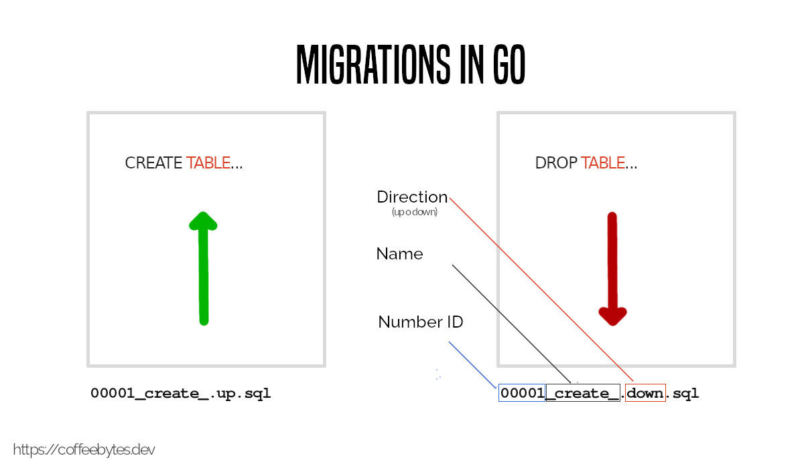
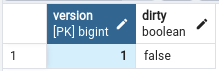

In frameworks like [Django, migrations are created automatically](/en/why-should-you-use-django-framework/), from the models. However, in languages like go, as long as we are not using an ORM, migrations will be done manually.



## What is a database migration?

A migration is an abstraction to manage the state and changes that occur in a database. Instead of executing SQL statements one by one manually, we automate the process by writing all the necessary SQL and running it automatically.

A migration consists of two files with SQL statements:

* file up: To make changes in the database.
* down file: To revert changes in the database.

For this case they are called up and down, but you could give them any other names; such as forward and backward, or next and previous.

For example:



### Migrations are complementary

Notice how the migrations are reversible and complementary; one performs an action and the other reverts it.

Following this logic we can make changes to the database and then revert them.

These two files can be generated automatically (as in the case of Django, from the models) or we can write them directly in SQL, as in the case of go.



## Migrate installation

To handle migrations we are going to use a tool called _migrate_, written in go.

Migrate can be downloaded directly from their [github releases section](https://github.com/golang-migrate/migrate/releases).

``` bash
curl -L https://github.com/golang-migrate/migrate/releases/download/v4.15.2/migrate.linux-amd64.tar.gz | tar xvz
mv migrate.linux-amd64 $GOPATH/bin/migrate
```

In new versions of Go feel free to just use:

``` bash
go install -tags 'sqlite3' github.com/golang-migrate/migrate/v4/cmd/migrate@latest
```

You should then be able to see which version you have installed.

``` bash
migrate -version
4.15.2
```

## Migration files creation with migrate in Go

To create the pair of migration files, which I told you about earlier, we run the following command:

``` bash
migrate create -seq -ext=.sql -dir=./migrations <migration_name>
```

I explain what each flag does:

* seq: indicates that it will be sequential, so that it begins with 000001 and continues until 00000n; the total of migrations that we have.
* dir: will indicate the directory
* ext: the extension of the file, in this case sql.
* At the end the name we want the migration to have. I will use create_first_table for this example.

After executing the command, you will have two migration files, one with extension _.up.sql_ and the other with extension _.down.sql_ inside the migrations folder.

``` bash
ls
000001_create_first_table.up.sql 000001_create_first_table.down.sql
```

These files must be edited manually and the SQL statements must be placed inside them.

### Example of migrations in go with postgres

For example, to create a hypothetical table _users_ in a postgres database:

For the up:

``` sql
CREATE TABLE "users" ("id" serial NOT NULL PRIMARY KEY, "name" varchar(50) NOT NULL);
```

And, to reverse the above, there is the down file:

``` sql
DROP TABLE "users";
```

Again, notice how both SQL statements are complementary; one creates a table and the other deletes it. But you can put more than one statement and they can be anything you want, an index, a constraint, a routine, etc.

## Execute migrations with migrate in Go

So far we have only created the migration files, but we have not let the program know where the database is.

Before making any changes to the database, we will need to indicate the access address to the database in the following format [engine]://[user]:[password]@[domain]/[database].

And, obviously, the most convenient and safest thing to do is to save this address in [an environment variable](/en/linux-basic-commands-passwd-du-useradd-usermod-fdisk-lscpu-apt-which/).

``` bash
DATABASE=[engine]://[user]:[password]@[domain]/[database]
```

Now we have a database to connect to.

### Apply migrations

To apply all migrations we will use the up command. Migrate will automatically detect the numbering and run _all migrations up_ in ascending order.

``` bash
migrate -path=./migrations -database=$DATABASE up
```

### Remove migrations

On the other hand, to revert all migrations we will use the down command. Migrate will automatically detect the numbering and run _all migrations down_ in descending order.

``` bash
migrate -path=./migrations -database=$DATABASE down
```

### Go to a specific migration

Whereas, if we want to go to a specific migration, we will use the goto command followed by the migration number to which we want to take the database.

``` bash
migrate -path=./migrations -database=$DATABASE goto <migration number>
```

Migrate will detect the active migration and run _the corresponding up or down migrations_ to bring the database to that state.

## The migration table

And how does the tool know which migration it is in? After each change we make to the database, the migrate tool will store the state of our database in a table called _schema_migrations_ that looks like this:



### Column version

Notice how the version column stores the status of the current migration. This way migrate records which version of the migrations it is in.

### Dirty column

In addition, this table also contains a column called _dirty_ that indicates if there was any conflict in the migration. In the latter case it will be necessary to repair it manually and force a new state in the table.

``` bash
migrate -path=./migrations -database=$DATABASE force 1
```

## Migrations to remote databases

The Migrate tool also supports remote migrations such as:

* Filesystem
* io/fs
* Go-Bindata
* pkger
* GitHub
* GitHub Enterprise
* Bitbucket
* Gitlab
* AWS S3
* Google Cloud Storage

Each of these endpoints requires a specific syntax. For example, the Amazon S3 endpoint looks like this:

``` bash
migrate -source="s3://<bucket>/<path>" -database=$DATABASE up
```

With this you already know the basics about migrations and you probably also value a lot more tools and [ORMs that take care of this automatically, such as Django](/en/why-should-you-use-django-framework/), Ruby on Rails, South, etc.