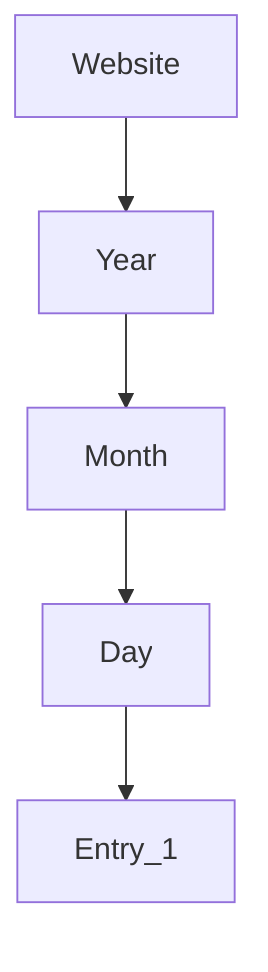
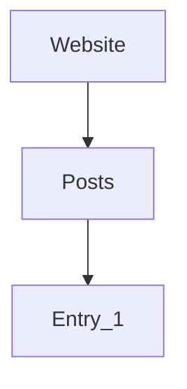

Hace unos años, migré mi sitio web un par de veces, primero de Wordpress a Frontity (Un framework de wordpress en React) y luego de Frontity a Hugo. No me arrepiento para nada de mi decisión, pero cometí unos cuantos errores respecto al SEO que probablemente puedas evitar si tomas en cuenta lo que estoy a punto de contarte.

## ¿Por qué debería importarte el SEO en el desarrollo web?

El SEO es el factor que determina si un sitio web aparece primero en los resultados de búsqueda de un motor de búsqueda (casi siempre Google) o si es sepultado en las últimas posiciones, recibiendo poco o nulo tráfico y condenando al negocio que representa a la quiebra, o si es un proyecto personal, al olvido.

Y no estoy hablando de diferencias sútiles, estoy hablando de diferencias abismales.

A riesgo de sonar redundante, lo repetiré nuevamente: el tráfico de un sitio web es mucho más importante que la eficiencia, el aspecto o el lenguaje o framework con el que esté hecho, sí, aunque lo escribas en C++ o directo en ensamblador.

### ¿El SEO sirve? Los desarrolladores web suelen ignorarlo

La mayoría de los desarrolladores poseen un background ingenieril, donde se valora la eficiencia, las buenas prácticas y se pasa por alto el aspecto comercial de un sitio web. 

De ahí que cuando un desarrollador web lanza sus proyectos personales, suele ignorar por completo el SEO y se centra, [erróneamente, en optimizar su sitio web al máximo](/es/no-te-obsesiones-con-el-rendimiento-de-tu-aplicacion-web/), generalmente consiguiendo un sitio web extremadamente rápido, eficiente, e incluso visualmente atractivo, pero sin tráfico.

## Mis errores al migrar un sitio web sin considerar el SEO

Cuando migré el blog lo primero que ignoré fueron las múltiples consecuencias de hacerlo abruptamente. Para empezar el sitemap, posteriormente la estructura de las URL y por último, como cereza del pastel, la ausencia de un schema.

### La presencia de un sitemap es crucial en el SEO

El sitemap que tenía mi sitio web anterior se encontraba en una dirección específica, cuando migré el sitio web esa dirección cambió, por lo que Google fue incapaz de encontrar el nuevo sitemap, ¿qué sucedió? Google indexó las páginas como pudo y quiso y, como seguramente ya sabrás, no fue la mejor manera y sufrí las consecuencias. 

Una noche mi celular vibró al ritmo de la cascada de advertencias que Google Search Console mandaba en forma de  notificaciones de mi celular.



¿Cómo pude evitarlo? Entrando en Google search console y reemplazando la vieja dirección del sitemap por la nueva y solicitándole a los sistemas de google una nueva lectura.

### Como me di cuenta de que la estructura de las URLs es importante en el SEO

Pero mi pesadilla no terminó ahí, tras la migración de Wordpress a Hugo Google detectó una gran cantidad de errores 404 al acceder a las viejas URLs y, como resultado de la consecuente penalización, mi tráfico disminuyo cerca de un 70%.

¿Por qué sucedió esto? Imagínate que los motores de búsqueda ven tu sitio web con una estructura URL como la siguiente.

Y cuando tu realizas la migración, la estructura cambia;

Lo importante a recordar aquí es que los motores de búsqueda no tienen una manera de reconocer fácilmente que una entrada es exactamente la misma que otra si ha cambiado de ubicación, sobre todo si esta migración conlleva cambios ligeros en la página. Si bien es cierto que Google puede detectar contenido duplicado y es capaz de renderizar una página web, eso no significa que "vea" las entradas de manera visual, como un humano lo haría, en sus entrañas sigue recibiendo y analizando texto en forma de HTML.

¿Cómo pude haber evitado esa caida de tráfico? Por medio de una redirección, en este caso bastaba con indicarle a Google que si accedia a */2020/12/12/entry_1* debía redirigirse a */posts/entry_1*, ¿y cómo? retornando una respuesta HTTP 302 o 308, Found or Permanent redirect, respectivamente.

### La ausencia del marcado de datos estructurados o Schema 

Cuando usaba Wordpress el plugin Yoast se encargaba del marcado de datos estructurados, pero en Hugo esto tiene que realizarse de forma manual, por lo que mi sitio web duró un tiempo sin estos datos estructurados, ¿el resultado? Una penalización de google en forma de una disminución de las impresiones, y por ende el tráfico de mi sitio web.



¿Cómo pude evitar este error? Simplemente añadiendo un esquema de datos estructurados y leyendo al respecto en [la págia oficinal de schema org](https://schema.org)

Esa es la tráfica historia de como disminuí mi tráfico siendo un lego en el SEO. Pero esta historia tiene un final feliz, tras este incidente me puse a leer al respecto y aprendí muchísimas cosas que puse en práctica tras el incidente. 

No me había dado la oportunidad de tocar este tema en el blog, porque semánticamente está bastante alejado de lo que la mayoría de devs entiende por desarrollo web, aunque realmente no lo sea. 

Pero por fin me di la oportunidad de plasmar estos erorres en una entrada y si pueden ahorrarte un par de dolores de cabeza, pues que mejor.