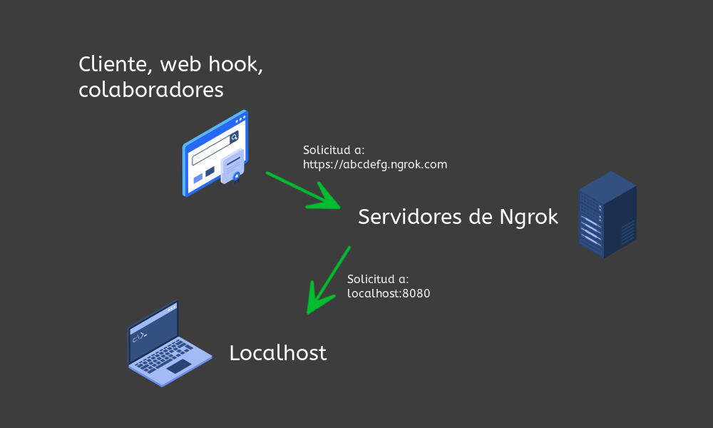
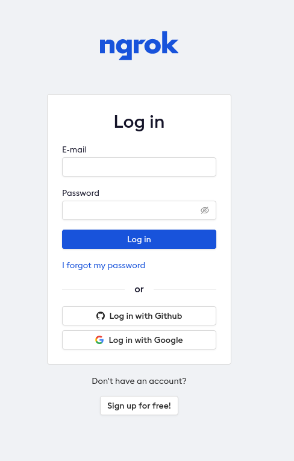
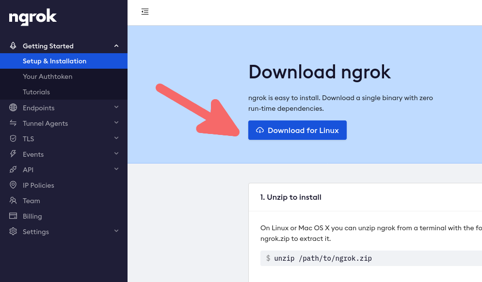
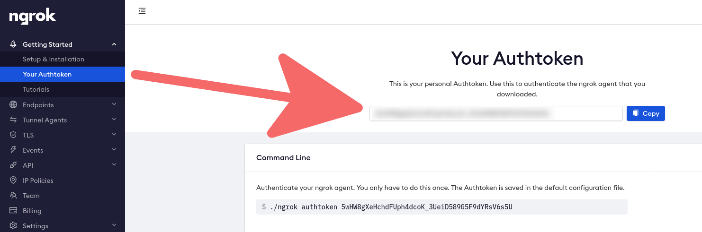
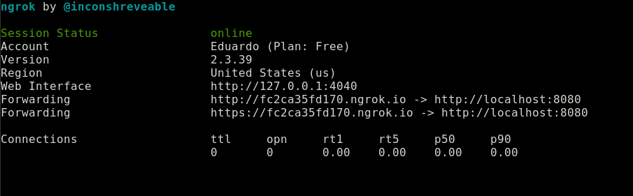
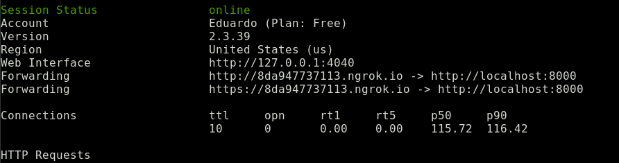
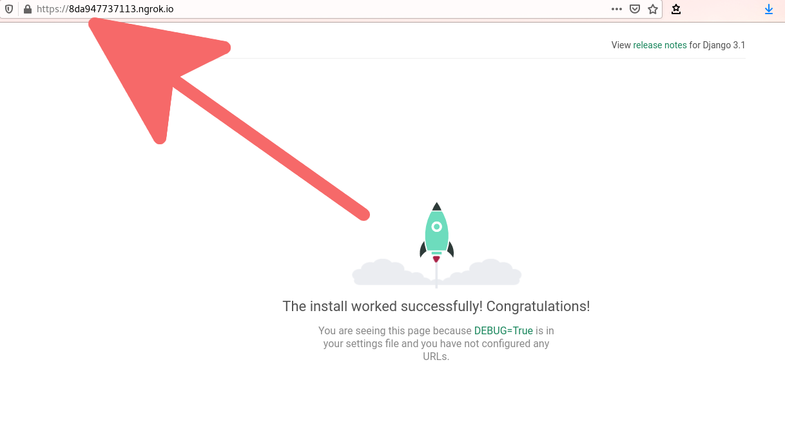

I ran into Ngrok trying to redirect a Mercado Pago payment notification to my localhost, for testing purposes. It worked more or less like this. Mercado Pago gave you a url address to redirect the buyer to make the payment. Once the payment was finished, Mercado Pago would make an HTTP request to any url address that you indicated and would send by POST the results of the payment attempt. The problem is that Mercado Libre does not send notifications to localhost.

## Ngrok allows you to share your localhost externally

What Ngrok does is to serve as a tunnel that redirects any web request, through its own urls, to your localhost. This can be used to test a webhook or receive notifications, a very common task in payment gateways, share your localhost with collaborators without needing your own domain, etc.



## Ngrok installation

To install Ngrok let's go to [their website](https://ngrok.com/) and create an account or log in. You can use Github or Gmail if you don't want to register.



Now let's download the program, we must be careful to choose the right one for our operating system, I will use the GNU/Linux one.



Having the program is not enough, we need a token to be able to use it.



Now that we have the token and the program downloaded let's use Ngrok and use the token to create a configuration file automatically. In some cases you can skip this step.

```bash
unzip ngrok-stable-linux-amd64.zip
./ngrok authtoken tu_token_secreto
```

## Basic use of ngrok

To run ngrok on GNU/Linux just run the executable, followed by the http option and a port number. I used 8080 but you can use the one you prefer.

```bash
./ngrok http 8080
```

If everything worked correctly, you will see the following information on your terminal



What does the above display mean? It means that all requests made to http://fc2ca35fd170.ngrok.io; that is, to the fc2ca35fd170 subdomain of the ngrok domain, will be redirected to your localhost, specifically to port 8080. And that's it, it's that simple and easy to use.

## Example with Django

For this example I redirected a Django application on port 8000, instead of port 8080.

If you have no idea how to use Django I have some book recommendations: [Django la guia definitiva](/blog/the-definitive-guide-to-django/) and [Django by example](/blog/learning-django-through-the-book-django-by-example-my-review/).

Remember to add the domain, with its subdomain to the ALLOWED_HOSTS variable in the configuration file.

```python
# tu_proyecto/settings.py
ALLOWED_HOSTS = ['8da947737113.ngrok.io']
```

Let's run the Django server, by default it will run on port 8000

```bash
python manage.py runserver
```

If we now run ngrok, specify port 8000 and access the address it indicates, we will see our application.

```bash
ngrok http 8000
```



Observe the domain in which our Django application is running.



We are able to make our application accessible to anyone who has the url that ngrok provides us with!