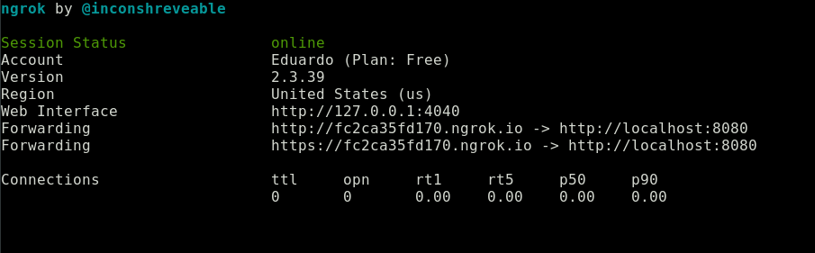

---
aliases:
- /ngrok-tu-localhost-accesible-desde-internet
authors:
- Eduardo Zepeda
categories:
- linux y devops
coverImage: images/ngrok-coffee-bytes.jpg
coverImageCredits: Créditos https://www.pexels.com/es-es/@pepecaspers/
date: '2021-04-29'
description: Ngrok vuelve público tu localhost, ya sea para hacer testeo de respuestas
  a tus endpoints o mostrarle avances a tus clientes.
keywords:
- linux
title: Ngrok, tu localhost accesible desde internet
---

Me topé con Ngrok intentando redirigir la notificación de un pago de Mercado Pago a mi localhost, para hacer pruebas. Funcionaba más o menos así: Mercado pago te otorgaba una dirección url a donde redigir al comprador para efectuara el pago. Una vez terminado el pago, Mercado Pago hacía una petición HTTP a cualquier dirección url que tú le indicaras y mandaba por POST los resultados del intento de pago. El problema es que mercado libre no manda notificaciones a localhost.

## Ngrok te permite compartir tu localhost al exterior

Lo que hace Ngrok es servir como un túnel que redirige cualquier petición web, a través de sus propias urls, a tu localhost. Esto puede usarse para probar un webhook o recibir notificaciones, una tarea bastante común en pasarelas de pago, compartir tu localhost con colaboradores sin necesidad de un dominio propio, etc.


## Instalación de Ngrok

Para instalar Ngrok entra directamente en [su sitio web](https://ngrok.com/) y creemos una cuenta o iniciemos sesión. Puedes usar Github o Gmail si no quieres registrarte.

## Uso básico de ngrok

Para ejecutar ngrok en GNU/Linux basta con correr el ejecutable, seguido de la opción http y un número de puerto. Yo usé 8080 pero puedes usar el que prefieras.

```bash
./ngrok http 8080
```

Si todo funcionó correctamente verás algo parecido a est en tu terminal



¿Qué significa la pantalla de arriba? Significa que todas las peticiones que se hagan a http://fc2ca35fd170.ngrok.io; es decir, al subdominio fc2ca35fd170 del dominio de ngrok, se redirigirán a tu localhost, específicamente al puerto 8080. Y es todo, así de simple y fácil de usar.

## ¿Cómo usar ngrok con Django?

Para este ejemplo redigirí una aplicación de Django en el puesto 8000, en lugar del puerto 8080.

Si no tienes idea de como usar Django tengo algunas recomendaciones de libros: [Django la guia definitiva](/es/la-guia-definitiva-de-django/) y [Django by example](/es/aprender-django-con-django-by-example-mi-resena/).

Recuerda agregar el dominio, con su subdominio a la variable ALLOWED\_HOSTS del archivo de configuración.

```python
# tu_proyecto/settings.py
ALLOWED_HOSTS = ['8da947737113.ngrok.io']
```

Corramos el servidor de Django, por default correrá en el puerto 8000

```bash
python manage.py runserver
```

Si ahora ejecutamos ngrok, especificamos el puerto 8000 y accedemos a la dirección que nos indica, visualizaremos nuestra aplicación.

```bash
ngrok http 8000
```


Observa el dominio en el que se ejecuta nuestra aplicación de Django.


¡Logramos poner nuestra aplicación al acceso de cualquier persona que tenga la url que ngrok nos provee!