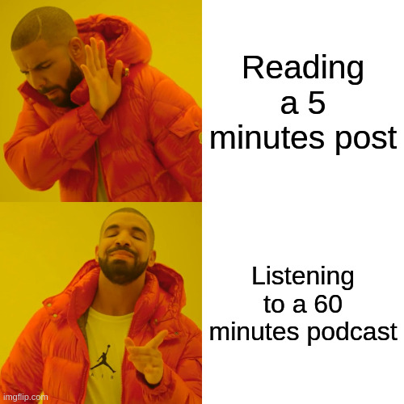
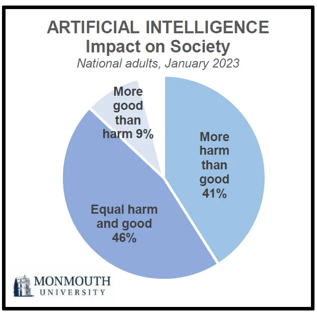

I just tried Google Notebooklm, and this feeling of novelty and excitement took over my mind. Similar to a child receives what he asked for for Christmas. However, I didn't ask for this tool to exist, but here it is anyway.

## Google Notebooklm lets you create a podcast from your notes

You've probably already heard of this tool, and if you haven't, I'll explain below. 

Google Notebooklm is an AI tool that becomes an expert in your notes and helps you. But the latter is not what has left me speechless. It is its tool that transforms your notes into a conversation between two people. Right now is only available in English language. But let me show you the results right now.

I generated this podcast using my post about [the problem of using github to evaluate developers](/en/dont-use-github-to-evaluate-developers-it-is-naive/).



You can create yours at [Google Nootebooklm's site](https://notebooklm.google/#?)

Google has done an excellent job with this tool. Please appreciate the tone, the clean audio. There are even a few crutches and occasional hesitant pauses to give it a slight touch of naturalness and realism. Not bad for a [black box made of code that is not yet conscious](/en/chat-gpt-searles-chinese-room-and-consciousness/) don't you think?



## Will Google Notebooklm and the other models replace podcasts?

This is the inevitable question (and its variants) whenever there is a significant progress in the field of artificial intelligence models: [Is Devin AI going to replace developers?](/en/devin-ai-the-supposed-replacement-for-programmers/) or is it just one more symptom of the [AI bubble we are witnessing?](/en/the-rise-and-fall-of-the-ai-bubble/).

I don't think it's that simple, the interesting thing about this is trying to fit it into this colossal puzzle of AI models rising up in front of us right now.

Just bear with me for a second. Eleven labs can convert text to different voices. While Notebooklm is able to transform notes into a podcast. Lumalabs or Pika can transform images into video. 

Can you visualize it yet? A complete podcast, with customizable voices and faces, in video, hardly distinguishable from a "real" podcast.

## A future of commoditized AI-created podcasts awaits us.

In a world where you can create monetizable podcasts in a matter of minutes, this type of content will become abundant (and repetitive) in short order, just like what is happening right now with all those channels that only put voices to reddit posts, or those that use AI images and voices to animate folktales.

Being able to train a model with material from past podcasts or writings to faithfully emulate the style will save content creators hours of work - imagine, you generate the entire podcast with AI and then just edit it to replace those parts that seem bland and voila!, you have a podcast that feels human in seconds. 

Or, if that doesn't suits you, you can take it further and create quite interesting scenarios like this one where the [AI podcast speakers discover their own non-human nature](https://www.reddit.com/r/artificial/comments/1frk1gi/notebooklm_podcast_hosts_discover_theyre_ai_not/#?).

### Possible not so positive market reaction to AI podcasts. 

On the other hand, this may also change the podcast market forever, people love to connect with other humans, and not everyone will be comfortable knowing that they will spend 2 hours listening to a podcast that probably regurgitated an AI, maybe some folks will dedicate a couple of extra minutes to look for a human version instead.

So no, it's not going to disappear podcasters, especially the big ones, but it will raise the bar, now a monotone, mediocre and average podcast that's indistinguishable from an AI generated one will be treated as such.

On the other hand, skepticism will make many people prefer content that is harder for an AI to imitate (at least for now), such as videos, or live, burying written content in oblivion.

## Notebooklm and the possible death of written content and blogging (Yes, again)

It's no secret that videos have become the most popular option for consuming content in recent years. 

I don't know if it's a trick of my imagination but I feel that people are reading less and less. The audiovisual format, although more superficial, allows us to connect emotionally in a better way with consumers, probably due to our social and collective nature that was naturally selected long before the appearance of writing.

Now that a podcast is so easy to generate from written text, who would rather dive into a sea of lyrics than yield to the tempting call of a human voice? 

Doesn't blogging now feel like the sketch or script of what an audiovisual content should be, as if it were an unfinished product? The truth is that it terrifies me to think about the answer, it seems to me that we are at the gates of an Orwellian dystopia, but I am unable to reverse the trend and I can only watch helplessly how the world I knew crumbles.

I guess I'll have to record more videos.

