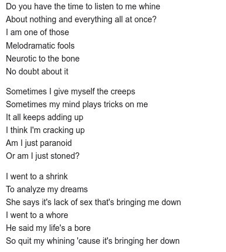
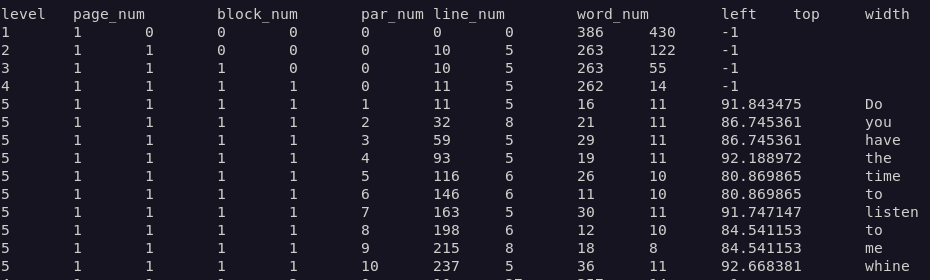

Python es súper versátil, tiene una comunidad gigante que tiene librerías que permiten lograr grandes cosas con pocas lineas de código, el Optical Character Recognition (OCR) es una de ellas, para ello basta con instalar tesseract y los bindings de python, llamados pytesseract.

## Algunas aplicaciones del OCR

El OCR es bastante útil para las redes sociales, donde puedes escanear el texto que aparece en las imágenes para leer su contenido y luego procesarlo o darle tratamiento estadístico.

Aquí va otro caso, imagina un programa que escanee image boards o redes sociales, extraiga un par de imágenes de los vídeos publicados y los relacione con una cuenta de tik tok usando la marca de agua que aparece en cada vídeo.

O quizá una página que sube imágenes de sus productos con sus precios escritos en cada una de ellas. Con el OCR es posible obtener todos sus precios, y subirlos a tu base de datos, descargando y procesando sus imágenes.

Facebook debe usar algún tipo de tecnología similar para censurar las imágenes que incluyen texto ofensivo, de acuerdo a sus políticas, que se suben a su red social.

Otra de las aplicaciones más comunes la transformación de un libro en pdf en imágenes a texto, ideal para transformar digitalizaciones de libros antiguos a epub o archivos de texto.

## Instalación de tesseract-ocr

Para llevar a cabo el OCR con Python necesitaremos tesseract, que es la librería que se encarga de todo el trabajo pesado y el procesamiento de imágenes.  
  
Asegúrate de instalar el tesseract-ocr más nuevo, hay una diferencia abismal entre la versión 3 y las versiones posteriores a la 4, pues se implementaron redes neuronales para mejorar el reconocimiento de caracteres. Yo estoy usando la versión 5 alpha.

```bash
sudo apt install tesseract-ocr
tesseract -v
tesseract 5.0.0-alpha-20201224-3-ge1a3
```


### Instalar lenguajes en tesseract

Podemos ver con que lenguajes viene instalado con _\--list-langs_

```bash
tesseract --list-langs
```

Es obvio, pero es necesario mencionar que la medida en la que reconozca el texto va a depender de que lo usemos en el lenguaje correcto. Instalemos el lenguaje de español.

```bash
sudo apt install tesseract-ocr-spa
tesseract --list-langs
List of available languages (3):
eng
osd
spa
```

Verás que ahora el español ya se encuentra instalado y podemos usarlo para detectar el texto de nuestras imágenes agregando la opción _\-l spa_ al final de nuestro comando

## OCR con tesseract

Ahora pongámoslo a prueba para reconocer texto en imágenes, directo de la terminal. Yo voy a usar la siguiente imagen:




```bash
tesseract imagen_con_texto.jpg -
Warning: Invalid resolution 0 dpi. Using 70 instead.
Estimating resolution as 139
Do you have the time to listen to me whine
...
```

El "-" al final del comando le indica a tesseract que mande los resultados del análisis a la salida estándar, para que podamos verlos en terminal.

Es posible indicarle a tesseract el motor de OCR que queremos usar:

- 0: para el tesseract original
- 1: para redes neuronales
- 2: tesseract y redes neuronales
- 3: Predeterminado, lo que esté disponible

```bash
tesseract imagen_con_texto.jpg - --oem 1
```

Considera que **no todos los archivos de idiomas funcionan con el tesseract original** (0 y 3). Aunque generalmente el de redes neuronales es el que da el mejor resultado. Puedes encontrar los modelos compatibles con el tesseract original y redes neuronales en el [repositorio de tesseract](https://github.com/tesseract-ocr/tessdata).

Puedes instalarlos de manera manual descargándolos y moviéndolos a la carpeta adecuada, en mi caso es _/usr/local/share/tessdata/_, pero puede ser diferente en tu sistema.

```bash
wget https://github.com/tesseract-ocr/tessdata/raw/main/eng.traineddata
sudo mv eng.traineddata /usr/local/share/tessdata/
```

## Instalando pytesseract

Tras la instalación agregamos pytesseract (los bindings de python) y pillow (para el manejo de imágenes) a nuestro entorno virtual.

```bash
pipenv install pytesseract pillow
```

## Leer texto de imágenes con python

Primero revisemos los lenguajes que tenemos instalados.

```python
import pytesseract
from PIL import Image
import pytesseract

print(pytesseract.get_languages())
# ['eng', 'osd', 'spa']
```

Ahora que ya tenemos los lenguajes, podemos leer el texto de nuestras imágenes.

El código es bastante corto y explicativo, por si mismo. Básicamente le pasamos la imagen como argumento al método _image\_to\_string()_ de pytesseract.

```python
import pytesseract

from PIL import Image
import pytesseract

img = Image.open("nuestra_imagen.jpg") # Abre la imagen con pillow
img.load()
text = pytesseract.image_to_string(img, lang='eng') # Extrae el texto de la imagen
print(text)

# Do you have the time to listen to me whine...
```

_image\_to\_string()_ puede recibir como argumento el lenguaje en el que queremos que detecte el texto.

Tesseract cuando con un método con el que podemos obtener mucha más información de la imagen, _image\_to\_data()_, disponible para versiones superiores a la 3.05

```python
data = pytesseract.image_to_data(img)
print(data)
```



Si quieres profundizar más visita la [documentación completa de tesseract](https://github.com/tesseract-ocr/tesseract).
