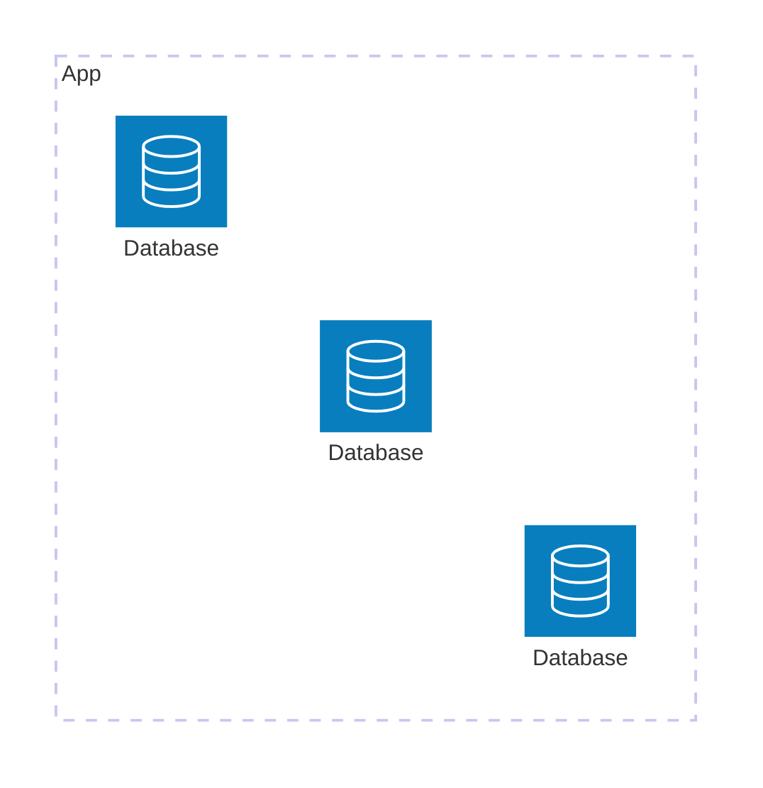

The **multi tenant architecture** is a software architecture (Don't confuse it with a [design pattern](/en/design-patterns-in-software/) or [deployment pattern](/en/common-and-useful-deployment-patterns/)) approach where **a single instance of an application serves multiple tenants**. You've probably come in contact with this architecture when using dropbox, Slack or any project management SAAS.

In multi-tenant architecture, each tenant can be a company, a group or an individual user, and although they share the same infrastructure and code base, their respective data is **isolated and customized**.

## Simple example of a multi-tenant application: A Shared House

Imagine a large house with several rooms, the living with roomies millenial's fantasy caused by expensive housing, well I'll put my traumas aside and continue. All tenants live under the same roof (the same application), but each has their own locked room (their data). Although they share the hallway and common facilities (infrastructure), their rooms are private and off-limits to others, of course, under normal conditions and those rooms may look different according to each tenant, as each one has customized it to their liking.


Now, imagine that instead of a house, we are talking about a cloud service, such as Slack or Jira. You and other companies use the same system, but you see your data and customizations, not those of others.

Taking it to a more real scenery, imagine you want to implement a service for managing small supermarket stores. Each separate store would represent a tenant, and each tenant is going to operate differently from the rest, have its own configuration, its own customers, suppliers and any other custom settings, plus the information of each supermarket store will be private.

## How is the multi-tenant architecture different from user accounts?

When I first read about this architecture I could not find the differences between, say a highly configurable application, like MySpace, for example, and a multi-tenant one. Probably for you the difference was very clear but for me it took me by surprise and I had to research about it, although I was certainly not the only one to ask [the difference between users and multi-tenant](https://stackoverflow.com/questions/48378789/what-is-the-difference-between-tenant-and-user#?):

| **Aspect**          | **User Accounts**                                                                  | **Multi-Tenant Application**                                                                              |
| ------------------- | ---------------------------------------------------------------------------------- | --------------------------------------------------------------------------------------------------------- |
| **Definition**      | Individual profiles within a shared application.                                   | A single instance of an application serving multiple clients (tenants), each with its own isolated space. |
| **Isolation Level** | All users share the same data and general configurations.                          | Each tenant's data and configurations are isolated from others.                                           |
| **Customization**   | Limited to the user level (such as themes or personal settings).                   | Each tenant can have different configurations, branding, or even functionalities.                         |
| **Simple Example**  | An online forum where users have accounts but share the same categories and posts. | Google Workspace (formerly G Suite), where each company (tenant) has its own email, Drive, and users.     |
| **Main Purpose**    | Managing multiple users within a single shared system.                             | Managing multiple separate clients, each with several users and unique needs.                             |
| **Shared Data**     | Data is typically stored in a single space, shared by all users.                   | Each tenant's data is segregated, even if using the same database.                                        |



## How to manage databases in a multi-tenant application?

A multi-tenant application will have to record and store information from each tenant and therefore there will be a database, but when handling multiple tenants, it will be inevitable to ask ourselves: How do we design our database(s)? Do we divide the tenants by database or by table? Is it a good idea to have one database for all of them instead?

Well, there are different paradigms in this regard, each with its advantages and disadvantages.

### One database and one schema for all tenants.

A single database and a single schema, with different tables for each tenant. The simplest and easiest architecture to implement, but comes with poor isolation and customization. You can identify each tenant by an unique id.

``` mermaid
architecture-beta
    group api(database)[Database]

    service schema(logos:datasette-icon)[Schema] in api
```



A SQL query would look like this

``` bash
SELECT * FROM <table> WHERE <tenant_id_column> = '<id>';
```

### A database for each tenant

A database for each tenant. The most expensive when it comes to resources but provides the best isolation and full customization level. You can identify a tenant by its schema.



A SQL query would look like this

``` bash
# Connect to database first
\c <tenant_database>
SELECT * FROM <tenant>.<table>;
```


### One database but different schemas for each tenant.

A single database for all tenants but a different schema for each tenant. Customizable and separation of schemas maintains some level of isolation, but complexity increases. You can identify a tenant by its schema.

``` mermaid
architecture-beta
    group api(database)[Database]

    service schema1(logos:datasette-icon)[Schema] in api
    service schema2(logos:datasette-icon)[Schema] in api
    service schema3(logos:datasette-icon)[Schema] in api
```



A SQL query would look like this


``` bash
SELECT * FROM <tenant>.<table>;
```

Now you got an overall idea of the multi tenant pattern and hopefully can use it in your SAAS adventures.