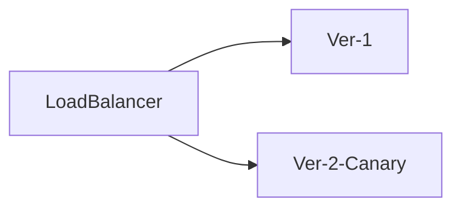
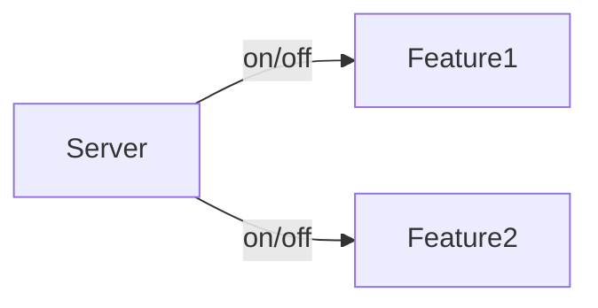
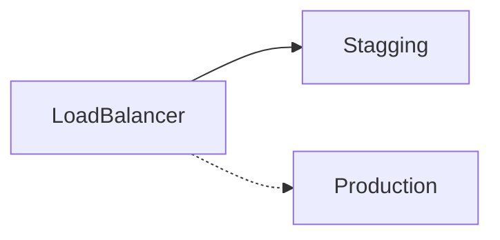
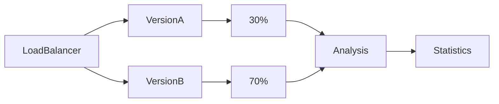
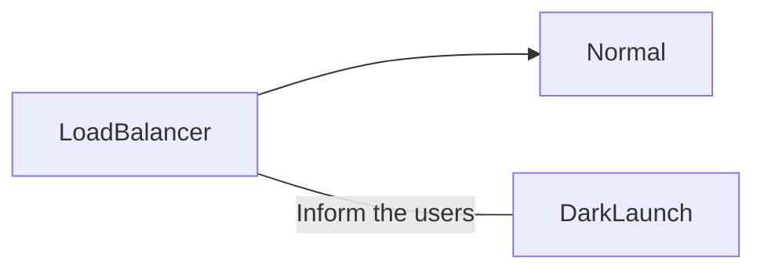

## What is a deployment pattern?

A deployment pattern (Not to be confused with a [design pattern](/en/design-patterns-in-software/)) is an automatic method of deploying new features of an application to your users. But it doesn't stop there, it is possible to get extra information from a deploy of an application, but.... but how? 

Imagine you want to test a feature of your web application, but you are afraid that it will not be liked by your users, or you want to see if this new feature increases or decreases the conversion rate of your application, which is invaluable, especially in the early stages of iteration of an application. 

What can you do in these cases? The best thing to do would be to test it on a representative sample of your audience and, depending on how it responds, discard it or roll it out to the rest of the users.

## Common deployment patterns

There are a number of widely used deployment patterns: 

- Monolithic deployment
- Microservices deployment
- Containerization
- Serverless Deployment
- Continuous Integration (CI) / Continuous Deployment (CD)
- Canary
- Features toggles
- Blue/Green
- A/B Testing
- Dark launches

For this post I am going to focus on the last patterns, since they are the ones I have read the least information about on the internet. Consider that **deployment patterns can be combined with each other**. For example, you can perform A/B tests on your monolithic application to find the best version. Having said that, I will explain the patterns.

### Canary

This pattern consists of showing new features to a small group of users. After analyzing and correcting the performance of the new features and, if appropriate, the deploy is extended to all users.

### Features toggles

Instead of releasing all changes at the same time, this pattern hides new features behind a switch, which can be turned on or off without modifying the code. This allows changes to be released gradually or only to certain users, making it easy to test and manage. This method has the advantage that if a problem occurs, you can turn the switch off without the need to return the code to a previous state.

### Blue/Green deployment

In the blue/green deployment we have two similar environments simultaneously. These environments will be known as blue and green. At any time only one of the two environments will be active, while load balancing from one environment to the other. If we find any errors we simply adjust the load balancing to the opposite side.

### A/B testing

A/B testing is the classic A/B testing; a random set of our users will receive version A of the application, while the rest will receive version B. We will then use statistics, specifically the two-sample t-test, to determine which version (A or B) is more effective.

The distribution percentage does not necessarily have to be 50-50.

### Dark launches

This type of deployment pattern is quite similar to the Canary deployment, however in this case users must be aware that they are receiving a test version and must be aware of the new functionality being tested. With this knowledge the users will be able to provide feedback on the new functionality.

Consider that many projects do not reach the necessary size for a deploy pattern to be useful, and that if your application has few users it may even be counterproductive. However, if this is not the case, you can use one or several of them to extract valuable information for your application.