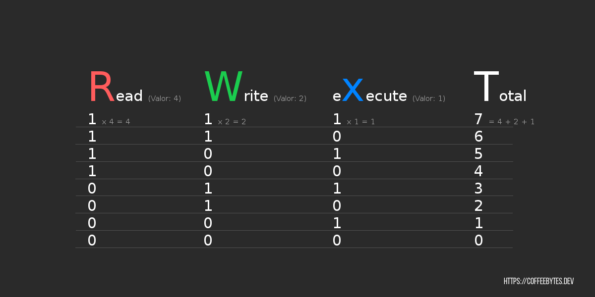

La entrada anterior fue la tercera parte sobre la serie de los comandos más comunes de GNU/Linux. Para finalizar la entrada escribí acerca del [comando chmod, que gestiona los permisos](/es/comandos-de-linux-que-deberias-conocer-tercera-parte/). Este comando chmod es uno de los comandos un poco más complejos de GNU/Linux, no por su variedad de opciones, sino por los conocimientos previos que se requieren para poder usarlo correctamente.

En esta entrada voy a ampliar un poco el tema de los permisos y mostraré las dos diferentes maneras del comando chmod para asignar permisos a un archivo. Para esta entrada vamos a usar varios comandos básicos de GNU/Linux, si no estás muy familiarizado con los comandos básicos [entra aquí donde explico algunos comandos básicos.](/es/comandos-de-linux-basicos-que-deberias-conocer/)

## Tipos de permisos en GNU/Linux

En GNU/Linux hay 3 tipos de permisos para los archivos; permiso para leer, especificado por la letra '_r_'; para escribir, representado por la letra '_w_'; y para ejecutar, asignado a la letra '_x_'. **En Linux todo es un archivo**, por lo que lo anterior aplica igualmente a los directorios. Los permisos para los archivos se muestran mediante el comando '_ls'._

```bash
ls -l
-rw-r--r-- 1 usuario usuario 9288 may 14 00:40 helloWorld.out
-rw-r--r-- 1 usuario usuario  106 may 14 00:40 codigo_fuente.cpp
```

Hay 3 conjuntos de 3 letras, cada conjunto contiene espacios para las letras '_r_' '_w_' y '_x_', en ese orden. La presencia de un guión indica la ausencia de permisos. El primer conjunto representa los permisos del propietario del archivo, el segundo conjunto representa los permisos del grupo al que pertenece el archivo y el tercer conjunto representa los permisos de otros. Antes del primer conjunto hay un espacio para el tipo de archivo; '_D_' para directorio, o un guión para un archivo.


Ninguno de los conjuntos tiene permisos para ejecutar el archivo _helloWorld.out_ por lo que, al intentarlo, nos mostrará la frase '_permiso denegado_' en la terminal.

```bash
./helloWorld.out
bash: ./helloWorld.out: Permiso denegado
```

Si removemos los permisos '_r_' y '_w_' de un archivo, usando el comando chmod, tampoco podremos leer o modificar su contenido, como se ve en las últimas lineas de código que aparecen más abajo.

```bash
chmod 000 codigoFuente.cpp
 # Removemos todos los permisos del archivo codigoFuente.cpp
ls -l
total 16
---------- 1 usuario usuario  106 may 14 00:40 codigoFuente.cpp
-rwxr-xr-x 1 usuario usuario 9288 may 14 00:40 helloWorld.out
cat codigoFuente.cpp
cat: codigoFuente.cpp: Permiso denegado
echo "Agrega texto" >> codigoFuente.cpp
bash: codigoFuente.cpp: Permiso denegado
```

Agregamos el permiso para ejecutar, '_x_', a todos los conjuntos de permisos y ahora el ejecutable puede correrse e imprimir en la terminal la frase '_Hello world_'. **No te preocupes por el significado de los números en el comando chmod, lo explicaremos más adelante.**

```bash
chmod 755 ejecutable.out
# Asignamos todos los permisos al propietario del archivo y permisos de lectura y ejecución a los demás conjuntos.
ls -l
total 16
-rw-r--r-- 1 usuario usuario  106 may 14 00:40 codigoFuente.cpp
-rwxr-xr-x 1 usuario usuario 9288 may 14 00:40 helloWorld.out
./helloWorld.out
 Hello world
```

## ¿Qué significan los números en el comando chmod?

Hay 3 cifras en los números que siguen al comando chmod, cada cifra representa los permisos de su conjunto respectivo. El número de cada cifra puede ir del 0 al 7. Este número está determinado por la suma de los valores de cada permiso; 4, 2 y 1.

El permiso '_r_' tendrá un valor de 4, el permiso '_w_' un valor de 2 y el permiso '_x_' un valor de 1.

| Permiso  | Valor |
| -------- | ----- |
| Leer     | 4     |
| Escribir | 2     |
| Ejecutar | 1     |



Tomando en cuenta lo anterior, un valor de 7 (4+2+1) significa que cuenta con todos los permisos, un valor de 5 (4 +1) significa que cuenta con el permiso de lectura (r) y de ejecución (x), un valor de 3 (2+1) significan permisos de escritura (w) y ejecución de un archivo (x).

La primera cifra representa los permisos del propietario del archivo, la segunda cifra los permisos del grupo y la tercera cifra los permisos de otros.

| Valor del Permiso | Permisos para...                                                                                                                                         |
| ----------------- | -------------------------------------------------------------------------------------------------------------------------------------------------------- |
| 755               | propietario: 4 + 2 +1 = 7 (Leer + Escribir + Ejecutar) grupo: 4 + 1 = 5 (Leer y ejecutar) otros: 4 + 1 = 5 (Leer y ejecutar)                             |
| 777               | propietario: 4 + 2 +1 = 7 (Leer + Escribir + Ejecutar) grupo: 4 + 2 +1 = 7 (Leer + Escribir + Ejecutar) otros: 4 + 2 +1 = 7 (Leer + Escribir + Ejecutar) |
| 111               | propietario: 1 (Ejecutar) grupo: 1 (Ejecutar) otros: 1 (Ejecutar)                                                                                        |

Veamos algunos ejemplos del equivalente en permisos de los números.

```bash
_rwxrwxrwx
 Esto seria equivalente al dígito 777
_rwxr_xr_x
 Esto seria equivalente al dígito 755
___x__x__x
 Esto seria equivalente al dígito 111
```

## Otro método para asignar permisos con chmod

Hay una manera alternativa de asignar permisos usando el comando chmod que luce más intuitiva. La notación que reemplazará a los 3 dígitos, en el comando chmod, consiste en una o varias letras para especificar los conjuntos a los cuales queremos aplicar los permisos; _'a'_, para todos; _'u'_, para el usuario propietario; _'g'_, para grupo; y _'o'_, para otros.

| Permiso | Significado |
| ------- | ----------- |
| a       | Todos       |
| u       | Usuario     |
| g       | Grupo       |
| o       | Otros       |

Pueden usarse una o varias letras. Después, el símbolo de '+' o '-', según deseemos agregar o remover permisos, respectivamente. Y, por último, los permisos que queremos agregar o remover, con las letras '_r_', '_w_' y '_x_', para leer, escribir y ejecutar, respectivamente. Veamos algunos ejemplos para clarificarlo.

```bash
chmod a+rwx codigoFuente.cpp
-rwxrwxrwx 1 usuario usuario  106 may 14 00:40 codigoFuente.cpp
```

En el primer ejemplo seleccionamos a todos los conjuntos usando la letra '_a_', elegimos agregar permisos usando el simbolo '_+_' y especificamos que los permisos a agregar son '_r_', '_w_' y '_x_'; lectura, escritura y ejecución, respectivamente.

```bash
chmod o-w helloWorld.out
-rwxrwxr-x 1 usuario usuario  106 may 14 00:40 codigoFuente.cpp
```

Para el segundo ejemplo elegimos que los cambios lo haremos al conjunto _otros_, seleccionamos el signo _'-'_, para remover permisos, y declaramos que el permiso a remover es el de escritura, 'w'.

```bash
chmod ug-wx codigoFuente.cpp
-r--r--r-x 1 usuario usuario  106 may 14 00:40 codigoFuente.cpp
```

Y, por último, en el tercer ejemplo los conjuntos para el propietario y el grupo, 'g' y 'u', respectivamente, perderán los derechos de escritura y ejecución, 'w' y 'x'.

Esta sintaxis puede ser más intuitiva que la anterior. ¿Cuál usar? la que te resulte más sencilla de entender, puedes llegar a los mismos resultados usando cualquiera de las dos.
