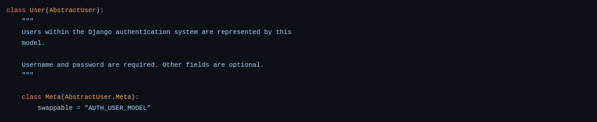

En esta entrada te explico tres métodos para extender o personalizar el modelo _User_ de Django, sin tener que reescribirlo desde cero, y manteniendo todas [las funcionalidades para el manejo de de usuarios que ya incluye Django.](https://coffeebytes.dev/por-que-deberias-usar-django-framework/)

Pero, antes de empezar, veamos de donde viene el modelo User de Django.

## ¿De donde viene el modelo User de Django?

El modelo _User_ de Django hereda de _AbstractUser_ que, a su vez, hereda de la clase _AbstractBaseUser_.


Si miras el código fuente de Django, verás que el **modelo _User_ que usas normalmente no tiene prácticamente ninguna funcionalidad propia**, sino que hereda toda su funcionalidad de _AbstractUser_.



Captura de pantalla del código de Django version 4.0

Ya que sabemos lo anterior, **podemos usar las clases AbstractUser y AbstractBaseUser para crear nuestros modelos de Usuario personalizados.**

## Heredar de la subclase AbstractUser

Este método es probablemente el más popular para extender el modelo _User_ de Django. Lo anterior debido a que se conserva prácticamente toda la funcionalidad del modelo _User_ original.

```python
# usuarios/models.py
from django.contrib.auth.models import AbstractUser
from django.db import models

class UsuarioPersonalizado(AbstractUser):
    # Tus propiedades personalizadas
    creditos = models.PositiveIntegerField(verbose_name='creditos',
        default=0, 
        blank=True)
```

Tras crear una clase nueva que herede de _AbstractUser_, necesitamos decirle a Django que queremos usar este nuevo modelo en lugar del modelo de usuario por defecto.

Establecemos este comportamiento en nuestro archivo de configuraciones.

```python
# settings.py
AUTH_USER_MODEL = 'usuarios.UsuarioPersonalizado'
```

Y es todo, podemos usarlo exactamente igual que si usaramos el modelo _User_ que incluye Django.

### ¿Cómo luce internamente AbstractUser?

Observa como la clase _AbstractUser_ hereda de _AbstractBaseUse_r y tiene múltiples campos disponibles para perfilar un usuario. Además, no puede instanciarse directamente, por ser una clase abstracta.


Captura de pantalla del código de Django version 4.0

Pasemos al segundo método.

## Heredar de la subclase AbstractBaseUser

Esta clase, como puedes apreciar en la imagen anterior, es la clase que se usa de base para crear el _AbstractUser_. Su funcionamiento es el mínimo y solo posee 3 campos:

- password
- last\_login
- is\_active

Solo cuenta con la función de autenticación. Y tienes que indicarle que campo se usará como _username_, para autenticar al usuario.

Este método se suele usar para personalizar completamente el modelo _Use_r o cuando no necesitamos prácticamente ningún campo extra.

```python
# usuarios/models.py
from django.contrib.auth.base_user import AbstractBaseUser
from django.db import models

class UsuarioPersonalizado(AbstractBaseUser):
    email = models.EmailField(verbose_name='emails', unique=True, max_length=255)
    creditos = models.PositiveIntegerField(verbose_name='creditos',
        default=0, 
        blank=True)
    USERNAME_FIELD='email'
    REQUIRED_FIELDS = []
```

Recuerda indicarle a Django que use tu modelo personalizado en lugar del predeterminado.

```python
# settings.py
AUTH_USER_MODEL = 'usuarios.UsuarioPersonalizado'
```

### ¿Cómo luce internamente AbstractBaseUser?

La siguiente imagen es una captura de pantalla directo del código de Django en su versión 4.0

Como puedes ver, solo cuenta con los 3 campos mencionados, hereda directamente de _models.Model_ y su clase Meta le indica a Python que es un modelo abstracto; no puedes crear instancias directamente de este.


Captura de pantalla del código de Django version 4.0

Ahora veamos la tercera manera de extender el model _User_ de Django.

## Crear un perfil para extender el modelo User

Otra manera de extender el modelo user es **crear otro modelo que sirva como un contenedor de los campos extras y luego relacionarlo por un campo _OneToOneField_** con el modelo que recibe por defecto la configuración de Django.

Esta aproximación es ideal si somos el creador de un paquete que necesite personalizar el modelo _User_ del proyecto para funcionar, pero sin modificarlo directamente.

También es útil cuando necesitamos varios tipos de usuarios o perfiles diferentes, con campos distintos entre ellos.

Para crear un perfil de esta manera basta con declarar un campo que relacione nuestro nuevo modelo con el modelo _User_, por medio de un _OneToOneField_.

```python
from django.conf import settings
class Perfil(models.Model):
    # otros campos
    user = models.OneToOneField(settings.AUTH_USER_MODEL, on_delete=models.CASCADE)
```

Y para acceder a nuestro usuario, accedemos al campo que lo relaciona con el modelo que creamos.

```python
usuario = User.objects.get(username='usuario')
usuario.perfil
```

## Otros recursos

- [Código fuente original del modelo User de Django](https://github.com/django/django/tree/main/django/contrib/auth)
- [Documentación del modelo User de Django](https://docs.djangoproject.com/en/4.0/topics/auth/customizing/)
