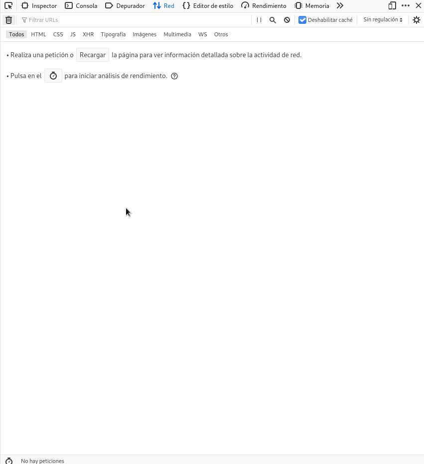
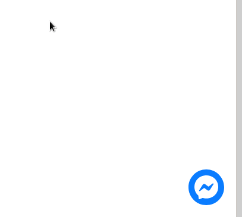

The facebook chat plugin allows you to add a page button that connects to the chat of a facebook fanpage. But, as you know, facebook is monopolistic and the default installation loads the plugin first, making your website slower and affecting the web vitals indicators of the pages. There are some ways to mitigate this.

## The impact of the facebook chat plugin

Loading the facebook plugin triggers a long list of web requests that download about many MB of information and consumes valuable time that can impact your page load, watch.



95 requests and about 3 mb downloaded, 4 seconds.

Third-party plugins can strongly impact the metrics and performance of your web pages, both frontend and backend.



## Delay plugin loading

The facebook plugin requires two html tags:

```html
<!-- Messenger plugin de chat Code -->
<div id="fb-root"></div>
<!-- Your plugin de chat code -->
<div id="fb-customer-chat" class="fb-customerchat"></div>
```

To mitigate the effect of the facebook chat plugin several actions can be performed: we can delay its loading until a certain amount of time has elapsed, also delay it until a user interaction among other things. The optimal solution depends on how your users behave and the website you have.

I will delay loading until the user interacts with the chat.

To begin with, we will place a fake icon in place of the original one. This icon is the same one that facebook downloads. Since it is a simple image, it does not load any JS code nor is it accompanied by any request to the facebook servers.

We will identify this fake facebook icon by its id: fb-chat-logo

```html
<div class="position-fixed" id="fb-chat-logo" style="bottom: 20px;right:20px; z-index: 1;"><svg width="60px" height="60px" viewBox="0 0 60 60" cursor="pointer"><svg x="0" y="0" width="60px" height="60px"><g stroke="none" stroke-width="1" fill="none" fill-rule="evenodd"><g><circle fill="#0A7CFF" cx="30" cy="30" r="30"></circle><svg x="10" y="10"><g transform="translate(0.000000, -10.000000)" fill="#FFFFFF"><g id="logo" transform="translate(0.000000, 10.000000)"><path d="M20,0 C31.2666,0 40,8.2528 40,19.4 C40,30.5472 31.2666,38.8 20,38.8 C17.9763,38.8 16.0348,38.5327 14.2106,38.0311 C13.856,37.9335 13.4789,37.9612 13.1424,38.1098 L9.1727,39.8621 C8.1343,40.3205 6.9621,39.5819 6.9273,38.4474 L6.8184,34.8894 C6.805,34.4513 6.6078,34.0414 6.2811,33.7492 C2.3896,30.2691 0,25.2307 0,19.4 C0,8.2528 8.7334,0 20,0 Z M7.99009,25.07344 C7.42629,25.96794 8.52579,26.97594 9.36809,26.33674 L15.67879,21.54734 C16.10569,21.22334 16.69559,21.22164 17.12429,21.54314 L21.79709,25.04774 C23.19919,26.09944 25.20039,25.73014 26.13499,24.24744 L32.00999,14.92654 C32.57369,14.03204 31.47419,13.02404 30.63189,13.66324 L24.32119,18.45264 C23.89429,18.77664 23.30439,18.77834 22.87569,18.45674 L18.20299,14.95224 C16.80079,13.90064 14.79959,14.26984 13.86509,15.75264 L7.99009,25.07344 Z"></path></g></g></svg></g></g></svg></svg></div>
```

Now, let's get and link this icon with _mouseover_, _click_, _ontouchstart_ and _ontouchmove_ events, so that any interaction with the icon will load the facebook code.

```javascript
const fakeFbChatLogo = document.getElementById('fb-chat-logo');

['click','ontouchstart', 'mouseover', 'ontouchmove'].forEach(evt => 
    fakeFbChatLogo.addEventListener(evt, loadFacebookChat, false)
);
```

And we will pass it a function called _loadFacebookChat_ that we will create next.

```javascript
function loadFacebookChat() {
      var chatbox = document.getElementById('fb-customer-chat');

      chatbox.setAttribute("page_id", "TU_FACEBOOK_CHAT_ID");
      chatbox.setAttribute("attribution", "biz_inbox");

      (function(d, s, id) {
        var js, fjs = d.getElementsByTagName(s)[0];
        if (d.getElementById(id)) return;
        js = d.createElement(s); js.id = id;
        js.src = 'https://connect.facebook.net/es_LA/sdk/xfbml.customerchat.js';
        fjs.parentNode.insertBefore(js, fjs);
      }(document, 'script', 'facebook-jssdk'));
    ['click','ontouchstart', 'mouseover', 'ontouchmove'].forEach(evt => {
    fakeFbChatLogo.removeEventListener(evt, loadFacebookChat, false)
});
      // window needs to be the latest to prevent FB not defined 
      window.fbAsyncInit = function() {
        FB.init({
          xfbml            : true,
          version          : 'v11.0'
        }) ;
        // 
        FB.Event.subscribe('xfbml.render', function(){
          FB.CustomerChat.show(true);
          fakeFbChatLogo.remove();      
        });
      }
}
```

The content of the function is the same as you get from [facebook documentation](https://www.facebook.com/business/help/1524587524402327) but with two small extra steps.

The first step is to remove the _eventListener_ we created so that it will no longer be executed once the user interacts with the fake icon.

```javascript
['click','ontouchstart', 'mouseover', 'ontouchmove'].forEach(evt => {
    fakeFbChatLogo.removeEventListener(evt, loadFacebookChat, false)
});
```

The second step is a subscription to the _xfbml.render_ event, method that will be executed when our chat is rendered. It is optional to open the chat instantly for the user to see interaction, I have done it this way. And, as a final step, we remove our fake icon, so that it is not displayed along with the original.

```javascript
FB.Event.subscribe('xfbml.render', function(){
          FB.CustomerChat.show(true); //opcional
          fakeFbChatLogo.remove();      
        });
      }
```

With the previous steps we are delaying the loading of the content until the user interacts with it. In this way the loading of the plugin is delayed until the user wants to use it, avoiding the impact on the initial load.



The plug-in script is not activated until we interact with the icon

See how the fb appears to load normally and there is a small icon change, the animation or extra details you can customize to your liking with CSS and its animations.