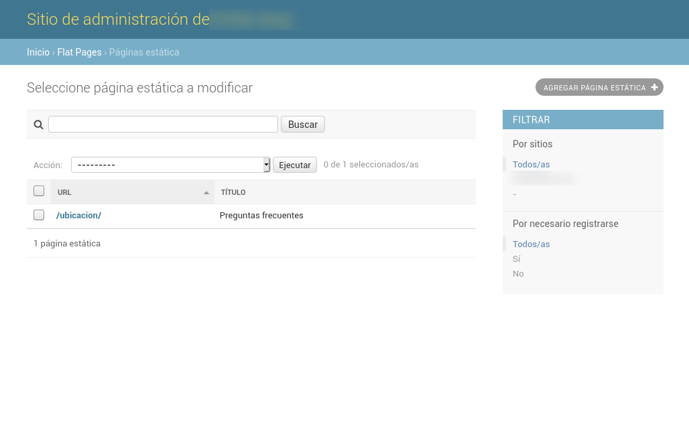
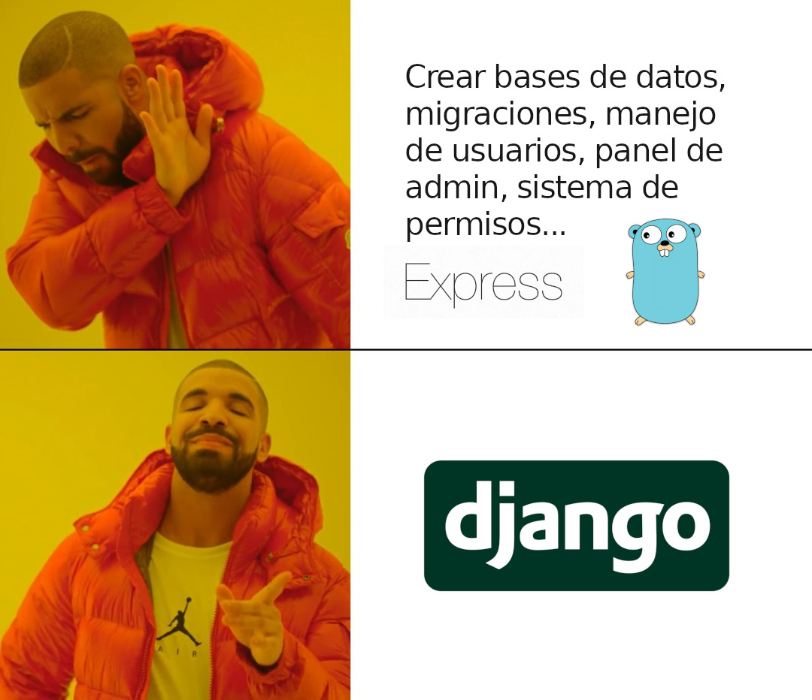
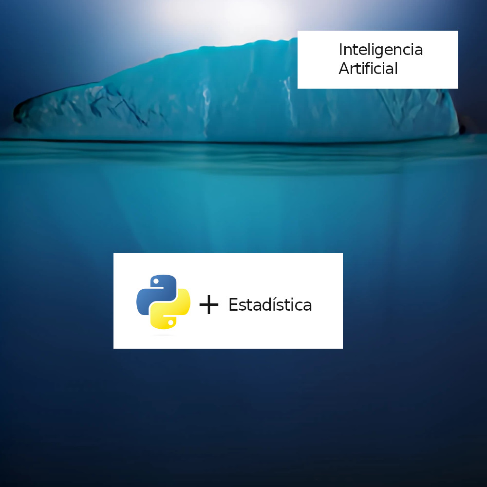

Why use Django in a world where everything is Javascript? Is it really worth learning a Python Framework in an ecosystem that insists on Frameworks written in Javascript? Well, I think so, and here are some of the reasons why you should use Django. And, in order not to lose objectivity, I will talk about the advantages as well as the disadvantages; you know that no solution is perfect.

## The advantages of Django

### Your ORM is simple and wonderful

Django's ORM abstracts away the need to write SQL queries to create tables and query data. It is quite intuitive to use and has almost all the most common queries included in its code. From filtering, partitioning, joins and even [advanced Postgres lookups](/en/trigrams-and-advanced-searches-with-django-and-postgres/) functions and migration handling.

To create a table in the database just create a class that inherits from _models.Model_ and Django will do all the heavy lifting.

```python
class Review(models.Model):
    title = models.CharField(max_length=25)
    comment = models.TextField()
    name = models.CharField(max_length=20)
    created = models.DateTimeField(auto_now_add=True)
    modified = models.DateTimeField(auto_now=True)
    user = models.ForeignKey(
        get_user_model(), related_name="reviews", null=True, on_delete=models.SET_NULL)
```

The following model is equivalent to the following SQL statement:

```sql
BEGIN;
--
-- Create model Review
--
CREATE TABLE "reviews_review" ("id" integer NOT NULL PRIMARY KEY AUTOINCREMENT, "title" varchar(25) NOT NULL, "comment" text NOT NULL, "name" varchar(20) NOT NULL, "created" datetime NOT NULL, "modified" datetime NOT NULL, "user_id" integer NULL REFERENCES "auth_user" ("id") DEFERRABLE INITIALLY DEFERRED);
CREATE INDEX "reviews_review_user_id_875caff2" ON "reviews_review" ("user_id");
COMMIT;
```

In addition to the above, its ORM supports multiple databases, so switching database engines is quite simple and after a few changes you can migrate seamlessly from Postgres to MySQL or vice versa, just by changing a couple of lines in the configuration. Saving you from having to write SQL by hand, as you would do in [migrations from another language, such as go](/en/go-migration-tutorial-with-migrate/).

```python
# settings.py
DATABASES = {
    'default': {
        'ENGINE': 'django.db.backends.mysql',
        'OPTIONS': {
            'read_default_file': '/path/to/my.cnf',
        },
    }
}
```

Its only disadvantage is its speed, as it falls short of alternatives such as sqlAlchemy, or [tortoise-orm](/en/python-tortoise-orm-integration-with-fastapi/).

### Administrator panel included

Django has the [django admin panel](/en/the-django-admin-panel-and-its-customization/), an administration panel that is installed by default. This admin implements a CRUD to the database in a simple way. And, in addition, it has a solid permissions system to restrict access to the data as you want.



### Offers security against the most common attacks

Django includes certain utilities, which are responsible for mitigating most attacks such as XSS, XSRF, SQL injections, Clickjacking and others. Most of them are already available and you just need to add the corresponding middleware or template tag.

```python
<form method="post">
```

### User management included

Most applications require a user management system, you know, register them, activate them, log them in, password recovery, well, Django already includes all of the above by default, even decorators to restrict views for authenticated users.

#### Authentication tested, including with JWT.

This framework has a proven authentication system based on sessions that are identified by a cookie. The authentication system has already been tested numerous times by some of the most trafficked websites out there, such as Instagram or the NASA website. Pinterest started with Django but moved to node.

You can use cookie authentication, session authentication or there are packages that allow you to use it with JWT. By the way, I have a post where I explain how to [authenticate a user using JSON Web token JWT in Django Rest Framework](/en/django-rest-framework-and-jwt-to-authenticate-users/). I also wrote another one explaining why [some consider this is not a good idea](/en/don-t-use-jwt-to-manage-sessions-translation/).

#### Permit system

Django has a robust [permissions and groups system](/en/how-do-permissions-and-permissions-groups-work-in-django/) that binds your users to models in the database that you can start using with just a few lines of code.

### Multiple packages

Django has a lot of packages to solve most common problems, and they are community-monitored and community-improved packages, which guarantees impressive quality.

Just to name a few:

* [Django-haystack](/en/how-to-implement-solr-for-searches-or-queries-in-django/)(For searches
complex)
* Django-watson (Searches)
* DRF (REST)
* Graphene (Graphql)
* Django-rest-auth (Authentication)
* Django-allauth (Authentication)
* Django-filter (Search)
* Django-storage (AWS storage)
* Django-braces (Common functions)

Among all of them I would like to highlight **DRF (Django Rest Framework) which makes [creating a REST API](/en/rest-api-basic-characteristics-and-recommendations/), handling permissions and [throttling](/en/throttling-on-nginx/), a simple task**, compared to creating everything from scratch.

Another package to highlight that allows you to work with websockets, to create an [application that communicates with the server in real time, through events, is django-channels](/en/django-channels-consumers-environments-and-events/).

### Takes you from an idea to a working prototype quickly.

I consider this the main reason to use Django. **Django gets you from an idea to an MVP fast and without reinventing the wheel. Which is a huge competitive advantage over other frameworks, especially when money and customers are involved.

With Django you would have a working prototype faster than with any other "less opinionated" framework or one that requires you to program everything from scratch.



### It is a proven solution

There are many new frameworks every day. Most of them are just a fad and fall into disuse over the years, leaving projects without support. Django is a framework that has been around for a very long time, that has gone through numerous tests that have made it  robust and reliable, and that is not going to disappear overnight leaving you with an unsupported project.

Consider that Django was once the choice of sites as big as Instagram or Pinterest.

### Django support for Machine Learning libraries

Python is great when it comes to Machine Learning, cool libraries like Pytorch, ScikitLearn, Numpy and Keras are widely used worldwide. Since Django is written in Python, you will be able to integrate these libraries natively into your Django projects, without the need to create a new service.



## The disadvantages of Django

Not everything is magic with Django, there are some things that can be considered a disadvantage and that I would change without hesitation.

### It is a monolith

Django is an old Framework, with everything you need to develop a web application, an ORM, a templating system, middleware and many other pieces that are there and are required for the framework to work, whether you need them or not. However, Django can be modularized to generate API responses in JSON (or other format) instead of HTML, ignoring the rest of the framework machinery.

The very stability of Django has made it look somewhat slow in a world of rapidly evolving JavaScript frameworks.

**Update**: Regarding the template system, if you combine it with libraries like htmx or turbolinks you will have the best of both worlds: interactivity on the frontend with HTML generation on the backend.

### It is slow and handles requests one at a time.

Python is an interpreted language that was made to be beautiful and simple, not necessarily fast. In my comparison of [python vs go](/en/python-vs-go-which-is-the-best/) I compare the performance of both, just to give you an idea.

In addition to the above, Django does not shine for its speed at the time of execution. In the race to be a fast framework, it is below more modern technologies such as Flask or FastAPI. Go to [my tutorial on FastAPI](/en/fastapi-tutorial-the-best-python-framework/) if you want to see how slow Django is compared to other frameworks.

### Your ORM is not asynchronous nor is it the fastest.

Django is working to make its ORM asynchronous, but it's not there yet. Other alternatives such as tortoise-orm, sql-alchemy, pony-orm are ahead in this aspect.

### Moderate learning curve

Django follows the philosophy of batteries included. Which is good, because it's code you save writing, but also bad, because it's code you need to learn to use: the ORM with models and queries, the middleware, the views, DRF (for the APIs) or the template system, the urls handler, string translation, the i18n package, etc. Learning all of the above takes more time than it would take you to learn other more minimalist frameworks; such as Flask or Express.

## TLDR advantages and disadvantages of Django

From my point of view the advantages outweigh the disadvantages, so I consider it a very attractive option to develop a complex website when you have little time or need to find developers fast.

Still not convinced? Remember that Instagram is the largest Django backend website out there.

In the end, as always, this is my point of view and everyone has their own. I hope this post has shown you something you would not have considered about Django before reading it.