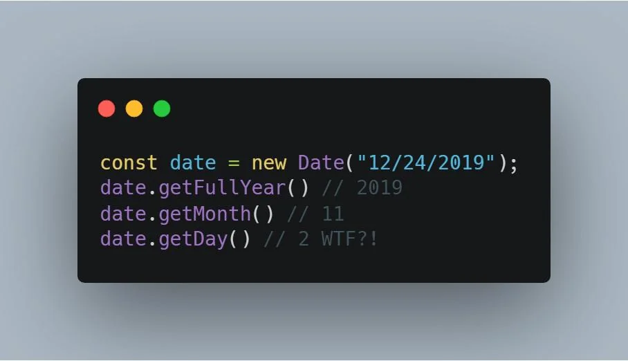
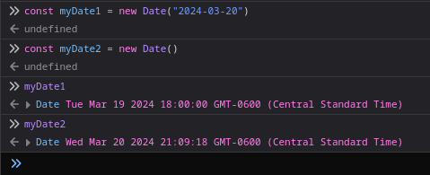
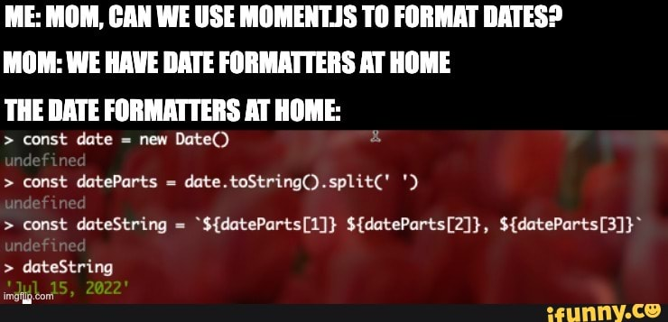
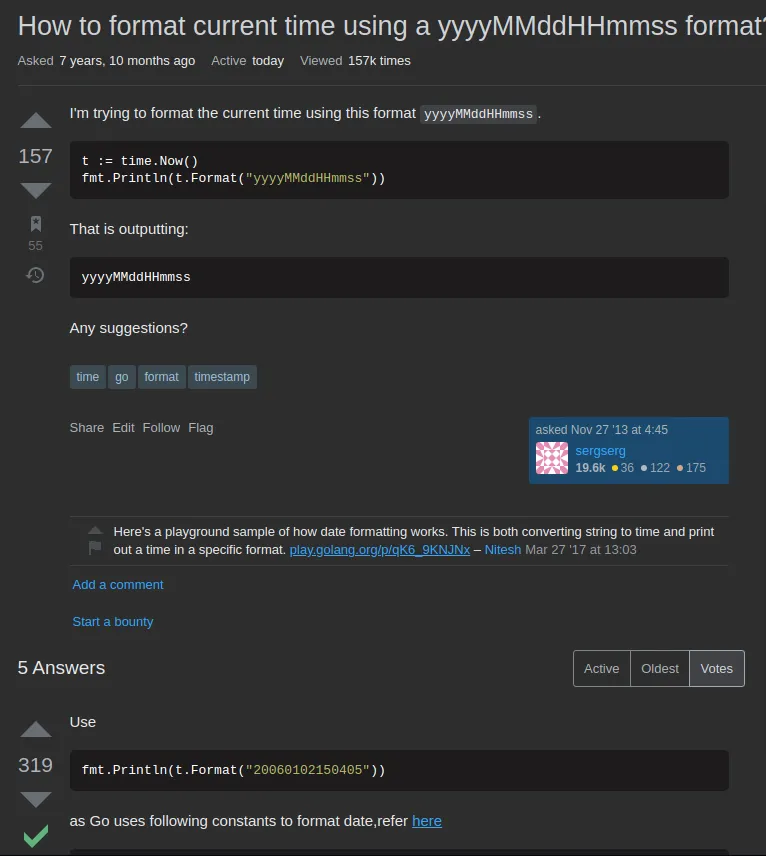

---
aliases:
- /porque-detesto-el-input-datetime-local-y-las-fechas-en-javascript
authors:
- Eduardo Zepeda
categories:
- javascript
- opiniones
coverImage: images/javascript-dates-and-html-input.jpg
date: '2024-03-20'
description: El manejo de fechas en javascript y su combinación con el input estándar
  HTML datetime-local, es dificil, incoherente y complicado.
keywords:
- javascript
- opiniones
- react
- html
- go
title: Porqué Detesto datetime-local Y Las Fechas en Javascript
url: /es/porque-detesto-el-input-datetime-local-y-las-fechas-en-javascript
---

Trabajar con Javascript es frustrante y, a veces, combinarlo con HTML resulta desesperante por su falta de coherencia interna, por si fuera poco, utilizarlo para el manejo de fechas, que requiere considerar el manejo de timezones, diferentes formas de representarlas y la sensibilidad requerida: segundos, minutos, milisegundos, etc. lo vuelve una tortura.

## Javascript maneja las fechas de manera extraña

Javascript usa los meses partiendo del índice 0 y los días del índice 1, dos objetos con la misma fecha son desiguales al compararlos con === (sí, ya sé que lo que se compara son los objetos y no las fechas), pero es justo el hecho de que no es intuitivo, al usuario del lenguaje no le interesan los objetos en memoria en si, sino lo que representan. Lenguajes como [Python tiene mejores abstracciones que las que maneja Javascript.](/es/python-vs-javascript-cual-es-el-mejor-lenguaje-de-programacion/)

## La desconexión entre HTML y JS

En el caso de agendar un evento con fecha y hora, es tentador utilizar el input datetime-local nativo que ya provee HTML. Sin embargo, este campo por defecto requiere una fecha en formato "YYYY-MM-DDThh:mm", mientras que javascript regresa las fechas en un objeto Date, que debes transformar a ISO 6801 "YYYY-MM-DDThh:mm.iiiZ", donde la "i" son microsegundos (o a otro formato con una función propia).

Para realizar esta transformación, la manera más obvia es eliminar la letra "Z", pero si intentas asignar esa fecha al input de tipo datetime-input, este le permitirá seleccionar los milisegundos al usuario, lo cual realmente tiene pocas aplicaciones para la mayoría de los usuarios. Lo correcto sería cortar desde el principio, haciendo un slice desde la posición 0 hasta la sensibilidad que necesitemos. 

Bien, tras esto el input datetime-local funcionará y mostrará la fecha, el problema ahora es que después de validar tu campo HTML y probablemente antes de guardar esas fechas en algún medio de almacenamiento (postgres, redis, etc.), querrás realizar modificaciones, por lo que tendrás que volver a convertirlas a un objeto Date en javascript en caso de que quieras gestionarlas, lo que implica nuevamente otra conversión.

Pero, ¿y si usamos una librería para manejar esos cambios? 

## Las librerias de js para el manejo de tiempo no solucionan nada

No tengo nada en contra de usar Moment o react-datetimepicker, Dayjs, etc. De hecho creo que sus desarrolladores realizan una tarea muy digna: el simplificar el deficiente manejo de fechas de Javascript (si algún contribuidor lee esto, gracias). 

Esas librerías existen, porque Javascript hizo un pésimo papel al diseñar su librería estándar. Las librerías son cómodas de usar pero, en un mundo ideal, no deberían existir.

Quizás pueda parecerte insignificante añadir una librería más, pero no es el peso el problema, sino el hecho de que una librería para algo tan común como el manejo de fechas sea tan necesario, además de que añade peso innecesario a tu bundle y una dependencia extra que gestionar.

El hecho de que estas librerías sean populares solo pone de manifiesto las carencias de Javascript como lenguaje. 

Y sí, ya sé lo que estás pensando. Aunque me gusta mucho [el lenguaje de programación Go](/es/go-lenguaje-de-programacion-introduccion-a-variables-y-tipos-de-datos/), también soy capaz de reconocer sus carencias y áreas de mejora.

