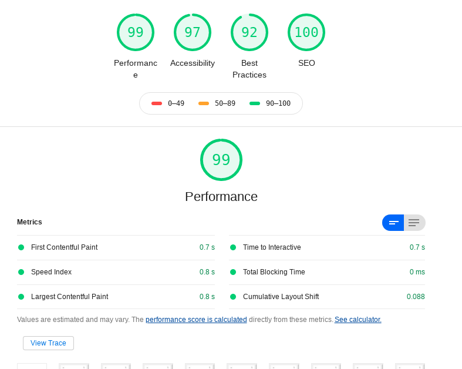
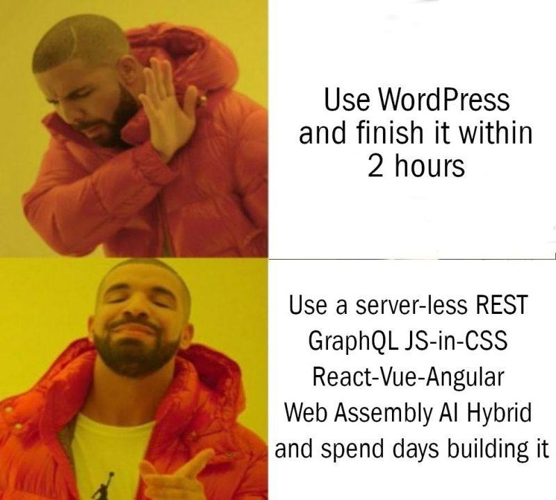

---
aliases:
- /programar-un-blog-o-usar-wordpress
- /programar-un-blog-o-usar-wordpress/porque_decidi_usar_wordpress/
- /programar-un-blog-o-usar-wordpress/porque_decidi_usar_wordpress/feed/
- /wordpress-vs-django-cms/
authors:
- Eduardo Zepeda
categories:
- opiniones
coverImage: images/porque_decidi_usar_wordpress.jpg
date: '2019-06-26'
keywords:
- wordpress
- opinion
- hugo
- react
- frontity
title: ¿Programar un blog o usar wordpress?
---

El otro día una persona me preguntó que porqué use Wordpress para mi blog si podía desarrollar un sitio web por mi mismo o usar alguna de las opciones disponibles como Ghost, Zola, etc. En la entrada donde explico [como aprendí a programar](/es/hello-world-como-aprendi-a-programar/) incluso hablé brevemente de mi pésima experiencia con PHP. Entonces, ¿por qué elegí Wordpress en lugar de desarrollar mi propio blog desde cero? La respuesta a esto es simplemente que, **para este blog, quiero escribir texto, no código**. 

## De lo que me pierdo al usar wordpress

Ciertamente al usar Wordpress se pierde muchísimo poder de personalización, tanto a nivel código como a nivel diseño. Solamente puedo acceder a lo que ya hay disponible, modificar el núcleo de wordpress sería una tarea que no pagaría los dividendos adecuados. De la misma manera, al usar Wordpress estoy renunciando a características nuevas del mundo de la programación, como las SPA (out of the box, claro), SSR y otras maravillas que probablemente no están disponibles para Wordpress. Así mismo me pierdo del placer de escribir modificaciones usando lenguajes como javascript o Python, en lugar de PHP.



## Lo que gano al usar wordpress

Wordpress es un sistema bastante popular en internet y ya cuenta con miles de soluciones a los problemas más comunes. Hay plugins para revisar mi SEO, corregir mi redacción, para prevenir el spam en comentarios, para integrar Wordpress automáticamente con MailChimp, para vincular la programación de entradas con redes sociales usando hootsuite, para optimizar imágenes y miles de plantillas hechas por diseñadores mucho más talentosos que yo. Sí, yo sé que se podría programar todo eso también, pero consume tiempo y ese tiempo podría utilizarlo para escribir más entradas o programar otros sitios web.

## Mi experiencia hasta ahora con wordpress

A decir verdad esta es la primera vez que creo algo con wordpress. Instalarlo en [Digital Ocean](/es/digital-ocean-analisis-y-mi-experiencia-como-usuario/) fue bastante sencillo y en menos de 5 minutos tuve un blog en linea y perfectamente funcional, listo para empezar a publicar en él y con un arsenal de herramientas para facilitar mi trabajo. Mis únicos dos problemas (si es que se les puede llamar así) fueron dos; el primero, el alto contenido de spam; el segundo, apache2 no sirve contenido usando http2 de manera predeterminada, por lo que necesité ir a la terminal para modificar la configuración de Apache2. A parte de eso, no he tenido problema alguno con Wordpress, ni perdida de datos, ni bugs en el código; mi sitio web corre relativamente bien, con muy buenos indicadores en [lighthouse](https://web.dev#?).

## El odio de los desarrolladores hacia wordpress

He escuchado que odiar Wordpress entre los desarrolladores está de moda y entiendo su sentir pero solo hasta cierto punto. Yo creo que Wordpress es un excelente sistema para hacer blogs porque es super amigable con el usuario final. Yo he estado al frente de una empresa y sé que el cliente final no quiere entender de tecnicismos, no le interesa lo que es node, nextjs, vercel o lo que es un ataque por XSS, lo que quiere el cliente es poder modificar un sitio a su antojo sin tener que estar llamando a un desarrollador web cada semana. ¿Es lo correcto? Pues yo creo que depende del proyecto, para blogs personales o proyectos menores sí, para algo mucho más sofisticado habría que educar al cliente y explicarle los pros y los contras de usar un CMS como wordpress a corto, mediano y largo plazo.

Por otro lado, le doy la razón totalmente a los desarrolladores cuando dicen que usar Wordpress para ecommerce, galerías de fotografías o cualquier otra aplicación es una pésima idea, yo comparto totalmente su sentir. Como escribí anteriormente, creo que en aquellas situaciones donde se requiere una solución mucho más personalizada hay que pasar de Wordpress por completo. Sin embargo es trabajo del desarrollador explicarle al cliente el valor agregado que puede aportar un sitio web personalizado y programado desde cero totalmente a su medida a su marca.

## TLDR;

En resumen, yo usaría wordpress solo para blogs personales y quizás Landing pages. Sin embargo evitaría usar wordpress para galerías de fotos, ecommerce o cualquier otro tipo de página web que requiera un poco más de personalización.

## Actualización, ¿por qué ya no uso Wordpress para este blog?

Actualización 18-Feb-2021: Decidí combinar lo mejor de los dos mundos; un frontend escrito usando las nuevas tecnologías de Javascript y un backend robusto en wordpress. Para hacerlo usé [Frontity, un framework de React para Wordpress](https://frontity.org/#?). La navegación es mucho más fluida y puedo personalizarlo a mi gusto. Y, dado que el backend de mi blog sigue siendo wordpress, aún puedo usar Yoast SEO y el editor de entradas de wordpress, desde el cual estoy escribiendo esta entrada.

Actualización de Abr-2022: Me cambié a Hugo, un SSG escrito casi por completo en Go, genera sitios estáticos en apróximadamente 1ms por página, utiliza Markdown, el cual es más fácil de respaldar y exportar a otros medios, para generar las páginas y cuenta con muchísimas características incorporadas como: índice de contenido, post recomendados, paginación y prácticamente todo lo que se necesita para crear sitios estáticos.

¡La verdad Hugo me encanta!, me permite olvidarme de múltiples problemas de seguridad, y mantener actualizadas las versiones de paquetes en npm y demás. Llevo poco tiempo usándolo pero me ha encantado, lo único malo es la curva de aprendizaje. 

Pero no te confundas, aún considero que Wordpress es la mejor opción para la mayoría de las personas que quieren empezar un blog, Hugo requiere demasiado conocimiento técnico como para serle útil a todo el mundo, su comunidad es mucho más pequeña y la mayoría de soluciones "out of the box" están desactualizadas y no son tan numerosas como en Wordpress. Además hecho de menos ciertos plugins como Yoast, el cual cuidaba el SEO a la par que creaba una entrada y con el que no [tenía que preocuparme por cometer errores de principiante en el SEO de la página](/es/mis-errores-de-optimizacion-en-el-seo-tecnico-de-mi-sitio-web/).

Incluso desarrollé mi propio tema minimalista, con solo lo básico para mis necesidades, [el código está en mi github](https://github.com/EduardoZepeda/hugo-theme-latte#?), por lo que si tienes curiosidad puedes revisarlo cuando gustes.