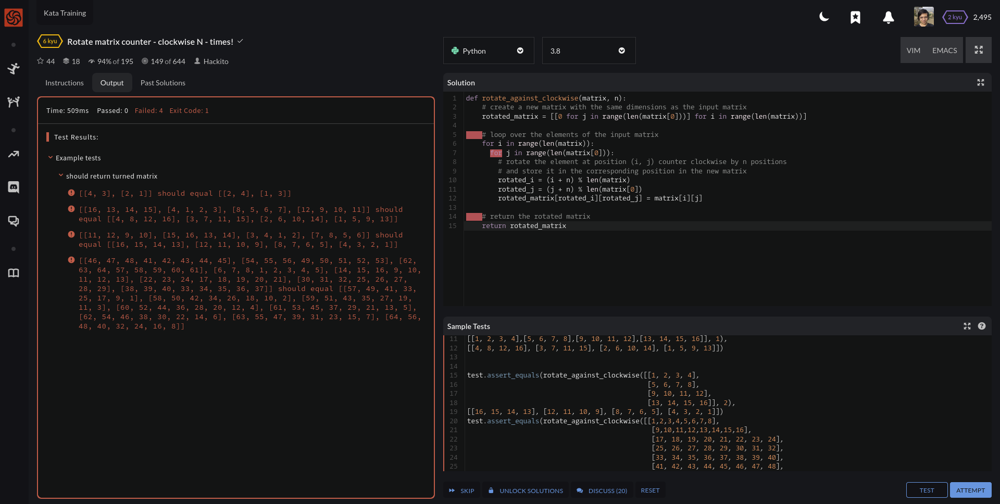
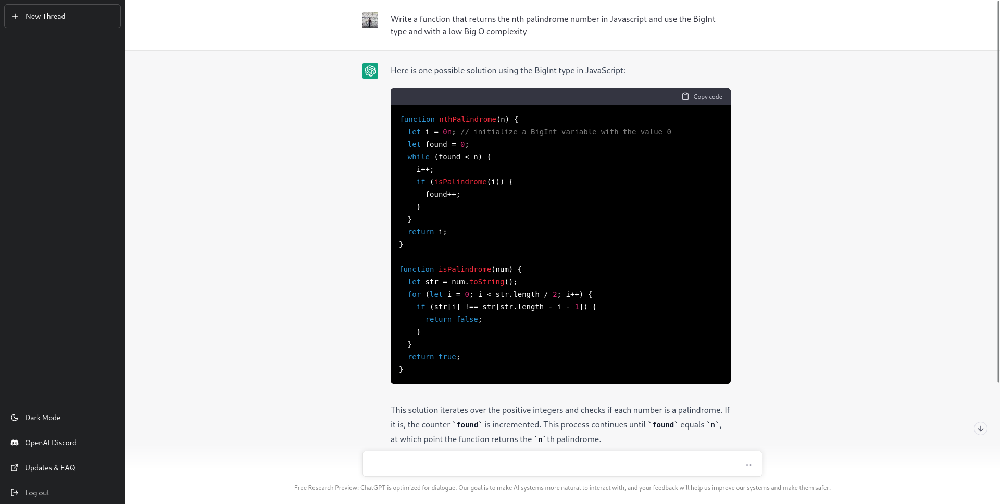

ChatGPT is breaking with everything previously known in artificial intelligence, some developers are worried that it may replace them in their jobs, just as Github Copilot threatened at the time. In this post I test [ChatGPT's supposed intelligence](/en/chat-gpt-searles-chinese-room-and-consciousness/) against three codewars challenges.

## How does Codewars work?

Before we start you need to understand that [Codewars](https://www.codewars.com) is a social network for programmers where code challenges written by the same users are shared. Each challenge can be tested with a series of tests and, if it passes all of them, the challenge is considered completed. These challenges are called katas.

Each kata has a level of difficulty, defined by its number of kyu (as in martial arts), with the highest numbers being the easiest and the lowest numbers the most difficult, ranging from the 8th kyu to the 1st kyu.

The challenges are very varied, ranging from classic tests, such as obtaining prime numbers, to more complex ones, such as writing code without exceeding two characters per line.

## Test with common requests to ChatGPT

To start with I was testing ChatGPT with a series of simple and popular requests. I found that ChatGPT was able to return the correct code each time with its explanation and logical steps:

* Fibonacci numbers
* Prime numbers
* Palindromes
* Validate email, strings, numbers
* Very specific tasks of some frameworks. For example: [Replace User model in Django.](/en/how-to-customize-the-user-model-in-django/)


Frankly, I am surprised with the capabilities of generating correct code that ChatGPT has for simple tasks and with abundant information on the net; I did not expect such capability.

For this entry I'm going to test this artificial intelligence with algorithmic puzzles that require a little more than googling information on the internet.

## Codewars test selection

For these proofs I tried to choose a middle ground between those proofs with very straightforward requirements and with abundant solutions on the web (such as fibonacci numbers or primes) and those that require a lot of additional information, very complex premises or that require extra context. I also focused on those solutions that are not so popular on the web.

## ChatGPT vs Rotate the matrix counter-clockwise N - times! (6kyu)

The challenge of the [Rotate Matrix Anti-Clockwise N - Times!](https://www.codewars.com/kata/5919f3bf6589022915000023) test is: In this kata your mission is to rotate a matrix counter-clockwise" n" number of times. That is, rotate a matrix against the clock "n" number of times.

The input I used in ChatGPT to generate the code is as follows: Create a function that rotates an array counterclockwise "n" number of times.


The Python code generated by our Artificial Intelligence is as follows:

```python
# Este código fue generado por OpenAI-ChatGPT
def rotate_matrix(matrix, n):
    # create a new matrix with the same dimensions as the input matrix
    rotated_matrix = [[0 for j in range(len(matrix[0]))] for i in range(len(matrix))]

    # loop over the elements of the input matrix
    for i in range(len(matrix)):
      for j in range(len(matrix[0])):
        # rotate the element at position (i, j) counter clockwise by n positions
        # and store it in the corresponding position in the new matrix
        rotated_i = (i + n) % len(matrix)
        rotated_j = (j + n) % len(matrix[0])
        rotated_matrix[rotated_i][rotated_j] = matrix[i][j]

    # return the rotated matrix
    return rotated_matrix
```

### Response analysis

After executing the code we can see that all the tests fail, the matrix rotates, but more times than necessary.



I want to emphasize that ChatGPT produces syntactically correct code, respecting identation, with intuitive variable names and even with a logic that seems correct, only at first glance, but upon closer examination, fails to "reason" its logic. Yes, I know that artificial intelligences do not reason.

## ChatGPT vs Find Nth Inverse Number (Extreme)

The challenge [Find the nth Reverse Number](https://www.codewars.com/kata/600c18ec9f033b0008d55eec) consists of: The nth reverse number needs to be returned. (Assume the reverse numbers start with 0 as shown in the example.)

That is, find the palindrome number "n" and with the appropriate condition of doing so with excellent Big O performance.

```python
0, 1, 2, 3, 4, 5, 6, 7, 8, 9, 11, 22, 33, 44, 55, 66, 77, 88, 99, 101
```



### Response analysis

After running the code I was surprised to realize that, after a little tweaking, the result is correct!


In addition to producing syntactically correct code, the generated code works perfectly, even containing comments.

```javascript
// Este código fue generado por OpenAI-ChatGPT
function findReverseNumber(n) {
  let i = 0n; // initialize a BigInt variable with the value 0
  let found = 0;
  // El ajuste está aquí, n-1 en lugar de n
  while (found < n-1) {
    i++;
    if (isPalindrome(i)) {
      found++;
    }
  }
  return i;
}

function isPalindrome(num) {
  let str = num.toString();
  for (let i = 0; i < str.length / 2; i++) {
    if (str[i] !== str[str.length - i - 1]) {
      return false;
    }
  }
  return true;
}
```

However, there is a small bug, despite producing the results correctly, the code fails the tests because the [Big O performance](/en/the-big-o-notation/) of the artificial intelligence is insufficient for the test.

I tried to get the correct answer multiple times, even specifying the complexity of Big O with different inputs, but it was impossible to get the correct result.

## ChatGPT vs Regular Expression for Binary Numbers Divisible by n (1 kyu)

The challenge of [Regular Expression for Binary Numbers Divisible by n](https://www.codewars.com/kata/5993c1d917bc97d05d000068) is: Create a function that returns a regular expression string capable of evaluating binary strings (consisting only of 1s and 0s) and determine whether the given string represents a number divisible by n.


After asking for an answer, it returns a rather simple expression and even gives us a step-by-step explanation of the logical reasoning, apparently correct but, in practice, incorrect.

The regular expression returned as a response is the following:

```javascript
// Este código fue generado por OpenAI-ChatGPT
^[01]+\b(?:$){n}$
```

### Response analysis

When we test it in the codewars tests, it fails, obviously.


## Results and my opinion

The results are summarized in the following table:

| Kata  | Resultado |
| ----- | --------- |
| 6 kyu | ❌         |
| 4 kyu | ✅         |
| 1 kyu | ❌         |

Although ChatGPT got only one of the challenges right (and only half right), it is able to solve simple problems, which could also be solved with a google or stackoverflow search, this artificial intelligence is able to return a code that works, but not necessarily correct or efficient, but it is close.

ChatGPT becomes quite inefficient with requests that require a more complex reasoning and seems unable to build a complex system, with many interacting parts, however I recognize that, for each question, it is able to return a syntactically correct and logical-looking answer, at least at first glance, giving us a false sense of security if we do not know the topic we are asking about. However, his answers can serve as a starting point.

### Is ChatGPT a threat to programmers?

Do I think ChatGPT represents is going to put a lot of jobs on the line? Yes, I think ChatGPT will trouble most jobs (not necessarily those related to code) that are not challenging and whose difficulty lies in a simple google search, or automatable tasks, requiring simple reasoning. However, I believe that it is not the veracity of its answers, but its chat-like interface, and the immediacy of its answers, that could make it quite popular.