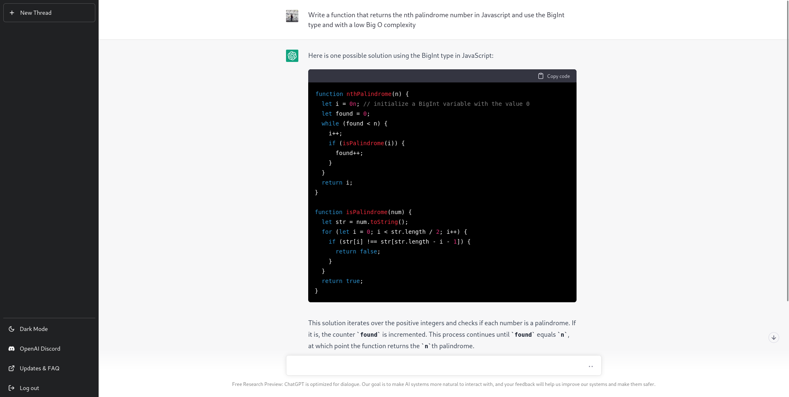
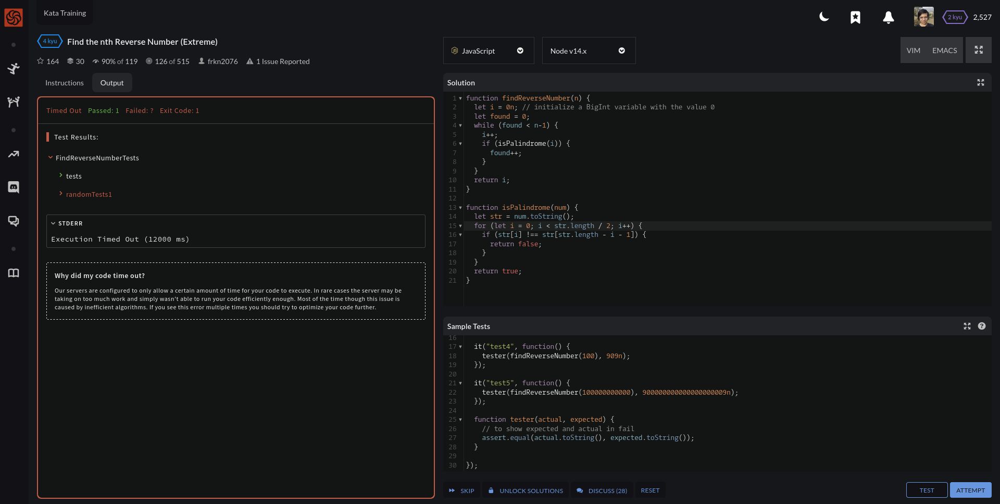

ChatGPT está rompiendo con todo lo conocido anteriormente en inteligencia
artificial, algunos desarrolladores están preocupados de que pueda reemplazarlos
en sus trabajos, justo como amenazó Github Copilot en su momento. En esta
entrada pongo a prueba ChatGPT contra tres desafios de codewars.

## ¿Cómo funciona Codewars?

Antes de empezar necesitas entender que [Codewars](https://www.codewars.com) es
una red social de programadores en la que se comparten desafios de código
escritos por los mismos usuarios. Cada desafio puede ponerse a prueba con una
serie de pruebas y, si las pasa todas, el desafio se considera completado. Estos
desafios tienen el nombre de katas.

Cada kata posee un nivel de dificultad, definido por su número de kyu (como en
las artes marciales), siendo los números más altos los más fáciles y los más
pequeños los más difíciles, yendo desde el 8vo kyu al 1er kyu.

Los desafios son muy variados, van desde pruebas clásicas; como la obtención de
números primos, hasta algunas más complejos; como escribir código sin superar
dos caracteres por linea.

## Test con peticiones comunes a ChatGPT

Para empezar estuve probando ChatGPT con una serie de peticiones sencillas y
populares. Encontré que ChatGPT pudo devolver el código correcto en cada ocasión
con su explicación y pasos lógicos:

* Números de fibonacci
* Números primos
* Palíndromos
* Validar email, strings, números
* Labores muy concretas de algunos frameworks. Por ejemplo: [Sustituir el modelo
  de User en Django.](/como-personalizar-el-modelo-user-en-django/)


Francamente, estoy sorprendido con las capacidades de generar código correcto
que tiene ChatGPT para tareas sencillas y con información abundante en la red;
no esperaba tal capacidad.

Para esta entrada voy a ponerlo a prueba a esta inteligencia artificial con
acertijos de algoritmos que requieren un poco más que googlear información en
internet.

## Selección de las pruebas de Codewars

Para estas pruebas traté de elegir un punto medio entre aquellas pruebas con
requisitos muy directos y con soluciones abundantes en la red (como los números
de fibonacci o los primos) y aquellas otras que requieren muchísima información
adicional, premisas muy complejas o que requieren contexto extra. Además me
enfoqué en aquellas soluciones que no son tan populares en la red.

## ChatGPT vs Rotate matrix counter - clockwise N - times! (6 kyu)

El desafio de la [prueba Rotate matrix counter - clockwise N -
times!](https://www.codewars.com/kata/5919f3bf6589022915000023) es: In this kata
your mission is to rotate matrix counter - clockwise N-times. Es decir, rotar
una matriz contra reloj "n" numero de veces.

El input que usé en ChatGPT para generar el código es el siguiente: Create a
function that rotates a matrix counter-clockwise "n" number of times.


El código Python generado por nuestra Inteligencia Artficial es el siguiente:

```python
# Este código fue generado por OpenAI-ChatGPT
def rotate_matrix(matrix, n):
    # create a new matrix with the same dimensions as the input matrix
    rotated_matrix = [[0 for j in range(len(matrix[0]))] for i in range(len(matrix))]
  
    # loop over the elements of the input matrix
    for i in range(len(matrix)):
      for j in range(len(matrix[0])):
        # rotate the element at position (i, j) counter clockwise by n positions
        # and store it in the corresponding position in the new matrix
        rotated_i = (i + n) % len(matrix)
        rotated_j = (j + n) % len(matrix[0])
        rotated_matrix[rotated_i][rotated_j] = matrix[i][j]
  
    # return the rotated matrix
    return rotated_matrix
```

### Análisis de la respuesta

Tras ejecutar el código podremos apreciar que todos los tests fallan, la matriz
gira, pero más veces de las necesarias


Quiero resaltar que ChatGPT produce código sintácticamente correcto, respetando
identación, con nombres de variables intuitivos e incluso con una lógica que
parece correcta, solo a simple vista, pero que tras la examinación más
detallada, falla en "razonar" su lógica. Sí, ya sé que las inteligencias
artificiales no razonan.

## ChatGPT vs Find the nth Reverse Number (Extreme)

El desafio [Find the nth Reverse
Number](https://www.codewars.com/kata/600c18ec9f033b0008d55eec) consiste en: You
need to return the nth reverse number. (Assume that reverse numbers start from 0
as shown in the example.)

Es decir, encontrar el palíndromo número "n" y con la condición adecuada de
hacerlo con un excelente rendimiento de Big O.

```python
0, 1, 2, 3, 4, 5, 6, 7, 8, 9, 11, 22, 33, 44, 55, 66, 77, 88, 99, 101
```



### Análisis de la respuesta

Tras ejecutar el código me sorprendí al darme cuenta de que, tras un pequeño
ajuste, ¡el resultado es correcto!



Además de producir código sintácticamente correcto, el código generado funciona
perfectamente, incluso contiene comentarios.

```javascript
// Este código fue generado por OpenAI-ChatGPT
function findReverseNumber(n) {
  let i = 0n; // initialize a BigInt variable with the value 0
  let found = 0;
  // El ajuste está aquí, n-1 en lugar de n
  while (found < n-1) {
    i++;
    if (isPalindrome(i)) {
      found++;
    }
  }
  return i;
}

function isPalindrome(num) {
  let str = num.toString();
  for (let i = 0; i < str.length / 2; i++) {
    if (str[i] !== str[str.length - i - 1]) {
      return false;
    }
  }
  return true;
}
```

Sin embargo, hay un pequeño error, a pesar de producir los resultados de manera
correcta, el código no pasa las pruebas por que el [rendimiento de Big
O](/la-notacion-big-o/) de la inteligencia artificial es insuficiente para la
prueba.

Intenté obtener la respuesta correcta múltiples veces, incluso especificando la
complejidad de Big O con diferentes inputs, pero fue imposible obtener el
resultado correcto.

## ChatGPT vs Regular Expression for Binary Numbers Divisible by n (1 kyu)


El desafio de [Regular Expression for Binary Numbers Divisible by
n](https://www.codewars.com/kata/5993c1d917bc97d05d000068) es: Create a function
that will return a regular expression string that is capable of evaluating
binary strings (which consist of only 1s and 0s) and determining whether the
given string represents a number divisible by n.


Tras solicitarle una respuesta nos devuelve una expresión bastante simple e
incluso nos da una explicación paso a paso del razonamiento lógico, en
apariencia correcto pero, en la práctica, incorrecto.

La expresión regular que nos devuelve como respuesta es la siguiente:

```javascript
// Este código fue generado por OpenAI-ChatGPT
^[01]+\b(?:$){n}$
```

### Análisis de la respuesta

Cuando la ponemos a prueba en las pruebas de codewars, falla, obviamente


## Resultados y mi opinión

Los resultados se resumen en la siguiente tabla:

| Kata   | Resultado |
|--------|-----------|
| 6 kyu  | ❌        |
| 4 kyu  | ✅        |
| 1 kyu  | ❌        |

Si bien ChatGPT acertó solo uno de los desafios (y a medias) es capaz de
resolver problemas sencillos, que también podrían resolverse con una búsqueda en
google o stackoverflow, esta inteligencia artificial es capaz de devolver un
código que funciona, más no necesariamente correcto, ni eficiente, pero se
acerca.

ChatGPT se vuelve bastante ineficiente con peticiones que requieren de un
razonamiento más complejo y parece incapaz de construir un sistema complejo, con
muchas partes que interaccionan entre sí, sin embargo reconozco que, ante cada
pregunta, es capaz de devolver una respuesta sintácticamente correcta y de
apariencia lógica, al menos a simple vista, dándonos una falsa sensación de
seguridad si desconocemos el tema del que estamos preguntándole. Sin embargo sus
respuesta sí que pueden servir de punto de partida.

### ¿Es ChatGPT una amenaza para los programadores?

¿Creo que ChatGPT representa va a poner en aprietos muchos trabajos? Sí, creo
que ChatGPT va a poner en dificultades a la mayoría de los trabajos (no
necesariamente aquellos relacionados con código) no desafiantes y cuya
dificultad radique en una sencilla búsqueda de google, o tareas automatizables,
que requieran razonamientos simples. Sin embargo, considero que no es la
veracidad de sus respuestas, sino su interfaz tipo chat, y la inmediatez de sus
respuestas, la que la la podrían volver bastante popular.
