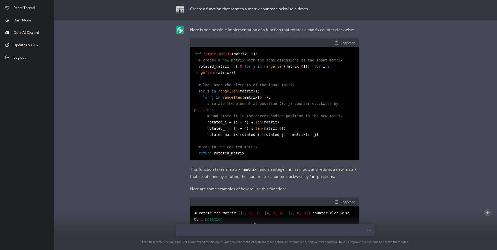
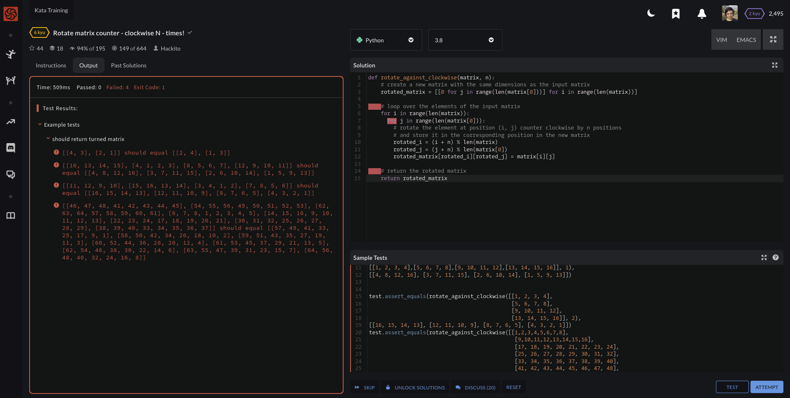
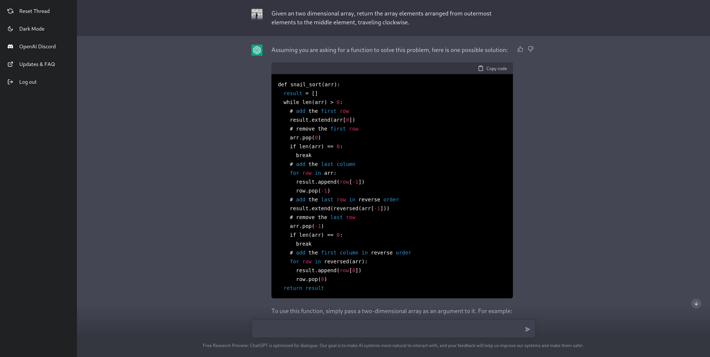
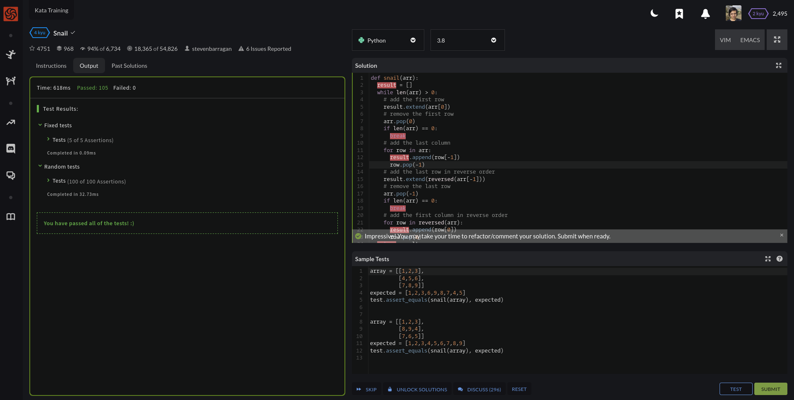
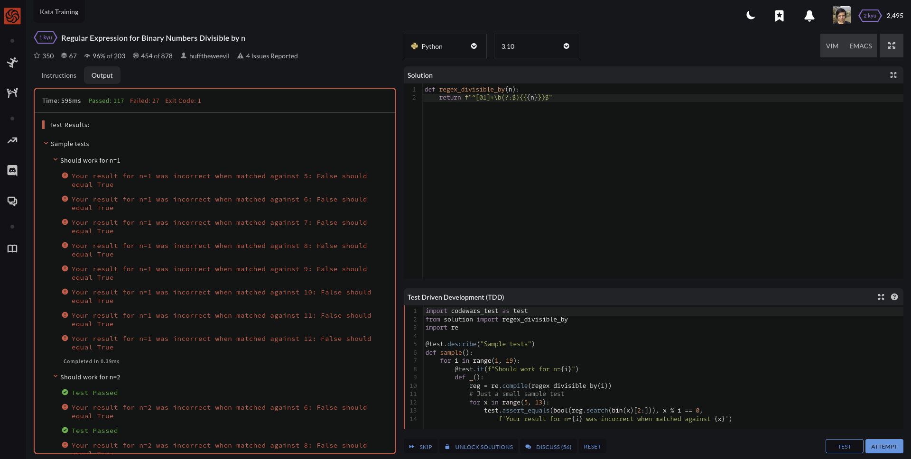

GPT-3 está rompiendo con todo lo conocido anteriormente en inteligencia artificial, algunos desarrolladores están preocupados de que pueda reemplazarlos en sus trabajos, justo como amenazó Github Copilot en su momento. En esta entrada pongo a prueba GPT-3 contra tres desafios de codewars.

## ¿Cómo funciona Codewars?

Antes de empezar necesitas entender que [Codewars](https://www.codewars.com) es una red social de programadores en la que se comparten desafios de código escritos por los mismos usuarios. Cada desafio puede ponerse a prueba con una serie de pruebas y, si las pasa todas, el desafio se considera completado. Estos desafios tienen el nombre de katas.

Cada kata posee un nivel de dificultad, definido por su número de kyu (como en las artes marciales), siendo los números más altos los más fáciles y los más pequeños los más difíciles, yendo desde el 8vo kyu al 1er kyu.

Los desafios son muy variados, van desde pruebas clásicas; como la obtención de números primos, hasta algunas más complejos; como escribir código sin superar dos caracteres por linea.

## Selección de las pruebas de Codewars

Para estas pruebas traté de elegir un punto medio entre aquellas pruebas con requisitos muy directos y con soluciones abundantes en la red (como los números de fibonacci o los primos) y aquellas otras que requieren muchísima información adicional, premisas muy complejas o contexto extra y con pocas probabilidades de encontrar información en la red.

## GPT-3 vs Rotate matrix counter - clockwise N - times! (6 kyu)

El desafio de la [prueba Rotate matrix counter - clockwise N - times!](https://www.codewars.com/kata/5919f3bf6589022915000023) es: In this kata your mission is to rotate matrix counter - clockwise N-times. Es decir, rotar una matriz contra reloj "n" numero de veces.

El input que usé en GPT-3 para generar el código es el siguiente: Create a function that rotates a matrix counter-clockwise "n" number of times.



El código Python generado por nuestra Inteligencia Artficial es el siguiente:

```python
def rotate_matrix(matrix, n):
    # create a new matrix with the same dimensions as the input matrix
    rotated_matrix = [[0 for j in range(len(matrix[0]))] for i in range(len(matrix))]
  
    # loop over the elements of the input matrix
    for i in range(len(matrix)):
      for j in range(len(matrix[0])):
        # rotate the element at position (i, j) counter clockwise by n positions
        # and store it in the corresponding position in the new matrix
        rotated_i = (i + n) % len(matrix)
        rotated_j = (j + n) % len(matrix[0])
        rotated_matrix[rotated_i][rotated_j] = matrix[i][j]
  
    # return the rotated matrix
    return rotated_matrix
```

### Análisis de la respuesta

Tras ejecutar el código podremos apreciar que todos los tests fallan, la matriz gira, pero más veces de las necesarias



Quiero resaltar que GPT-3 produce código sintácticamente correcto, respetando indentación, con nombres de variables intuitivos e incluso con una lógica que parece correcta, solo a simple vista, pero que tras la examinación más detallada, falla en "razonar" su lógica. Sí, ya sé que las inteligencias artificiales no razonan.

## GPT-3 vs Snail (4 kyu)

El desafio [snail](https://www.codewars.com/kata/521c2db8ddc89b9b7a0000c1) consiste en: Given an n x n array, return the array elements arranged from outermost elements to the middle element, traveling clockwise.


```python
array = [[1,2,3],
         [4,5,6],
         [7,8,9]]
snail(array) => [1,2,3,6,9,8,7,4,5]
```



### Análisis de la respuesta

Tras ejecutar el código me sorprendí al darme cuenta de que ¡todos los tests pasan!



Además de producir código sintácticamente correcto, el código generado funciona perfectamente, incluso contiene comentarios.

```python
def snail(arr):
    result = []
    while len(arr) > 0:
      # add the first row
      result.extend(arr[0])
      # remove the first row
      arr.pop(0)
      if len(arr) == 0:
        break
      # add the last column
      for row in arr:
        result.append(row[-1])
        row.pop(-1)
      # add the last row in reverse order
      result.extend(reversed(arr[-1]))
      # remove the last row
      arr.pop(-1)
      if len(arr) == 0:
        break
      # add the first column in reverse order
      for row in reversed(arr):
        result.append(row[0])
        row.pop(0)
    return result
```

## GPT-3 vs Regular Expression for Binary Numbers Divisible by n (1 kyu)


El desafio de [Regular Expression for Binary Numbers Divisible by n](https://www.codewars.com/kata/5993c1d917bc97d05d000068) es: Create a function that will return a regular expression string that is capable of evaluating binary strings (which consist of only 1s and 0s) and determining whether the given string represents a number divisible by n.


Tras solicitarle una respuesta nos devuelve una expresión bastante simple e incluso nos da una explicación paso a paso del razonamiento lógico, en apariencia correcto pero, en la práctica, incorrecto.

La expresión regular que nos devuelve como respuesta es la siguiente:

```javascript
^[01]+\b(?:$){n}$
```

### Análisis de la respuesta

Cuando la ponemos a prueba en las pruebas de codewars, falla, obviamente




## Resultados y mi opinión sobre GPT-3

Los resultados se resumen en la siguiente tabla:

| Kata   | Resultado |
|--------|-----------|
| 6 kyu  | ❌        |
| 4 kyu  | ✅        |
| 1 kyu  | ❌        |

Si bien GPT-3 es capaz de resolver problemas sencillos, que también podrían resolverse con una búsqueda en google o stackoverflow, se vuelve bastante ineficiente con peticiones que requieren un proceso más complicado, sin embargo reconozco que, ante cada pregunta, es capaz de devolver una respuesta semánticamente correcta y de apariencia lógica, al menos a simple vista, dándonos una falsa sensación de seguridad si desconocemos el tema del que estamos preguntándole.

¿Creo que GPT-3 representa una amenaza para los trabajos? Sí, creo que GPT-3 va a eliminar la mayoría de los trabajos no desafiantes y cuya dificultad radica en una búsqueda de google, aunque quizás su interfaz tipo chat, más cercana a una conversación, tenga que ver más con la información que devuelve.

