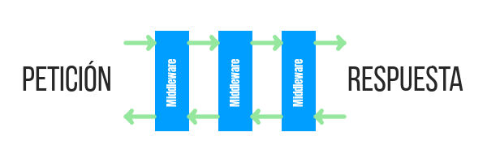
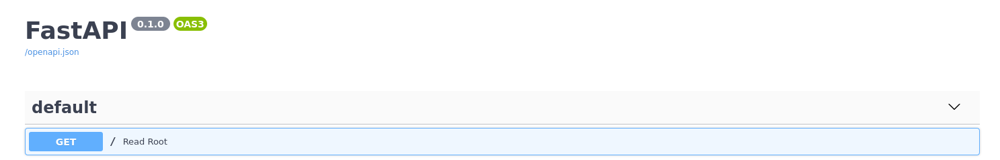

Estos últimos días he estado probando una librería para Python que se está volviendo muy popular, FastAPI, un framework para crear APIs, tales como [REST APIs](/caracteristicas-basicas-de-una-api-rest/) o APIs RPC. FastAPI promete ayudarnos a crear APIs rápidas de manera sencilla, con muy poco código y con un rendimiento extraordinario, para soportar sitios web de alta concurrencia.

## FastAPI vs Django vs Flask vs Pyramid

¿De verdad FastAPI es tan rápido? Sí, al menos así lo afirma la evidencia. FastAPI queda en primer lugar en respuestas por segundo frente a Frameworks más populares como Django, Pyramid o Flask. Y también queda en los primeros lugares si lo comparamos con Frameworks de otros lenguajes de programación, como PHP o Javascript.

### FastAPI vs Django

FastAPI se centra en crear APIs de manera sencilla y muy eficiente, Django puede hacer lo mismo usando su librería de DRF y su ORM, pero yo no considero que sean competidores directos. ¿Por qué? Pues porque Django se centra en ser más una solución integral, que cubre desde un sistema de [sesiones y autenticación](/login-con-django-rest-framework-drf/), ORM, renderizado de plantillas, creación y manejo de formularios, middleware, [sistema de caché](/cache-en-django-rest-framework-con-memcached/), su [panel de admin incluido](/el-django-admin-panel-y-su-personalizacion/), i18n y muchos otros aspectos. 

Por otro lado, FastAPI le deja el camino libre al desarrollador, por lo que, al cubrir necesidades diferentes, la comparación no aplica.

### FastAPI vs Flask

A diferencia de Django, sí considero a Flask como un competidor más directo de FastAPI. Ambos frameworks guardan cierta similitud en cuanto a sintaxis y se caracterizan por ser bastante ligeros y ofrecer la mínima funcionalidad. FastAPI ofrece validación, mientras que Flask no, FastAPI ofrece documentación automática, mientras que Flask no. Además FastAPI ofrece un mejor rendimiento según las pruebas disponibles.

Mira las siguientes comparaciones que usan información de [Techempower](https://www.techempower.com/benchmarks). He resaltado en azul los frameworks de Python.

### Rendimiento para peticiones con una query

El número indica la cantidad de respuestas por segundo para un single query, por supuesto que mientras más alto mejor.


### Rendimiento para peticiones con 20 queries

Pero, ¿y para peticiones con mayor carga? En esta imagen se muestran la cantidad de respuestas para una petición con 20 queries, nuevamente, mientras más alto mejor.


Según la información que nos proporciona Techempower, **FastAPI es tremendamente más rápida que Django, Flask y Pyramid.**

Pero ¿qué tal su compatibilidad con las nuevas versiones de Python?

## Tipado y asincrónismo en Python

FastAPI es totalmente compatible con el tipado y el asincrónismo de las últimas versiones de Python.

Con la intención de mantener este tutorial lo más sencillo posible voy a usarlas **únicamente donde sea necesario**, si no es estrictamente necesario incluirlas voy a omitirlas. Menciono lo anterior para que tomes en cuenta que cada fragmento de código donde se use FastAPI puede incorporar asincronismo y tipado, según consideres necesario.

Ahora que ya viste porque vale la pena usarlo, ¿por qué no probarlo?

## Tutorial básico de FastAPI

### Instalación de FastAPI

Para instalarlo vamos a crear un entorno virtual con [Pipenv, una herramienta de manejo de entornos virtuales.](/pipenv-el-administrador-de-entornos-virtuales-que-no-conoces/). Además de FastAPI necesitaremos uvicorn; un servidor ASGI, el cual usaremos para servir nuestra API.

```bash
pipenv install fastapi uvicorn
```

Activemos el entorno virtual para tener acceso a los paquetes que acabamos de instalar.

```bash
pipenv shell
```

A continuación vamos a crear un archivo llamado _main.py_, aquí estará todo el código que usaremos para crear nuestra API.

```bash
touch main.py
```

Y ahora vamos a colocar el código mínimo para tener un servidor.

```python
# main.py
from fastapi import FastAPI

app = FastAPI()

@app.get("/")
def read_root():
    return {"Hello": "World"}
```

Lo primero será importar la librería, después crearemos una instancia de FastAPI. A continuación escribiremos una función que devuelva un diccionario y usaremos un decorador con la ruta que queremos que capture nuestra aplicación. Es todo.

Uvicorn se encargará de servir la API que acabamos de crear por medio del siguiente comando:

```bash
uvicorn main:app --reload
```

Analicemos brevemente lo que acabamos de ejecutar:

- _main_ se refiere al nombre de nuestro archivo
- _app_ es la instancia de FastAPI que creamos
- _\--reload_ le dice a uvicorn que escuche cambios en el código

```bash
INFO:     Uvicorn running on http://127.0.0.1:8000 (Press CTRL+C to quit)
```

Como puedes ver, si todo salió bien, tendremos un servidor corriendo [localhost:8000](http://127.0.0.1:8000)

```bash
curl localhost:8000
{"Hello":"World"}
```

Y, si realizamos una petición al puerto 8000, obtendremos nuestra respuesta en formato JSON, sin necesidad de haberla convertido desde el diccionario Python.

### Capturando parámetros

Ahora pasemos de rutas estáticas a rutas con parámetros.

Para capturar parámetros agregaremos estas lineas al archivo _main.py_ que ya tenemos. Importamos el tipado _Optional_ con la intención de capturar nuestros parámetros opcionales. Para este ejemplo voy a usar el tipado que ofrecen las nuevas versiones de Python, nota como fijamos _item\_id_: _int_ para que acepte únicamente valores de tipo entero.

```python
from fastapi import FastAPI
from typing import Optional

app = FastAPI()

@app.get("/")
def read_root():
    return {"Hello": "World"}

@app.get("/items/{item_id}")
def read_item(item_id: int, q: Optional[str] = None):
    # otra_funcion_para_item_id(item_id)
    # otra_function_para_q(q)
    return {"item_id": item_id, "q": q}
```

Dentro del decorador colocamos entre corchetes el nombre de la variable que queremos capturar. Esta variable se la pasaremos como parámetro a nuestra función

Como segundo parámetro, opcional, esperaremos un parámetro GET, de nombre "q".

En este caso, lo único que hará nuestra función es devolver ambos valores en formato JSON. Aunque, seguramente ya te diste cuenta cuenta de que, en lugar de simplemente devolverlos, puedes usar esos datos para buscar en una base de datos, ingresar esa información como parámetros a otra función y retornar otra cosa totalmente distinta.

```bash
curl localhost:8000/items/42
{"item_id":42,"q":null}
```

Como no especificamos un parámetro GET opcional nos devuelve un _null_ en su lugar. Mira lo que sucede si intentamos enviar un valor inválido, es decir, que no sea un entero.

```bash
curl localhost:8000/items/texto -i
HTTP/1.1 422 Unprocessable Entity
date: Sun, 11 Oct 2020 00:13:38 GMT
server: uvicorn
content-length: 104
content-type: application/json

{"detail":[{"loc":["path","item_id"],"msg":"value is not a valid integer","type":"type_error.integer"}]}
```

FastAPI se encarga de hacernos saber que el valor enviado es inválido mediante una respuesta HTTP 422. Ahora hagamos una petición que incluya valores correctos para ambos parámetros de nuestra funcion _read\_item()_

```bash
curl localhost:8000/items/42?q=larespuesta
{"item_id":42,"q":"larespuesta"}
```

Observa como nos regresa el número que le pasemos, sea cual sea, así como nuestro parámetro GET opcional llamado "q".

### REST

FastAPI se encarga de manejar los métodos HTTP de manera bastante intuitiva, simplemente cambiando la función de nuestro decorador por su respectivo método de petición HTTP

```bash
@app.get()
@app.post()
@app.put()
@app.delete()
```

Además **es posible especificar un código de respuesta** opcional como parámetro en cada una de estas rutas.

```bash
@app.post(status_code=201)
```

Para corroborarlo creemos otra función, esta en lugar de usar el decorador _@app.get_, usará _@app.post_ y devolverá un código 201.

```python
from fastapi import FastAPI
from typing import Optional

app = FastAPI()

# {...código anterior}

@app.post("/items/", status_code=201)
def post_item():
    return {"item": "our_item"}
```

Este decorador capturará cualquier petición POST a la url _/items/_. Mira lo que sucede si intentamos hacer una petición GET, en lugar de una POST.

```bash
curl localhost:8000/items/ -i
HTTP/1.1 405 Method Not Allowed
date: Sun, 11 Oct 2020 00:56:06 GMT
server: uvicorn
content-length: 31
content-type: application/json

{"detail":"Method Not Allowed"}
```

Así es, cualquier otro método no soportado recibirá una respuesta 405 (Método no permitido). Ahora hagamos la petición correcta, con POST.

```bash
curl -X POST localhost:8000/items/
HTTP/1.1 201 Created
date: Sun, 11 Oct 2020 00:57:05 GMT
server: uvicorn
content-length: 19
content-type: application/json

{"item":"our_item"}
```

Observa que recibimos un código 201 como respuesta, así como nuestra respuesta en formato JSON.

### Cookies

#### Lectura de cookies

Si queremos leer cookies usando FastAPI tendremos que importar Cookie y luego definir un parámetro, que será una instancia de esa Cookie. Si todo sale bien podremos mandar una Cookie y FastAPI nos regresará su valor.

```python
from fastapi import Cookie, FastAPI
from typing import Optional

app = FastAPI()

# {...código anterior}

@app.get("/cookie/")
def read_cookie(my_cookie = Cookie(None)):
    return {"my_cookie": my_cookie}
```

Usemos curl para mandar una cookie y que la procese nuestra vista.

```bash
curl --cookie "my_cookie=home_made" localhost:8000/cookie/ -i
{"my_cookie":"home_made"}
```

#### Colocar cookies

Para colocar cookies es necesario acceder al objeto de respuesta de nuestra petición HTTP, y además necesitamos especificar el tipado de este parámetro. Por favor recuerda importarlo

```python
from fastapi import Cookie, FastAPI, Response
from typing import Optional

app = FastAPI()

# {...código anterior}

@app.get("/setcookie/")
def set_cookie(response: Response):
    response.set_cookie(key="myCookie",
                        value="myValue")
    return {"message": "The delicious cookie has been set"}
```

Mira la cabecera _set-cookie_ que aparece en nuestra respuesta. La presencia de esta cabecera HTTP o header indica que hemos recibido la instrucción de colocar nuestra cookie correctamente.

```bash
curl localhost:8000/setcookie/ -i
HTTP/1.1 200 OK
date: Mon, 19 Oct 2020 20:45:08 GMT
server: uvicorn
content-length: 31
content-type: application/json
set-cookie: myCookie=myValue; Path=/; SameSite=lax

{"message":"Delicious cookies"}
```

### Headers o cabeceras HTTP

#### Leer headers o cabeceras HTTP

Para leer cabeceras HTTP se hará de la misma manera que con las cookies. Por favor recuerda importar Header.

```python
from fastapi import Cookie, Header, Response, FastAPI
from typing import Optional

app = FastAPI()

# {...código anterior}

@app.get("/headers/")
def return_header(user_agent = Header(None)):
    return {"User-Agent": user_agent}
```

Listo, ahora tendremos una cabecera que nos devolverá el User-Agent actual, con el que estamos realizando la petición, el cual manda automáticamente curl con cada petición, por lo que deberiamos ser capaces de capturarlo.

```bash
curl localhost:8000/headers/ -i
HTTP/1.1 200 OK
date: Mon, 19 Oct 2020 19:33:45 GMT
server: uvicorn
content-length: 28
content-type: application/json

{"User-Agent":"curl/7.52.1"}
```

En este caso, como hicimos la petición con curl, nos retornará la cadena de texto "curl/nuestra\_versión". Si hicieramos la petición con un navegador web obtendriamos el valor de User-Agent para ese navegador.

#### Colocar headers o cabeceras HTTP

Para colocar headers necesitamos acceder al objeto response, este objeto tiene una propiedad llamada headers al que podemos agregarle valores como si fuera un diccionario.

```python
from fastapi import Cookie, Header, Response, FastAPI
from typing import Optional

app = FastAPI()

# {...código anterior}

@app.get("/setheader/")
def set_header(response: Response):
    response.headers["response_header"] = "my_header"
    return {"message": "header set"}
```

Ahora hacemos una petición a la url que acabamos de crear. Esperamos que la respuesta contenga un header o cabecera HTTP llamada _response\_header_

```bash
curl localhost:8000/setheader/ -i
HTTP/1.1 200 OK
date: Sat, 24 Oct 2020 16:11:31 GMT
server: uvicorn
content-length: 24
content-type: application/json
response_header: my_header
x-my_data: X-my_data

{"message":"header set"}
```

### Middleware

Sí, aunque FastAPI es bastante simple también incorpora la funcionalidad de usar middleware como parte de su ciclo de petición-respuesta.

¿No sabes que es un middleware? De manera simplista, un middleware es una pieza de código que colocas antes de la petición, para "interceptarla" y hacer (o no) algo con ella. Un middleware funciona de manera similar a esas carreras de relevos donde la petición y la respuesta serían las estafetas que van pasándose de un middleware al otro, cada middleware puede modificar la petición o la respuesta o dejarla intacta para pasarla al siguiente middleware.



Esquema super simplificado de un Middleware en el contexto web

Para usar middleware basta con colocar un decorador @app.middleware('http') sobre una función. Esta función recibe el objeto de la petición web (request) y una función llamada call\_next, que recibirá la petición web y retornará una respuesta.

```python
from fastapi import Cookie, Header, Response, FastAPI
from typing import Optional

app = FastAPI()

@app.middleware("http")
async def add_something_to_response_headers(request, call_next):
    response = await call_next(request)
    # Ahora ya tenemos la respuesta que podemos modificar o procesar como querramos
    response.headers["X-my_data"] = "x-my_data"
    return response
```

La respuesta a nuestra petición la obtenemos después de llamar a _call\_next_ pasándole como parámetro el objeto _request_, por lo que todas las modificaciones a la petición van antes de la llamada a _call\_next_, mientras que todas las modificaciones a la respuesta van despúes de _call\_next_

```python
from fastapi import Cookie, Header, Response, FastAPI
from typing import Optional

app = FastAPI()

# {...código anterior}

@app.middleware("http")
async def my_middleware(request, call_next):
    # modificaciones a REQUEST
    response = await call_next(request)
    # modificaciones a RESPONSE
    return response
```

Ahora hagamos un curl a localhost:8000 para ver si funcionó. Mira como ahora tenemos un header o cabecera HTTP en la respuesta, y este corresponde a la información que le acabamos de colocar.

```bash
curl localhost:8000 -i
HTTP/1.1 200 OK
date: Mon, 19 Oct 2020 19:20:35 GMT
server: uvicorn
content-length: 17
content-type: application/json
x-my_data: X-my_data

{"Hello":"World"}
```

Mientras el middleware que creamos siga activo, cada nueva respuesta que obtengamos contendrá ese header y su respectivo valor.

#### Middleware incluidos

FastAPI viene con una serie de middleware incluidos que podemos usar y agregar a la lista de middlewares por los que pasarán nuestras peticiones. Para agregar un middleware basta con usar el método _add\_middleware()_, de nuestra app.

No es necesario que agregues el siguiente código. Es solo para que conozcas algunas de las opciones incluye fastAPI como parte de su código.

```python
from fastapi import Cookie, Header, Response, FastAPI
from typing import Optional

from fastapi.middleware.gzip import GZipMiddleware
# from fastapi.middleware.trustedhost import TrustedHostMiddleware
# from fastapi.middleware.httpsredirect import HTTPSRedirectMiddleware

app = FastAPI()

app.add_middleware(GZipMiddleware, minimum_size=1000)
```

- GZipMiddleware: se encarga de usar compresión gzip en tus respuestas
- TrustedHostMiddleware: con este middleware podemos decirle a fastAPI cuales son los dominios seguros, similar a la variable ALLOWED\_HOSTS de Django.
- HttpsRedirectMiddleware: se encarga de redirigir las peticiones http a su version en https

### Manejo de formularios

Lo primero que tenemos que hacer para manejar formularios es instalar la dependencia _python-multipart_ a nuestro entorno virtual. Puedes usar pip o pipenv, yo usaré pipenv.

Asegúrate de estar dentro del entorno virtual en el cual estás trabajando.

```bash
pipenv install python-multipart
```

Una vez instalado nuestro paquete, crearemos una función que reciba un parámetro igual al objeto _Form_. Recuerda, nuevamente, importar _Form_ desde _fastapi_

También toma en cuenta que si quieres agregar más campos basta con establecer más parámetros para la función.

Sí, puede sonar bastante obvio pero es mejor mencionarlo.

```python
from fastapi import Cookie, Header, Response, FastAPI, Form
from typing import Optional

app = FastAPI()

# {...código anterior}

@app.post("/subscribe/")
async def subscribe(email=Form(...)):
    return {"email": email}
```

Ahora intentemos mandar un dato usando un formulario usando curl.

```bash
curl -X POST -F 'email=email@example.org' localhost:8000/subscribe/
{"email":"email@example.org"}
```

Veremos como nos regresa un objeto JSON, con el correo que mandamos en el formulario, como respuesta.

### Manejo de archivos

De la misma manera que para los formularios, el manejo de archivos requiere la librería _python-multipart_. Instalalá usando pip o pipenv si aún no lo has hecho. Una vez hecho esto agrega _File_ y _UploadFile_ a las importaciones.

Por favor observa como es necesario usar el tipado de Python para este ejemplo, si no lo haces te devolverá un error.

```python
from fastapi import Cookie, Header, Response, FastAPI, Form, File, UploadFile
from typing import Optional

app = FastAPI()

# {...código anterior}

@app.post("/files/")
async def create_file(file: bytes = File(...)):
    return {"file_size": len(file)}


@app.post("/uploadfile/")
async def create_upload_file(file: UploadFile = File(...)):
    return {"filename": file.filename}
```

Para este ejemplo vamos a crear un archivo sencillo de texto.

El siguiente comando creará un archivo de extensión txt en nuestra carpeta actual. Si no te sientes cómodo usando la terminal de GNU/Linux visita mi serie de entradas donde explico los [comandos básicos de GNU/Linux](/comandos-de-gnu-linux-basicos-que-deberias-conocer/)

```bash
printf "texto" > archivo.txt
```

Observa como una petición a _/files/_ nos devuelve el tamaño de nuestro archivo.

```bash
curl -F "file=@archivo.txt" localhost:8000/files/
{"file_size":5}
```

Mientras que una petición a _/uploadfile/_ nos devuelve el nombre de nuestro archivo

```bash
curl -F "file=@archivo.txt" localhost:8000/uploadfile/
{"filename":"archivo.txt"}
```

Seguramente ya habrás notado que **en ningún caso el archivo está siendo guardado, sino que solo se pone a disposición de fastAPI**, para que hagamos con él lo que queramos dentro de nuestra función.

### Manejo de errores

FastAPI cuenta con una serie de excepciones que podemos usar para manejar los errores de nuestra aplicación.

Para este ejemplo nuestra función solo retornará un error, pero bien podrías colocar esta excepción en la búsqueda fallida de un objeto en la base de datos o alguna otra situación que se te ocurra.

```python
from fastapi import Cookie, Header, Response, FastAPI, Form, File, UploadFile, HTTPException
from typing import Optional

app = FastAPI()

# {...código anterior}

@app.get("/error/")
def generate_error():
    raise HTTPException(status_code=404, detail="Something was not found")
```

Elegimos el código a devolver con _status\_code_ y la información adicional con _detail_.

Si hacemos una petición web a _/error/_ recibiremos una respuesta HTTP 404, junto con la respuesta

```bash
curl localhost:8000/error/ -i
HTTP/1.1 404 Not Found
date: Mon, 19 Oct 2020 20:21:28 GMT
server: uvicorn
content-length: 36
content-type: application/json
x-my_data: X-my_data

{"detail":"Something was not found"}
```

Si lo deseamos también podemos agregar cabeceras HTTP o headers a la respuesta directamente como un argumento llamado headers en nuestra excepción.

```python
from fastapi import Cookie, Header, Response, FastAPI, Form, File, UploadFile, HTTPException
from typing import Optional

app = FastAPI()

# {...código anterior}

@app.get("/error/")
def generate_error():
    raise HTTPException(status_code=404,
                        detail="Something was not found",
                        headers={"X-Error": "Header Error"},)
```

### Testing en FastAPI

FastAPI contiene un cliente con el que podemos hacer testeo. Antes de empezar a realizar el testing vamos a instalar los paquetes necesarios para hacerlo: pytest y requests.

Si quieres profundizar en el testeo en Python tengo una entrada donde expongo algunas de las [librerías en Python para hacer testing.](/unittest-python-valen-la-pena-los-tests-en-python/)

```bash
pipenv install requests pytest
```

Ahora que ya los tenemos vamos a crear un archivo de testeo llamado _test\_api.py_ y un archivo _\_\_init\_\_.py_ para que python poder tener acceso a nuestros módulos.

```bash
touch __init__.py test_apy.py
```

En nuestro archivo _test\_api.py_ vamos a colocar el siguiente código.

```python
from fastapi.testclient import TestClient
from typing import Optional

from .main import app

client = TestClient(app)

def test_read_main():
    response = client.get("/")
    assert response.status_code == 200
    assert response.json() == {"Hello": "World"}
```

Como puedes apreciar en el código anterior:

- **client.get**() se encarga de realizar la petición a root
- **response.status\_code** contiene el código de respuesta
- **response.json()** nos devuelve el cuerpo de la respuesta en formato JSON

Si corremos pytest veremos que se ejecutan los tests correspondientes para corroborar que cada uno de los elementos anteriores sea igual al valor esperando.

```bash
pytest
======== test session starts ===========
platform linux -- Python 3.7.2, pytest-6.1.1, py-1.9.0, pluggy-0.13.1
rootdir: /home/usuario/fastAPI
collected 1 item
test_api.py .  [100%]

======== 1 passed in 0.17s =============
```

### Documentación en FastAPI

Hasta este momento **te he ocultado una de las características más geniales de FastAPI**, no me odies por favor. Así es, ya sabes exactamente a que me refiero: ¡Documentación automática!

Sí, como seguramente ya sabías, FastAPI cuenta con documentación automática usando [swagger](https://swagger.io/) y [redoc](https://github.com/Redocly/redoc), no tienes que agregar código, ni establecer una variable para esto, sencillamente abre tu navegador y dirígete a tu [localhost:8000/docs/](http://127.0.0.1:8000/docs/) y [localhost:8000/redoc/](http://127.0.0.1:8000/redoc/), respectivamente, y verás la documentación interactiva generada automáticamente.



### Deployment sin Docker

El despliegue también es una tarea sencilla de realizar.

Para hacer deployment sin usar [Docker](/que-es-docker-y-para-que-sirve/) basta con correr uvicorn, justo como hicimos al principio de este tutorial.

```bash
uvicorn main:app --host 0.0.0.0 --port 80
```

### Deployment con Docker

Hacer un deployment con Docker es super sencillo, el creador de FastAPI ya nos provee de una imagen de Docker personalizada que podemos usar como base para nuestro Dockerfile. Primero creemos un archivo [Dockerfile](/tutorial-de-comandos-basicos-de-docker/#usando-un-dockerfile-para-crear-una-imagen).

```bash
touch Dockerfile
```

Ahora vamos a colocar lo siguiente dentro:

```docker
FROM tiangolo/uvicorn-gunicorn-fastapi:python3.7

COPY . /app
```

Le indicamos a Docker que copie todo el contenido de nuestra carpeta actual en la carpeta _/app_. Despues de la instrucción _Copy_ puedes agregar más código para personalizar tu imagen.

A continuación vamos a compilar la imagen.

```bash
docker build -t fastapi .
```

Cuando termine de compilar nuestra imagen vamos a correr un contenedor en segundo plano, en el puerto 80. Este contenedor usa gunicorn para servir el contenido.

```bash
docker run -d --name fastapicontainer -p 80:80 fastapi
```

La configuración de uvicorn y el uso de certificados SSL, ya sea usar Cerbot o Traefik o alguna otra opción ya depende de ti.

Con esto concluye mi pequeño tutorial FastAPI. Esta fue únicamente una pequeña introducción con las opciones que yo considero más relevantes, por favor [lee la documentación oficial](https://fastapi.tiangolo.com) para profundizar en cada una de las opciones que FastAPI tiene disponibles.
