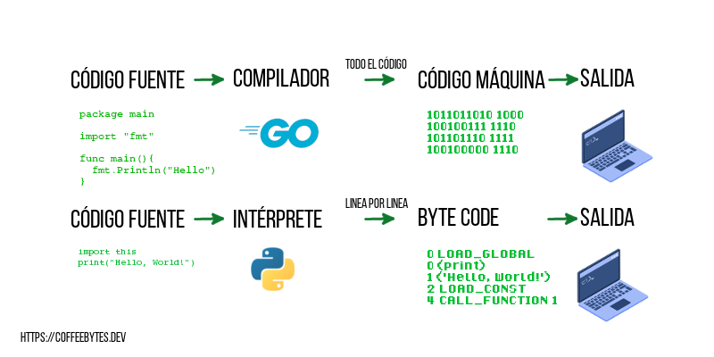
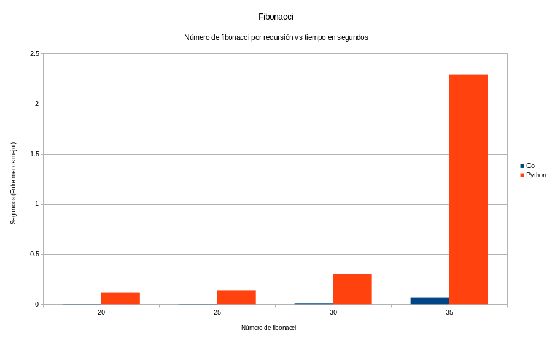
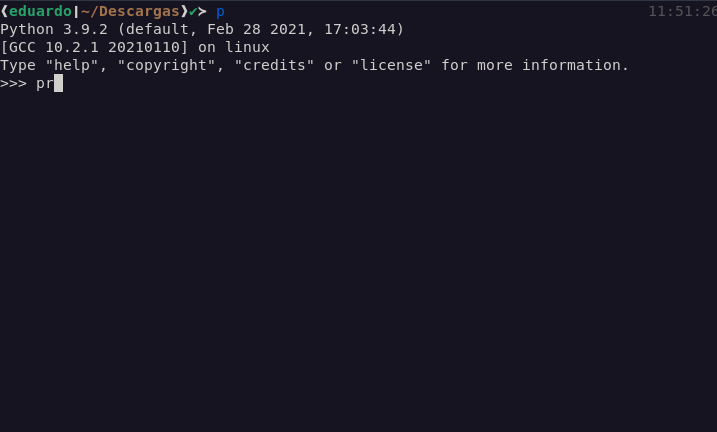
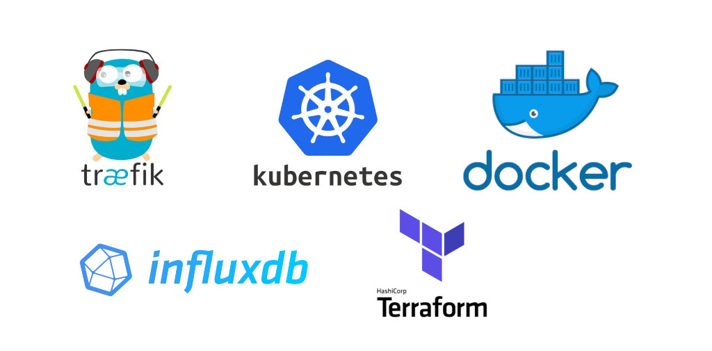
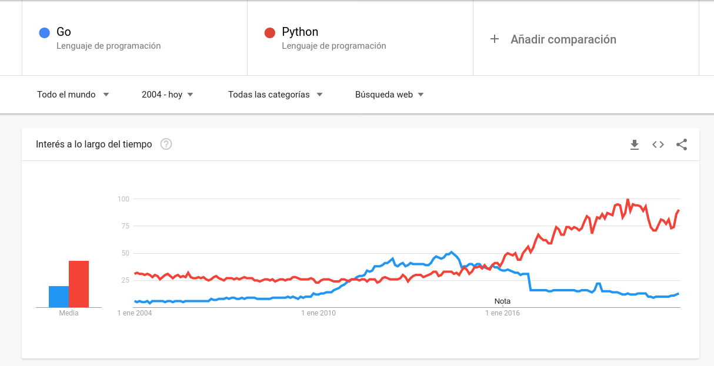
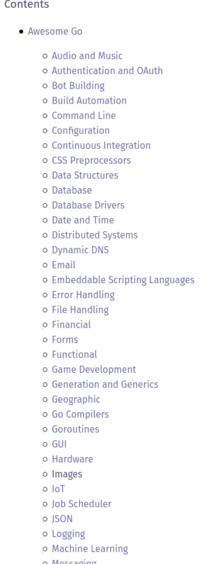
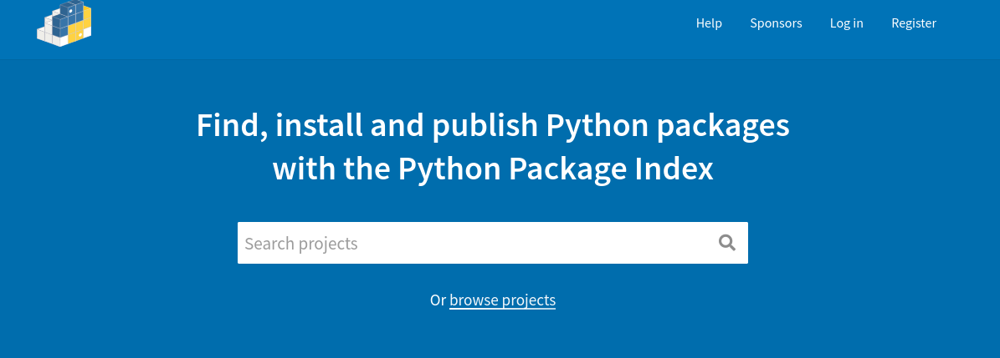
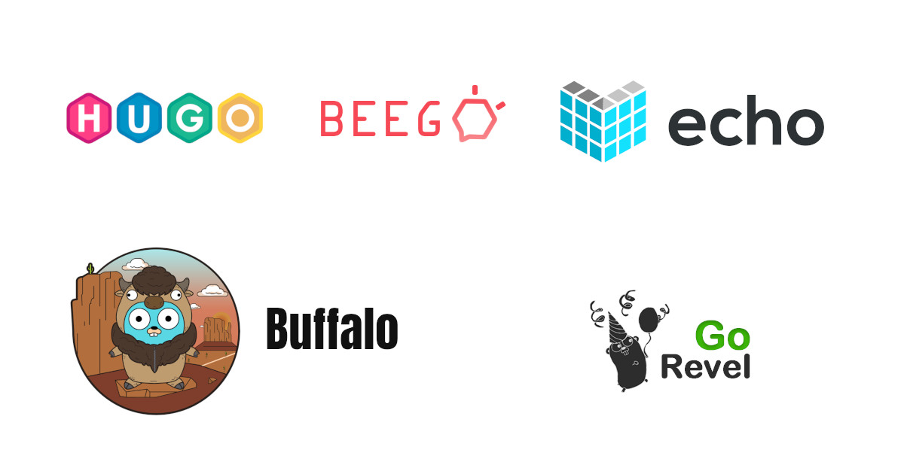

These last few months I have been learning go. How did it all start? Well, it started in a rather superficial way; I loved their mascot, yes, that's really what it was all about. So after a brief mental debate, I decided to give the language a try. My first impression of it is that it is quite similar to Python; simple and easy to learn. Now that I have used it a bit more I bring you a comparison of Python vs Go, where I will explain some of their differences, in case you are interested in learning one or the other this 2024.



## Introduction and subtle differences between Python and Go

This comparison is going to be a bit sloppy, since we are going to compare Python, an interpreted language, and go, a compiled language. So we are already starting from quite big differences.

**Python is an interpreted and imperative language while Go is a compiled, concurrent and imperative language.**



I had already explained a bit about the differences between an interpreted and a compiled language in my [python vs javascript comparison](/en/python-vs-javascript-which-is-the-best-programming-language/), so if you want to refresh your memory a bit go there.

Both languages are characterized by fast code production.

The **compilation of go is extremely fast** and, although it might be slightly slower to run than if you were using C++ or Rust, product development and MVPs should take less time than with those languages.



## Which one is faster Python vs Go?

The comparison here is going to become somewhat unfair, but I'll make it anyway: **Go is blazingly fast compared to Python**. The above difference is explained by the fact that Go is compiled, while Python is interpreted.

### Python vs Go in fibonacci by recursion

How fast is go compared to python? I made a small test using [multitime](https://tratt.net/laurie/src/multitime/) to measure how long it takes to calculate the n fibonacci number for each language, 10 repetitions for each test, results are in seconds (smaller is better), note the radical difference in performance of both languages.



## My opinion on the hatred of go

Go is a **quite controversial language that triggers quite heated discussions**. I leave you some examples below of how varied opinions are:

* [Thoughts on go](https://xetera.dev/thoughts-on-go/)
* [Why go is not good?](https://yager.io/programming/go.html)

Complaints range from the simplicity of the language, to Robert Pike's claim that it is a language for "not so bright" programmers, to the (now fixed) lack of generics.

My opinion? I think it's certainly not the best designed language (I prefer Rust). So why use it? Google created the language based on a number of quite concrete problems; Go is the solution to these problems.

Go is good for a couple of things that programmers tend to overlook, the
business part:

* Iteration. Its fast compilation speed and ease of typing allow you to iterate faster than with other languages, which translates into more money and less long-term business risk.
* Easy to learn. No, as much as we would all like to, your company is not going to fire the entire department to hire Rust or C++ programmers, it is easier to train programmers in Rust or C++. 
* Standard packages and library. Your company probably doesn't have the time
and resources for you to create code from scratch. Go has a fairly mature standard
standard library that provides out of the box solutions for most needs.

Of course, this is not necessarily a good thing from the point of view of a
technical profile, but you know first-hand that money often has a strong influence on business decisions.

## Maturity in both languages

Python was created by Guido Van Rossum in the late 1980s. Go, on the other hand, is a much younger language than Python, released twenty years later, in 2009, and initially designed by Robert Griesemer, Rob Pike and Ken Thompson.

## Types in Python and Go

### Typed in Go

Go is a **compiled language with strong typing**, which requires that specify the data type when creating a variable. However, Go also has a way to let the compiler also has a way to let the compiler guess the type of the variable, under certain conditions, automatically.

```go
// go default variable declaration and assignation
var explicitType int = 1
// Only inside a function scope
implicitTypeInsideAFunction := 1
// everything is good up to here, but the next line will throw an error
explicitType = 1.5
// Error: constant 1.5 truncated to integer
```

### Typing in Python

Python is a strongly typed **interpreted language**; it does not require us to specify the variable type. We can change the type of a variable without any problem at any time. It implements optional typing as of version 3.5 but they are not forced by the interpreter.

```python
# Python
number = [1]
number = {1:1}
number = 1
number = "1"
 # no error 'til here
number + 2
# TypeError: can only concatenate str (not "int") to str
```

## Differences in Syntax Python vs Go

### Syntax in go

Go bases its syntax heavily on C and takes some features from languages such as Python to favor the readability of its code. It stands out in that it **does not has neither while nor do while** loops. And, unlike Python, it does use braces.

The entry point of an application is its _main_ function.

An interesting feature with respect to syntax is that the compiler does not will not run if it detects unused variables or errors in the braces of each function. So the go compiler forces you to write code following a set of conventions or best practices. a set of conventions or best practices.

```go
//go
package main

import "fmt"
var explicitType int = 123

func sum(a, b int) (int, int){
    return a, b
}

func loop() {
  var array [10]int
  for i:= 0; i < 10; i++ {
    array[i] = i
    }
  }

func infiniteLoop() {
    for {}
    }

// main is the starting point of a program

func main() {
    implicitType := 23
    // Since we have unused variables this code WON'T compile
    fmt.Println("Hello world")
}
```

Another important thing, some developers say that go is oriented to object oriented, while others flatly state that it is not. The truth is that go does not direct support for classes, but instead uses **[structs that emulate polymorphism and polymorphism and encapsulation](/en/go-structs-inheritance-polymorphism-and-encapsulation/)** and other OOP features. 

```go
//go
type Person struct {
    Name string
    Sex string
}

// Every field from Person are inherited by Professor
type Professor struct {
    Person
}

// So we can call Professor.Greet()
func (p *Professor) Greet(){
    fmt.Println("Hello")
}
```

### Python syntax

Python's syntax is super clean, focused on code readability; it doesn't use braces to separate code, but line no braces to separate the code, but line breaks and mandatory identations. And, unlike the Go compiler, the Python interpreter is not so strict.

Python **is strongly object oriented** and you are going to have all of the capabilities of an object-oriented language, except for the private, public and protected scopes characteristic of Java, C++ and other languages.

```python
if True: 
    return "result"

print("You can also add a semicolon at the end, but it's not strong convention")

class MiClase:
    def __init__(self, property):
        self.property = property

def funcion(defaultArgument = "default", *args, **kwargs):
    my_arguments_list = args
    my_key_value_arguments = kwargs
    return my_arguments_list

try:
  do_something()
except:
  print("An exception occurred")
```

## Asynchronism capability, Python vs Go

### Asynchronism in go

One of the strong points of this language is the creation of concurrency by means of its [_goroutines_, or goroutines and channels](/en/go-introduction-to-goroutines-and-concurrency/). Using them is quite simple, just add the word go before a function. We add a counter with _Add_ and remove it with Done. When our wait group, _wg_, has zero counters, it will terminate execution.

Its concurrency capabilities make it ideal for web servers.

```go
var wg sync.WaitGroup
wg.Add(1)
go func() {
  wg.Done()
}()
wg.Wait()
```

### Asynchronism in Python

In Python, coroutines did not appear until version 3.5. Asynchronous functions run in a single thread and only switch to another coroutine when an asynchronous operation is encountered.

The same syntax as async and await is used. For this we use the library, gather all the tasks to be executed with _gather_ and execute them with _run_.

```python
import asyncio
import time

async def wait_two_second(name):
    await asyncio.sleep(3)
    print(name)

async def main():
    await asyncio.gather(wait_two_second("first"), wait_two_second("second"), wait_two_second("third"))

if __name__ == "__main__":
    asyncio.run(main())
```

This script will take three seconds to run.

## Error handling comparison Python and Go

Error handling is something that is a fairly constant feature of languages, but in the case of go we find that the creators opted to abandon convention and it can be convention and it can be something different from what you are used to.

### Error handling in go

Go has a rather peculiar way of handling errors. **It does not have _try_ and _except_ blocks (or their equivalent in other languages)**. Instead, the execution of a function can return an error as a second return value, which we can get and check to see if an error has occurred and manually handle it.

```go
message, err := requestToApiEndpoint("")
    if err != nil {
        log.Fatal(err)
    }
```

### Error handling in Python

Python handles the classic _try...except_ pattern that most programming languages handle, where errors are caught by the _try...except_ 

```python
try:
  do_something()
except:
  print("An exception occurred")
```

## Which language is worst, Python vs Go?

### Not so cool things about go

Go is very opinionated. It has very rigid positions on certain things, such as the use of all variables, but leaves use of all variables, but leaves many others to good user handling, such as errors caused by pointers or null pointers. I would accuse Go of being inconsistent in that respect.

```go
func forgetToCheckError() {
  result, err := accion()
  // We forgot to check for a nil pointer, but Go didn't force us
  print(result.algo)
  // runtime error:
  // panic: invalid memory address or nil pointer dereference
}
```

Or for example, the fact that you can return tuples, but you can't use them in other part of the language.

```go
// you CAN return tuples but you CANNOT use tuples
func returnTuple() {
    return 1, 2
}
```

It has no default values for the arguments of a function and you have to resort to trickery to have something similar to a function.

```go
// This doesn't exist
func ThisFunctionDoesntExist(valor=1, valor2=2){
}
```

Error handling in Go it's a sensitive topic among developers, who consider it inferior to other languages.

The following pattern will be recurrent and will repeat itself multiple times in your code, violating the DRY maxim.

```go
if err != nil {
    return err
}
```

### Not so cool things about python

Among the not-so-cool things about Python is the sharp separation that occurred between Python 2 and Python 3, leaving many libraries out of date or with a lot of patches to make cod patches to make the code compatible between the two versions.

Another rather problematic aspect is the excessive use of memory, along with the speed of the language; the Python interpreter is slow. Python is forced by default to by default to run on a single thread, because of its [GIL](https://wiki.python.org/moin/GlobalInterpreterLock), which does not allow full utilization by modern computers without complicating the code.

## Support

Go, as of the date of writing this article, requires installation on the system, either from the official website or the repositories.

While Python has a quite wide support, as it is found in generally installed in all GNU/Linux distributions and you only need to open a terminal and type the word Python to start using it. Open a terminal and type the word Python to start using it.



## Common usages of Python and Go

### Uses of go

Go can be used for almost anything, but it has a strong presence in devops tools, backend servers and blockchain. Docker, Traeffik, Docker compose, Kubernetes, Terraform and InfluxDB are all written in Go.

The [docker containers are written using go](/en/how-does-a-docker-container-work-internally/).



They have also created such great tools as [Pocketbase](https://pocketbase.io/), an excellent example of Backend as a service and open source alternative to firebase.

### Python Uses

Python is a multi-purpose language, allowing you to create basically everything from native applications with user interface, programming networks or web servers, artificial intelligence, data science, web application development, or basic scripting. basic scripting.

## Which one is more popular, Python vs Go?

To date Python is much more popular than Go. You can see that Go gained popularity between the period between 2011 and 2015, but stabilized to fall below Python.



### Popularity among developers

Go is a very popular language among developers, even more than Javascript, but less loved than Python and Typescript.

.

## Python vs Go salaries

Go developers tend to **make significantly more money than the Python developers**. In fact, Go is among the top 10 highest paid languages according to the languages according to stackoverflow's 2023 survey.

## Batteries included 

Both languages have a [library standard](https://docs.python.org/3/library/) with most of the basic needs covered, from network basic needs covered, from network management, to code profiling, and even some less common and even some less common ones like audio handling. The included batteries are one of the features that make Python so popular.

Go is no slouch, it has understood quite well the benefits of a standard library and has included it for the enjoyment of its users. **It is not It is not as large as Python's** but it covers most of the common needs and pales in comparison to other languages. needs and pales in comparison to other languages. Its standard testing library is impressive, it produces coverage reports and even profiling of the different parts of your code. different parts of your code.

You can see the available libraries and functions in the section


## Packages

### Packages in go

Go does not have an official package repository like Python does. The packages are obtained by _go get_ (the equivalent of _pip_ in Python) from different sources. It misses a standard solution, like npm in javascript, but you can see a list of available packages in [Awesome Go](http://awesome-go.com)

The [import of modules and packages into Go](/en/go-package-import-and-module-management/) may seem a bit strange to you. strange, there are no relative imports, like in Python or Javascript.



Awesome Go features links to a large number of sorted Go packages by theme

To date, Go has around 350,000 packages registered on github.
However, the fact that they are in github does not make them usable, so I consider that the number of packages is much smaller.

In summary, the go community is growing, but, for now, it is smaller than Python's.

### Python packages

Python has 336,000 in pypi, many of them are available to be using pip or any other package management tool.

Python has a gigantic community, compared to go, and they have packages for almost everything you can imagine.




## Web frameworks

### Web frameworks in go

The frameworks available for Go focus on speed. Since the language language is new, they are relatively young technologies but extremely fast and efficient, being efficient, being able to serve many, many requests per second. If speed is a is a requirement for your project, consider them seriously.



### How fast are Go web frameworks compared to Python web frameworks?

Check out these performance tests from techempower. The green bars correspond to Go frameworks, while the blue bars are for Python frameworks.

Enclosed in black are the number of requests per second supported by each framework (the more the better). As you can see, Go beats Python in performance.

Performance comparison of various web frameworks at [techempower](images/Velocidad-frameworks-go-vs-python.png "Go web frameworks outperform Python web frameworks").

Performance tests for Python (purple) and Go frameworks (green)

### Web frameworks in Python

While in Python we already have some well proven solutions, solutions, characterized by being very stable and with an answer for almost all the needs of a web and with an answer for almost all the needs of a web developer and that, in addition, support very popular sites with huge traffic, like pinterest or instagram. instagram.

Among the frameworks [Django, one of the favorite frameworks of Python](/en/why-should-you-use-django-framework/)


Even though most Python frameworks are old, it doesn't mean that new frameworks are not appearing lately.
[Fastapi](/en/fastapi-tutorial-the-best-python-framework/), which I already did a tutorial on, is also a fast-growing new framework that is gaining popularity day by day.

## Which one to choose Python vs go?

In my opinion, if you need stability and time-tested solutions for your frameworks or you plan to enter the world of artificial intelligence, deep learning or data learning or data science, if you want a language that has a steep learning curve and a lot of and a large number of packages available that will save code for you and/or your save you and/or your team code, I'd go for Python.

On the other hand, if you are serious about devops and/or speed and concurrency are important features for the projects you plan to create, and you want to dedicate yourself to dedicate yourself to creating devop tools. If you don't mind the steeper learning curve steeper learning curve that Go has (it's not that steep either) compared to Python, then Go will probably seem like a better choice.

Anyway, now that you know a little bit of both languages you can take a much more informed decision based on your intentions and personal situation. You can always learn both and combine them to have the best of both worlds.