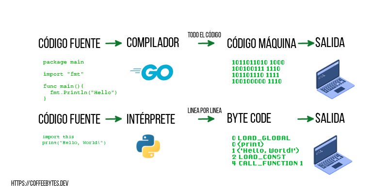
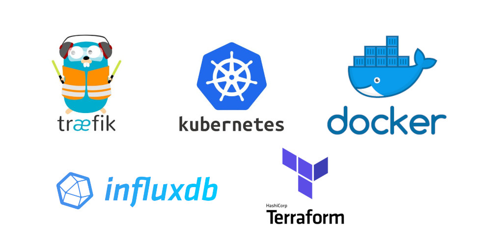
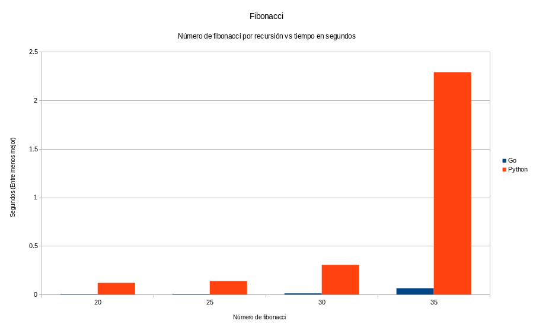

Estos últimos meses he estado aprendiendo go. ¿Por qué? La primera razón es bastante superficial; me encantó su mascota, sí, de verdad fue por eso. Así que tras un breve debate mental, decidí darle una oportunidad al lenguaje. Mi primera impresión de él es que es bastante similar a Python; simple y sencillo de aprender. Ahora que ya lo he usado un poco más te traigo una comparación de Python vs Go, donde explicaré algunas de sus diferencias, por si estás interesado en aprender uno u otro este 2022.

Si quieres aprender go, date una vuelta por mi [tutorial de golang desde cero, donde te explico los detalles básicos de Go: sintaxis y tipos de datos.](https://coffeebytes.dev/golang-introduccion-al-lenguaje-variables-y-tipos-de-datos/)

## Un poco sobre Python y go

Esta comparación va a ser un poco chapucera, puesto que vamos a comparar; Python, un lenguaje interpretado; y go, un lenguaje compilado. Por lo que ya partimos de diferencias bastante grandes.

**Python es un lenguaje interpretado e imperativo mientras que Go es un lenguaje compilado, concurrente e imperativo.**

Ya había explicado un poco las diferencias entre un lenguaje interpretado y uno compilado en mi comparación de python vs javascript, por lo que si deseas refrescar un poco tu memoria dirígete ahí.



Ambos lenguajes se caracterizan porque la producción de código en ellos es rápida.

La compilación de go es muy rápida y, aunque su ejecución podría ser ligeramente más lenta que si usaras C++ o Rust, el desarrollo de productos y MVPs debería tomar menos tiempo que con esos lenguajes.

## Antigüedad

Python fue creado por Guido Van Rossum a finales de los 80's. Go, por otro lado, es un lenguaje mucho más joven que Python, lanzado veinte años después, en 2009, y diseñado inicialmente por Robert Griesemer, Rob Pike y Ken Thompson.

## Tipado

### Tipado en Go

Go es un **lenguaje compilado con tipado fuerte**, que requiere que especifiquemos el tipo de dato al momento de crear una variable. Sin embargo, también tiene una manera de dejar que el compilador intuya el tipo de variable, bajo ciertas condiciones, de manera automática.

```go
// go
var tipoExplicito int = 1
// Solo dentro del scope de una función
tipoImplicitoDentroDeFuncion := 1
// Todo bien hasta aquí, pero ahora fallará.
tipoExplicito = 1.5
// Error: constant 1.5 truncated to integer
```

### Tipado en Python

Python es un **lenguaje interpretado fuértemente tipado**; no requiere que especifiquemos el tipo de variable. Además podemos cambiar de tipo a una variable sin problema en cualquier momento. Implementa tipado opcional a partir de su versión 3.5 pero no son forzados por el intérprete.

```python
# Python
numero = [1]
numero = {1:1}
numero = 1
numero = "1"
 # no hubo error en ningún caso
numero + 2
# TypeError: can only concatenate str (not "int") to str
```

## Sintaxis

### Sintaxis en go

Go basa fuertemente su sintaxis en C y toma algunas características de lenguajes como Python para favorecer la legibilidad de su código. Destaca en que **no tiene ciclos while, ni do while**. Y, a diferencia de Python, sí usa llaves.

El punto de entrada de una aplicación es su función _main_.

Una característica interesante respecto a la sintaxis es que el compilador no se ejecutará si detecta variables sin usar o errores en el acomodo de las llaves de cada función. Por lo que el compilador de go fuerza a escribir código siguiendo un conjunto de convenciones o buenas prácticas.

```go
//go
package main
    
import "fmt"
var tipoExplicito int = 123

func suma(a, b int) (int, int){
    return a, b
}
   
func bucle() {
  var array [10]int
  for i:= 0; i < 10; i++ {
    array[i] = i
    }
  }
}

func bucleInfinito() {
    for {}
    }

// main es el punto de ejecución de un programa

func main() {
    tipoImplicito := 23
    // Este codigo no compilará porque tenemos variables sin usar y otros errores
    fmt.Println("Hello world")
}
```

Otra cosa importante, algunos desarrolladores dicen que go es orientado a objetos, mientras que otros afirman rotundamente que no. Lo cierto es que **[go no tiene soporte para clases de la manera común](https://coffeebytes.dev/go-structs-herencia-polimorfismo-y-encapsulacion/)**, sino que maneja structs, interfaces y composición para emular, hasta cierto punto, características como la herencia de la programación orientada a objetos.

```go
//go
type Persona struct {
    Nombre string
    Sexo string
}

// Todos los campos de Persona pasan a Profesor
type Profesor struct {
    Persona
}

// Para poder llamar a unProfesor.Saludar()
func (p *Profesor) Saludar(){
    fmt.Println("Hola")
}
```

### Sintaxis en Python

La sintaxis de Python es súper limpia, enfocada en la legibilidad del código; no usa llaves para separar el código, sino saltos de linea e identaciones obligatorias. Y, a diferencia del compilador de Go, el intérprete de Python no es tan estricto.

Python **está fuertemente orientado a objetos** y vas a tener todas las capacidades que tiene un lenguaje orientado a objetos, exceptuando los scopes privados, públicos y protegidos característicos de Java, C++ y otros lenguajes.

```python

if True: 
    return "resultado"

print("También puedes incluir punto y coma al final, pero la convención es no hacerlo")

class MiClase:
    def __init__(self, propiedad):
        self.propiedad = propiedad

def funcion(argumento_por_defecto = "predeterminado", *args, **kwargs):
    mi_lista_de_argumentos = args
    mi_diccionario_de_argumentos = kwargs
    return mi_list_de_argumentos

try:
  do_something()
except:
  print("An exception occurred")
```

## Capacidad de asincronismo

### Asincronismo en go

Go fue **[diseñado para ser un lenguaje councurrente](https://coffeebytes.dev/go-goroutines-channels-o-canales-introduccion/)**, por lo que es uno de los puntos fuertes de go. Crear concurrencia por medio de sus _goroutines_, o gorutinas, es bastante sencillo, basta con añadir la palabra go antes de una función. Añadimos un contador con _Add_ y lo removemos con Done. Cuando nuestro grupo de espera, _wg_, tenga cero contadores, terminará la ejecución.

Sus capacidades de concurrencia lo hacen ideal para servidores web.

```go
var wg sync.WaitGroup
wg.Add(1)
go func() {
  wg.Done()
}()
wg.Wait()
```

### Asincronismo en Python

En Python las corutinas no aparecieron hasta su versión 3.5. Las funciones asíncronas se ejecutan en un hilo sencillo y únicamente cambian a otra corrutina cuando una operación asíncrona es encontrada.

Se usa la misma sintaxis de async y await. Para esto usamos la librería _asyncio_, reunimos todas las tareas a ejecutar con _gather_ y las ejecutamos con _run_.

```python
import asyncio
import time

async def wait_two_second(name):
    await asyncio.sleep(3)
    print(name)


async def main():
    await asyncio.gather(wait_two_second("first"), wait_two_second("second"), wait_two_second("third"))

if __name__ == "__main__":
    asyncio.run(main())
```

Este script tardará tres segundos en ejecutarse.

## Manejo de errores

El manejo de errores es algo que es bastante constante en los lenguajes, pero en el caso de go nos encontramos con que los creadores optaron por abandonar la convención y puede ser algo diferente a lo que estás acostumbrado.

### Manejo de errores en go

Go tiene una manera bastante peculiar de manejar los errores. **No cuenta con bloques _try_ y _except_ (o su equivalente en otros lenguajes)**. Sino que la ejecución de una función puede retornar un error como un segundo valor de retorno, el cual podemos obtener y verificar para saber si ha ocurrido un error.

```go
message, err := requestToApiEndpoint("")
    if err != nil {
        log.Fatal(err)
    }
```

### Manejo de errores en Python

Python maneja el clásico patrón de _try...except_ que manejan la mayoría de los lenguajes de programación, donde los errores son capturados por el bloque _except_ y procesados a continuación.

```python
try:
  do_something()
except:
  print("An exception occurred")
```

## Cosas no tan geniales

### Cosas no tan geniales de go

Go es muy "opinionated". Tiene posturas muy rígidas sobre ciertas cosas, como el uso de todas las variables, pero deja otras tantas al buen manejo por parte del usuario, como los errores causados por punteros o pointers nulos. Se podría decir que es inconsistente en ese aspecto.

```go
func olvideRevisarError() {
  resultado, err := accion()
  // Se nos olvido revisar si err es igual a nil
  print(resultado.algo)
  // runtime error:
  // panic: invalid memory address or nil pointer dereference
}
```

O por ejemplo el hecho de que puedes retornar tuplas, pero no puedes usarlas en otra parte del lenguaje.

```go
 // es posible retornar algo parecido a tuplas, aunque no puedes declarar una tupla en el lenguaje
func returnTuple() {
    return 1, 2
}
```

No tiene valores por defecto para los argumentos de una función y tienes que recurrir a triquiñuelas para tener algo parecido

```go
 // Esto NO existe en go
func sinValoresPredeterminados(valor=1, valor2=2){
}
```

### Cosas no tan geniales de python

Entre las cosas no tan geniales de Python está la fuerte separación que ocurrió entre Python 2 y Python 3, dejando muchas librerías desactualizadas o con un montón de parches para hacer compatible el código entre ambas versiones.

Otro aspecto bastante problemático es el uso excesivo de memoria, junto con la velocidad del lenguaje; el intérprete de Python es lento. Python está forzado de manera predeterminada a correr en un solo hilo, por su [GIL](https://wiki.python.org/moin/GlobalInterpreterLock), lo cual no permite el aprovechamiento total por parte de las computadoras modernas sin complicar el código.

## Soporte

Go, a la fecha de escritura de este artículo, requiere instalarse en el sistema ya sea de la página oficial o los repositorios.

Mientras que Python cuenta con un soporta bastante amplio, pues se encuentra instalado generalmente en todas las distribuciones de GNU/Linux y basta con que abras una terminal y teclees la palabra Python para empezar a usarlo.


## Usos

### Usos de go

Go puede usarse para casi cualquier cosa pero tiene fuerte presencia en herramientas de devops, servidores de backend y en blockchain. Docker, Traeffik, Docker compose, Kubernetes, Terraform e InfluxDB están escritos en Go.



Traefik, docker, kubernetes, influxdb y terraform están escritos en Go

### Usos de Python

Python es un lenguaje multipropósito, permite crear básicamente de todo, desde aplicaciones nativas con interfaz de usuario, programar redes o servidores web, inteligencia artificial, data science, desarrollo de aplicaciones web, o scripting básico.

## Popularidad

A la fecha Python es mucho más popular que Go. Puedes observar que Go ganó popularidad entre el periodo comprendido entre 2011 y 2015, pero se estabilizó para quedar por debajo de Python.


### Popularidad entre los desarrolladores en 2021

Go es un lenguaje bastante popular entre los desarrolladores, mucho más apreciado que Javascript, pero menos querido que Python y Typescript.


## Salarios de desarrolladores en 2021

Los desarrolladores de Go suelen ganar más dinero que los desarrolladores de Python. De hecho Go se encuentra dentro de los 10 lenguajes mejor pagados según la encuesta de stackoverflow del 2021.


## Baterías incluidas

Ambos lenguajes cuentan con una [librería estándar](https://docs.python.org/3/library/) con la mayoría de las necesidades básicas cubiertas, desde manejo de redes, hasta profiling de código e incluso algunas menos comunes como manejo de audio. Las baterías incluidas es una de las características que hacen a Python tan popular.

Go no se queda atrás, ha sabido entender bastante bien los beneficios de una amplia librería estándar y la ha incluido para el disfrute de sus usuarios. **No es tan grande como la de Python** pero cubre la mayoría de las necesidades más comunes y hace palidecer a la de otros lenguajes. Su librería estándar de testeo es impresionante, produce reportes de coverage e incluso profiling de las diferentes partes de tu código.

Puedes ver las librerías y funciones que tiene disponible en la sección [standard library de su página oficial.](https://pkg.go.dev/std)

## Paquetes

### Paquetes en go

Go no cuenta con un repositorio oficial de paquetes como sí lo tiene Python. Los paquetes se obtienen por medio de _go get_ (el equivalente de _pip_ en Python) de diferentes fuentes. Se extraña una solución estándar, tipo npm en javascript, pero puedes ver una lista de los paquetes disponibles en [Awesome Go.](http://awesome-go.com)

El [manejo de los modulos y paquetes en Go](https://coffeebytes.dev/go-importacion-de-paquetes-y-manejo-de-modulos/) puede parecerte un tanto extraño, no existen las importaciones relativas, como en Python o en Javascript.


Awesome Go cuenta con enlaces a una gran cantidad de paquetes de Go ordenados por tema

A la fecha Go cuenta con alrededor de 350,000 paquetes registrados en github. Sin embargo que estén en github no los vuelve usables, por lo que considero que el número de paquetes es mucho menor.

En resumen, la comunidad de go está creciendo, pero, por ahora, es más pequeña que la de Python.

### Paquetes en Python

Python cuenta con 336,000 en pypi, muchos de ellos están disponibles para ser usados usando pip o cualquier otra herramienta de manejo de paquetes.

Python tiene una comunidad gigantesca, comparada con la de go, y tienen paquetes para casi todo lo que te puedas imaginar.


El índice de paquetes de Python Pypi

## Velocidad

La comparación aquí va a tornarse algo injusta, pero la haré de todas formas: **Go es descomunalmente más rápido que Python**. La diferencia anterior se explica porque Go es compilado, mientras que Python interpretado.

### Python vs go en fibonacci por recursión

¿Qué tan rápido es go comparado con python? He hecho una pequeña prueba usando [multitime](https://tratt.net/laurie/src/multitime/) para medir el tiempo que le toma calcular el n número de fibonacci a cada lenguaje, 10 repeticiones por cada prueba, los resultados están en segundos (menor es mejor) nota la diferencia tan radical en el rendimiento de ambos lenguajes.



Fibonacci por recursión, entre menos mejor. Go es descomunalmente más rápido que Python.

## Web frameworks

### Web frameworks en go

Los frameworks disponibles para Go se centran en velocidad. Dado que el lenguaje es nuevo son tecnologías relativamente jóvenes pero extremadamente rápidas y eficientes, pudiendo servir muchísimas peticiones por segundo. Si la velocidad es un requerimiento para tu proyecto, considéralos muy seriamente.


### ¿Qué tan rápido son los web frameworks de Go comparados con los de Python?

Mira estás pruebas de rendimiento de techempower. Las barras verdes corresponden a frameworks de Go, mientras que las barras azules son de frameworks de Python.

Encerrado en negro están las peticiones por segundo que soporta cada framework (mientras más mejor). Como puedes apreciar, Go supera a Python en rendimiento.


Pruebas de rendimiento para frameworks de Python (morado) y Go (verde)

### Web frameworks en Python

Mientras que en Python ya contamos con algunas **soluciones bastante probadas, con bastante experiencia, caracterizadas por ser m**uy estables y con una respuesta para casi todas las necesidades de un desarrollador web y que, además, soportan sitios muy populares y con tráfico gigantesco, como pinterest o instagram.

Entre los frameworks destaca [Django, uno de los frameworks favoritos de Python.](https://coffeebytes.dev/por-que-deberias-usar-django-framework/)


A pesar de que la mayoría de frameworks en Python son antiguos, no significa que no estén apareciendo nuevos frameworks últimamente. [Fastapi](https://coffeebytes.dev/tutorial-de-fastapi-el-mejor-framework-de-python/), del que ya hice un tutorial también es un nuevo framework muy veloz que gana popularidad día con día.

## ¿Cuál elegir Python vs go?

En mi opinión, si necesitas estabilidad y soluciones probadas con el tiempo para tus frameworks o planeas entrar en el mundo de la inteligencia artificial, deep learning o data science, si quieres un lenguaje que tenga una curva de aprendizaje poco inclinada y una gran cantidad de paquetes disponibles que le ahorrarán código a ti y/o a tu equipo, yo me iría por Python.

En cambio, si vas muy en serio con devops y/o la velocidad y la concurrencia son características importantes para los proyectos que planeas crear y, además, no te importa la curva de aprendizaje más pronunciada que tiene Go, comparado con Python, entonces probablemente Go te parecerá una mejor opción.

De cualquier forma ahora que sabes un poco de ambos lenguajes ya puedes tomar una decisión mucho más informada y basada en tus intenciones y situación personal. Siempre puedes aprender ambos y combinarlos para tener lo mejor de los mundos.
