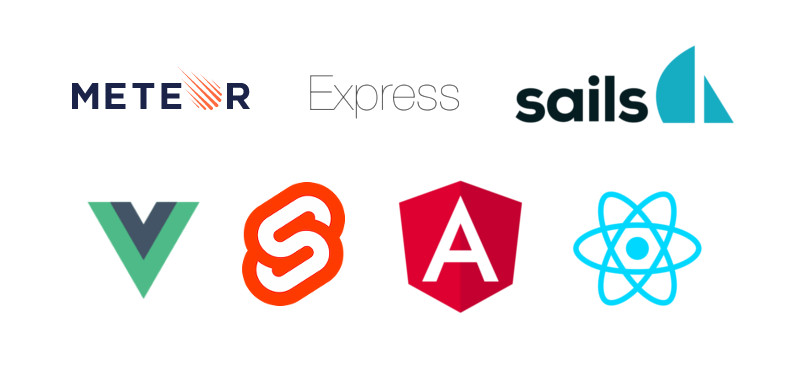
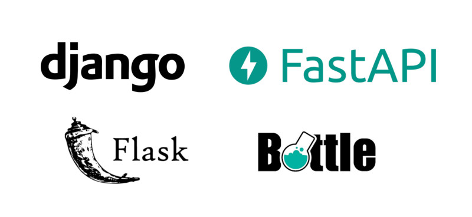

If you've used only Python or only Javascript, you're likely to get a little
curious to know what the other one is like. I've used both and I can tell you a little bit about the differences
about the differences and some commonalities between the two languages,
so you can find the best one for you in 2023.

I also have a comparison of [Python vs.
go](/python-vs-go-which-is-the-best-programming-language/) that you can
review.

## A little about them

To begin with, **Python is an interpreted language**. If you are not familiar
the term, it means that it has an interpreter that translates the instructions, one by one, to machine language, so that they
instructions, one by one, to machine language, so that they are executed on the fly. So you don't
you don't have to compile all your code every time you want to execute it, as you would with C++, Java, Java
you would with C++, Java, Rust, etc.

Javascript was born as an interpreted language, however, modern engines
have made it a **JIT (Just in Time) compiled language**.
Virtually all browsers make [compiled
JIT](https://www.youtube.com/watch?v=d7KHAVaX_Rs) of Javascript, except,
as usual, IE8.

If you want to learn how the Javascript engine works at a higher level
deeper, I leave you a link to [a series of
videos](https://www.youtube.com/watch?v=No-Pfboplxo&amp;list=PLfeFnTZNTVDNnF4a8eVooiubYAPUSP01C&amp;index=1)
on youtube where the subject is discussed in more detail.

Look at this super-simplified schematic comparing compiled and compiled languages.
interpreted languages.


interpreted](images/codigo-compilado-vs-interpretado.png "Differences between an interpreted and a compiled language.
interpreted language and a compiled language.")

In this scheme I refer to Javascript at the time of its creation, as a language.
interpreted language, not the **JIT compilation** I was talking about.

## Seniority

Python appeared in the late 1980s, while Javascript appeared in the early 1990s.
the early 1990s, so **Python is older** than Javascript.

## Typed

With respect to typing, it is a very complex subject for which I have not found a
**clear and uniform consensus** on what is considered strong typing and what is weak typing.
weak. However, experts tend to say that strongly typed languages do not allow changes in the data types once they have been
languages do not allow changes to data types once declared, while weakly typed ones do.
weakly typed do.

Here are a couple of examples for your consideration

### Javascript Typing

First let's see what happens if we try to change a type in Javascript.

```javascript
//javascript
let numeroEnTexto = "1"
numeroEnTexto = 1 // no pasa nada
const numero = 1 
numero = "2"
Uncaught TypeError: Assignment to constant variable.
```

In addition to const, Javascript allows to declare a variable, let or var. If instead of const we had used var or let
instead of using const we had used var or let the error would not occur.

But now look what happens if we add an integer and a string.

```javascript
//javascript
console.log(1 + "1")
"11"
```

No problem! The Javascript interpreter adds them together without any problem, even if one is a string and the other an integer.
even if one is a string and the other an integer. If you are one of those who prefer
use strong typing with javascript, either because you bring a C++ background,
Java or another strongly typed language or you simply prefer the advantages of strong typing, give it a try.
of strong typing, take a look at what
[Typescript](https://www.typescriptlang.org/) and its compiler have to offer.
offer.

```javascript
// Este es código Typescript
// Observa como cada tipo de variable requiere su correspondiente tipo de dato
let idUser: number | string;
const months: Array<string> = ["Enero", "Febrero"]
```

### Typing in Python

Python does not necessarily require you to specify the type of variable.
See what happens if we try to change the type of a variable in Python.

```python
# Python
numero = "1"
numero = 1
numero = [1]
numero = {1:1} # no hubo error en ningún caso
```

And what happens if we now try to add two variables of different types such as
we did in Javascript?

```python
# Python
print(1 + "1")
Traceback (most recent call last):
  File "<stdin>", line 1, in <module>
TypeError: unsupported operand type(s) for +: 'int' and 'str'
```

As you can see, Python does not allow you to perform implicit transformations of
one type of variable to another.

```python
def titleToNumber(columnTitle: str) -> int:
    # ...
```

#### Python Typing

What about Typescript for Python? Well, it's already included, Python incorporates optional typing.
optional, as of version 3.5, typing can be used by some linters to show you errors in the code.
linters to show you errors in the code, however the interpreter does not force its use.
its use. Check the [official
official](https://docs.python.org/3/library/typing.html) to learn how to use them.

## Syntax

### Javascript syntax

The syntax of **Javascript is quite similar to that of C++ and other languages.
programming languages. The separation between parts of the code is done by
braces and semicolons**. Javascript uses _this_ as a reference to the
object itself and are not required when declaring methods on objects.

```javascript
// true con minúsculas
if(true){"resultado"}
console.log("El punto y coma al final es opcional");
class MiClase {
  constructor(propiedad) {
    this.propiedad = propiedad;
  }
}

function(argumento, argumento_por_defecto="predeterminado"){
    let myFirstArgument = arguments[0]
    return myFirstArgument
}

try {
  functionThatCausesError();
} catch(error){
  console.error(error);
}
```

### Python syntax

On the other hand, **Python favors readability, the use of special characters
and the separation of parts of the code is done by means of indentations and line breaks**.
by means of indentations and line breaks**. Python uses _self_ to
refer to the object itself and requires that it be passed as the first argument to each method of the object.
method of the object.

```python
# True con mayusculas
if True: 
    return "resultado"

print("También puedes incluir punto y coma al final, pero la convención es no hacerlo")

class MiClase:
    def __init__(self, propiedad):
        self.propiedad = propiedad

def funcion(argumento_por_defecto = "predeterminado", *args, **kwargs):
    mi_lista_de_argumentos = args
    mi_diccionario_de_argumentos = kwargs
    return mi_list_de_argumentos

try:
  do_something()
except:
  print("An exception occurred")
```

The differences in syntax are much more extensive than the ones I present here,
each one has its own functions, its own built-in libraries and a different syntax, but I hope you have at least appreciated the little
different syntax, but I hope you have at least appreciated the small differences between them.
differences between the two.

## Support

### Javascript support

Javascript is natively present in all browsers, you just need to
open the terminal of your favorite browser to start using it. It is
the preferred language for manipulating the DOM.

Below you can see the javascript terminal of the Firefox web browser


You can also use node to run it on your computer.


### Python support

Python is not found in browsers, however it is installed on the
most GNU/Linux systems by default, if you are using a GNU/Linux distribution
distribution of GNU/Linux and you open the terminal of your operating system and execute the command
the Python command, it is most likely already installed.


## Uses

### Uses of Javascript

Javascript is used, as I mentioned earlier, to manipulate the DOM and
primarily run in the browser. However, Node allows you to use it
also on your computer, to be used as a server-side language,
even though it was not originally conceived that way. Node js has allowed
javascript to be used outside the browser, so its use has been extended,
even to machine learning.

In recent years there are rumors that [deno](https://deno.land/), made by the creator of Node js, will replace node, its predecessor.
creator of Node js, will replace node, its predecessor, but they are just that,
rumors.

### Python Uses

Python is a multi-purpose language, it allows you to create native applications with
user interface, programming networks or web servers, artificial intelligence,
web application development, pretty much anything.

## Popularity

Javascript started out being much more popular than Python, probably because of the
rise of web browsers. However, at some point around 2017, Python
gained relevance compared to JavaScript, and the trend continues until
the end of 2022.

Google trends graph comparing Python vs.
Javascript](images/Python-vs-Javascript-desde-2004.png "Python gains relevance
vs Javascript in Google trends")

### Popularity among developers in 2022

Stackoverflow shows in its surveys that, among developers, Python is the most popular
much more popular than Javascript. However, Typescript (the strongly typed super set of
JavaScript super set with strong typing that I mentioned earlier) is slightly more popular than Python.
popular than Python.

StackOverflow survey results for the languages most appreciated by developers.
by developers. Python ranks above
Javascript](images/love-vs-dreaded-python-javascript.png "Python surpasses
Javascript in popularity in 2023")

## Python and Javascript salaries in 2022

According to Stackoverflow's latest survey (2022), professionals who use
Python are slightly better paid than those using JavaScript. Without
However, the difference is not that significant. Typescript is also ahead of Javascript.
above Javascript.

Salaries of developers according to the programming language used](images/salaries-python-vs-javascript).
used.](images/salaries-python-vs-javascript.png "Python overtakes Javascript in
salaries in 2023")

## Batteries included

Python is characterized by being a language with batteries included, i.e., it is already
includes by default a lot of functionalities that you just have to import to start using them.
Do you want to work with networks? import the socket module,
want to create a GUI, use tkinter, manipulate audio, use audioop. Python
includes libraries for most common needs. It even includes
numpy, a powerful library for numerical analysis.

Javascript, on the other hand, includes only what is necessary, although it has a gigantic
community of users creating packages and making them available to anyone who wants to take them.
who wants to take them.

## Speed

As interpreted languages, they are much slower than compiled languages,
so they will look pretty bad if you compare them with C, C++, Java, Rust,
etc. However between them the difference is obvious: it can be stated that.
**Javascript running in Node is much faster than Python with its original interpreter.
interpreter.

The graph below compares the average execution time for ten repetitions
of the N-Rheins problem (the lower the better), I used the [respective
javascript and python codes from Sean P.
Gallivan](https://dev.to/seanpgallivan/solution-n-queens-5hdb#javascript-code)
(all credits to the author) and the [program
multitime](https://tratt.net/laurie/src/multitime/) for the calculation of the average time.
average.

Runtime graph of the N-Rein problem between Javascript and Python.
and Python. [Javascript has better performance.
performance](images/problema-de-las-n-reinas.jpg "Performance of the n-Rheinas problem.
n-Queens problem. Execution time on Y-axis and number of queens on X-axis.
(Less is better, javascript is better).")

Node.js v15.10.0 and Python 3.8.6 were used. The code was executed directly from
the terminal, without any other program running. If you want to know the
If you want to know the specs of the computer you can write me to my social networks and I'll be glad to let you know.
and I'll be glad to let you know.

I clarify, although it is quite obvious, that it is not a methodology with the rigorous
scientific rigor, but it is nevertheless useful as a rough comparison.

## Asynchronism capability

### Asynchronism in Javascript

Asynchronous javascript functions are executed in a separate thread, and
return to the main thread when completed.

```javascript
async function(){
    await downloadData()}
```

### Asynchronism in Python

In Python asynchronous functions run on a single thread and only
switch to another coroutine when an asynchronous operation is encountered.

As of Python 3.5, asynchronism is incorporated using the same syntax of
async and await

```python
from tortoise import Tortoise, run_async
from database.connectToDatabase import connectToDatabase

async def main():
    await connectToDatabase()
    await Tortoise.generate_schemas()

if __name__ == '__main__':
    run_async(main())
```

## Web Frameworks for web development

Javascript and Python have quite a few frameworks to choose from when it comes to
web development.

### Frameworks for Javascript

There are many **Javascript frameworks for web development, both for the
backend and frontend**; for the backend, express, nustjs, meteor,
sails; for the frontend, vue, react, svelte, angular.



Even with the abundance of options, new frameworks are coming out.
JavaScript frameworks are released more frequently than for Python.

### Frameworks for Python

Because Python is not installed in the browsers, **the
current web development using Python is mainly focused on the backend**, where we have quite mature solutions like [Django, with its
Backend**, where we have quite mature solutions like [Django, with its advantages and disadvantages](/why-should-you-use-django-framework
advantages and disadvantages](/why-you-should-use-django-framework/), or Flask, and
some more modern ones like the lightning-fast [web development framework
FastAPI](/python-fastapi-the-best-framework-for-python/), about which I already wrote a previous
post about it before.



You can write HTML and CSS code using Python for the frontend, but never
have the same versatility as running javascript code directly in the user's browser.
user's browser.

Update: I found out about a library that is gaining popularity, called
htmx, which allows you to generate modern applications by returning html instead of JSON responses.
JSON responses. Check out my post about [django and
htmx](/django-and-htmx-web-apps-modern-apps-without-writing-js/) to learn more.

## Packages

Both the Python community and the Javascript community have libraries
libraries available that solve most of the common programming problems.
programming.

### Javascript Packages

Javascript uses npm for package management and there are quite a few to choose from.
As of June 2019 npm [surpassed one million packages
published](https://snyk.io/blog/npm-passes-the-1-millionth-package-milestone-what-can-we-learn/).
Lots and lots of variety to choose from! Although you also run into things like this:

NPM is-odd package](images/IsOddPackageNpm-1.png "The package to know if a number is odd has almost half a million downloads").
a number is odd has almost half a million downloads.")

Meme of the rapper using the is-odd package instead of the modulo operator.
module](images/meme-is-odd-js.jpg "Meme of the rapper making fun of the number of downloads").
downloads")

### Python packages

Pypi is the main platform in charge of Python package management. At
the date this article was updated [Pypi has 348,000 packages published](), only one-fifth of the number of packages in Python.
published](https://pypi.org/), only one-fifth of the number that has
Javascript has! And since there are fewer packages, we can expect more relevant packages.
right? Let's see...


## To conclude

I hope this small comparison has shown you a little bit of the differences that
differences between both languages and if you are thinking of focusing on one of them you have
you have more information on the table to make the right decision.

If you need to start developing websites now, without complicating things, I would go for
Javascript.

If you want to dedicate yourself to machine learning and data analysis, or if you want a
more comprehensive solution on websites and more flexibility, I'd go with
Python.

Anyway, you don't have to reduce everything to a dichotomy, if you have
time to dedicate to both you can do it, many web developers master multiple languages and use them
multiple languages and use them interchangeably according to their needs.