Si has usado solamente Python o solamente Javascript, seguramente te de un poco de curiosidad saber como es el otro. Yo he usado ambos y te puedo platicar un poco sobre las diferencias y algunas cosas en común que tienen ambos lenguajes, para que encuentres el mejor para ti en este 2022.

También tengo una comparación de Python vs go que puedes revisar.

## Un poco sobre ellos

Para empezar diremos que **Python es un lenguaje interpretado**. Si no sabes que es eso, significa que tiene un intérprete que traduce las instrucciones, una por una, a lenguaje máquina, para que se ejecuten al momento. Por lo que no tienes que compilar todo tu código cada vez que quieras ejecutarlo, como sí lo harías con C++, Java, Rust, etc.

Javascript nació como un lenguaje interpretado, sin embargo los motores modernos han logrado que se convierta en un **lenguaje compilado JIT** ("Just in Time"). Prácticamente todos los navegadores hacen compilado JIT de Javascript, exceptuando, como siempre, IE8.

Si quieres aprender como funciona el motor de Javascript a un nivel más profundo, te dejo un enlace a [una serie de videos](https://www.youtube.com/watch?v=No-Pfboplxo&list=PLfeFnTZNTVDNnF4a8eVooiubYAPUSP01C&index=1) en youtube.

Observa este esquema súper simplificado que compara los lenguajes compilados e interpretados.

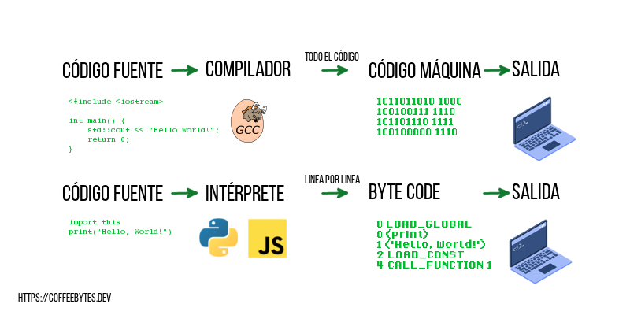

En este esquema me refiero a Javascript al momento de su creación, como lenguaje interpretado.

## Antigüedad

Python apareció a finales de los 80, mientras que Javascript apareció a principios de los 90, por lo que **Python es más antiguo** que Javascript.

## Tipado

Respecto al tipado, es un tema muy complejo en el que no he encontrado un **consenso claro y uniforme** sobre que se considera tipado fuerte y que tipado débil. Sin embargo los expertos suelen decir que los lenguajes fuertemente tipados no permiten cambios en los tipos de datos una vez declarados, mientras que los débilmente tipados sí.

Te dejo un par de ejemplos para que los consideres

### Tipado en Javascript

Primero veamos que sucede si intentamos cambiar un tipo en Javascript.

```javascript
//javascript
let numeroEnTexto = "1"
numeroEnTexto = 1 // no pasa nada
const numero = 1 
numero = "2"
Uncaught TypeError: Assignment to constant variable.
```

Además de const, Javascript permite declarar una variable, let o var. Si en lugar de usar const hubieramos usado var o let el error no se presentaría.

Pero ahora mira lo que sucede si sumamos un entero y una cadena de texto.

```javascript
//javascript
console.log(1 + "1")
"11"
```

¡No pasa nada! Los suma sin problema alguno, incluso aunque uno es de tipo string y el otro un entero. Si eres de los que prefieren usar tipado fuerte con javascript, ya sea porque traes un background de C++, Java u otro lenguaje furtemente tipado o simplemente prefieres las ventajas de un tipado fuerte, dale una mirada a lo que [Typescript](https://www.typescriptlang.org/) y su compilador tienen para ofrecer.

```javascript
// Este es código Typescript
// Observa como cada tipo de variable requiere su correspondiente tipo de dato
let idUser: number | string;
const months: Array<string> = ["Enero", "Febrero"]
```

### Tipado en Python

Python no requiere, de manera forzosa, que especifiques el tipo de variable. Mira lo que sucede si intentamos cambiar el tipo de una variable en Python.

```python
# Python
numero = "1"
numero = 1
numero = [1]
numero = {1:1} # no hubo error en ningún caso
```

Y ¿qué pasa si ahora intentamos sumar dos variables de tipo distintas como hicimos en Javascript?

```python
# Python
print(1 + "1")
Traceback (most recent call last):
  File "<stdin>", line 1, in <module>
TypeError: unsupported operand type(s) for +: 'int' and 'str'
```

Como puedes apreciar, Python no permite realizar transformaciones implícitas a los tipos de variables.

```python
 def titleToNumber(columnTitle: str) -> int:
    # ...
```

¿Y el Typescript para Python? Pues ya va incluido, Python incorpora tipado opcional, a partir de su versión 3.5, el tipado puede ser usado por algunos linters para mostrarte errores en el código, sin embargo el intérprete no obliga a su uso. Revisa la [documentación oficial](https://docs.python.org/3/library/typing.html) para aprender a usarlos.

## Sintaxis

### Sintaxis de Javascript

La sintaxis de **Javascript es bastante parecida a la de C++ y otros lenguajes de programación clásicos. La separación entre partes del código se hace por medio de llaves y puntos y comas**. Javascript usa _this_ como referencia al propio objeto y no se requieren al declarar métodos en los objetos.

```javascript
// true con minúsculas
if(true){"resultado"}
console.log("El punto y coma al final es opcional");
class MiClase {
  constructor(propiedad) {
    this.propiedad = propiedad;
  }
}

function(argumento, argumento_por_defecto="predeterminado"){
    let myFirstArgument = arguments[0]
    return myFirstArgument
}

try {
  functionThatCausesError();
} catch(error){
  console.error(error);
}
```

### Sintaxis de Python

Por otro lado, **Python favorece la legibilidad, el uso de caracteres especiales se encuentra reducido al mínimo y la separación para las partes del código se hace por medio de indentaciones y saltos de linea**. Python usa _self_ para referirse al propio objecto y requiere que se pase como primer argumento a cada método del objeto.

```python
# True con mayusculas
if True: 
    return "resultado"

print("También puedes incluir punto y coma al final, pero la convención es no hacerlo")

class MiClase:
    def __init__(self, propiedad):
        self.propiedad = propiedad

def funcion(argumento_por_defecto = "predeterminado", *args, **kwargs):
    mi_lista_de_argumentos = args
    mi_diccionario_de_argumentos = kwargs
    return mi_list_de_argumentos

try:
  do_something()
except:
  print("An exception occurred")
```

Las diferencias de sintaxis son mucho más extensas que las que aquí expongo, cada uno tiene sus propias funciones, sus propias librerías integradas y una sintaxis diferente, pero espero que al menos hayas apreciado las pequeñas diferencias entre ambos.

## Soporte

### Soporte para Javascript

Javascript se encuentra en todos los navegadores de manera nativa, basta con que abras la terminal de tu navegador preferido para que empieces a utilizarlo. Es el lenguaje preferido para manipular el DOM .

Abajo puedes ver la terminal de javascript del navegador web Firefox

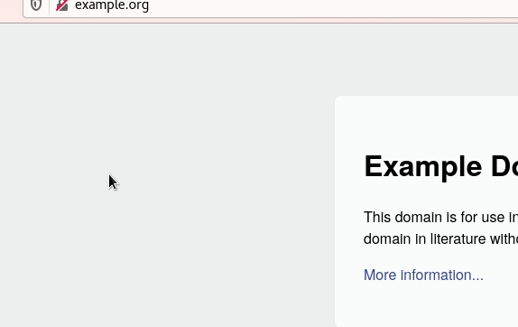

Además puedes usar node para ejecutarlo en tu computadora.

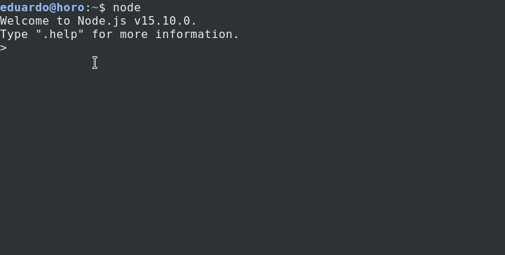

### Soporte para Python

Python no se encuentra en los navegadores, sin embargo está instalado en la mayoría de los sistemas GNU/Linux de manera predeterminada, si usas una distribución de GNU/Linux y abres la terminal de tu sistema operativo y ejecutas el comando Python verás que ya se encuentra instalado.

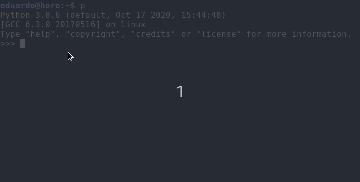

## Usos

### Usos de Javascript

Javascript se usa, como ya mencioné anteriormente, para manipular el DOM y ejecutarse principalmente en el navegador. Sin embargo Node permite utilizarlo también en tu ordenador, para ser usado como un lenguaje del lado del servidor, aunque originalmente no fue concebido de esa manera. Node js ha permitido que javascript se use fuera del navegador, por lo que su uso se ha extendido, incluso al machine learning.

En los últimos años hay rumores de que [deno](https://deno.land/), hecho por el creador de Node js, reemplazará a node, su predecesor, pero son solo eso, rumores.

### Usos de Python

Python es un lenguaje multipropósito, te permite crear aplicaciones nativas con interfaz de usuario, programar redes o servidores web, inteligencia artificial, desarrollo de aplicaciones web, prácticamente lo que sea.

## Popularidad

Javascript empezó siendo mucho más popular que Python, probablemente debido al auge de los navegadores web. Sin embargo, en algún punto cercano al 2017, Python ganó relevancia en comparación con Javascript y la tendencia se mantiene hasta mediados de agosto del 2021.

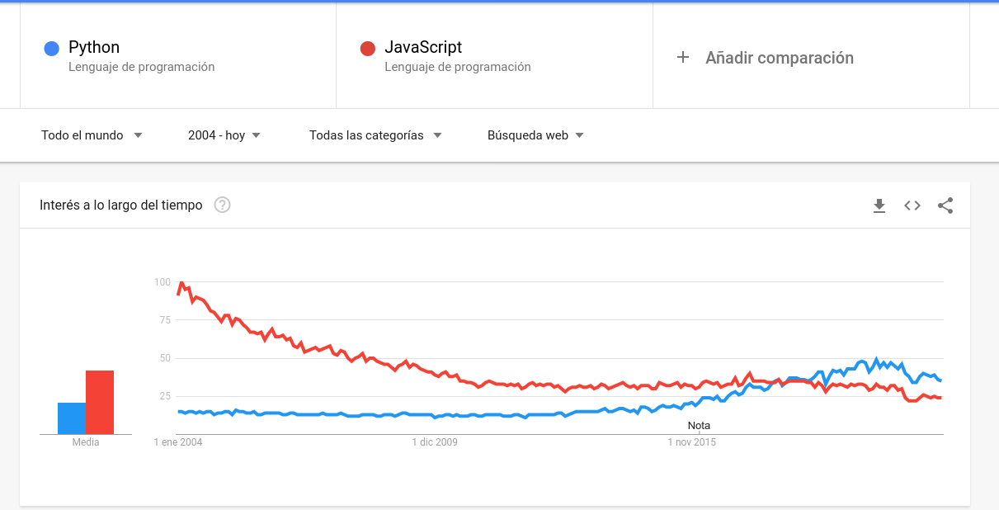

### Popularidad entre los desarrolladores en 2021

Stackoverflow muestra en sus encuestas que, entre los desarrolladores, Python es mucho más popular que Javascript. Sin embargo, Typescript (el super set de Javascript con tipado fuerte que mencioné anteriormente) es ligeramente más popular que Python.

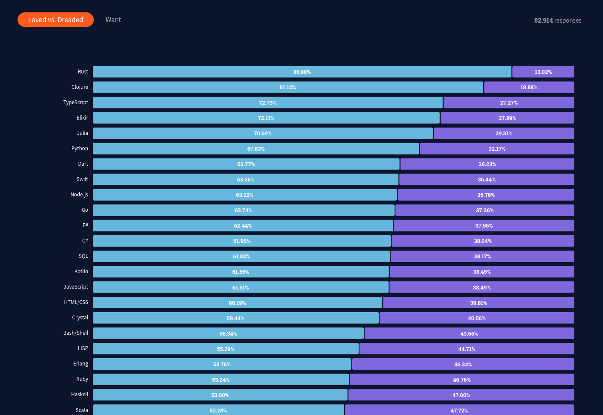

Python supera a Javascript en popularidad

## Salarios de Python y Javascript en 2021

Según la última encuesta de Stackoverflow (2021), los profesionales que usan Python son ligeramente mejor pagados que aquellos que usan Javascript. Sin embargo la diferencia no es tan significativa. Typescript también se encuentra por encima de Javascript.


Pyhton supera a Javascript en salarios

## Baterías incluidas

Python se caracteriza por ser un lenguaje con baterías incluidas, es decir, ya incluye por defecto muchísimas funcionalidades que solo tienes que importar para empezar a usarlas, ¿quieres trabajar con redes? importa el modulo socket, ¿quieres crear un GUI?, usa tkinter, ¿manipular audio?, usa audioop. Python incluye librerías para la mayoría de las necesidades comunes. Incluso incluye numpy, una poderosa librería para el análisis númerico.

Por otro lado, Javascript incluye solo lo necesario, aunque tiene una gigantesca comunidad de usuarios creando paquetes y poniéndolos a disposición de cualquiera que quiera tomarlos.

## Velocidad

Al ser lenguajes interpretados son mucho más lentos que lenguajes compilados, por lo que quedarán bastante mal parados si los comparas con C, C++, Java, Rust, etc. Sin embargo entre ellos la diferencia es evidente: se puede afirmar que **Javascript ejecutado en Node es mucho más rápido que Python con su intérprete original.**

El gráfico de abajo compara el tiempo de ejecución promedio de diez repeticiones del problema de las N-Reinas (mientras más bajo mejor), usé los respectivos códigos de javascript y python que se encuentran [aquí](https://dev.to/seanpgallivan/solution-n-queens-5hdb#javascript-code) (todos los créditos al autor) y el programa [multitime](https://tratt.net/laurie/src/multitime/) para el cálculo del tiempo promedio.

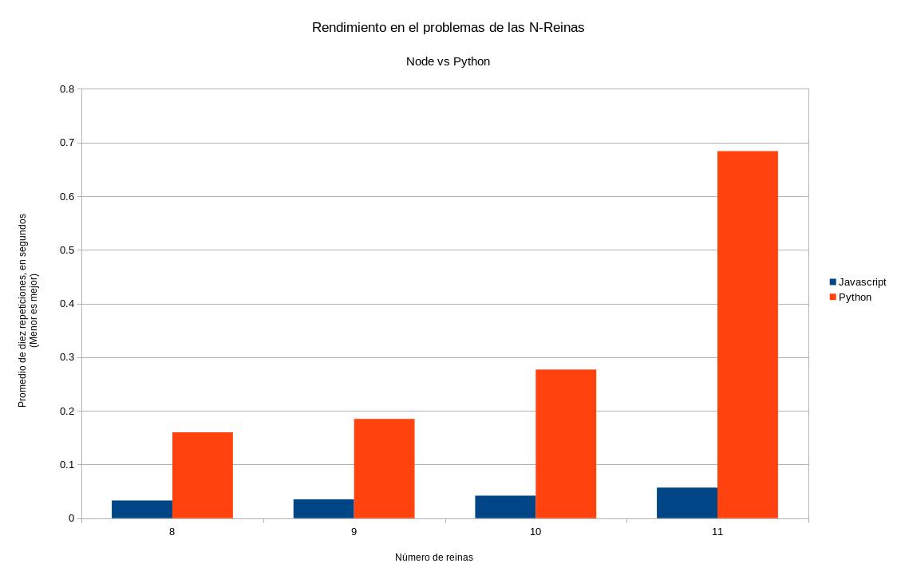

Rendimiento del problema de las n-Reinas. Tiempo de ejecución en eje de las Y y número de reinas en el eje de las X. (Menor es mejor)

Se usó Node.js v15.10.0 y Python 3.8.6. El código se ejecutó directamente desde la terminal, sin ningún otro programa ejecutándose. Si quieres saber las especificaciones de la computadora puedes escribirme a mis redes sociales y con gusto te las hago saber.

Aclaro, a pesar de ser bastante obvio, que no es una metodología con el rigor científico adecuado, sin embargo es útil a manera de comparación grosso modo.

## Capacidad de asincronismo

### Asincronismo en Javascript

Las funciones asíncronas de javascript se ejecutan en un hilo separado y regresan al principal cuando se completan.

```javascript
async function(){
    await downloadData()}
```

### Asincronismo en Python

En Python las funciones asíncronas corren en un hilo sencillo y únicamente cambian a otra corrutina cuando una operación asíncrona es encontrada.

A partir de Python 3.5 se incorpora asincronismo mediante la misma sintaxis de async y await

```python
from tortoise import Tortoise, run_async
from database.connectToDatabase import connectToDatabase

async def main():
    await connectToDatabase()
    await Tortoise.generate_schemas()

if __name__ == '__main__':
    run_async(main())
```

## Web Frameworks de desarrollo web

Javascript y Python tienen bastantes frameworks para elegir cuando se trata de desarrollo web.

### Frameworks para Javascript

Existen muchísimos frameworks de **Javascript para desarrollo web tanto para el backend como para el frontend**; para el backend, express, nustjs, meteor, sails; para el frontend, vue, react, svelte, angular.

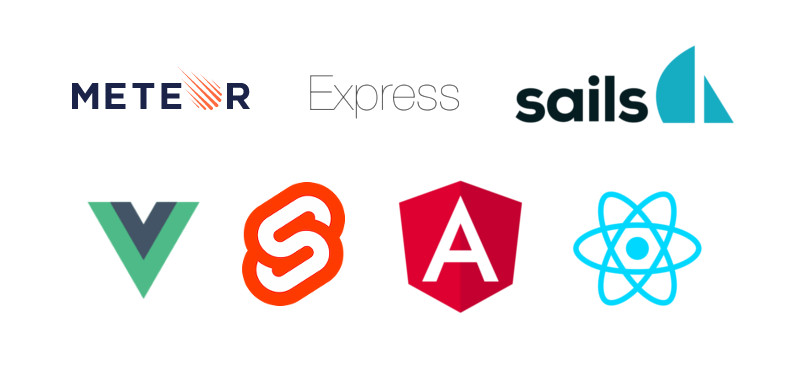

Incluso aún a pesar de la abundancia de opciones que hay salen nuevos frameworks de Javascript más frecuentemente que para Python.

### Frameworks para Python

Debido a que Python no se encuentra instalado en los navegadores, **el desarrollo web actual usando Python se centra principalmente en la parte del Backend**, donde tenemos soluciones bastante maduras como [Django, con sus ventajas y desventajas](https://coffeebytes.dev/por-que-deberias-usar-django-framework/), o Flask y algunas más modernas como el rapidísimo [framework de desarrollo web FastAPI](https://coffeebytes.dev/tutorial-de-fastapi-el-mejor-framework-de-python/), del que ya escribí una entrada anteriormente.

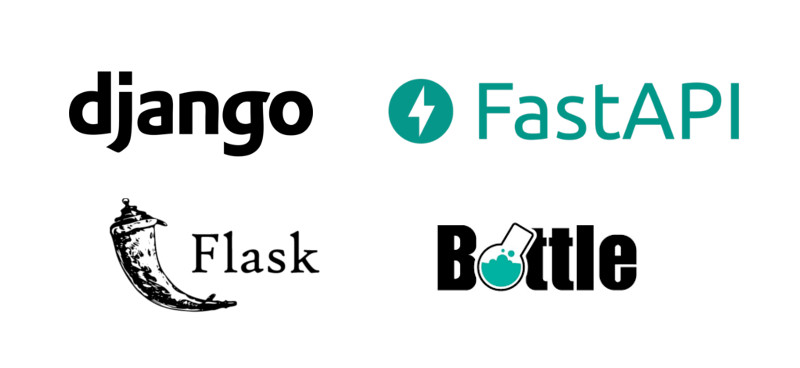

Puedes escribir código HTML y CSS usando Python para el frontend, pero nunca tendrás la misma versatilidad que ejecutar código javascript directamente en el navegador del usuario.

Actualización: Me enteré de una librería que está ganando popularidad, llamada htmx, que te permite generar aplicaciones modernas devolviendo html en lugar de respuestas JSON. Entra en mi entrada sobre [htmx y django](https://coffeebytes.dev/django-y-htmx-web-apps-modernas-sin-escribir-js/) para conocer más.

## Paquetes

Tanto la comunidad de Python, como la de Javascript, tienen librerías disponibles que solucionan la mayoría de los problemas más comunes a la hora de programar.

### Paquetes en Javascript

Javascript usa npm para el manejo de paquetes y hay bastantes de donde elegir. En junio del 2019 npm [superó el millón de paquetes publicados](https://snyk.io/blog/npm-passes-the-1-millionth-package-milestone-what-can-we-learn/). ¡Muchísima variedad para elegir! Aunque también te encuentras cosas como esta:

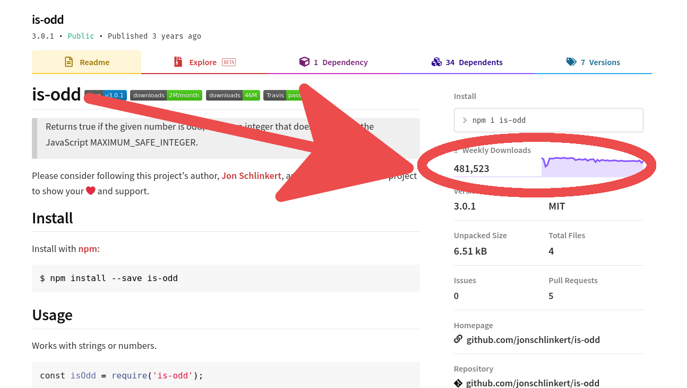

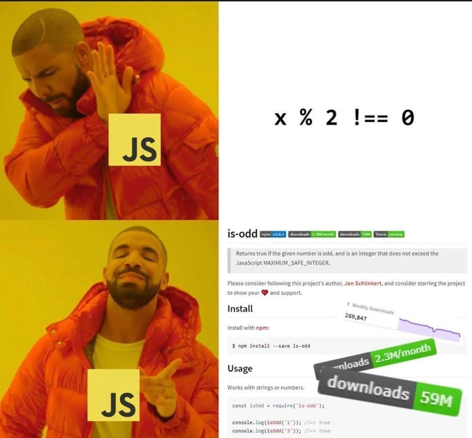

### Paquetes en Python

Pypi es la plataforma principal encargada del manejo de paquetes en Python. En la fecha en la que se actualizó este artículo [Pypi tiene 348,000 paquetes publicados](https://pypi.org/), ¡solo una quinta parte de la cantidad que tiene Javascript! Y como son menos paquetes podemos esperar paquetes más relevantes ¿no? A ver...

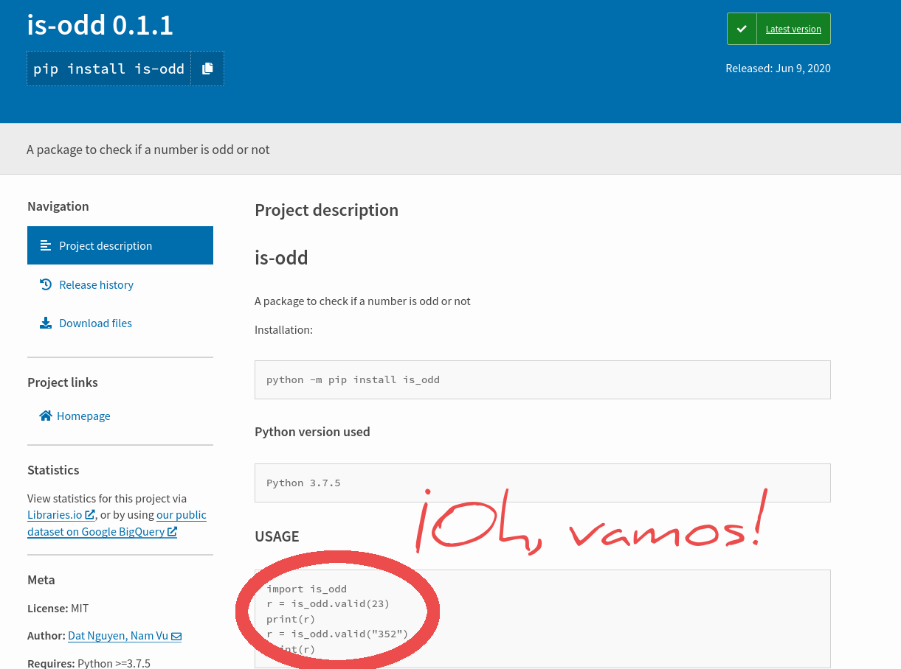

## Para finalizar

Espero que esta pequeña comparación te haya mostrado un poco las diferencias que existen entre ambos lenguajes y si estás pensando en centrarte en alguno de ellos tengas más información sobre la mesa para tomar la decisión correcta.

Si te urge empezar a desarrollar sitios web ya, sin complicarte, yo me iría por Javascript.

Si quieres dedicarte al machine learning y análisis de datos, o quieres una solución más integral en los sitios web y más flexibilidad, yo me iría por Python.

De cualquiera manera no tienes porque reducirlo todo a una dicotomía, si tienes tiempo para dedicarle a ambos puedes hacerlo, muchos desarrolladores web dominan múltiples lenguajes y los usan indistintamente de acuerdo a sus necesidades.
