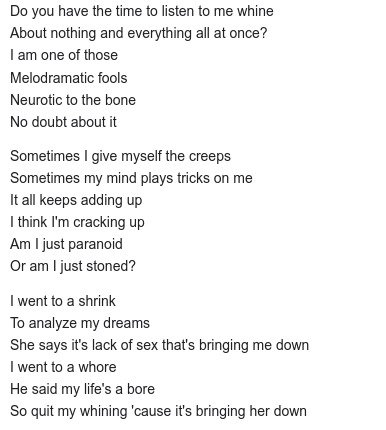
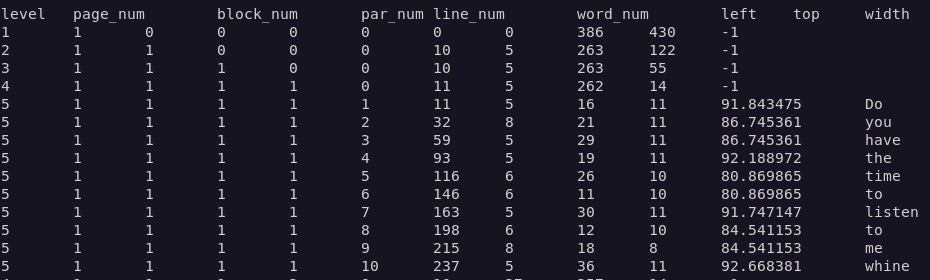
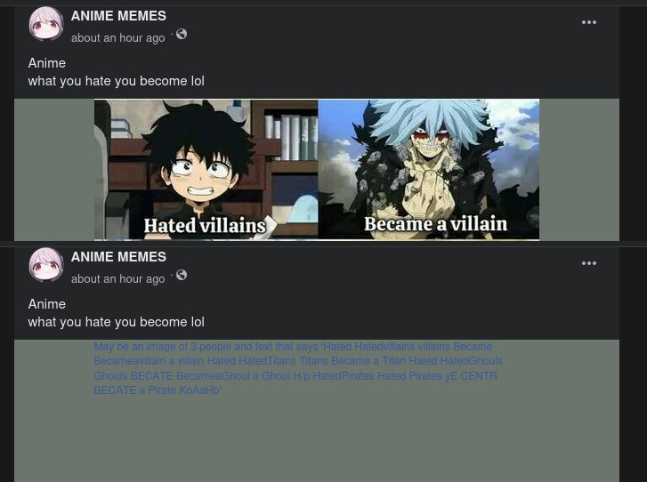

---
aliases:
- /en/ocr-with-tesseract-python-and-pytesseract/
authors:
- Eduardo Zepeda
categories:
- python
- artificial intelligence
coverImage: images/OCR.jpg
coverImageCredits: credits https://www.pexels.com/@cottonbro/
date: '2021-09-28'
description: Learn how to perform optical character recognition (OCR) on images using
  python, tesseract, and its bindings pytesseract to convert an image to string in
  linux
keyword: pytesseract
keywords:
- python
- artificial intelligence
- pytesseract
title: OCR with tesseract, python and pytesseract
---

Python is super versatile, it has a giant community with libraries that allow you to create neural networks from scracth, [fine-tune a LLM](/en/artificial intelligence/fine-tuning-a-llm-small-practical-guide-with-resources/) or use Optical Character Recognition (OCR). For the latter you just need to install tesseract and python bindings, known as pytesseract and you'll be ready to convert an image to a string in a breeze.

## Installation of tesseract-ocr

To perform OCR with Python we will need tesseract, which is the library that handles all the heavy lifting and image processing.

Make sure you install the newest tesseract-ocr, there is a huge difference between version 3 and versions after 4, as neural networks were implemented to improve character recognition. I am using version 5 alpha.

```bash
sudo apt install tesseract-ocr
tesseract -v
tesseract 5.0.0-alpha-20201224-3-ge1a3
```

Differences in OCR engine efficiency between tesseract 3 and tesseract 5 alpha. 


### Installing languages in tesseract

We can see which languages are installed with _--list-langs_.

```bash
tesseract --list-langs
```

It is obvious, but it is necessary to mention that the extent to which it recognizes the text will depend on whether we use it in the correct language. Let's install the Spanish language.

```bash
sudo apt install tesseract-ocr-spa
tesseract --list-langs
List of available languages (3):
eng
osd
spa
```

You will see that Spanish is now installed and we can use it to detect the text in our images by adding the _-l spa_ option to the end of our command



## OCR with tesseract

Now let's put it to the test to recognize text in images, straight from the terminal. I am going to use the following image:



```bash
tesseract image_with_text.jpg -
Warning: Invalid resolution 0 dpi. Using 70 instead.
Estimating resolution as 139
Do you have the time to listen to me whine
...
```

The "-" at the end of the command tells tesseract to send the results of the analysis to the standard output, so that we can view them in the terminal.

It is possible to tell tesseract which OCR engine to use:

* 0: for the original tesseract
* 1: for neural networks
* 2: tesseract and neural networks
* 3: Default, whichever is available

```bash
tesseract image_with_text.jpg - --oem 1
```

Consider that **not all language files work with the original tesseract** (0 and 3). Although generally the neural networks one is the one that gives the best result. You can find the models compatible with the original tesseract and neural networks in the [tesseract repository](https://github.com/tesseract-ocr/tessdata#?).

You can install them manually by downloading them and moving them to the appropriate folder, in my case it is _/usr/local/share/tessdata/_, but it may be different on your system.

```bash
wget https://github.com/tesseract-ocr/tessdata/raw/main/eng.traineddata
sudo mv eng.traineddata /usr/local/share/tessdata/
```

## OCR with Pytesseract

### Installing pytesseract

After installation we add pytesseract (the python bindings) and pillow (for image management) to our virtual environment.

```bash
pip install pytesseract pillow
```

### Read strings from images with pytesseract

First let's check the languages we have installed.

```python
import pytesseract
from PIL import Image
import pytesseract

print(pytesseract.get_languages())
# ['eng', 'osd', 'spa']
```

Now that we have the languages, we can read the text that's in our images and process it as a string in our script.

The code is quite short and self-explanatory. Basically we pass the image as an argument to pytesseract's *image_to_string* method.

```python
import pytesseract

from PIL import Image
import pytesseract

img = Image.open("image_with_text.jpg") # Open the image with pillow
img.load()
text = pytesseract.image_to_string(img, lang='eng') # Extract image's text
print(text)

# Do you have the time to listen to me whine...
```

*image_to_string* method can receive as argument the language in which we want it to detect the text.

Tesseract when with a method with which we can obtain much more information from the image, *image_to_data*, available for versions higher than 3.05.

```python
data = pytesseract.image_to_data(img)
print(data)
```



If you want to learn more visit the [complete tesseract documentation](https://github.com/tesseract-ocr/tesseract).

## Applications of OCR

OCR is quite useful for social networks, where you can scan the text that appears in the images to read its content and then process it or give it statistical treatment.

Here's another case, imagine a program that scans image boards or social networks, extracts a couple of images from the posted videos and links them to a tik tok account using the watermark that appears on each video.

[Captcha resolution](/en/opinions/my-analysis-of-anti-bot-captchas-and-their-advantages-and-disadvantages/) is also one of the most interesting uses of OCR.

Or maybe a page that uploads images of your products with your prices written on each of them. With OCR it is possible to get all their prices, and upload them to your database, downloading and processing their images.

Facebook must use some kind of similar technology to censor images that include offensive text, according to its policies, that are uploaded to its social network.



Another of the most common applications is the transformation of a pdf book into images to text, ideal for transforming old book scans to epub or text files.

As you can see it is quite useful, I think it is one of the IA applications that will not go away [when the AI bubble crashes](/en/inteligencia-artificial/the-rise-and-fall-of-the-ai-bubble/).