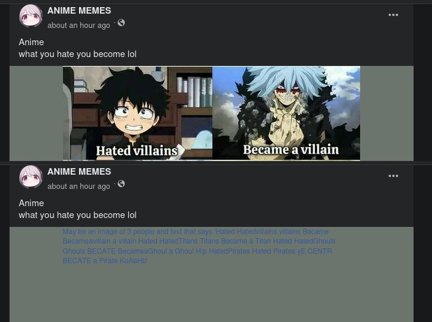

---
aliases:
- /ocr-con-tesseract-python-y-pytesseract
- /ocr-reconocimiento-optico-de-caracteres-con-tesseract-y-pytesseract
- /ocr-con-tesseract-python-y-pytesseract//1000
- /ocr-con-tesseract-python-y-pytesseract/feed/
- /ocr-con-tesseract-python-y-pytesseract/ocr/
- /es/pytesseract-ocr-reconocimiento-optico-de-caracteres-en-python/
authors:
- Eduardo Zepeda
categories:
- python
- artificial intelligence
coverImage: images/OCR.jpg
coverImageCredits: Créditos https://www.pexels.com/@cottonbro/
date: '2021-09-28'
description: Aprende a llevar acabo reconocimiento óptico de caracteres (OCR) sobre
  imágenes usando python, tesseract-ocr y pytesseract, para convertir imágenes en
  strings.
keyword: pytesseract
keywords:
- python
- artificial intelligence
- pytesseract
title: Pytesseract, OCR Reconocimiento óptico de carácteres en Python
url: ocr-con-tesseract-python-y-pytesseract
---

Python es increíblemente versátil, cuenta con una numerosa comunidad que pone a tu disposición librerías que te permiten crear redes neuronales desde cero, [realizar fine-tuning de un LLM](/es/inteligencia artificial/fine-tuning-de-un-llm-guia-practica-con-recursos/) o usar el Reconocimiento Óptico de Caracteres (OCR). Para este último sólo necesitas instalar tesseract y los bindings de python, llamados pytesseract y estarás listo para convertir una imagen en una cadena de texto.

## Instalación de tesseract-ocr

Para llevar a cabo el OCR con Python necesitaremos tesseract, que es la librería que se encarga de todo el trabajo pesado y el procesamiento de imágenes.  
  
Asegúrate de instalar el tesseract-ocr más nuevo, hay una diferencia abismal entre la versión 3 y las versiones posteriores a la 4, pues se implementaron redes neuronales para mejorar el reconocimiento de caracteres. Yo estoy usando la versión 5 alpha.

```bash
sudo apt install tesseract-ocr
tesseract -v
tesseract 5.3.0
```


### ¿Cómo instalar lenguajes en tesseract?

Podemos ver con que lenguajes viene instalado con _\--list-langs_

```bash
tesseract --list-langs
```

Es obvio, pero es necesario mencionar que la medida en la que reconozca el texto va a depender de que lo usemos en el lenguaje correcto. Instalemos el lenguaje de español.

```bash
sudo apt install tesseract-ocr-spa
tesseract --list-langs
List of available languages (3):
eng
osd
spa
```

Verás que ahora el español ya se encuentra instalado y podemos usarlo para detectar el texto de nuestras imágenes agregando la opción _\-l spa_ al final de nuestro comando



## OCR con tesseract

Ahora pongámoslo a prueba para reconocer texto en imágenes, directo de la terminal. Yo voy a usar la siguiente imagen:


```bash
tesseract imagen_con_texto.jpg -
Warning: Invalid resolution 0 dpi. Using 70 instead.
Estimating resolution as 139
Do you have the time to listen to me whine
...
```

El "-" al final del comando le indica a tesseract que mande los resultados del análisis a la salida estándar, para que podamos verlos en terminal.

Es posible indicarle a tesseract el motor de OCR que queremos usar:

- 0: para el tesseract original
- 1: para redes neuronales
- 2: tesseract y redes neuronales
- 3: Predeterminado, lo que esté disponible

```bash
tesseract imagen_con_texto.jpg - --oem 1
```

Considera que **no todos los archivos de idiomas funcionan con el tesseract original** (0 y 3). Aunque generalmente el de redes neuronales es el que da el mejor resultado. Puedes encontrar los modelos compatibles con el tesseract original y redes neuronales en el [repositorio de tesseract](https://github.com/tesseract-ocr/tessdata#?).

Puedes instalarlos de manera manual descargándolos y moviéndolos a la carpeta adecuada, en mi caso es _/usr/local/share/tessdata/_, pero puede ser diferente en tu sistema.

```bash
wget https://github.com/tesseract-ocr/tessdata/raw/main/eng.traineddata
sudo mv eng.traineddata /usr/local/share/tessdata/
```

## OCR con pytesseract

### Instalación de pytesseract

Tras la instalación agregamos pytesseract (los bindings de python) y pillow (para el manejo de imágenes) a nuestro entorno virtual.

```bash
pip install pytesseract pillow
```

### Leer cadenas de texto o strings de imágenes con pytesseract

Lo primero es revisar los lenguajes que tenemos instalados.

```python
import pytesseract
from PIL import Image
import pytesseract

print(pytesseract.get_languages())
# ['eng', 'osd', 'spa']
```

Ahora que ya tenemos los lenguajes, podemos leer el texto de nuestras imágenes.

El código necesario es bastante corto y explicativo, por si mismo. Básicamente le pasamos la imagen como argumento al método *image_to_string* de pytesseract.

```python
import pytesseract

from PIL import Image
import pytesseract

img = Image.open("nuestra_imagen.jpg") # Abre la imagen con pillow
img.load()
text = pytesseract.image_to_string(img, lang='eng') # Extrae el texto de la imagen
print(text)

# Do you have the time to listen to me whine...
```

*image_to_string* puede recibir como argumento el lenguaje en el que queremos que detecte el texto.

Tesseract incluye un método con el cual podemos obtener mucha más información de la imagen: *image_to_data*, este está disponible para versiones superiores a la 3.05.

```python
data = pytesseract.image_to_data(img)
print(data)
```


Si quieres profundizar más visita la [documentación completa de tesseract](https://github.com/tesseract-ocr/tesseract).

## ¿Qué se puede hacer con el OCR?

El OCR es bastante útil para las redes sociales, donde puedes escanear el texto que aparece en las imágenes para leer su contenido y luego procesarlo o darle tratamiento estadístico.

Aquí va otro caso, imagina un programa que escanee image boards o redes sociales, extraiga un par de imágenes de los vídeos publicados y los relacione con una cuenta de tik tok usando la marca de agua que aparece en cada vídeo.

O quizá una página que sube imágenes de sus productos con sus precios escritos en cada una de ellas. Con el OCR es posible obtener todos sus precios, y subirlos a tu base de datos, descargando y procesando sus imágenes.

La [resolución de captchas](/es/opinion/mi-analisis-de-captchas-anti-bots-ventajas-y-desventajas/) también es uno de los usos más interesantes del OCR.

Facebook debe usar algún tipo de tecnología similar para censurar las imágenes que incluyen texto ofensivo, de acuerdo a sus políticas, que se suben a su red social.



Otra de las aplicaciones más comunes la transformación de un libro en pdf en imágenes a texto, ideal para transformar digitalizaciones de libros antiguos a epub o archivos de texto.

Como puedes ver es bastante útil, yo pienso que es una de las aplicaciones de la AI que no desaparecerá [cuando la burbuja de AI truene](/es/inteligencia-artificial/el-auge-y-la-caida-de-la-burbuja-de-ai/).