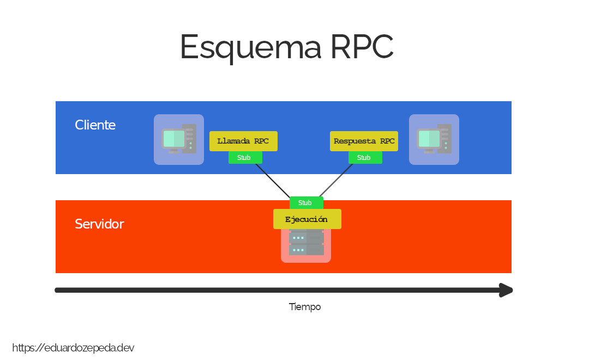
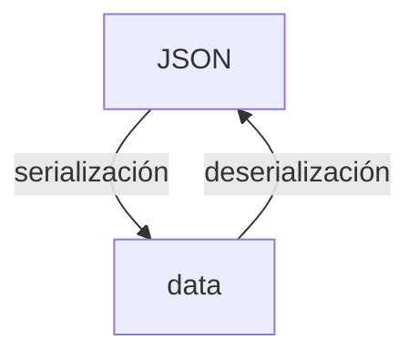
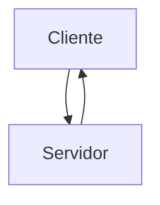
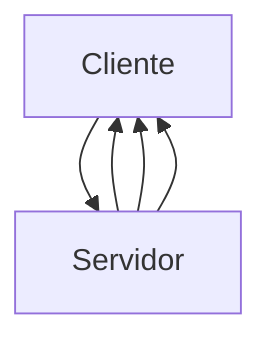
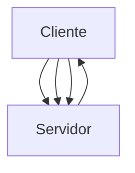
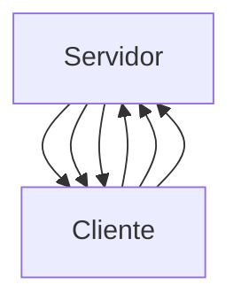

---
aliases:
- /que-es-grpc-y-para-que-sirven-los-protobuffers
- /libera-el-potencial-de-tu-api-con-grpc-y-protobuffers
- /es/libera-el-potencial-de-tu-api-con-grpc-y-protobuffers/
title: APIs ultrarrápidas en Go usando gRPC y Protobuffers
authors:
- Eduardo Zepeda
categories:
- arquitectura de software
coverImage: images/que-es-grpc-y-protobuffers.jpg
date: '2023-01-19'
description: ¿Que es una API gRPC y que son los archivos .proto y los protobuffers?
  ¿qué ventajas tienen los protobuffers sobre JSON y cual es el mecanismo que los
  vuelve tan eficientes?
keywords:
- REST
- arquitectura de software
- API
- buenas practicas
---

Los protobuffers te permiten crear una API gRPC que tiene la característica de ser increíblemente más rápida, por usar binario en lugar de otros formatos menos optimizados (Como JSON), en esta entrada aprenderás en que consiste este tipo de API y porque es tan rápido.

En mi entrada sobre [las características básicas sobre una API REST](/es/caracteristicas-basicas-de-una-api-rest/) te mencioné que, además de REST, existían otros tipos de APIS, una de ellas es gRPC, la cual se deriva de RPC, por lo que empecemos la entrada hablando sobre esta última. 

## ¿Qué es RPC?

Las siglas de RPC vienen de Remote Procedure Call (Llamada de procedimiento remoto en español), que, en palabras simples, se refiere a invocar a la ejecución de código en una máquina, desde otra máquina, generalmente un servidor, de manera que, para el programador, pareciera que la ejecución se realizó de manera local.

### ¿Cómo funciona RPC?

El proceso más detallado es el siguiente:

1. El cliente realiza la llamada enviando un mensaje a la red. 
2. La llamada incluye un procedimiento para codificar los métodos, tipos de
   request y tipo de respuesta en el formato adecuado
   ([marshalling](https://es.wikipedia.org/wiki/Marshalling)). **A este
   procedimiento se llama el stub**.
3. El servidor recibe la petición y usa el stub para decodificar los datos en el
   formato adecuado del entorno RPC y saber que ejecutar y con que información.
4. Se ejecuta la tarea en el servidor y como resultado se genera una respuesta.
5. La respuesta del servidor se codifica usando el stub y se envía al cliente.
6. El cliente recibe la respuesta y la decodifica en el formato adecuado.



¿Notaste que mencioné codificación de datos? Pues bien, un aspecto de RPC a destacar es que requiere que tanto cliente como servidor usen el mismo lenguaje de programación, lo cual lo vuelve una desventaja en entornos donde se pueden mezclar múltiples lenguajes de programación. 

Ahora sí, vamos con gRPC.



## ¿Qué es gRPC?

Google tomó en cuenta las carencias de RPC y decidió mejorarlo creando gRPC. 

gRPC emula a RPC con la ventaja de que **no necesita usar el mismo lenguaje de programación** para llevar a cabo la comunicación entre máquinas. 

¿Y qué pasó con la codificación de datos? Pues Google desarrolló los Protocol Buffers (o protobuffers) para usarlos como el formato predeterminado d gRPC en el intercambio de información entre máquinas y conseguir un rendimiento superior a otros formatos como JSON o XML.

## ¿Qué son los protobuffers?

Seguramente has trabajado con APIs y has notado que, al comunicarte con una API, existe un intercambio de información; tú le mandas información a la API y esta te retorna una respuesta. Este intercambio de información puede llevarse a cabo en diferentes formatos, texto plano, XML (si eres de la vieja escuela) o JSON (el más popular a la fecha de hoy).

Para que este intercambio ocurra tiene que realizarse una serialización de la información al enviarla y, posteriormente, una deserialización. 



Los Protocol Buffers (protobuffers en adelante) son un formato completamente agnóstico de lenguaje y plataforma, que gRPC usa para serializar y deserializar información estructurada solo que, en lugar de usar JSON, XML u otro formato, se realiza directamente en binario. Lo anterior, como ya sabes, lo vuelve mucho más eficiente que usar un formato más amigable con los humanos como JSON.


### ¿Cómo convertir información con los protobuffers?

Simplificando, para crear el código necesario para serializar y deserializar en el formato de los protobuffers partimos de un archivo de extensión *.proto*, este se encargará de modelar la información que usaremos para comunicarmos, así como los servicios que estarán disponibles para nuestra API. Básicamente es decirle como está estructurada nuestra información y que cambios vamos a realizar sobre esta información junto con lo que recibirán como entrada y devolverán como respuesta.

``` go
message DataResponse {
    int32 id = 1;
    string info = 2;
    string result = 3;
}

message DataRequest {
    int32 id = 1;
    string info = 2;
}

service Publisher {
    rpc ProcessData (DataRequest) returns (DataResponse) {}
}
```

Tras definir nuestros modelos y servicios, estos archivos se compilan, y nos generarán el código necesario para serializar y deserializar la información en el lenguaje que nosotros querramos, tanto del lado del cliente como del servidor. Nosotros no tenemos que preocuparnos de los detalles al respecto.

Actualmente el formato [protobuffers se encuentra disponible para C#, C++, Go, Objective-C, Java, Python y Ruby.](https://developers.google.com/protocol-buffers) Revisa la documentación para tu lenguaje en particular.

## REST vs gRPC

Pero, ¿qué tan eficiente es gRPC en comparación con REST? Mira esta comparación hecha por [Matthew Leung](https://laptrinhx.com/grpc-vs-rest-performance-comparison-2418648833/).


|                         | gRPC   | REST   |
| ----------------------- | ------ | ------ |
| Peticiones/Segundo      | 48.00  | 4.00   |
| Latencia de la petición | 6.15   | 8.00   |
| CPU ms/s                | 832.00 | 404.00 |
| CPU/petición            | 17.33  | 101.11 |

Como puedes apreciar *gRPC es mucho más rápido que REST más JSON al procesar peticiones*, las pruebas de rendimiento varian de 5 hasta 10 veces.

### ¿Por qué gRPC es tan eficiente?

Existen varios factores que vuelven a los gRPC extremadamente eficiente para intercambiar información:

* Usa los protobuffers como estructura para intercambio de datos.
* El uso de HTTP2 y multiplexación
* Compresión de headers o cabeceras

El formato binario de los protobuffers se traduce en una menor cantidad de información a transportar y un manejo más fácil y eficiente por parte de las computadoras.

Por otro lado, el uso de HTTP/2, le permite a gRPC enviar múltiples streams de información sobre una sola conexión TCP (multiplexación) de manera bidireccional y asíncrona. 

## Tipos de gRPC y streaming

El protocolo HTTP/2 es muy versátil y le permite a gRPC soportar cuatro tipos de comunicaciones entre cliente y servidor:

* **Unary**. El cliente y el servidor se comunican usando una petición y
  respuesta sencilla, como en REST.



* **Streaming del lado del servidor**. El servidor envía múltiples respuestas a
  una petición del cliente.



* **Streaming del lado del cliente**. El cliente envía múltiples peticiones al
  servidor y este responde con una única respuesta.



* **Streaming bidireccional**. Tanto el cliente como el servidor envían
  múltiples peticiones y respuestas, respectivamente.



Como puedes ver esto es super útil para servicios que requieran intercambios constantes de grandes cantidades de información, como los microservicios.

## Otras capacidades de gRPC

### Interceptores

gRPC cuenta con mecanismo para interceptar mensajes y modificarlos a tu gusto, puedes pensar en ellos como una especie de middleware.

### Balanceo de carga

gRPC provee capacidades de balanceo de carga de manera nativa.

## Recursos de referencia

- [How RPC Works](https://learn.microsoft.com/en-us/windows/win32/rpc/how-rpc-works)
- [What is RPC? gRPC Introduction](https://www.youtube.com/watch?v=gnchfOojMk4)
- [Minimalist guide to RPC](https://itnext.io/a-minimalist-guide-to-grpc-e4d556293422)
- [Devopedia](https://devopedia.org/grpc)