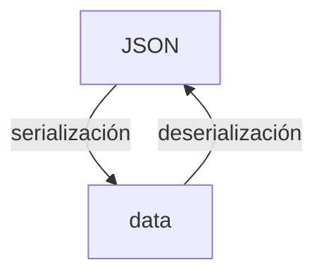
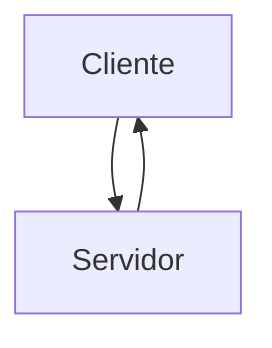
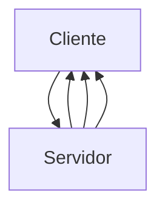
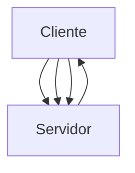
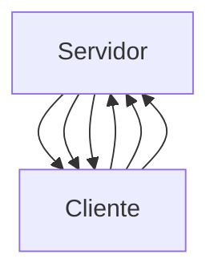

In my entry on [the basic features of a REST API
](/basic-features-of-a-api-rest-api/) I mentioned that, besides REST,
there were other types of APIS, one of them is gRPC, which is derived from RPC,
so let's start the entry talking about the latter.

## What is RPC?

RPC stands for Remote Procedure Call (Remote Procedure Call).
which, in simple terms, refers to invoking the execution of code on one machine, from another machine
execution of code on one machine, from another machine, usually a server, so that, to the programmer
server, so that, to the programmer, it appears that the execution was performed locally.
execution appears to the programmer to have been performed locally.

### How does RPC work?

The more detailed process is as follows:

1. The client makes the call by sending a message to the network.
2. The call includes a procedure to encode the methods, request types, and response type in the appropriate format.
request and response type in the appropriate format ([marshalling]()).
([marshalling](https://es.wikipedia.org/wiki/Marshalling)). **This procedure is called the stub.
procedure is called the stub**.
3. The server receives the request and uses the stub to decode the data in the proper format of the RPC
The server receives the request and uses the stub to decode the data into the appropriate format of the RPC environment and to know what to execute and with what information.
4. The task is executed on the server and a response is generated as a result.
5. The response from the server is encoded using the stub and sent to the client.
6. The client receives the response and decodes it in the appropriate format.


Did you notice I mentioned data encryption? Well, one aspect of RPC to note is that it
is that it requires both client and server to use the same programming language.
programming language, which makes it a disadvantage in environments where multiple programming languages can be mixed.
multiple programming languages can be mixed.

Now, let's go to gRPC.

## What is gRPC?

Google took into account the shortcomings of RPC and decided to improve it by creating gRPC.

gRPC emulates RPC with the advantage that it **does not need to use the same language of
programming language** to perform machine-to-machine communication.

And what happened to data encryption? Well, Google developed Protocol
Buffers (or protobuffers) to use them as the default format for gRPC in
information exchange between machines and achieve higher performance than other formats such as JSON or XML.
to other formats such as JSON or XML.

## What are protobuffers?

You have probably worked with APIs and have noticed that, when communicating with an API,
there is an exchange of information; you send information to the API and it returns a response.
returns a response. This information exchange can take place
in different formats, plain text, XML (if you are old-school) or JSON
(the most popular as of today).

In order for this exchange to occur, a serialization of the
information when it is sent and, subsequently, a deserialization.



Protocol Buffers (protobuffers from now on) are a completely new format for the
platform and language agnostic, which gRPC uses to serialize and deserialize structured data.
structured information only that, instead of using JSON, XML or another format, it is done directly in binary.
instead of using JSON, XML or another format, it is done directly in binary. This, as you know, makes it much more efficient than using a friendlier format.
efficient than using a more human-friendly format like JSON.


### How to convert information with protobuffers?

Simplistically, to create the code necessary to serialize and deserialize into
the protobuffers format, we start from a file with extension _.proto_,
this will be in charge of modeling the information that we will use to communicate, as well as the services that will be available to our API.
as well as the services that will be available for our API. Basically it is
tell you how our information is structured and what changes we are going to make on this information along with what we will
changes we are going to make on this information together with what they will receive as input and
return as a response.

``` go
message DataResponse {
    int32 id = 1;
    string info = 2;
    string result = 3;
}

message DataRequest {
    int32 id = 1;
    string info = 2;
}

service Publisher {
    rpc ProcessData (DataRequest) returns (DataResponse) {}
}
```

After defining our models and services, these files are compiled, and we
generate the necessary code to serialize and deserialize the information in the language we
the language we want, both on the client and server side.
server side. We do not have to worry about the details in this regard.

Currently the [protobuffers format is available for C#, C++, Go,
Objective-C, Java, Python and Ruby.
Ruby.](https://developers.google.com/protocol-buffers) Check the documentation
for your particular language.

## REST vs gRPC

But how efficient is gRPC compared to REST? Take a look at this comparison
by [Matthew
Leung](https://laptrinhx.com/grpc-vs-rest-performance-comparison-2418648833/).

| gRPC            | REST     |
| --------------- | -------- | ------ |
| Requests/Second | 48.00    | 4.00   | 4.00   |
| Request latency | 6.15     | 8.00   | 8.00   | 8.00   | 8.00 | 8.00 | 8.00 | 8.00 | 8.00 | 8.00 |
|                 | CPU ms/s | 832.00 | 404.00 | 404.00 |
| CPU/request     | 17.33    | 101.11 |

As you can see _gRPC is much faster than REST plus JSON in processing
requests_, performance tests vary from 5 to 10 times.

### Why is gRPC so efficient?

There are several factors that make gRPCs extremely efficient for
exchange information:

* Uses the protobuffers as a structure for data exchange.
* The use of HTTP2 and multiplexing.
* Compression of headers.

The binary format of the protobuffers translates into a smaller amount of
information to be transported and easier and more efficient handling by computers.
computers.

The use of HTTP/2, on the other hand, allows gRPC to send multiple streams of
over a single TCP connection (multiplexing) in a bidirectional and asynchronous manner.
and asynchronous.

## Types of gRPC and streaming

The HTTP/2 protocol is very versatile and allows gRPC to support four types of
client-server communications:

* **Unary**. The client and server communicate using a simple request and response, as in REST.
response, as in REST.



**Server-side streaming**. The server sends multiple responses to
a request from the client.



* Client-side streaming. The client sends multiple requests to the server
The client sends multiple requests to the server and the server responds with a single response.



* Two-way streaming**. Both the client and the server send multiple requests and
multiple requests and responses, respectively.



As you can see this is super useful for services that require exchanges.
constant exchanges of large amounts of information, such as microservices.

## Other gRPC capabilities

### Interceptors

gRPC has a mechanism to intercept messages and modify them as you wish,
you can think of them as a kind of middleware.

### Load balancing

gRPC provides load balancing capabilities natively.

## Reference resources

* [Cómo funciona
funciona](https://learn.microsoft.com/en-us/windows/win32/rpc/how-rpc-works)
* [¿Qué es RPC? Introducción a gRPC](https://www.youtube.com/watch?v=gnchfOojMk4)
* [Guía minimalista de
RPC](https://itnext.io/a-minimalist-guide-to-grpc-e4d556293422)
* Devopedia](https://devopedia.org/grpc)