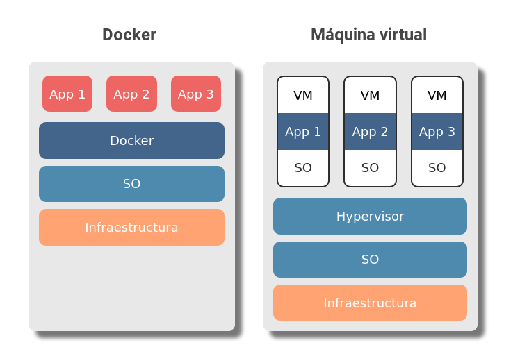

If you have been using computers for a long time, you are probably more familiar with a virtual machine than a container, aren't you? Docker solves the same problem as virtual machines but in a different way than the latter. But let's take it one step at a time, let's start by answering: what is Docker and what is it for?

## What is Docker?

Docker is a tool that allows you to package an application and its dependencies in a lightweight container. It's as if you take a complete application with absolutely everything it needs to run so that you can seamlessly transport it to any other server with Docker installed, either for further development or for deploying. So, that's it? transporting code? I'm sure you'll tell me that's already done by virtual machines, [virtual environments](/en/why-should-you-use-a-virtual-environment-in-python/), zip files and pretty much any tool. Well yes, but I'm going to try to explain in a simple way what the issues are.

## What is Docker for?

In order to explain what Docker is for, let's create a hypothetical multifaceted and multidisciplinary team.

* Manolo: uses windows because he likes the ease with which everything is done.
* Sofia: prefers iOS because it is more elegant and intuitive.
* Ricardo: likes GNU/Linux because he can customize it as he wants.

Each member of our hypothetical team installs a package from a different operating system. Moreover, there are dependencies that may not be available on one of the operating systems. In the end, when the project is unified, compatibility problems may arise due to the differences between operating systems.

Manolo, Sofia and Ricardo know this, for this reason our team agrees to use the same operating system; GNU/Linux in its Ubuntu distribution.

* Manolo, use a live usb to run the newest version of Ubuntu on your pc.
* Sofia installs Ubuntu from a CD copy she had in her desk drawer.
* Ricardo, on the other hand, keeps his operating system as it was in the beginning.

Even if you are both using the same distribution, it's not exactly the same operating system. Notice what can go wrong here? Exactly, there are different versions of the same operating system, as well as the kernel on which they run, and probably each version of the Kernel has different packages, with their respective versions, in their repositories, in addition to the custom configuration that each user or hosting provider may have on their systems.

**This does not necessarily mean that if we set up a project on a server without using Docker everything will go wrong, but it introduces a variability that could be avoided if everyone used **exactly the same version of the operating system**.

## Docker uses containers

**Docker allows us to run our applications in containers**, each with its own function, operating system and resources. Now you are probably thinking: a container is like a virtual machine, isn't it? why not use virtual machines then? Well yes, containers are a form of virtualization and work similarly to a virtual machine, but technically they are not the same.

To avoid falling into the vile hands of computer science purists I will quote the differences between virtual machine and container as they are in the [official Docker website](https://www.docker.com/resources/what-container), and I will entrust myself to the good knowledge of its editors:

## Differences between containers and virtual machines

### Container

> Containers are an abstraction in the application layer that packages the code and its dependencies. Multiple containers can run on the same machine and share the operating system kernel with other containers, each running as an isolated process in the user's environment. Containers take up less space than VMs (container images typically have sizes of tens of MB), can handle more applications, and require fewer VMs and operating systems.
>
> What is a Container? (n.d.). Retrieved September 23, 2020, from https://www.docker.com/resources/what-container

The thing to remember about containers is that **they are not resource intensive, they are isolated and virtualize the operation of an operating system**.

If you want to know how a container works, at the code level, I will tell you that [a container is a process that uses namespaces, linux cgroups and chroot](/en/how-does-a-docker-container-work-internally/) to isolate a group of processes in linux, limit the operating system resources they can use and have their own file system, respectively.

### Virtual machine

> Virtual machines (VMs in singular or VMs in plural) are an abstraction of the physical hardware that turn one server into many servers. The VM monitor allows multiple virtual machines to run on a single machine. Each VM includes a complete copy of an operating system, application, libraries and necessary binaries - taking tens of GBs. VMs can also be slow to boot.
>
> What is a Container (n.d.). Retrieved September 23, 2020, from https://www.docker.com/resources/what-container

The important thing to remember about virtual machines is that, compared to containers, **they take up a lot of memory space and, because they must load a full operating system, they can take much longer to boot** and, unlike containers, **virtualize the operation of the hardware part.**

In the first image we can see that, in the case of containers, the applications interact directly with Docker, and this, in turn, with the operating system.

In the second image we have several applications, **each application running on its own operating system**, that's right, three complete operating systems monopolizing resources, doesn't it sound quite inefficient? Under those virtual machines, the software in charge of creating and running them (Hypervisor) interacts with the operating system.

In addition to the differences in structure, Docker performs optimizations when running, such as using a single operating system if multiple containers use it, so as not to repeat information.

## There are two versions of Docker

It is also important to note that, as is common in Freemium models, **there are two versions of Docker:** the community version, called Docker CE (community edition), which is open source, and the Docker EE (Enterprise Edition), which is paid and has additional features to its counterpart.

## Don't use Docker just because you can

One more thing before ending this entry. **Docker is great, but you don't need to use it in every project**. Project experts often say that adding an extra layer of complexity to a project is something that needs to be evaluated on a case-by-case basis.

In the end Docker is just another tool that should be used to solve a problem that exists or is likely to exist. You're not going to be mounting static pages in Docker containers with Apache or NGINX for a project that you might as well mount directly on a CDN.

## Summary

For practical purposes, Docker will allow us to create applications that we will be able to easily move from one environment to another, that will run in isolated containers within our operating system and that **will behave exactly the same on any machine with Docker installed**.

All of the above will get rid of the "it worked perfect on my machine" and avoid errors caused by environment or configuration differences at development time. Keep reading about Docker in the next post.