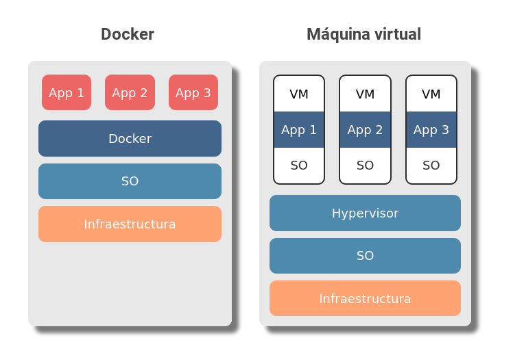

Si llevas usando computadoras desde hace tiempo, probablemente te encuentres más familiarizado con una máquina virtual que con un contenedor, ¿no es así? Docker resuelve el mismo problema que las máquinas virtuales pero de una manera diferente a estas últimas. Pero vamos por partes, empecemos por responder: ¿qué es Docker?

## ¿Qué es Docker?

Docker es una herramienta que permite empaquetar una aplicación y sus dependencias en un contenedor muy ligero. Es como si tomaras una aplicación completa con absolutamente todo lo que necesita para funcionar para poder transportarla sin problema a cualquier otro servidor con Docker instalado, ya sea para seguir desarrollándola o para hacer deploy. ¿Y? ¿es todo? ¿transportar código? De seguro me dirás que eso ya lo hacen las máquinas virtuales, [los entornos virtuales](https://coffeebytes.dev/por-que-deberias-usar-un-entorno-virtual-en-python/), los archivos zip y prácticamente cualquier herramienta. Bueno sí, pero voy a intentar explicar de manera sencilla que problemática hay.

## ¿Para qué sirve Docker?

Con el propósito de explicar para que sirve Docker vamos a crear un hipotético equipo multifacético y multidisciplinario.

- Manolo: usa windows porque le gusta la facilidad con que se hace todo.
- Sofia: prefiere iOS por que es más elegante e intuitivo
- Ricardo: le entusiasma GNU/Linux porque puede personalizarlo a su antojo

Cada que uno de los integrantes de nuestro hipotético equipo instala un paquete lo hará desde un sistema operativo diferente. Es más, hay dependencias que pueden no estar disponibles en alguno de los sistemas operativos. Al final, cuando unifiquen el proyecto, pueden surgir problemas de compatibilidad por las diferencias entre sistemas operativos.

Manolo, Sofia y Ricardo saben esto, por esta razón nuestro equipo acuerda usar el mismo sistema operativo; GNU/Linux en su distribución Ubuntu.

- Manolo, usa una live usb para correr la versión más nueva de Ubuntu en su pc.
- Sofia instala ubuntu desde una copia en CD que tenía guardada en un cajón de su escritorio.
- Ricardo, por su parte, mantiene su sistema operativo tal cual estaba en un principio.

Aunque ambos estén usando la misma distribución, no es exactamente el mismo sistema operativo. ¿Notas lo que puede salir mal aquí? Exactamente, hay diferentes versiones de un mismo sistema operativo, así como el kernel sobre el cual se ejecutan, y probablemente cada versión del Kernel tenga diferentes paquetes, con sus respectivas versiones, en sus repositorios, además de la configuración personalizada que pueda tener cada usuario o proveedor de hosting en sus sistemas.

**Lo anterior no significa necesariamente que si montamos un proyecto en un servidor sin usar Docker todo vaya a salir mal, pero introduce una variabilidad que podría evitarse si todos usaran** **exactamente la misma versión del sistema operativo.**

## Docker usa contenedores

**Docker nos permite correr nuestras aplicaciones en contenedores**, cada una con su propia función, sistema operativo y recursos. De seguro ahora estás pensando: ¿un contenedor es cómo una máquina virtual? ¿no? ¿por qué no usar máquinas virtuales entonces? Pues sí, los contenedores son una forma de virtualización y funcionan de manera similar a una máquina virtual, pero técnicamente no son iguales.

Para evitar caer en las viles manos de los puristas de las ciencias de la computación citaré las diferencias entre máquina virtual y contenedor tal cual están en la [página oficial de Docker](https://www.docker.com/resources/what-container), y me encomendaré al buen conocimiento de sus redactores:

## Los contenedores no son lo mismo que las máquinas virtuales

### Contenedor

> Los contenedores son una abstracción en la capa de aplicación que empaqueta el código y sus dependencias. Múltiples contenedores pueden correr en la misma máquina y compartir el kernel del sistema operativo con otros contenedores, cada uno corriendo como un proceso aislado en el entorno del usuario. Los contenedores ocupan menos espacio que las VMs (las imágenes de los contenedores típicamente tienen tamaños de decenas de MB), pueden manejar más aplicaciones y requieren menos VMs y sistemas operativos.
> 
> What is a Container? (n.d.). Retrieved September 23, 2020, from https://www.docker.com/resources/what-container

Lo que debes recordar acerca de los contenedores es que **son muy ligeros, se encuentran aislados y virtualizan el funcionamiento de un sistema operativo.**

Si quieres conocer como funciona, a nivel código, un contenedor, te adelanto que [un container es un proceso que echa mano de los namespaces, cgroups de linux y chroot](/container-de-docker-con-namespaces-y-cgroups/) para aislar un grupo de procesos en linux, limitar los recursos del sistema operativo que pueden usar y tener su propio sistema de archivos, respectivamente.

### Máquina virtual

> Las máquinas virtuales (VM en singular o VMs en plural) son una abstracción del hardware físico que convierten un servidor en muchos servidores. El monitor de las VMs permite que múltiples máquinas virtuales corran en una única máquina. Cada VM incluye una copia completa de un sistema operativo, la aplicación, librerías y binarios necesarios - tomando decenas de GB. Las VMs también pueden ser lentas de arrancar.
> 
> What is a Container? (n.d.). Retrieved September 23, 2020, from https://www.docker.com/resources/what-container

Lo importante a recordar de las máquinas virtuales es que, en comparación con los contenedores, **ocupan mucho espacio y, como deben cargar un sistema operativo completo, pueden demorar mucho más tiempo en arrancar** y, a diferencia de los contenedores, **virtualizan el funcionamiento de la parte del hardware.**

Hice los diágramas usando HTML y CSS, pero al final me decidí por usar una imagen, el código fuente esta comentado en esta página, puedes tomarlo si quieres. O mandame un DM por twitter y te lo paso.

En la primera imagen podemos apreciar que, en el caso de los contenedores, las aplicaciones interaccionan directamente con Docker, y este, a su vez, con el sistema operativo.

En la segunda imagen tenemos varias aplicaciones, **cada aplicación corriendo sobre su propio sistema operativo**, así es, tres sistemas operativos completos monopolizando recursos, ¿no suena bastante ineficiente? Bajo esas máquinas virtuales, el software encargado de crearlas y ejecutarlas (Hypervisor) interacciona con el sistema operativo.

Además de las diferencias en la estructura, Docker lleva a cabo optimizaciones a la hora de ejecutarse, como usar un solo sistema operativo si múltiples contenedores lo usan, para no repetir información.

## Existen dos versiones de Docker

También es importante hacer notar que, como es común en los modelos Freemium, **existen dos versiones de Docker:** la versión de la comunidad, llamada Docker CE (community edition), de código abierto y la versión Docker EE (Enterprise Edition), de pago y con funciones adicionales a su contraparte.

## No uses Docker solo porque puedes

Algo más antes de terminar esta entrada. **Docker es genial, pero no hace falta usarlo en todos los proyectos**. Los expertos en proyectos suelen afirmar que añadir una capa más de complejidad a un proyecto es algo que debe evaluarse para cada caso en cada particular.

Al final Docker es una herramienta más que debería usarse para solucionar un problema que existe o es probable que llegue a existir. No vas a estar montando páginas estáticas en contenedores de Docker con Apache o NGINX para un proyecto que bien podrías montar directamente en un CDN.

## Resumen

Para fines prácticos, Docker nos va a permitir crear aplicaciones que vamos a poder transportar de un entorno a otro fácilmente, que van a ejecutarse en un contenedores aislados dentro de nuestro sistema operativo y que, además, se **van a comportar exactamente igual en cualquier máquina que cuente con Docker instalado**. 

Todo lo anterior nos librará del "funcionaba perfecto en mi máquina" y evitará errores causados por diferencias de entorno o configuración al momento de desarrollo. Sigue leyendo sobre Docker en la siguiente entrada.
