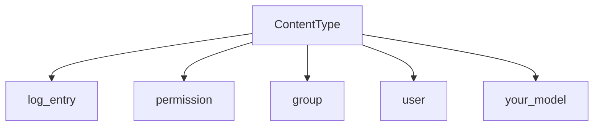

Did you know that Django keeps track of each of the models you create for your project in a model called _ContentType_? Read on to learn about it.

Sorry for taking so long to write! I've been busy moving the frontend of my blog to Frontity, a React framework for Wordpress, and also moving to a new apartment. Maybe I'll talk a bit about Frontity in a future post. For now let's get on with it.

Before we start, if you have no idea what Django is for, visit my post where I talk about (why you should use django)[/en/why-should-you-use-django-framework/] If you've used Django before, let's move on.

## ContentType and models

ContentTypes is a special **Django model that registers each of the models that exist** within our application, both those that we create and those that are installed by default.

## What is ContentType used for?

ContentType **serves to relate models with other models**, as if it were a foreign key, but with the advantage that the type of model with which we relate it can be different for each table entry.



Imagine a simple social network, where we have different types of content; a template for videos, a template for images and a template for text. ContentType allows us to create a model that references any of our three models in a simple way, even if they're completely different models.

## How to use ContentType?

To exemplify how ContentType works, let's create a django project, with a model:

First let's create a virtual environment with [Pipenv, the virtual environment manager](/en/pipenv-the-virtual-environment-manager-you-dont-know/). Or you can also use pip.

```bash
pipenv shell
```

Once in our virtual environment, let's install Django

```bash
pipenv install django
```

Let's create a project:

```bash
django-admin startproject videogameStore
cd videogameStore
```

Now we will create an app for our application.

```bash
django-admin startapp videogame
cd videogame
```

Once we have our application, we will have to create a template, and, as I already mentioned, Django will automatically register that template in its _ContentType_ application.

The first thing we will do is open our _models.py_ file and edit the content of the file

```python
from django.db import models

# Create your models here.

class Videogame(models.Model):
    name = models.CharField(max_length=256)
    created = models.DateTimeField(auto_now_add=True)
    modified = models.DateTimeField(auto_now=True)
```

We must remember to add our newly created app to our _settings.py_ file.

```python
INSTALLED_APPS = [
    ...,
    'videogame'
]
```

We create the migrations and execute them. Pay attention to how to create migrations for the ContentTypes application in Django.

```bash
python3 manage.py makemigrations
Migrations for 'videogame':
  videogame/migrations/0001_initial.py
    - Create model Videogame
python3 manage.py migrate
Operations to perform:
  Apply all migrations: admin, auth, contenttypes, sessions, videogame
Running migrations:
  Applying contenttypes.0001_initial... OK
  Applying auth.0001_initial... OK
...
```

Now we will have a model registered in _ContentType_. Let's check it directly from Django's _shell_.

```python
python manage.py shell
```

Once in the terminal, let's import the _ContentType_ model.

### How to get models from ContentType in Django?

Just like any other model, we can use your ORM to get the data from the models.

Each object of the _ContentType_ model will have a property called _app_label_, and another _model_, which are the name of the application and the name of the model, respectively.

```python
from django.contrib.contenttypes.models import ContentType
ContentType.objects.get(app_label='videogame', model="videogame")
<ContentType: videogame | videogame>
```

If you prefer, you can also access the _ContentType_ instance directly from the model using the _get_for_model_ method.

```python
from videogame.models import Videogame
ContentType.objects.get_for_model(Videogame)
<ContentType: videogame | videogame>
```

## Other models stored in Django ContentType

As you know, each table entry has a unique identifier, the id, see what happens if we access the id of the instance we just created.

```python
ContentType.objects.get(app_label='videogame', model="videogame").id
7
```

Yes, as you may have already guessed, there are more models registered in the ContentType app. Let's find out what they are.

```python
>>> ContentType.objects.get(id=1)
<ContentType: admin | log entry>
ContentType.objects.get(id=2)
<ContentType: auth | permission>
ContentType.objects.get(id=3)
<ContentType: auth | group>
ContentType.objects.get(id=4)
<ContentType: auth | user>
```

As I already mentioned, each of the default installed apps has its respective models.

If you want to go deeper into the subject please check [the official Django documentation](https://docs.djangoproject.com/en/3.1/ref/contrib/contenttypes/)