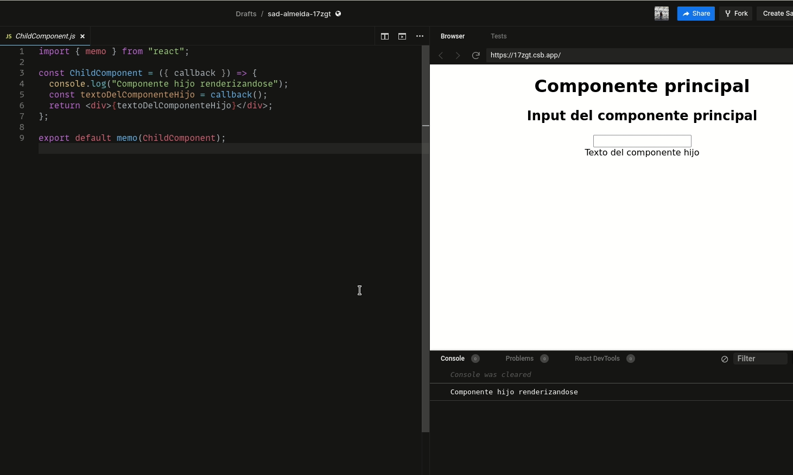
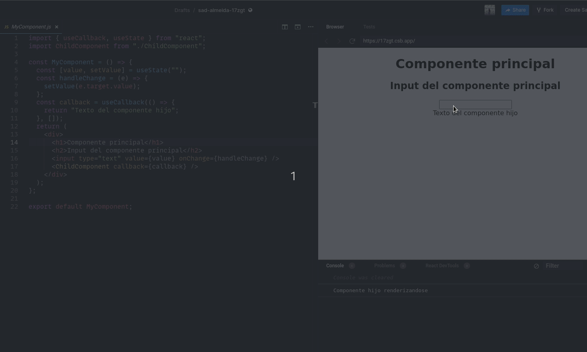

We can use react memo and useCallback to prevent a component from being rendered, uselessly, multiple times by memoization. If you don't know what memoization is or don't understand what the react components, useCallback and memo are for, I have a post where I explain [React's useCallback, useMemo and memo, and what they are for](/en/react-memo-usememo-and-usecallback-to-avoid-react-renderings/).

Let's start our example with the following component:

```javascript
import ChildComponent from './ChildComponent'

const MyComponent = () => {
  // callback va a ser diferente cada vez que este componente se renderice
  const callback = () => {
    return 'Texto del componente hijo'
  };
  return <ChildComponent callback={callback} />;
}

export default MyComponent
```

Each time MyComponent is rendered, React will create a new function called callback, and pass it to ChildComponent, which will be rendered in turn.

The first step will be to memoize the child component, ChildComponent, so that it remains constant as long as its props do not change. To do this, just pass the component to the memo function and export it.

```javascript
import { memo } from "react";

const ChildComponent = ({ callback }) => {
  const textoDelComponenteHijo = callback();
  return <div>{textoDelComponenteHijo}</div>;
};

export default memo(ChildComponent)
```

As I mentioned before, every time React renders a component, its internal functions will be recreated, becoming a different prop for each child component that receives them.

To prevent the props from changing, we have to memoize the function that memo is receiving as a prop. How? Well, using the React hook useCallback

```javascript
import ChildComponent from './ChildComponent'
import {useCallback} from 'react'

const MyComponent = ({ prop }) => {
  const callback = useCallback(() => {
    return 'Result'
  },[])
  return <ChildComponent callback={callback} />;
}

export default MyComponent
```

Now the callback function will not change every time MyComponent is rendered, it will remain constant. Therefore, the memoized component, ChildComponent, will receive as prop the same function, always, avoiding its re-rendering every time MyComponent changes.

## Testing the effect of React memo and useCallback

Still not clear? Check this example in a sandbox.

In the sandbox below, notice how the ChildComponent has a console.log method that writes to the terminal each time the component is rendered. If you write to the input you will notice that ChildComponent is not rendering with each key press.

Why? First, we are using memo in the ChildComponent to avoid renderings. Second, we are using useCallback to prevent the MyComponent function from changing, so memo always receives the same prop.

Now try the following in this sandbox:

<iframe src="https://codesandbox.io/embed/sad-almeida-17zgt?autoresize=1&amp;expanddevtools=1&amp;fontsize=14&amp;module=%2Fsrc%2FChildComponent.js&amp;moduleview=1&amp;theme=dark" style="width:100%; height:500px; border:0; border-radius: 4px; overflow:hidden;" title="sad-almeida-17zgt" allow="accelerometer; ambient-light-sensor; camera; encrypted-media; geolocation; gyroscope; hid; microphone; midi; payment; usb; vr; xr-spatial-tracking" sandbox="allow-forms allow-modals allow-popups allow-presentation allow-same-origin allow-scripts"></iframe>

Remove only the memo function from the ChildComponent and write to the input. ChildComponent will re-render with each new key press. A new terminal message will appear for each rendering.

```javascript
// ChildComponent.js
export default ChildComponent;
```



On the other hand, if you remove the useCallback hook, without removing memo, ChildComponent will still be re-rendered with each key press. This is because with each keystroke, MyComponent is re-rendered and the callback function is re-created, being a new function, memo re-renders the component.

```javascript
// MyComponent.js
const callback = () => {
    return "Texto del componente hijo";
  };
```

Pay attention to the terminal to appreciate the renderings.



On the other hand, if you remove both memo and useCallback, the same thing will happen.

## Avoiding renderings with useMemo

useMemo can also be used to avoid renderings. How? In the previous post I mentioned that every time a component is rendered new objects are created, and these objects are not the same, even if they have the same properties, with the same values.

```javascript
const A = {uno: 1, dos:2}
const B = {uno: 1, dos:2}
A===B
// false
```

Look at the following example, every time the component is re-rendered due to another component, or a change in the state, a new _statsDelMonstruo_ object will be created. Every time that happens React will ask inside useEffect: "Is the variable statsDelMonstruo the same as last time?" And the answer will be "no", because React creates a new object every time, even if this object has exactly the same values as its previous version, they are different objects.

```javascript
import ChildComponent from './ChildComponent'
import {useCallback} from 'react'

const MyComponent = ({ prop }) => {
  const [hp, setHp] = useValue(100)
  const [mp, setMp] = useValue(100)
  // otro valores de estado

  const statsDelMonstruo = { hp, mp }

  useEffect(()=>{
    console.log(statsDelMonstruo)
  }, [statsDelMonstruo])

  return (
    // Otros componentes
    <RenderizaMonstruo stats={statsDelMonstruo}/>
    );
}

export default MyComponent
```

To solve this problem we can useMemo. Our memoizer function will keep the same object, as long as the values inside the square brackets do not change. Now, when React asks: "Is the variable _statsDelMonstruo_ the same as last time?" the answer will be "yes", it is the same variable, because as long as the variables in square brackets do not change, useMemo will return the same object in memory.

```javascript
import ChildComponent from './ChildComponent'
import {useCallback} from 'react'

const MyComponent = ({ prop }) => {
  const [hp, setHp] = useValue(100)
  const [mp, setMp] = useValue(100)
  // otro valores de estado

  const statsDelMonstruo = useMemo(()=> {
    return { hp, mp }
  }, [hp, mp])

  useEffect(()=>{
    console.log(statsDelMonstruo)
  }, [statsDelMonstruo])

  return (
    // Otros componentes
    <RenderizaMonstruo stats={statsDelMonstruo}/>
    );
}

export default MyComponent
```

If you want to go deeper into the subject I found an excellent [youtube video](https://www.youtube.com/watch?v=uojLJFt9SzY) where they explain it quite well.