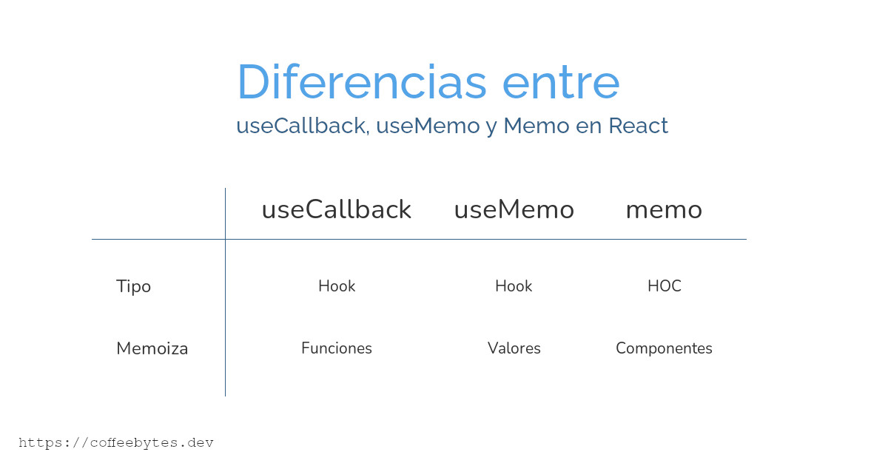

The useCallback, useMemo and memo functions are used to optimize React applications using memoization, avoiding useless renderings, each with their differences, similarities and use cases. These three functions should not be used indiscriminately, but only in those situations where their impact is less than the benefits they offer.

Visit my post where I share [5 React libraries](/en/5-cool-react-libraries-you-should-know-about/) that you can't miss in your arsenal.

## Memoization and object handling in Javascript

Before we start moving on to functions there are two concepts you need to understand first: memoization and Javascript's handling of objects. Move on to the useCallback part if you have already mastered them.

### What is memoization?

Memoize means to memorize a value to avoid processing it again, generally used to save you the cost of producing a value over and over again.

Imagine that you want to multiply the numbers 17 and 19. You would take paper and pen or a calculator, perform the relevant operations and obtain the result: 323. If you are asked again the value of that multiplication, you will not take a new paper and pen to calculate again, but you will recite the number 323, without calculating it, from memory.

As long as they keep asking you for the multiplication of 17 and 19 you will be able to return an answer without recalculating it. You have just memorized the result of multiplying 17 and 19 and you can return it without having to recalculate it.

Now I will explain how Javascript handles objects.

### How does Javascript handle objects?

In Javascript, when we compare two native values we will get the same result. However, objects, including functions, are not considered equal, even if they are identical.

```javascript
2 === 2
true
'hello world' === 'hello world'
true
const d = () => "hello world"
const c = () => "hello world"
d === c
false
//las funciones son idénticas, sin embargo, al ser objetos diferentes, no son iguales para JS
```

Another example:

```javascript
const A = {uno: 1, dos:2}
const B = {uno: 1, dos:2}
A===B
// false
```

Even if two objects are the same and have the same properties and values, since they are located at different memory addresses, they are considered two different objects by JavaScript.

## Object creation in React

The above applies exactly the same in React. **Every time React creates a function it is creating a new object**, different from the previous one, even if they fulfill the same function, line by line.

Look at the following code, **every time the MyComponent component is rendered, React will create a new function** called _callback_, different from the last rendering.

```javascript
import { useCallback } from 'react';

const MyComponent = ({prop}) => {
  const callback = () => {
    return 'Result'
  };
  return <ChildComponent callback={callback} />
}
```

Now that you know how JavaScript and React handle objects, let's get to the main topic.

## Differences between useCallback, useMemo and memo

To begin with we will say that _useCallback, useMemo and memo are memoization_ functions, these functions will save us to recalculate _something_ from scratch.

The basic differences between useCallback, useMemo and memo are summarized in the following table.

* useCallback, memoizes functions, is a hook.
* useMemo, memoizes values, it is a hook.
* memo, memoizes components, it is a HOC.



Together, [memo, useMemo and useCallback are used to avoid unnecessary renderings in React](/en/react-memo-usememo-and-usecallback-to-avoid-react-renderings/).

## useCallback memoize functions

useCallback **is a React hook** that takes care of memoizing the functions so that they are not re-rendered when the components are mounted. It is very useful when transferring functions to child components.

The useCallback function accepts two arguments and **returns a function**. The first argument is the function to memoize and the second, like useEffect, is an array of variables to watch, so that React does not generate a new function with each rendering, as long as those variables do not change. As with useEffect we can also leave the array empty.

```javascript
import { useCallback } from 'react'

const MyComponent = ({prop}) => {
  const callback = () => {
    return 'Result'
  };
  const memoizedCallback = useCallback(callback, [prop])
  return <ChildComponent callback={memoizedCallback} />
}
```

I repeat, as long as the prop that receives the component called Component, remains constant, a new function will not be created, no matter how much the component is re-rendered.

## useMemo memoizes values

This function **is a React hook** used to memoize the value returned by a function. The useMemo function accepts two arguments and **returns a value**. The first argument is the function and the second, like useCallback, is an array of variables to watch, so that a new value will not be generated as long as those variables do not change.

```javascript
import { useMemo } from 'react'

// Ideal para funciones costosas de ejecutar, como factoriales o cálculos complejos
const OtherComponent({value}) => {
  const memoizedValue = useMemo(()=>getExpensiveValue(value), [value])
  return <div>...</div>
}
```

Again, as long as _value_ is kept constant, _getExpensiveValue_ will not be executed with each rendering of the component, but the memoized value will be returned. As with useEffect we can also leave the array empty, instead of value.

## memo memoizes components

Memo **is not a hook**, it is a High Order Component (HOC), i.e. a function that takes a component as a parameter and **returns a new component.

Memo checks if the props of the component it receives have changed, if they have not, it will return the memoized component, without rendering it again.

Again, unlike useCallback and useMemo, memo **is not a hook**, but a memoization function that runs on a component.

```javascript
import { memo } from 'react'

const MyComponent = ({id, title}) => {
    return <div>{id}{title}</div>
}

export default memo(MyComponent)
```

For example, imagine we have the above component. As long as _id_ and _title_ do not change, the component named _Component_, will not be rendered once again, but its memoized value will be returned.

```javascript
import MyComponent from './MyComponent'

const ParentComponent = () => {
   const {id, title} = getIdAndTitle()

   return(
   <>
     <OtrosComponentes/>
     <MyComponent id={id} title={title}/>
   </>)
}
```

### memo use cases

Memo is ideal for components that:

* Suffer multiple renderings with the use of the application and generally receive the same props.
* Receive props that change infrequently or not at all.
* Very bulky components that have a very large impact on performance.

Remember to check my post where I combine this [memo and useCallback to avoid renderings in React](/en/react-memo-usememo-and-usecallback-to-avoid-react-renderings/).

See the [official React hooks documentation](https://es.reactjs.org/docs/hooks-reference.html) if you want to learn more about it.