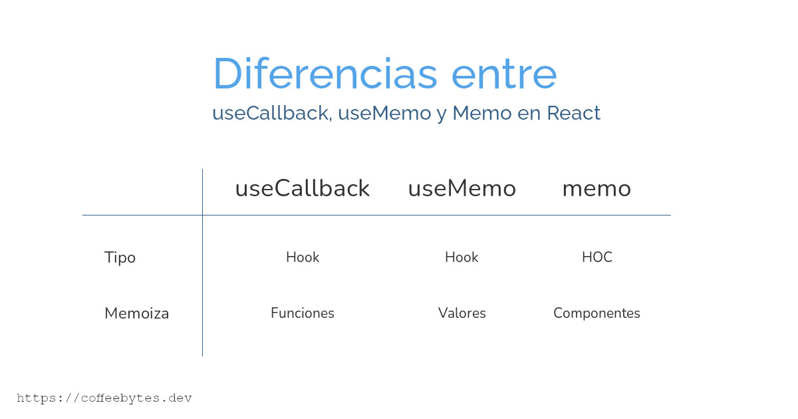

---
aliases:
- /react-usecallback-usememo-y-memo-diferencias-y-usos
- /react-memo-y-usecallback-para-evitar-renderizaciones/
- /react-usecallback-usememo-y-memo-diferencias-y-usos//1000
- /es/react-usecallback-usememo-y-memo-diferencias-y-usos/
authors:
- Eduardo Zepeda
categories:
- react
coverImage: images/ReactuseCallbackuseMemoMemo.jpg
coverImageCredits: Créditos https://www.pexels.com/es-es/@timegrocery/
date: '2021-08-02'
description: Conoce las diferencias entre los hooks useCallback y useMemo, y el HOC
  memo en React y como mejorar el rendimiento de tu app con ellos.
keywords:
- javascript
- react
- rendimiento
slug: /react/react-usecallback-usememo-y-memo-diferencias-y-usos/
title: React useCallback, useMemo y memo, diferencias y usos
---

Las funciones useCallback, useMemo y memo se usan para optimizar aplicaciones de React usando memoización, evitando renderizaciones inútiles, cada uno con sus diferencias, similitudes y casos de uso. Estas tres funciones no deben ser usadas de manera indiscriminada, sino exclusivamente en aquellas situaciones en las que su impacto sea menor que los beneficios que ofrecen.



Visita mi entrada donde comparto [5 librerías de React](/es/react/5-librerias-geniales-de-react-que-debes-conocer/) que no pueden faltarte en tu arsenal.

## Memoización y manejo de objetos en Javascript

Antes de empezar pasar a las funciones hay dos conceptos que tienes que entender primero: memoización y el manejo de objetos por parte de Javascript. Avanza a la parte de useCallback si ya los dominas.

### ¿Qué es memoización?

Memoizar significa memorizar un valor para evitar procesarlo nuevamente, generalmente se usa para ahorrarte el costo de producir un valor una y otra vez.

Imagína que quieres multiplicar los números 17 y 19. Tomarías papel y pluma o una calculadora, realizarías las operaciones pertinentes y obtendrías el resultado: 323. Si te preguntan nuevamente el valor de esa multiplicación, no vas a tomar un nuevo papel y pluma para calcular otra vez, sino que recitarás la cifra 323, sin calcularla, de memoria.

Mientras te sigan preguntando por la multiplicación de 17 y 19 tu podrás devolver una respuesta sin calcularla nuevamente. Acabas de memoizar el resultado de multiplicar 17 y 19 y puedes devolverlo sin tener que calcularlo nuevamente.

Ahora te explico como maneja Javascript los objetos.

### ¿Cómo maneja Javascript los objetos ? 

En Javascript, cuando comparamos dos valores nativos obtendremos el mismo resultado. Sin embargo, los objetos, incluidas las funciones, no se consideran iguales, incluso aunque sean idénticos.

```javascript
2 === 2
true
'hello world' === 'hello world'
true
const d = () => "hello world"
const c = () => "hello world"
d === c
false
//las funciones son idénticas, sin embargo, al ser objetos diferentes, no son iguales para JS
```

Otro ejemplo:

```javascript
const A = {uno: 1, dos:2}
const B = {uno: 1, dos:2}
A===B
// false
```

Aunque dos objetos sean iguales y tengan las mismas propiedades y valores, dado que se encuentran en diferentes direcciones de memoria, se consideran dos objetos diferentes por parte de Javascript.



## Creación de objetos en React

Lo anterior aplica exactamente igual en React. **Cada vez que React crea una función se está creando un nuevo objeto**, distinto al anterior, incluso aunque cumplan la misma función, linea por linea.

Mira el siguiente código, **cada vez que se renderice el componente MyComponent, React creará una función nueva** llamada _callback_, distinta a la de la renderización pasada.

```javascript
import { useCallback } from 'react';

const MyComponent = ({prop}) => {
  const callback = () => {
    return 'Result'
  };
  return <ChildComponent callback={callback} />
}
```

Ahora que sabes como manejan Javascript y React los objetos vamos al tema principal.

## Diferencias entre useCallback, useMemo y memo

Para empezar diremos que *useCallback, useMemo y memo son funciones de memoización*, estas funciones nos ahorrarán volver a calcular *algo* desde cero.

Las diferencias básicas entre useCallback, useMemo y memo se resumen en la siguiente tabla.

* useCallback, memoiza funciones, es un hook.
* useMemo, memoiza valores, es un hook.
* memo, memoiza componentes, es un HOC.



En conjunto, [memo, useMemo y useCallback, se usan para evitar renderizaciones innecesarias en React.](/es/react/react-memo-usememo-y-usecallback-para-evitar-renderizaciones-en-react/)

## useCallback memoiza funciones

useCallback **es un hook de React** que se encarga de memoizar las funciones y de que no se re-renderizen al montarse los components. Es muy útil cuando se transfieren funciones a componentes hijos.

La función useCallback acepta dos argumentos y **retorna una función**. El primer argumento es la función a memoizar y el segundo, al igual que useEffect, es una array de variables a vigilar, de manera que React no genere una nueva función con cada renderizado, siempre y cuando esas variables no cambien. Al igual que con useEffect también podemos dejar el array vacio.

```javascript
import { useCallback } from 'react'

const MyComponent = ({prop}) => {
  const callback = () => {
    return 'Result'
  };
  const memoizedCallback = useCallback(callback, [prop])
  return <ChildComponent callback={memoizedCallback} />
}
```

Lo repito, mientras el prop que recibe el componente llamado Component, se mantenga constante, no se creará una nueva función, por más que se re-renderice el componente.

## useMemo memoiza valores

Esta función **es un hook** de React que sirve para memoizar el valor que devuelve una función. La función useMemo acepta dos argumentos y **retorna un valor**. El primer argumento es la función y el segundo, al igual que useCallback, es un array de variables a vigilar, de manera que no se generará un nuevo valor mientras esas variables no cambien.

```javascript
import { useMemo } from 'react'

// Ideal para funciones costosas de ejecutar, como factoriales o cálculos complejos
const OtherComponent({value}) => {
  const memoizedValue = useMemo(()=>getExpensiveValue(value), [value])
  return <div>...</div>
}
```

Nuevamente, mientras _value_ se mantenga constante, no se ejecutará _getExpensiveValue_ con cada renderización del componente, sino que se devolverá el valor memoizado. Al igual que con useEffect también podemos dejar el array vacio, en lugar de value.

## memo memoiza componentes

Memo **no es un hook**, es un High Order Component (HOC), es decir una función que toma un componente como parámetro y **retorna un nuevo componente.**

Memo revisa si los props del componente que recibe han cambiado, si no lo han hecho, devolverá el componente memoizado, sin renderizarlo nuevamente.

Una vez más, a diferencia de useCallback y useMemo, memo **no es un hook**, sino una función de memoización que se ejecuta sobre un componente.

```javascript
import { memo } from 'react'

const MyComponent = ({id, title}) => {
    return <div>{id}{title}</div>
}

export default memo(MyComponent)
```

Por ejemplo, imagínate que tenemos el componente anterior. Mientras _id_ y _title_ no cambien, el componente llamado _Component_, no se renderizará una vez más, sino que se devolverá su valor memoizado.

```javascript
import MyComponent from './MyComponent'

const ParentComponent = () => {
   const {id, title} = getIdAndTitle()

   return(
   <>
     <OtrosComponentes/>
     <MyComponent id={id} title={title}/>
   </>)
}
```

### casos de uso de memo

Memo es ideal para componentes que:

- Sufren múltiples renderizaciones con el uso de la aplicación y que generalmente reciben los mismos props.
- Reciben props que cambian con poca frecuencia o simplemente no cambian.
- Componentes muy voluminosos que tienen un impacto muy grande en el rendimiento.

Recuerda revisar mi entrada donde combino este [memo y useCallback para evitar renderizaciones en React.](/es/react/react-memo-usememo-y-usecallback-para-evitar-renderizaciones-en-react/)

Consulta la [documentación oficial de los hooks de React](https://es.reactjs.org/docs/hooks-reference.html) si quieres profundizar más en el tema.