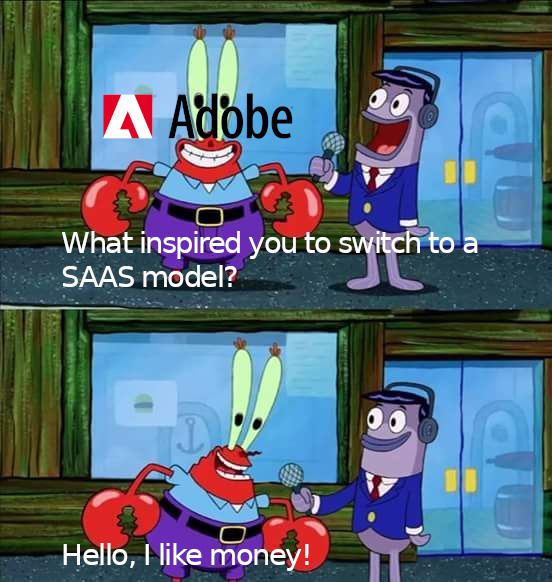
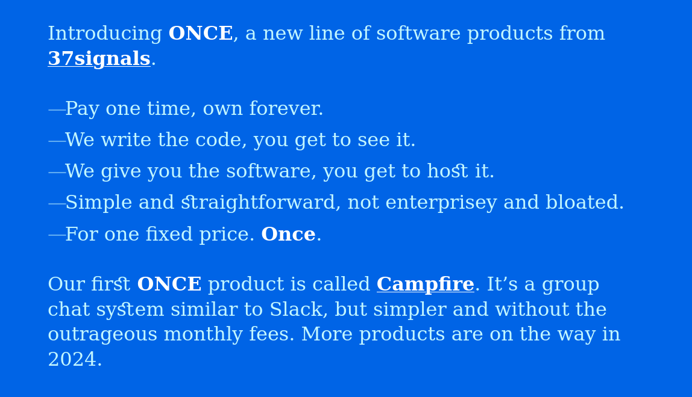

It is no secret that these days software, in general, is trending towards a SAAS business model. However if you were there when the holy scriptures of the internet were written, you will know that this trend is rather recent.

## OTS and software as a physical product

When the internet first came into use, it was common practice to sell software as if it were a regular supermarket product; you made a one-time payment and the product was yours, you owned it outright and you were free to use it until the inevitable collapse of our modern society. 

Not only that, but you physically owned it outside of computers; either in the form of CDs, floppy disks and later DVDs.

But was this situation a corporate decision? Well, yes and no, let me expand on this point a bit.

### The lack of payment methods and the slow internet of yesteryear

Much of the commercial software was too heavy, in proportion to the size of the storage devices, to download without problems. 

In the old days, internet connections were incredibly slow and unstable, leaving aside the strange noise that preceded every connection, old internet pirates know what I'm talking about.

As a result, many companies chose to distribute their software via CDs or other external media.

### Making payments over the internet was not something common.

Making payments over the internet was unusual, paypal didn't exist and there were no other companies offering the service, plus people were wary of the world of online transactions. I don't blame them, HTTPS didn't exist, let alone strong cryptographic standards to protect your personal data.

## The advent of SAAS, the recurring payment model and SAAS hell

The landscape changed and the internet evolved, or maybe it's better to say it became corporatized. 

Companies like Adobe grew and realized that they could save a lot of money by eliminating the logistics of distributing physical products and focusing solely on offering their content over the web.

Subsequently, they found that it was more lucrative to rent the software, probably because:

- They dampened the variability of sales. They no longer had to worry about sudden changes in sales.
- They guaranteed a steady cash flow that allowed them to better plan their costs given the stability.
- The user was unable to use older versions of the software at zero cost.

Offering SAAS allowed companies to make a product or service available to the market with a rentier business model and ensure that if customers wanted to continue using a product (or service) they would have to pay month to month or forget about using it.

This affected mainly those people who rarely updated their software. If they wanted to use it the following month, they now had to pay.

At the same time, however, it allowed companies to release new versions of their software more frequently and to iterate more quickly on user feedback to improve their product, allowing them to improve their product and make it more attractive to customers.

That said, you might think that migrating to a SAAS model would make companies millionaires, but it didn't, at least not for Adobe.

Although it is worth noting that if gross profits did not increase dramatically, his SAAS business allowed him to operate with a gross margin of 93%. Imagine, 93%, Jeff Bezos' wettest dream!

Was it a smart move? Well at least it seems so, since they have kept it up all these years, many, many companies followed the trend along with Adobe and adopted SAAS models.

### SAAS Hell

As more companies adopted SAAS, we went from living in a world of CDs, DVDs and floppy disks to one with a long list of monthly payments for the software we use: netflix, slack, chatGPT, buffer, nuelink, X, Adobe, etc. Offering the companies some pretty convenient recurring revenue and us a list of bills to pay each month.

## Eleven and the return of OTS

And right in the middle of this sea of SAAS, Once appears as an island that offers refuge from the onslaught of companies that want to keep you subscribed for as long as possible.

Eleven is a company that plans to go against the current SAAS trend. Eleven claims that **it is unfair that customers have to pay so much money without ever owning the product**, similar to the landlord-tenant model, where the landlord will not own the real estate, even if he has paid more money than the real estate to the landlord. 

In his manifesto, Eleven, with the eloquence of the best politician, promises **one-time payment for his software and access to the code**, waving the flag of a promising post-SAAS era.

Surprisingly, their promise is not based on empty words; they have developed an application similar to Slack, called **campfire**, which promises to reduce operating costs by up to 99.9% and was quite well received at X.

}

## Some OTS and SAAS considerations.

What advantages do I see? Well the most obvious one, money, paying $299 USD is much better than paying a recurring subscription of $7.25/user/month for decades. The price is incredibly cheap for a company (although a bit more significant for an individual, so I'll be looking forward to trying it out). Add to this the obvious advantage of total control over the data, as the database will be completely in the clients' possession and, surprisingly, access to the code, allowing them to extend it and integrate it with other systems (license permitting).

The disadvantages? You have to be sure that campfire will not disappear leaving you with a deprecated, unsupported product. Not to mention the increased responsibility, as you will now be responsible for keeping the application running, either directly or by hiring someone else, which depending on the number of users and workload may or may not be cost effective. 

From Eleven's point of view, I would point out that it is disadvantageous to provide the source code to your customers, because you expose yourself to the development of competing products, but I'm not saying it, some of them will be able to develop the application for you.

## References:

- [Why Adobe Shifted to a Subscription Model](https://www.linkedin.com/pulse/why-adobe-shifted-subscription-model-travis-hardman)
- [Once Manifest](https://once.com/) 
- [Adobe SAAS Growth](https://tomtunguz.com/adobe-saas-growth)