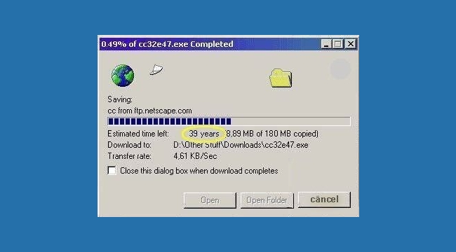
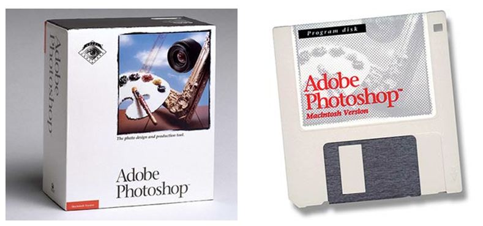
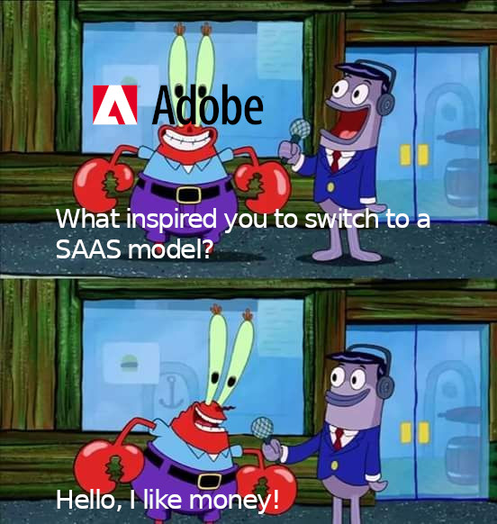
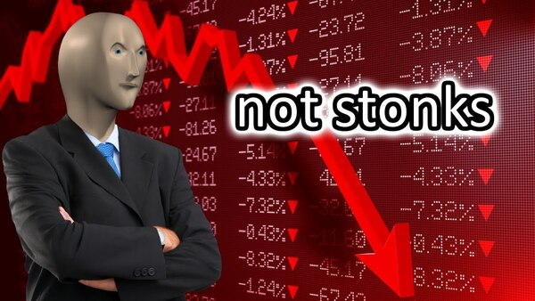
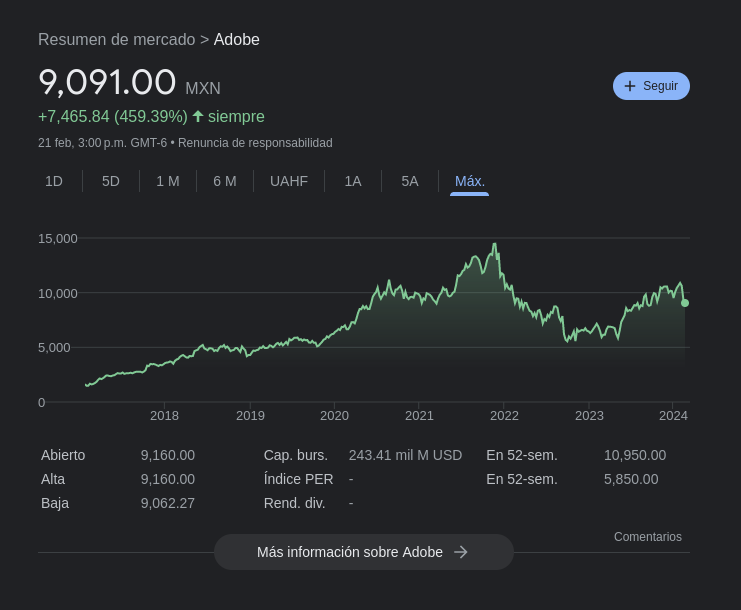
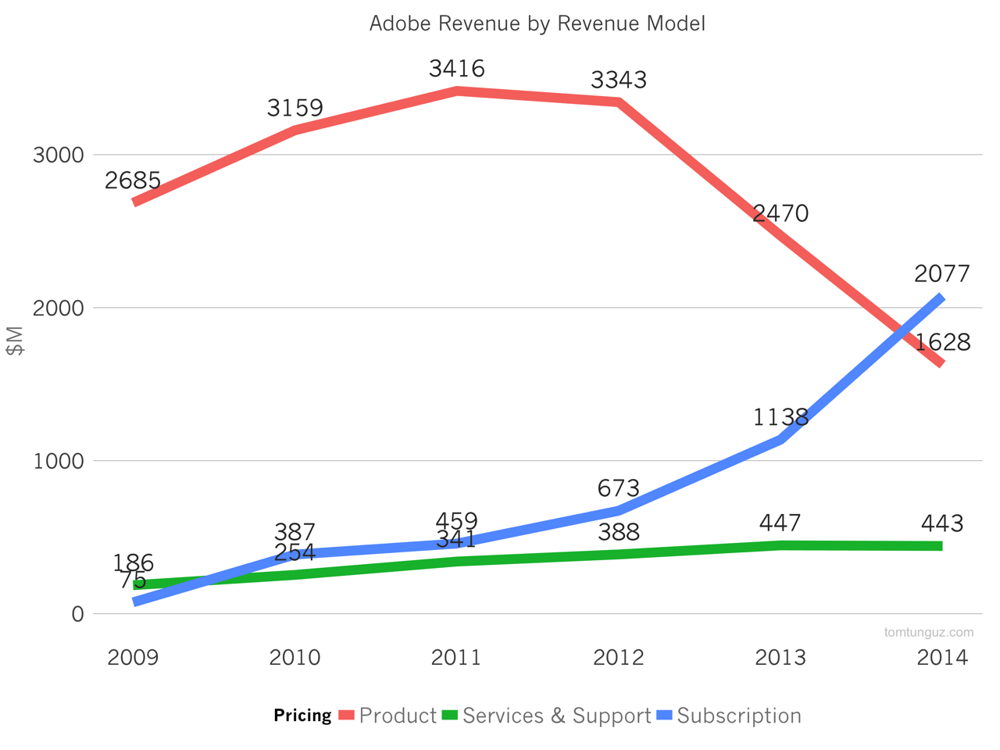
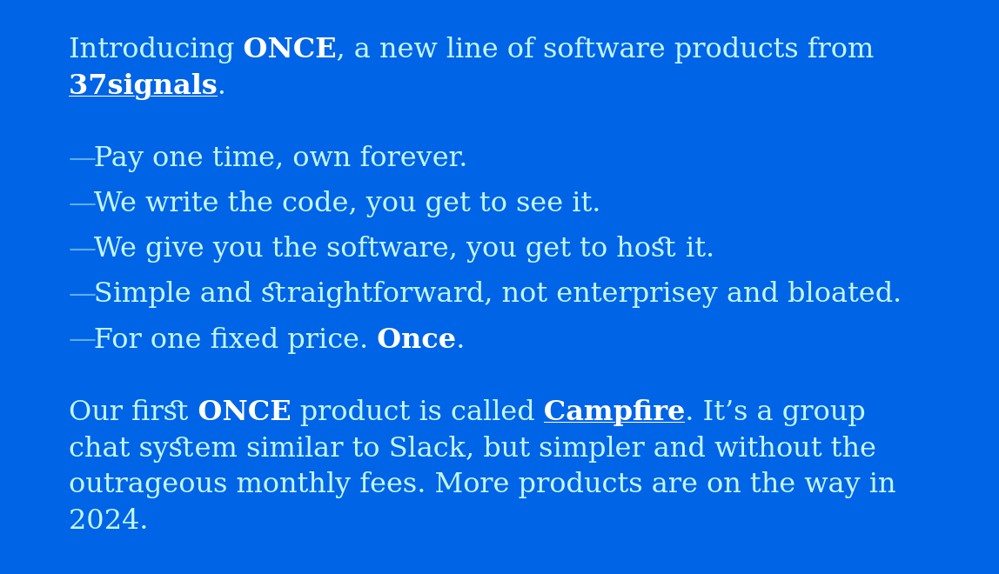

---
aliases:
- /saas-y-one-time-sale-ots-como-modelos-de-negocios
- /saas-y-ots-como-modelos-de-negocios-en-software-y-mi-opinion-sobre-once
authors:
- Eduardo Zepeda
categories:
- opiniones
coverImage: images/saas-y-one-time-sale-ots-como-modelos-de-negocios.jpg
date: '2024-02-22'
title: SAAS y OTS como modelos de negocios y mi opinión sobre Once
url: /es/saas-y-ots-como-modelos-de-negocios-en-software-y-mi-opinion-sobre-once
---

No es un secreto que estos últimos días el software, en general, tiende hacia un modelo de negocio SAAS. Sin embargo si estuviste ahí cuando fueron escritas las sagradas escrituras del internet, sabrás que esta tendencia es más bien reciente.

## OTS y software como producto físico

Cuando internet comenzó a ser usado, era una práctica común vender el software como si fuera un producto cualquiera del supermercado; realizabas un único pago y el producto era tuyo, te pertenencía totalmente y eras libre de usarlo hasta el colapso inevitable de nuestra sociedad moderna. 

No solo eso, sino que poseías físicamente fuera de los ordenadores; ya sea en forma de CDs, Diskettes y más adelante DVDs.

Pero, ¿era esta situación una decisión de las empresas? Bueno, sí y no, permíteme extender un poco este punto.

### La falta de métodos de pago y lentitud del internet de antaño

Gran parte del software comercial era demasiado pesado, en proporción al tamaño de los dispositivos de almacenamiento, como para que pudiera descargarse sin problemas. 

Antaño, las conexiones a internet eran increíblemente lentas e inestables, dejando de lado el ruido extraño que precedia a cada conexión, los viejos piratas de la internet saben de que hablo.

Por lo anterior, numerosas compañias optaron por distribuir su software por medio de CDs u otros medios externos.

### Realizar pagos por internet no era algo común

Realizar pagos por internet era algo poco usual, paypal no existía y no había otras compañias que ofrecieran el servicio, además las personas veían con desconfianza el mundo de las transacciones en linea. No los culpo, el HTTPS no existía y ni hablar de estándares criptográficos fuertes que protegieran tus datos personales.



## La llegada del SAAS, el modelo de pagos recurrentes y el SAAS hell

El panorama cambió e internet evolucionó, o quizás sea mejor decir que se corporativizó. 

Compañias como Adobe crecieron y se dieron cuenta de que podían ahorrar muchísimo dinero eliminando la logística de distribuir productos físicos y centrarse únicamente en la oferta de su contenido a través la red.

Posteriormente, notaron que era más lucrativo rentar el software, probablemente debido a que:

- Amortiguaban la variabilidad de las ventas. Ya no tenían que preocuparse por cambios bruscos en las ventas.
- Garantizaban un flujo de caja constante que les permitía planear mejor sus costos dada la estabilidad.
- El usuario era incapaz de usar versiones antiguas del software con costo cero.

Ofrecer SAAS les  permitió a las empresas poner a disposición un producto o servicio al mercado con un modelo de negocio rentista y asegurarse de que si los clientes deseaban seguir usando un producto (o servicio) deberían pagar mes con mes u olvidarse de usarlo.

Esto afectaba principalmente a aquellas personas que actualizaban su software raramente. Pues si querían usarlo el siguiente mes, ahora debían de pagar.

Sin embargo, al mismo tiempo, permitió a las empresas liberar nuevas versiones de su software de manera más frecuente e iterar con mayor velocidad sobre la información que les proporcionaban los usuarios para mejorar su producto, lo que les permitiría mejorar su producto y hacerlo más atractivo a los clientes.

Dicho lo anterior, quizás pienses que migrar a un modelo de SAAS volvía millonarias a las empresas, pero no sucedió así, al menos no para Adobe.

Aunque cabe resaltar que si las ganancias brutas no aumentaron radicalmente, su negocio de SAAS le permitió operar con un margen bruto del 93%. ¡Imagínate, 93%, el sueño más humedo de Jeff Bezos!

¿Fue un movimiento inteligente? Pues al menos lo parece, ya que lo han mantenido todos estos años, muchísimas empresas siguieron la tendencia junto con Adobe y adoptaron modelos de SAAS.

### SAAS Hell

Conforme más empresas adoptaron el SAAS, pasamos a vivir en un mundo de CDs, DVDs y diskettes a otro con una larga lista de pagos mensuales por el software que usamos: netflix, slack, chatGPT, buffer, nuelink, X, Adobe, etc. Ofreciéndoles a las empresas unas ganancias recurrentes bastante convenientes y a nosotros una lista de cuentas por pagar cada mes.

## Once y el regreso de OTS

Y justo en medio de este mar de SAAS aparece Once como una isla que ofrece refugio ante los embates de las compañias que quieren tenerte suscrito el mayor tiempo posible.

Once es una compañia que planea ir en contra de la tendencia actual del SAAS. Once afirma que **es injusto que los clientes tengan que pagar tanto dinero sin jamás llegar a poseer el producto**, similar al modelo rentista de propietario-arrendador, en donde el arrendador no va a poseer el bien inmueble, incluso aunque haya pagado una cantidad de dinero superior al bien del inmueble al propietario. 

En su manifiesto, Once, con la elocuencia del mejor político, promete **un único pago por su software y acceso al código**, ondeando la bandera de una prometedora era post-SAAS.

Sorprendemente, su promesa no se basa en palabras vacias; han desarrollado una aplicación similar a Slack, llamada **campfire**, que promete reducir los costos de operación hasta en un 99.9% y que fue bastante bien recibida en X.



## Algunas consideraciones del OTS y SAAS

¿Qué ventajas le veo yo? Pues la más obvia, el dinero, pagar $299 USD es mucho mejor que pagar una suscripción recurrente de $7.25/usuario/mes por décadas. El precio es increíblemente barato para una empresa (aunque un poco más significativo para un individuo, por lo que me quedaré con las ganas de probarlo). Sumado a esto, la obvia ventaja de un control total sobre los datos, pues la base de datos estará completamente en poder de los clientes y, sorpresivamente, acceso al código, lo que les permite extenderlo e integrarlo con otros sistemas(siempre y cuando la licencia lo permita).

¿Las desventajas? Debes estar seguro de que campfire no desaparecerá dejándote con un producto deprecado, sin soporte alguno. Eso sin contar con el aumento de responsabilidad, pues ahora tú serás el responsable de mantener funcionando la aplicación, ya sea directamente o contratando a otra persona, lo cual dependiendo del número de usuarios y la carga de trabajo puede o no ser rentable. 

Desde el punto de vista de Once, yo resaltaría que es desventajoso dotar del código fuente a tus clientes, pues te expones a que desarrollen productos competidores, pero no lo digo yo, algunas personas afirmaron en twitter que solo comprarían el producto para examinar el código y enfatizaron el mismo peligro potencial.

## No todas las aplicaciones pueden volverse OTS

¿Se volverá tendencia el OTS y regresaremos a como funcionaba la industria del software antes? Yo lo dudo mucho, algunos negocios dependen completamente del modelo de SAAS y suscripbciones para funcionar; por ejemplo ChatGPT, Midjourney, Deepl y otras aplicaciones, cuyo valor radica en que su modelo de IA no caiga en manos de un competidor, la renta de la propiedad intelectual y la premisa de que sus propuestas están a salvo de la ingeniería inversa. Para todas estas empresas un modelo de SAAS y suscripciones es crucial para sus operaciones.

O considera el caso de Netflix, Hulu, HBO, disney plus, no esperabas que por una tarifa única te dejara descargar todo su catálogo de películas y series para siempre, ¿o si?

Tampoco veo a Adobe dando marcha atrás a los cambios que hizo y volviendo a ofrecer OTS en sus productos. 

¿Y en el caso de startups? Yo no me atrevería a afirmar nada, quizás se vuelva una tendencia entre las nuevas startups ofrecer OTS en lugar de SAAS para monetizar rápidamente sus productos y servicios. Quizás me de una vuelta a esta entrada en un par de años y actualice lo que sucedió con esta promesa de un mundo nuevo.

## Fuentes

- [Why Adobe Shifted to a Subscription Model](https://www.linkedin.com/pulse/why-adobe-shifted-subscription-model-travis-hardman)
- [Manifiesto de Once](https://once.com/) 
- [Adobe SAAS Growth](https://tomtunguz.com/adobe-saas-growth)