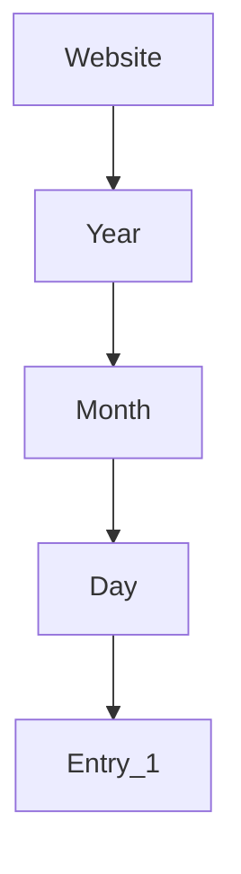
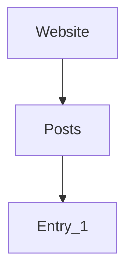

---
aliases:
- /en/my-mistakes-regarding-the-tech-seo-optimization-of-my-website/
- /en/my-technical-seo-mistakes-when-i-migrated-my-site-from-wordpress/
authors:
- Eduardo Zepeda
categories:
- SEO
- opinion
coverImage: images/automation-and-intellectual-property-developers.jpg
date: 2024-04-27 19:49:56
description: I tell you what I did wrong, what I did right and what I learned from
  optimizing the technical SEO aspects of my website so that you don't make the same
  mistakes.
keywords:
- opinion
- seo
- web development
title: My technical SEO mistakes when I migrated my site from Wordpress
---

A few years ago, I migrated my website a couple of times, first from Wordpress to Frontity (A wordpress framework in React) and then from Frontity to a [Digital Ocean Hugo App](). I don't regret my decision at all, but I made a few technical SEO mistakes that you can probably avoid if you take into account what I'm about to tell you.

After that incident I wrote []()

## Why should I care about SEO if I'm a web developer?

SEO is the factor that determines whether a website appears first in the search results of a search engine (almost always Google) or whether it is buried in the last positions, receiving little or no traffic and condemning the business it represents to bankruptcy, or if it is a personal project, to oblivion.

And I'm not talking about subtle differences, I'm talking about abysmal differences.

At the risk of sounding redundant, I will repeat it again: the traffic of a web site is much more important than the efficiency, the language or framework used to code it, yes, even if you wrote it in C++ or directly in assembler.



### Web developers often ignore the potential of SEO.

Most developers have an engineering background, where efficiency, best practices and the business aspect of a website are valued and overlooked. 

Hence, when a web developer launches their personal projects, they often completely ignore SEO and focus on [optimizing their webapp performance to the maximum](/en/opinion/dont-obsess-about-your-web-application-performance/), usually resulting in an extremely fast, efficient, and even visually appealing website, but with no traffic.





## My mistakes migrating a website without considering Technical SEO

When I migrated my web development blog, the first thing that I blatantly ignored were the multiple consequences of doing it unanticipatedly. I began with the sitemap, then the URL structure and finally, as the cherry on top of the cake, the absence of a schema markup.

### The presence of a sitemap is crucial in Tech SEO

A [sitemap is an xml file that functions as a map to navigate your site](/en/django/dynamic-sitemap-with-django/). 

The sitemap that my previous website had was located at a specific URI, which I changed when I migrated the website, so Google was unable to find it, and then what happened? Well... Google indexed the pages randomly, as you probably already know, and I suffered the consequences.

One night my cell phone vibrated to the rhythm of the cascade of notifications that Google Search Console was sending me.



How could I have prevented this? By **logging in my Google search console account** and replacing the old sitemap address with the new one, and then asking Google to read it again,

### How I realized that URL structure is important in Tech SEO

But that wasn't all, after the migration from Wordpress to Hugo, Google detected a lot of 404 errors when accessing the old URLs and, as a punishment for being so careless, my traffic decreased by about 70%, yes 70%, painful I know.

Why did this happen? Imagine that search engines see your website with a URL structure like the following.

And when you perform the migration, the structure changes;

The pages were the same but they weren't at the same place. I like to think that I overestimated google's capabilities to detect the new location of my content and act accordingly.

The important thing to remember here is that search engines do not have a way to easily recognize that one entry is exactly the same as another if it has changed location, especially if this migration involves major changes to the page. While it is true that Google can detect duplicate content and is able to render a web page, that doesn't mean it "sees" the entries visually, as a human would, in its guts it is still receiving and parsing HTM.

### How could I have prevented my traffic decline?

Using a plain, old and boring redirect. It should have been enough to tell Google that if it accessed */202020/12/12/entry_1* it should redirect to */posts/entry_1*, how? by [returning an HTTP 302 or 308 response](), Found or Permanent redirect, respectively.

### The absence of structured data or Schema markup 

When I used Wordpress the Yoast plugin took care of the structured data markup, but in Hugo this has to be done manually, so my website lasted a long time without this structured data, the result? A penalty from Google in the form of a decrease in the daily impressions, and therefore a traffic decline to my website.





That was the tragic story of how my traffic went down abruptly, because I was a layman in SEO. 

But after that incident, I decided that i wouldn't allow for it to happen me again, so I started reading about SEO and I learned a lot of things that I put into practice later. I'm not going to lie to you, right now the website is not at the level that it was before but it is heading in that direction and the best part is that I know what I'm doing now.

I had not given myself the opportunity to touch this topic in the blog, because semantically it is quite far from what most devs understand by web development, and most devs are not really interested in SEO.

But I finally decided to write these mistakes here so they can save you a couple of headaches in the future.