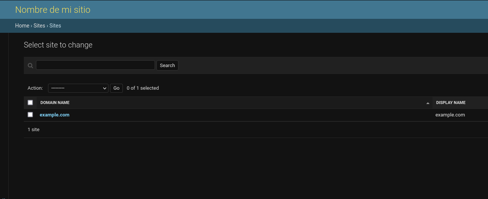

A sitemap is an xml file that functions as a map to navigate your site. Hence the name; Site (site) map. Search engines, such as google, bing, yahoo and others, use the sitemap of a site as a starting point to analyze its content and include it in their search results.

## Structure of a sitemap

A sitemap is an xml file, which has an element called urlset, which is a collection of url elements. Each url element has a location, in this case its url address, a frequency of change, a priority and other optional elements, such as images.

```xml
<?xml version="1.0" encoding="UTF-8"?>
<urlset xmlns="http://www.sitemaps.org/schemas/sitemap/0.9" xmlns:xhtml="http://www.w3.org/1999/xhtml">
   <url>
      <loc>http://example.com/objecto/1</loc>
      <lastmod>1970-01-01</lastmod>
      <changefreq>monthly</changefreq>
      <priority>0.8</priority>
   </url>
</urlset>
```

### Split Sitemaps

When a sitemap is very large it is possible to divide it into smaller sitemaps, using a _sitemapindex_ element and _sitemap_ sub elements, each with its respective location.

```xml
<?xml version="1.0" encoding="UTF-8"?>
<sitemapindex xmlns="http://www.sitemaps.org/schemas/sitemap/0.9">
  <sitemap>
    <loc>http://www.example.com/sitemap1.xml</loc>
  </sitemap>
  <sitemap>
    <loc>http://www.example.com/sitemap2.xml</loc>
  </sitemap>
</sitemapindex>
```

## Framework of sitemaps in Django

Django already has an internal framework for sitemap generation, _django.contrib.sitemaps_, which allows us to create sitemaps dynamically in conjunction with _django.contrib.sites_.

_django.contrib.sites_ is a framework included in django that allows you to manage different websites with the same django application.

To use the sitemaps framework, we need to add the two packages to the INSTALLED_APPS variable and also add the site identifier.

```python
# settings.py
SITE_ID = 1

INSTALLED_APPS = (
    'django.contrib.sites',
    'django.contrib.sitemaps',
)
```

Since Django keeps track of the sites that are managed by the application in the database, you will need to run migrations to update the database.

## Defining a sitemap in Django

Now redirect to your application, at the same level as your _models.py_ file and create a file called _sitemaps.py_.

Inside this file we are going to inherit a class from the _Sitemap_ class provided by Django.

```python
# app/sitemaps.py
from django.contrib.sitemaps import Sitemap
from .models import Videogame

class VideogameSitemap(Sitemap):
    changefreq = 'monthly'
    priority = 0.8

    def items(self):
        return Videogame.objects.filter(published=True)

    def lastmod(self, obj):
        return obj.modified
```

### items

By overwriting the items function we will define the queryset that will be used as a base, you can modify it as much as you want: partition it, limit it to attributes of your objects or as you prefer.

### location

Location refers to the url of the resource. If we do not define a _location_ method, Django will use the _get_absolute_url_ method of our model to generate.

```python
# sitemaps.py
class VideogameSitemap(Sitemap):
    # ...

    def location(self, obj):
        return obj.metodo_personalizado()
```

### changefreq

Refers to the frequency with which the content changes. You can use a function to generate it dynamically according to attributes of the object itself or leave it fixed.

```python
# app/sitemaps.py
class VideogameSitemap(Sitemap):

    def changefreq(self, obj):
        # ...
        return 'monthly'
```

### priority

It dictates the priority of the resource. It is possible to use a function to generate the priority dynamically through attributes or any other flow you prefer.

```python
# app/sitemaps.py
class VideogameSitemap(Sitemap):

    def priority(self, obj):
        # ...
        return 0.8
```

## Adding a sitemap to Django urls

Now we need to add the url to our project's _urls.py_ file. The view we will use, called _sitemap_, is provided by django and we just pass it a dictionary that relates the sitemap we just created and pass it as a parameter.

Within the sitemaps variable you can add other sitemaps for other applications.

```python
from django.contrib.sitemaps.views import sitemap
from videogame.sitemaps import VideogameSitemap

sitemaps = {
    'videogames': VideogameSitemap,
}

urlpatterns = [
    # ...
    path('sitemap.xml', sitemap, {'sitemaps': sitemaps},
        name='django.contrib.sitemaps.views.sitemap'),
]
```

## Setting the domain name in the sitemap

If we access the sitemap, you will notice that the base url of the urls is _example.org_, to define another one we need to modify the base from the administrator. The form is located at _/admin/sites/site/_



## Sitemap cache

Remember that, generally, when you are creating a sitemap dynamically, from each of the objects in your database, you are going through it completely every time you access it. If your database is very large, this may not be convenient. Depending on the type of site you manage, you may want to store the sitemap in the [Django cache](/blog/caching-in-django-rest-framework-with-memcached/).