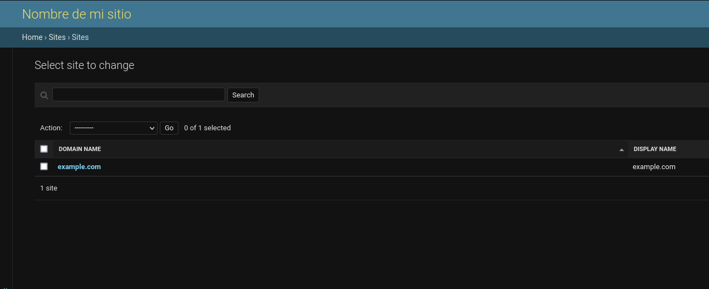

---
aliases:
- /sitemap-dinamico-con-django
- /como-crear-un-sitemap-dinamico-con-django
authors:
- Eduardo Zepeda
categories:
- django
coverImage: images/sitemap-en-django.jpg
date: '2022-07-20'
description: Tutorial sobre la creación de un Sitemap dinámico con Django, su estructura,
  definición, caché y uso de modelos para crear cambos loc, changefreq y priority
keywords:
- django
- sitemap
- python
- seo
title: ¿Cómo Crear un Sitemap Dinámico con Django?
url: sitemap-dinamico-con-django
---

Un sitemap es un archivo de tipo xml que funciona como un mapa para navegar tu sitio. De ahí el nombre; Site (sitio) map (mapa). Los motores de búsqueda, como google, bing, yahoo y otros, usan el sitemap de un sitio como punto de partida para analizar su contenido e incluirlo en sus resultados de búsqueda.

Un sitemap bien estructurado es [crucial en SEO y la presencia de errores puede disminuir radicalmente las vistas de tu sitio web](/es/mis-errores-de-optimizacion-en-el-seo-tecnico-de-mi-sitio-web/), como me sucedió a mi.

## Estructura de un sitemap

Un sitemap es un archivo xml, que cuenta con un elemento llamado urlset, el cual es una colección de elementos url. Cada elemento url tiene una locación, en este caso su dirección url, una frecuencia de cambio, una prioridad y otros elementos opcionales, tales como imágenes.

```xml
<?xml version="1.0" encoding="UTF-8"?>
<urlset xmlns="http://www.sitemaps.org/schemas/sitemap/0.9" xmlns:xhtml="http://www.w3.org/1999/xhtml">
   <url>
      <loc>http://example.com/objecto/1</loc>
      <lastmod>1970-01-01</lastmod>
      <changefreq>monthly</changefreq>
      <priority>0.8</priority>
   </url>
</urlset>
```

### Sitemaps divididos

Cuando un sitemap es muy extenso es posible dividirlo en sitemaps más pequeños, usando un elemento *sitemapindex* y sub elementos *sitemap*, cada uno con su respectiva ubicación.

```xml
<?xml version="1.0" encoding="UTF-8"?>
<sitemapindex xmlns="http://www.sitemaps.org/schemas/sitemap/0.9">
  <sitemap>
    <loc>http://www.example.com/sitemap1.xml</loc>
  </sitemap>
  <sitemap>
    <loc>http://www.example.com/sitemap2.xml</loc>
  </sitemap>
</sitemapindex>
```

## Framework de sitemaps en Django

Django ya cuenta con un framework interno para la generación de sitemaps, *django.contrib.sitemaps*, que nos permite crear sitemaps de manera dinámica en conjunto con *django.contrib.sites*

*django.contrib.sites* es un framework incluido en django que te permite manejar diferentes sitios web con una misma aplicación de django. 

Para usar el framework de sitemaps, necesitamos agregar los dos paquetes a la variable INSTALLED_APPS y además agregar el identificador del sitio.

```python
# settings.py
SITE_ID = 1

INSTALLED_APPS = (
    'django.contrib.sites',
    'django.contrib.sitemaps',
)
```

Como Django lleva un registro de los sitios que se manejan con la aplicación en la base de datos, necesitarás correr las migraciones para actualizar la base de datos.

## Definir un sitemap en Django

Ahora redirígete a tu aplicación, al mismo nivel que tu archivo *models.py* y crea un archivo llamado *sitemaps.py*.

Dentro de este archivo vamos a heredar una clase de la clase *Sitemap* que nos provee Django.

```python
# app/sitemaps.py
from django.contrib.sitemaps import Sitemap
from .models import Videogame

class VideogameSitemap(Sitemap):
    changefreq = 'monthly'
    priority = 0.8

    def items(self):
        return Videogame.objects.filter(published=True)

    def lastmod(self, obj):
        return obj.modified

```

### items

Sobreescribiendo la función items definiremos el queryset que se usará como base, puedes modificarlo tanto como quieras: particionarlo, limitarlo a atributos de tus objetos o como prefieras.

### location

Location se refiere a la url del recurso. Si no definimos un método *location*, Django usará el método *get_absolute_url* de nuestro modelo para generar.

```python
# sitemaps.py
class VideogameSitemap(Sitemap):
    # ...

    def location(self, obj):
        return obj.metodo_personalizado()

```

### changefreq

Se refiere a la frecuencia con que el contenido cambia. Puedes usar una función para generarlo de manera dinámica de acuerdo a atributos del mismo objeto o dejarlo fijo.

```python
# app/sitemaps.py
class VideogameSitemap(Sitemap):
    
    def changefreq(self, obj):
        # ...
        return 'monthly'

```

### Priority

Dicta la prioridad del recurso. Es posible usar una función para generar la prioridad de manera dinámica a través de los atributos o cualquier otro flujo que prefieras.

```python
# app/sitemaps.py
class VideogameSitemap(Sitemap):

    def priority(self, obj):
        # ...
        return 0.8
```

## Agregar un sitemap a las urls de Django

Ahora necesitamos agregar la url a nuestro archivo *urls.py* del proyecto. 

La vista que usaremos, llamada *sitemap*, nos la provee django y nosotros le pasamos solamente un diccionario que relacione el sitemap que acabamos de crear y se lo pasamos como parámetro.

Dentro de la variable sitemaps puedes agregar otros sitemaps para otras aplicaciones.

```python
from django.contrib.sitemaps.views import sitemap
from videogame.sitemaps import VideogameSitemap

sitemaps = {
    'videogames': VideogameSitemap,
}

urlpatterns = [
    # ...
    path('sitemap.xml', sitemap, {'sitemaps': sitemaps},
        name='django.contrib.sitemaps.views.sitemap'),
]
```

## Estableciendo el nombre del dominio en el sitemap usando el admin de Django

Si accedemos al sitemap, notarás que la url base de las urls es *example.org*, para definir otro necesitamos modificar la base desde el administrador. El formulario se encuentra en */admin/sites/site/*



## Caché del sitemap

Recuerda que, generalmente, cuando estás creando un sitemap de manera dinámica, a partir de cada uno de los objetos de tu base de datos, estás accediendo a la base de datos y recorriendo toda la tabla por completo cada vez que lo generas. 

Si tu base de datos es muy grande quizás no sea lo más conveniente, recuerda que múltiples bots monitorean el internet múltiples veces al día. Por lo que, dependiendo del tipo de sitio que manejas quizás te convenga guardar el sitemap en la [caché de Django](/es/cache-en-django-rest-framework-con-memcached/).