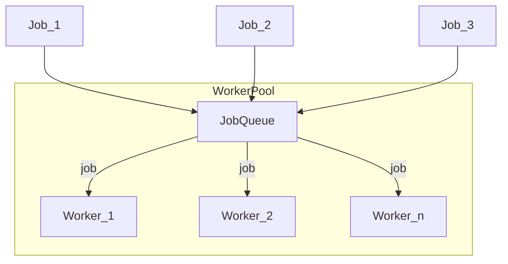
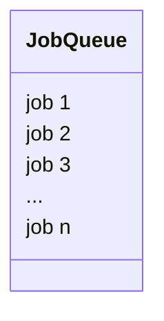
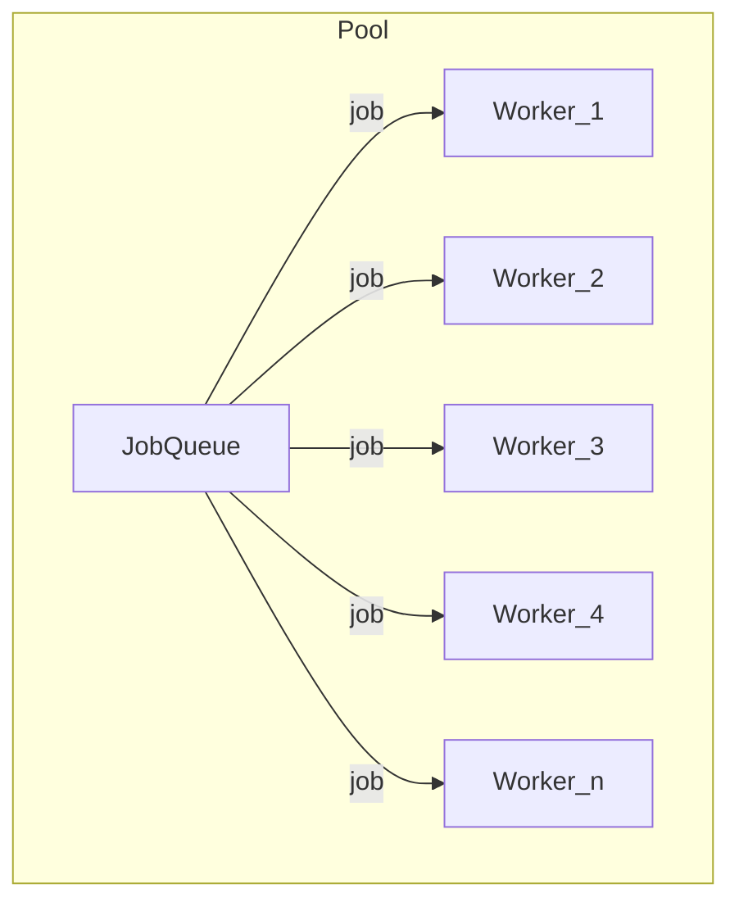
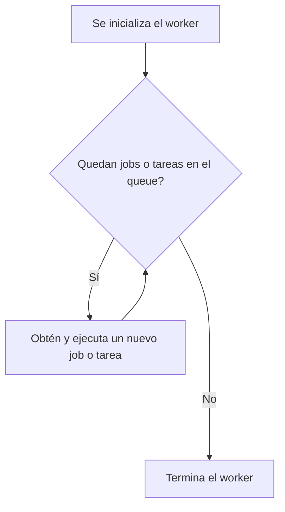
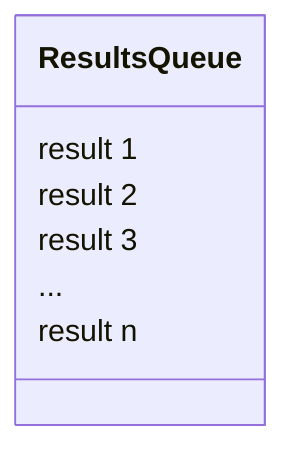

---
aliases:
- /el-patron-de-diseno-worker-pool-aprovechando-la-concurrencia-en-go
- /explicacion-del-patron-de-diseno-worker-pool
- /go-introduccion-a-las-goroutines-y-concurrencia/explicacion-del-patron-de-diseno-worker-pool/
- /go-uso-de-channels-o-canales-para-comunicar-goroutinas/explicacion-del-patron-de-diseno-worker-pool/
- /es/explicacion-del-patron-de-diseno-worker-pool/
authors:
- Eduardo Zepeda
categories:
- software architecture
- Go
coverImage: images/worker-pool-patron.jpg
date: '2023-06-28'
description: Te explico como funciona el patrón de diseño worker pool, el job queue
  o cola de tareas ideal para manejar con lenguajes de programación que soporten la
  concurrencia
keyword: worker pool
keywords:
- Go
- Patrones de diseño
- Worker pool
- Concurrencia
- Paralelismo
- Workers
- algoritmos
slug: /software-architecture/explicacion-del-patron-de-diseno-worker-pool/
title: Explicación del Patron De Diseño Worker Pool
---

Esta entrada va sobre un patrón de diseño, llamado Worker Pool (Piscina de workers o trabajadores suena espantoso, lo usaré en inglés) del que, en su momento, encontré muy poca información en español. Imagínate que tienes una serie de tareas concurrentes que quieres realizar, ya sea realizar crawling de muchos sitios web, o quizás procesar información de cada uno de los pixeles de una imagen o cualquier otra cosa que se te ocurra.



La opción simplista es crear una serie de workers y usarlos de manera concurrente, algo parecido a este pseudocódigo:

``` python
for job in jobs:
    async process_concurrent_job()
```

Esto puede pintar bastante bien, al principio, pero tiene múltiples desventajas; La primera, se estarán creando workers sin control, lo que puede incrementar el uso de memoria de tu programa increíblemente rápido; la segunda, estás creando y destruyendo workers constantemente, lo cual puede ser costoso para tu programa.



Lo mejor sería mantener el uso de memoria constante y evitar crear y destruir workers frecuentemente. Para esto, el patrón worker pool funciona perfecto.

Worker pool es un [patrón de diseño]() que viene para suplir estas deficiencias. 

Hay desarrolladores que han usado este patrón para [manejar un millón de peticiones por minuto en go.](http://marcio.io/2015/07/handling-1-million-requests-per-minute-with-golang#?)



## ¿Cómo funciona el patrón de diseño worker pool?

Partimos de una cola de tareas por ejecutar, estas pueden estar fijas o crearse dinámicamente. Luego, en lugar de crear y destruir múltiples workers ([goroutines en el caso de go](/es/go/go-introduccion-a-las-goroutines-y-concurrencia/)) constantemente, creamos un **número fijo de workers** y las ponemos en un ciclo, en el que estarán escuchando constantemente información de la queue o cola de tareas (por medio de un [canal o channel en el caso de lenguajes como Go]()). De esta manera mantendremos nuestro manejo de memoria mucho más estable y predecible, además de que limitamos el impacto que ejercerían la creación y destrucción constantes de workers.

Por último, de manera opcional, podemos guardar los resultados de estas tareas en una cola desde la cual podrán ser leídos más adelante.



### Job queue

Las tareas o jobs que queremos que se ejecuten por los workers se irán a una cola de tareas o job queue. Una queue normalita, como cualquier otra. Esta puede ser fija, o crearse al vuelo por medio de interacciones de los usuarios u otros sistemas.



### El pool

El pool inicializa y alberga el número de workers que establezcamos, generalmente querrás usar un archivo de configuración, variables de entorno u otro medio. Cada uno de estos workers tomará una tarea, la ejecutará y, cuando vuelva a estar disponible, buscará nuevamente una tarea del job queue para ejecutar y repetir el ciclo.



### El worker

El worker se encarga de ejecutar las tareas y, como mencioné, estará escuchando por nuevas tareas o jobs permanentemente o hasta cierto límite que nosotros indiquemos, como que se agote el job queue, se ejecuten un número dado de tareas o cualquier otra condición que declaremos.




La cantidad fija de workers asegúrara que, durante toda la ejecución del programa, habrá una cantidad máxima de tareas ejecutándose, lo que limitará el impacto en memoria de nuestras tareas concurrentes.


### El queue de resultados del worker pool (opcional)

De manera opcional, podemos mandar el resultado de cada tarea ejecutada por un worker a un segunda cola; el queue de resultados, el cual podremos procesar posteriormente. 



Este patrón de diseño es muy útil cuando hay que procesar candidades enormes de tareas y cuando no queremos sobrecargar el sistema. Y, como puedes suponer es bastante popular y útil en lenguajes de programación que utilizan fuertemente la concurrencia, tales como [el lenguaje de programación Go.]()