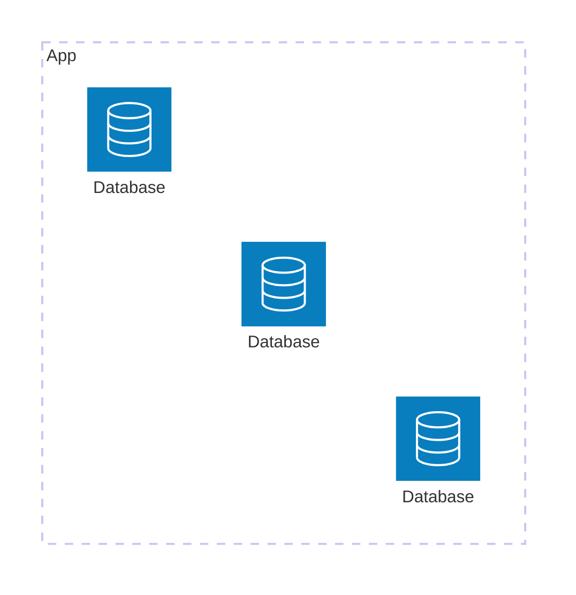

---
aliases:
- /es/arquitectura-multi-tenant-en-software-que-es-y-sus-patrones-de-bases-de-datos/
authors:
- Eduardo Zepeda
categories:
- software architecture
- databases
coverImage: images/multi-tenant-pattern-and-its-database-paradigms.jpg
date: '2025-01-28T17:44:50-06:00'
description: El patrón multiarrendatario es un enfoque de arquitectura de software
  en el que una única instancia de una aplicación sirve a múltiples arrendatarios
  y existen múltiples formas de diseñar una base de datos para este patrón
keyword: multi-tenant
keywords:
- software architecture
- patrones de diseño
slug: /software-architecture/arquitectura-multi-tenant-en-software-que-es-y-sus-patrones-de-bases-de-datos/
title: 'Arquitectura Multi Tenant En Software: Qué Es y Sus Patrones De Bases De Datos'
---

El **patrón multi tenant** es un enfoque de arquitectura (No confundir con [patrón de diseño]() o [patrón de despliegue]()) en software donde **una única instancia de una aplicación sirve a múltiples clientes** (o también podrías llamarlos inquilinos, que es la traducción de tenants). Es probable que hayas estado en contacto con este patrón de diseño al usar dropbox, Slack o cualquier SAAS de gestión de proyectos.

En la arquitectura multi-tenant, cada tenant puede ser una empresa, un grupo o un usuario individual, y aunque comparten la misma infraestructura y código base, sus datos están **aislados y personalizados**.

## Ejemplo Sencillo de aplicación multi-tenant: Un coworking moderno

La arquitectura multiusuario es similar a un edificio de oficinas moderno donde diferentes empresas (inquilinos) (como WeWork, pero con menos corrupción) comparten la misma infraestructura física (ascensores, sistemas de seguridad, servicios públicos y administración del edificio). Sin embargo, cada empresa cuenta con espacios de oficina completamente aislados con sus propios datos, configuraciones y personalizaciones, a los que otras empresas no pueden acceder.



Al igual que el propietario del edificio mantiene un conjunto de sistemas mientras presta servicio a varias empresas, una aplicación multiusuario presta servicio a varias organizaciones utilizando una única instancia de software e infraestructura de base de datos, **con un estricto aislamiento de datos entre los inquilinos**.

Esto difiere de una aplicación multiusuario simple (básicamente cualquier app simple), que se asemeja más a la oficina de una sola empresa donde todos los empleados comparten el mismo espacio de trabajo, datos y configuración (un godinato promedio si estás en México): todos ven la misma información y operan bajo las mismas reglas organizativas y ~~se ponen la misma camiseta~~. En cambio, en los sistemas multiusuario, cada inquilino opera como si tuviera su propia aplicación, con su propia base de usuarios, datos y, a menudo, funciones personalizadas.



Llevando el ejemplo en algo más práctico, imaginate que quieres implementar un servicio de administración de tiendas de supermercado pequeñas. Cada tienda separada representaría un tenant, y cada tenant va a operarse de manera diferente al resto, tendrá su propia configuración, sus propios clientes, proveedores y cualquier otra configuración personalizada, además la información de cada tienda de supermercado será privada.

## ¿En qué se diferencia el patrón multi-tenant de las cuentas de usuario?

Cuando leí la primera vez sobre este patrón de arquitectura no pude encontrar las diferencias entre, digamos una aplicación muy configurable, como MySpace, por ejemplo, y una multi-tenant. Probablemente para ti fue muy clara la diferencia pero a mi me tomó por sorpresa y tuve que investigar al respecto, aunque ciertamente no fui el único en preguntar [la diferencia entre usuarios y multi-tenant](https://stackoverflow.com/questions/48378789/what-is-the-difference-between-tenant-and-user#?):

| **Aspecto**              | **Cuentas de Usuario**                                                                                | **Aplicación Multi-Tenant**                                                                                 |
| ------------------------ | ----------------------------------------------------------------------------------------------------- | ----------------------------------------------------------------------------------------------------------- |
| **Definición**           | Perfiles individuales dentro de una aplicación compartida.                                            | Instancia única de una aplicación que sirve a múltiples clientes (tenants), cada uno con su propio espacio. |
| **Nivel de Aislamiento** | Todos los usuarios comparten los mismos datos y configuraciones generales.                            | Los datos y configuraciones de cada tenant están aislados entre sí.                                         |
| **Personalización**      | Limitada al nivel del usuario (como temas o ajustes personales).                                      | Cada tenant puede tener configuraciones, branding o incluso funcionalidades diferentes.                     |
| **Ejemplo Sencillo**     | Un foro online donde los usuarios tienen cuentas, pero todos comparten las mismas categorías y posts. | Google Workspace (antes G Suite), donde cada empresa (tenant) tiene su propio correo, Drive, y usuarios.    |
| **Propósito Principal**  | Gestionar múltiples usuarios dentro de un solo sistema compartido.                                    | Gestionar múltiples clientes separados, cada uno con varios usuarios y necesidades únicas.                  |
| **Datos Compartidos**    | Los datos suelen estar en un mismo espacio, compartidos por todos los usuarios.                       | Los datos de cada tenant están segregados, aunque usen la misma base de datos.                              |



## ¿Cómo estructurar las bases de datos en una aplicación multi-tenant?

Una aplicación multi-tenant tendrá que registrar y guardar información de cada tenant y por ende habrá una base de datos, pero al estar manejando múltiples tenants o inquilinos, será inevitable preguntarnos: ¿Cómo diseñamos nuestra(s) base(s) de datos? ¿Divido a los tenants por base de datos o por tabla? ¿será buena idea una base de datos para todos en su lugar?

Pues existen diferentes paradigmas al respecto, cada una con sus ventajas y desventajas.

### Una base de datos y un mismo esquema para todos los tenants.



Una única base de datos y un solo esquema, con tablas diferentes para cada tenant. La más sencilla y simple de implementar, pero con pésimo aislamiento y personalización. Puedes identificar a cada tenant por su id único.

``` mermaid
architecture-beta
    group api(database)[Database]

    service schema(logos:datasette-icon)[Schema] in api
```



Una query SQL luciría así

``` bash
SELECT * FROM <table> WHERE <tenant_id_column> = '<id>';
```

### Una base de datos para cada tenant



Aquí hay una base de datos por cada tenant. La más costosa en recursos pero proporciona aislamiento y nivel de personalización total. Puedes identificar a cada tenant por su schema.



Una query SQL luciría así


``` bash
# Connecting database in postgres
\c <tenant_database_>
SELECT * FROM <tenant>.<table>;
```

### Una base de datos pero diferentes schemas para cada tenant

Una única base de datos para todos los tenants pero un schema diferente para cada tenant. Personalizable y la separación de los esquemas mantiene cierto nivel de aislamiento, pero la complejidad se incrementa. Puedes identificar a cada tenant por su schema.

``` mermaid
architecture-beta
    group api(database)[Database]

    service schema1(logos:datasette-icon)[Schema] in api
    service schema2(logos:datasette-icon)[Schema] in api
    service schema3(logos:datasette-icon)[Schema] in api
```




Una query SQL luciría así.

``` bash
SELECT * FROM <tenant>.<table>;
```

Ahora tienes una idea general del patrón multi tenant y esperamos que puedas usarlo en tus aventuras SAAS.