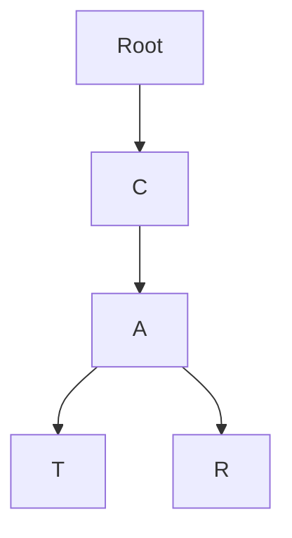
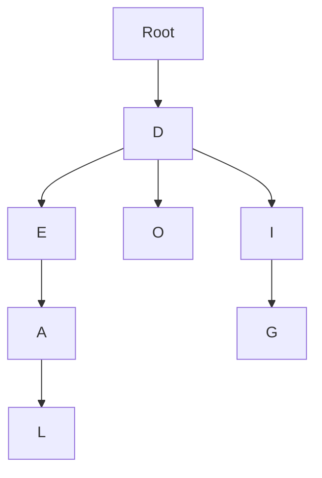
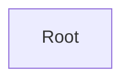
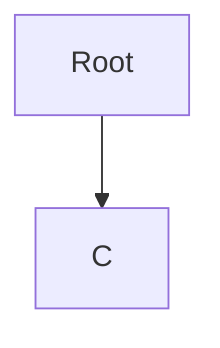
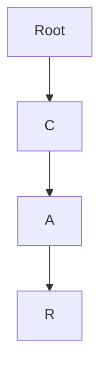
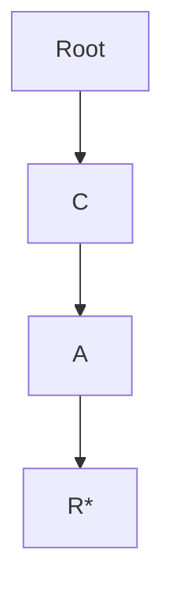
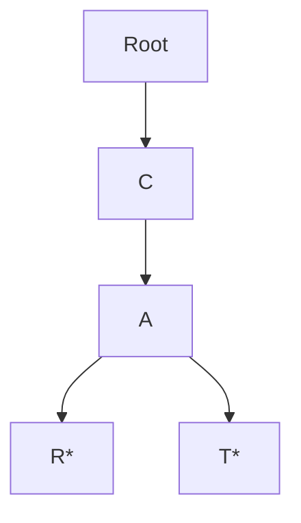

The other day I was reading the second part of [System Design Interview](https://amzn.to/4nsgK0V#?), or was it the first? and I recall that the author was using a trie tree to design a autosuggestion search, like the one on Google. I never heard of that data structure before so I decided to build a visual simulator so you can understand it faster and better.



Aside from suggestions you can also find trie trees in DNA sequence matching in bioinformatics, command routing in CLIs, compiles, and pattern matching in security just to name a few. 

## Trie Trees: The Data Structure That Thinks in Prefixes

When you're working with strings in programming—think autocomplete, search suggestions (like I mentioned), or even dictionaries—you'll eventually bump into something called a **Trie Tree**. The name might sound fancy, but the idea is straightforward once you picture it.



Let's see how they stand apart from binary trees, what they're good for, and in what kind of situations they just suck.



## So, what exactly is a Trie Tree?

A **Trie** (pronounced like "try") is a special kind of tree that stores strings by their prefixes. Instead of putting whole words into nodes, each level of the tree represents only one character. If you follow a path from the root to a node, you're basically tracing out a prefix.

For example, storing "cat" and "car" would share the first two steps ("c" → "a"), and then branch at the "t" and "r." It's like keeping words organized not by the entire string, but by their common beginnings or prefixes. Like morphemes serving as the base for variations.

Think of it like a family tree but instead of faces you use letters.

### How does it differ from a binary tree?

At first glance, you might think, "Wait, isn't a trie tree a binary tree?" Not quite. A binary tree is built around two child nodes (left and right), usually to order numbers or balance structures. 

A Trie, on the other hand, doesn't care about numbers or ordering in the same way. You can have three, four or any number of nodes (well only from A to Z).

Here are some subtle differences:

* **Binary tree**: Think of it as a librarian sorting books by numbers or alphabetical order. Every left branch is "smaller," every right branch is "bigger."
* **Trie tree**: Think of it as grouping books by shared titles. Every branch is one more letter until you finish spelling the word.

That's why tries shine with strings and look awkward if you try to force them to behave like binary trees (like your romantic relationships), so don't do it.



## What are trie trees used for?

Tries pop up in more places than you'd expect. Some examples:

* **Autocomplete**: Every time your phone suggests "pizza" after you type "pi," there's probably a trie under the hood, it makes the queries ~~blazingly~~ fast
* **Spell checkers**: They can quickly test whether a string is in a dictionary (Somewhat similar to a Swiss Table or a [Bloom Filter]())
* **IP routing**: Networks use a similar prefix-matching idea to decide where to send packets.
* **Word games**: Ever played Scrabble helpers online? 

The unifying idea is that you're not searching one whole word at a time—you're searching through chunks, prefixes, and paths which makes things a lot way faster and easier.



## Building one (the minimalist way)

Ok how to build one? Well this algorithm is probably in one thousands blogs already, but here it goes one more time:

1. Start with a root node (an empty shell).

2. For each word, walk through its characters one by one.
3. If a character doesn't exist at the current node, create a child node for it.

4. Move down to that child, and repeat until the whole word is stored.

5. Mark the final node as "end of word." (You can use an asterisk or whatever you want.)

That's it. For "car," you'd go root → "c" → "a" → "r." For "cat," you'd reuse "c" → "a" and just add a "t.". Just like in the simulator above.



In code, it often boils down to a dictionary of dictionaries (or maps inside maps) with a flag to show when a word ends.

## The shortages—because nothing can be perfect

Tree tries come with some baggage:

* **Memory hungry**: They can blow up in size if you're storing a lot of words, especially with large alphabets, think of Google's trie trees.
* **Implementation overhead**: A simple array or hash lookup is often easier and faster for smaller datasets, otherwise is just an overkill
* **Cache unfriendly**: Since nodes can be scattered in memory, accessing them may be slower on real machines compared to something compact like a hash table, so implement [caching system]() can be complicated.

## The upsides (and why people still love them)

Now, where they really shine:

* **Fast lookups**: Checking if a word exists is basically as quick as spelling it out.
* **Prefix-friendly**: Autocomplete and prefix searches are effortless.
* **Ordered by default**: Unlike hash maps, words in a trie naturally come out in alphabetical order, but things can get more complex in languages like Japanese or Chinese.
* **Shared storage**: Common prefixes only get stored once, which saves space if your dataset has lots of overlap. Also since a lot of words comes from morphemes, the tree can store many variations in mimum space. 

Memory eaters but lightning-fast when you're constantly checking or suggesting words.

## Big O performance and Trie Trees

What about performance and [Big O notation]()? This data structure has a O(L) where L is the word's length. The worst case scenario is a long word, or long sentences.

### How to optimize a Trie Tree?

There are some memory optimization techniques if you want to squeeze more juice from this data structure. And given that memory is the Achille's heel of this data structure that's the thing that should be improved.

- You can use arrays vs [hash maps]() for children
- If you're dealing with a fixed alphabet you can use Bitmask representations.
- You can store counts of prefixes in each node to easily get how many words starts with a certain prefix.
- You can also store extra metadata at nodes (like frequency counts for predictive typing).

## You probably won't need trie trees

You probably won't use this data structure every day, unless you're into search engines, autocomplete or other related tasks, but they can be frequent in big and complex systems. But still I think that this data structure shows how you can tune performance in the most unexpected ways.

## Some Trie trees implementations

Don't reinvent the wheel, here are some community-tested implementations of trie trees.

- [Marisa-trie (Python)](https://github.com/pytries/marisa-trie#?)
- [Datrie (Python)](https://pypi.org/project/datrie/#?)
- [Trie (Rust)](https://github.com/paritytech/trie#?)
- [Trie (Golang)](https://github.com/dghubble/trie#?)