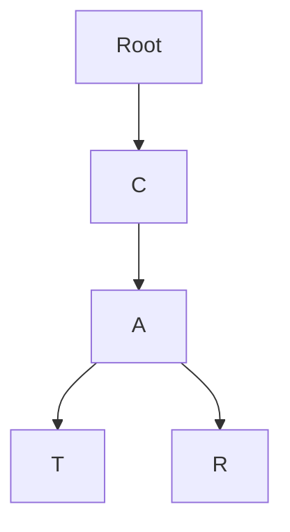
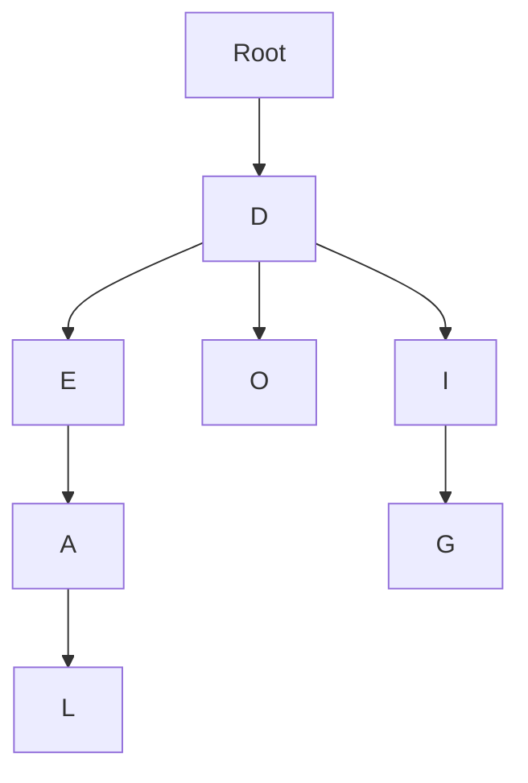
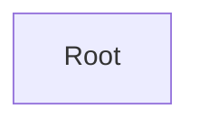
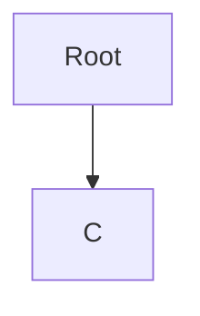
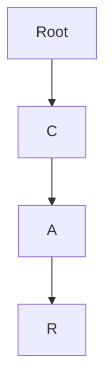
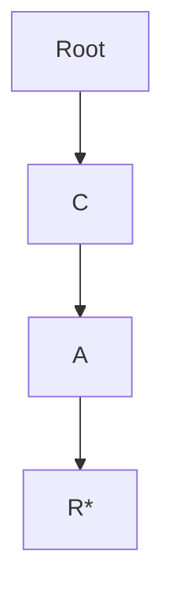
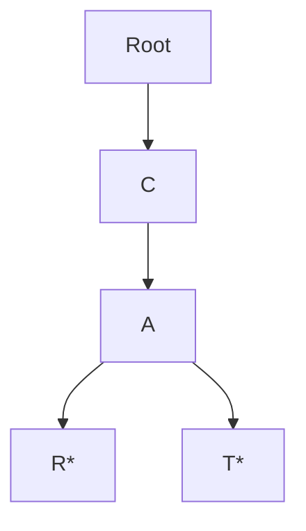

El otro día estaba leyendo la segunda parte de [System Design Interview](https://amzn.to/4nsgK0V#?), ¿o era la primera? y recuerdo que el autor usaba un trie tree para diseñar un buscador con autocompletado estilo Google. Nunca había escuchado de esa estructura de datos, así que decidí crear un simulador visual para que lo entiendas más rápido y mejor.



Además de su uso más común: sugerencias de text, también puedes encontrar trie trees en coincidencia de secuencias de ADN en bioinformática, en ruteo de comandos en CLIs, compiladores y detección de patrones en seguridad, por mencionar solo algunos casos.

## Trie Trees: La estructura de datos que piensa en prefijos

Cuando trabajas con strings en programación—ya sea autocompletado, sugerencias de búsqueda (como ya mencioné) o incluso diccionarios—tarde o temprano te toparás con algo llamado **Trie Tree**. El nombre puede sonar rimbombante, pero la idea es bastante sencilla una vez que la entiendes.

Vamos a ver en qué se diferencia de un árbol binario, para qué sirve y en qué situaciones simplemente apesta.



## Entonces, ¿qué es exactamente un Trie Tree?

Un **Trie** (se pronuncia en inglés igual a "try") es un tipo especial de árbol que guarda strings por sus prefijos. En lugar de almacenar palabras completas en cada nodo, cada nivel del árbol representa solo un carácter. Si sigues un camino desde la raíz hasta un nodo, básicamente estás trazando un prefijo.

Por ejemplo, almacenar "cat" y "car" compartiría los dos primeros pasos ("c" → "a"), y luego se separan en la "t" y la "r". Es como organizar palabras no por la cadena completa, sino por sus prefijos en común. Como los morfemas, que sirven de base para variaciones de palabras.

Piénsalo como un árbol genealógico, pero en vez de caras usas letras.

### ¿Cómo se diferencia de un árbol binario?

A primera vista podrías pensar: "¿Un trie tree no es básicamente un árbol binario?" Pues no, lamento desilusionarte. Un árbol binario se organiza alrededor de dos nodos hijos (izquierdo y derecho), normalmente para ordenar números o balancear estructuras.

Un Trie, en cambio, no se preocupa por números ni por ordenarlos. Puede tener tres, cuatro o tantos hijos como caracteres existan (bueno, solo de la A a la Z).

Aquí algunas diferencias sutiles:

* **Árbol binario**: Piensa en un bibliotecario que ordena libros por números o alfabéticamente. Cada rama izquierda es "menor", cada rama derecha es "mayor".
* **Trie tree**: Piensa en agrupar libros por títulos compartidos. Cada rama es una letra más hasta terminar la palabra.

Por eso los tries brillan con strings y se ven forzados si los quieres tratar como lo que no son, árboles binarios (como tus relaciones amorosas), así que no lo hagas.

## ¿Para qué se usan los trie trees?

Los tries aparecen en más lugares de los que pensarías. Algunos ejemplos:

* **Autocomplete**: Cada vez que tu celular sugiere "pizza" después de escribir "pi," probablemente hay un trie detrás. Hace las consultas ~~ridículamente~~ rápidas.
* **Correctores ortográficos**: Pueden comprobar en un instante si una palabra está en el diccionario (similar a una Swiss Table o a un [Bloom Filter]()).
* **Ruteo de IPs**: Las redes usan esta misma idea de coincidencia de prefijos para decidir a dónde enviar los paquetes.
* **Juegos de palabras**: ¿Has usado ayudas de Scrabble en línea?

La idea central es que no buscas toda la palabra de un solo jalón—buscas por fragmentos, prefijos y caminos, lo que hace las cosas mucho más rápidas y fáciles.

## Construyendo uno (a la minimalista)

Ok, ¿cómo construir uno? Bueno, este algoritmo seguro está en mil blogs ya, pero aquí va una vez más:

1. Empieza con un nodo raíz (una celda vacia).

2. Para cada palabra, recorre sus caracteres uno por uno.
3. Si un carácter no existe en el nodo actual, crea un nodo hijo para él.

4. Baja a ese hijo y repite hasta guardar la palabra completa.

5. Marca el nodo final como "fin de palabra" (puedes usar un asterisco o lo que quieras).

Eso es todo. Para "car," harías raíz → "c" → "a" → "r." Para "cat," reutilizas "c" → "a" y solo agregas una "t." Justo como en el simulador de arriba.

En código, normalmente se reduce a un diccionario de diccionarios (o mapas dentro de mapas) con una bandera que indica cuándo termina una palabra.

## Las desventajas, porque nada es perfecto

Los trie trees cargan con algunos problemas:

* **Consumen mucha memoria**: Pueden crecer demasiado si guardas muchas palabras, sobre todo con alfabetos grandes, piensa en los tries de Google.
* **Sobrecarga de implementación**: Un simple array o un hash lookup suele ser más sencillo y rápido para datasets pequeños; de otro modo es un overkill.
* **Cache-unfriendly**: Como los nodos pueden estar dispersos en memoria, acceder a ellos puede ser más lento en máquinas reales comparado con algo compacto como un hash table, así que implementar un [sistema de caché]() puede complicarse.

## Las ventajas (y por qué los devs los aman igual)

Aquí es donde realmente lucen:

* **Búsquedas rápidas**: Verificar si una palabra existe es tan rápido como deletrearla.
* **Amigables con prefijos**: Autocompletado y búsquedas por prefijo salen sin esfuerzo.
* **Ordenados por defecto**: A diferencia de los hash maps, las palabras en un trie salen naturalmente en orden alfabético, aunque las cosas se complican en idiomas como japonés o chino.
* **Almacenamiento compartido**: Los prefijos comunes solo se guardan una vez, lo que ahorra espacio si tu dataset tiene mucha superposición. Además, como muchas palabras provienen de morfemas, el árbol puede almacenar muchas variaciones en mínimo espacio.

Son devoradores de memoria, pero rapidísimos cuando estás constantemente verificando o sugiriendo palabras.

## Big O y los Trie Trees

¿Y qué pasa con el rendimiento y la [notación Big O]()? Esta estructura de datos tiene un rendimiento de O(L), donde L es la longitud de la palabra. El peor caso es una palabra muy larga, o frases enteras, pero nada más.

### ¿Cómo optimizar un Trie Tree?

Existen técnicas para optimizar memoria si quieres sacarle más jugo a esta estructura. Y como la memoria es el talón de Aquiles de los tries, es justo ahí donde conviene mejorar.

* Puedes usar arrays en lugar de [hash maps]() para los hijos.
* Si trabajas con un alfabeto fijo puedes usar representaciones con Bitmask.
* Puedes almacenar contadores de prefijos en cada nodo para saber fácilmente cuántas palabras empiezan con cierto prefijo.
* También puedes guardar metadata extra en los nodos (como frecuencias para escritura predictiva).

## El final de mi entrada sobre trie trees

Probablemente no uses esta estructura de datos todos los días, a menos que trabajes en buscadores, autocompletado u otras tareas similares, pero sí aparecen seguido en sistemas grandes y complejos. Aun así, creo que muestran cómo se puede afinar el rendimiento de formas bien inesperadas.

## Algunas implementaciones de Trie trees

Por favor no reinventes la rueda, aquí hay implementaciones de la comunidad ya probadas:

* [Marisa-trie (Python)](https://github.com/pytries/marisa-trie#?)
* [Datrie (Python)](https://pypi.org/project/datrie/#?)
* [Trie (Rust)](https://github.com/paritytech/trie#?)
* [Trie (Golang)](https://github.com/dghubble/trie#?)

