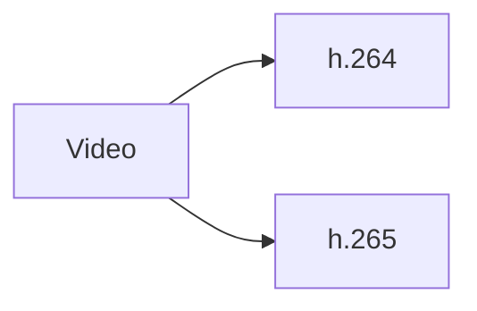
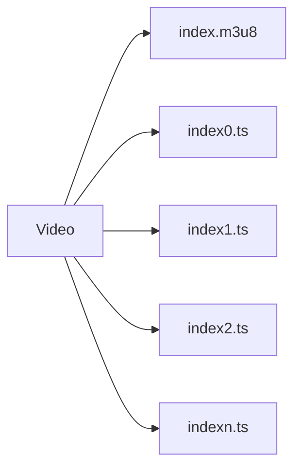
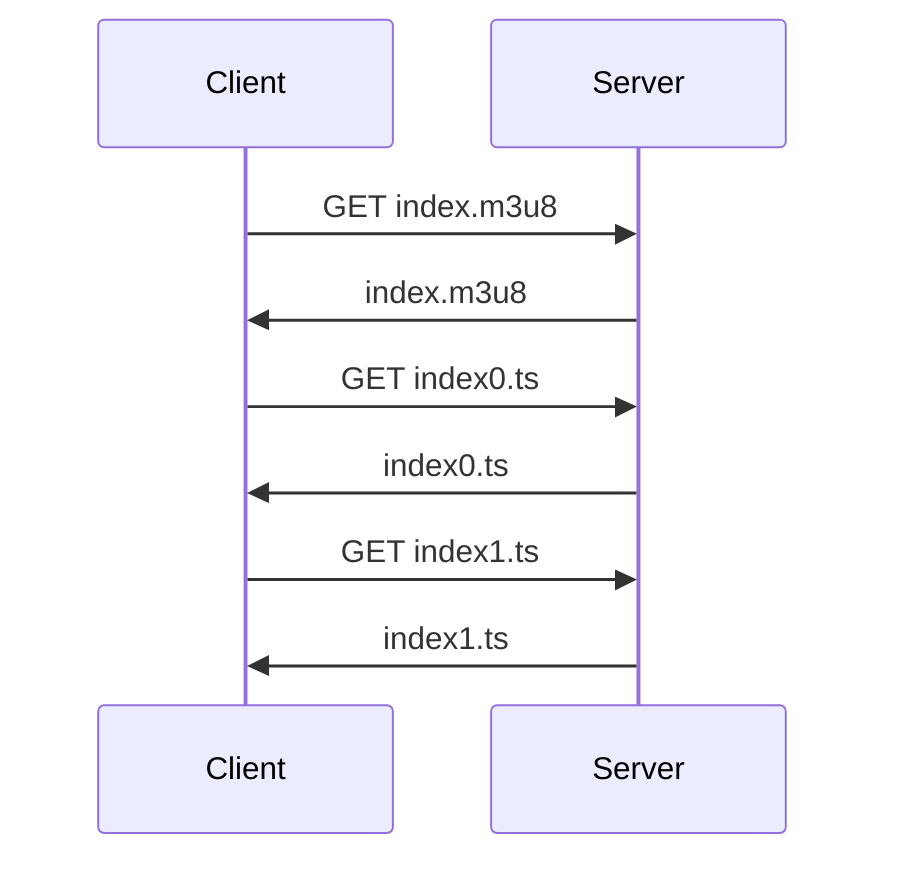

Almost all modern web applications perform some form of streaming, from video platforms to live streaming. In this post I explain how streaming works with HLS in such a simplified way that it will bring out your inner purist.

I leave you a minimal example of streaming in Go here in [my github repository](https://github.com/EduardoZepeda/go-hls-streaming-example), in case you want to see the code.

## Introduction to streaming

Videos and audios contain a lot of encoded information, so their handling and downloading strongly impacts the bandwidth and usage of any server.

Streaming is a process that allows us to continuously send small amounts of information, in the case of audio or video, which can be stored or generated by a webcam or microphone in real time.

### What's wrong with the HTTP protocol for playing videos and audios?

Normal users don't watch the complete audiovisual materials, yes, even you skip the paid advertising of your favorite influencers and sometimes you only watch 10 seconds of the video of some internet tutorials. If we were to use the HTTP protocol, the normal user would download a huge file, only to see a fraction of it. And he would have to wait for the download to complete before he could start playing it.

As you probably already know, sending the full video to all users would be pointless and consume huge amounts of bandwidth and I bet you don't want to make your cloud providers richer.

The solution? Streaming; an on-demand model, where each user receives only what they consume of the audio visual material, a little at a time, and if the user closes the video we do not send them the rest.

## Streaming protocols

Before you start, you should know that there are quite a few streaming protocols, each with its own particularities that you can delve into on your own:

* RTSP
* RTP
* RTCP
* HLS
* MPEG-DASH
* HDS

I will explain HLS, why? Because HLS uses the HTTP protocol, so it does not require specialized servers, and it is compatible with any device that connects to the Internet. Finally, we add that lately it is a popular protocol for video streaming.

## The HLS protocol

The HLS protocol is a protocol based on HTTP, developed by Apple (yes, the same Apple), so any device that can connect to the Internet will be compatible with this protocol. HLS uses TCP underneath to send the information, avoiding the potential packet loss of its counterpart, UDP. And, as icing on the cake, HLS reacts to changes in internet speed and prioritizes the sending of lighter versions of our files (with lower quality, of course). The player in conjunction with the HLS library takes care of this automatically and you don't have to worry about the details.

## Preparation of the files for HLS on the server

Video transmission using HLS is carried out in several steps. First, the video is encoded and divided into segments of fixed duration. Then, these segments are uploaded to an HTTP server and provided to the user's media player via a playback index, a file with extension M3U8, which is a simple text file containing information about the available video segments. The segments can be uploaded to a CDN for higher performance, and some CDNs can even handle the entire process of encoding and segmenting your video.

To implement the protocol on the server side we need two steps:

* Coding
* Partitioning

### Coding

HLS requires our files to be in a specific encoding, so first we need to encode our media file to H.264 or H.265 (quite popular nowadays), so that any device can read them.



If your original file is not in that encoding, you can use tools like [ffmpeg](https://ffmpeg.org/) to convert it.

``` bash
ffmpeg -i <input> -vcodec libx264 -acodec aac <output.mp4>
```

### Partitioning and creating an index for HLS

Then, the video or audio that we need to place in streaming is divided into several parts, generally with a few seconds of duration and, in order to know in which order each part goes, an index will also be created.



Partitioning for HLS can also be performed with ffmpeg.

``` bash
ffmpeg -i <tu-video>.mp4 -profile:v baseline -level 3.0 -start_number 0 -hls_time 10 -hls_list_size 0 -f hls index.m3u8
```

The index that stores the order of each generated segment is a file with ending _m3u8_, whose content looks something like this:

``` bash
#EXTM3U
#EXT-X-VERSION:3
#EXT-X-TARGETDURATION:13
#EXT-X-MEDIA-SEQUENCE:0
#EXTINF:10.333333,
index0.ts
#EXTINF:9.750000,
index1.ts
#EXTINF:13.458333,
index2.ts
#EXTINF:9.083333,
index3.ts
#EXTINF:9.208333,
index4.ts
#EXTINF:8.333333,
# ... RESTO DE FRAGMENTOS ...
#EXTINF:2.416667,
index24.ts
#EXT-X-ENDLIST
```

Each segment of the video is numbered in ascending order, each with a _ts_ extension so that you know where it belongs.

## HLS at the customer

That was the hardest part, now we just need to pass the index to our client and the client device will do the following:

1. Download the index,
2. Read the table of contents
3. Obtain the segment you require for the video according to the table of contents.
4. Add it to the playback queue
5. Read the index again to get the next segment and repeat the process.

All of the above with Javascript, the HLS player library is already developed and takes care of all this automatically.



### Example of HLS at the client

Look at this super simple example:

``` html
<script src="https://cdn.jsdelivr.net/npm/hls.js@latest"></script>
<!-- Cargamos la librería mediante un CDN o tu propio servidor -->
<video controls id="video"></video>
<!-- Cargamos la etiqueta de video -->
```

And now we proceed to load the index, or in another way, the file

``` javascript
var video = document.getElementById('video');
  if(Hls.isSupported()) {
    // Si soporta HlS 
    var hls = new Hls();
    hls.loadSource('http://tuservidor.com/ruta/index.m3u8');
    // carga el índice
    hls.attachMedia(video);
    //Una vez cargado el índice reproduce el video
    hls.on(Hls.Events.MANIFEST_PARSED,function() {
      video.play();
  });
 } else if (video.canPlayType('application/vnd.apple.mpegurl')) {
    video.src = 'http://tuservidor.com/ruta/stream';
    video.addEventListener('loadedmetadata',function() {
      video.play();
    });
  }
```

If you were to examine the browser you would see that the video is loaded bit by bit, and as it is needed, the browser requests the next video segment and automatically adds it to the playback.


## Preprocessing of videos for HLS on the server

If you will be in charge of processing the videos yourself, you may want to implement a service that will take care of encoding the videos to h.264 or h.265 and then split them into segments. After that you may want to link them to a notification system that lets your application know that the video processing is finished and can be played.

You may also want to have variants of the video with different quality, to be used in case of a slower connection on the client.

Of course, all of the above already depends on your architectural needs.

``` bash
#EXTM3U
#EXT-X-VERSION:6
#EXT-X-STREAM-INF:BANDWIDTH=1210000,RESOLUTION=480x360,CODECS="avc1.640015,mp4a.40.2"
index-360p.m3u8

#EXT-X-STREAM-INF:BANDWIDTH=2283600,RESOLUTION=640x480,CODECS="avc1.64001e,mp4a.40.2"
index-480p.m3u8

#EXT-X-STREAM-INF:BANDWIDTH=3933600,RESOLUTION=1280x720,CODECS="avc1.64001f,mp4a.40.2"
index-720p.m3u8
```

With this you have the minimum to create a basic example and go from there on your own.