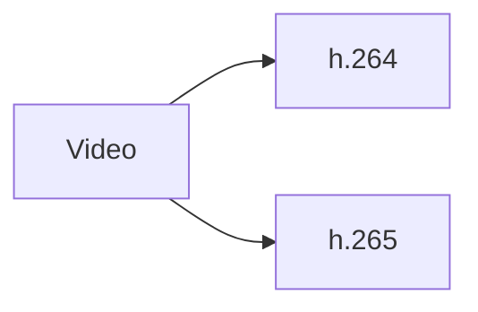
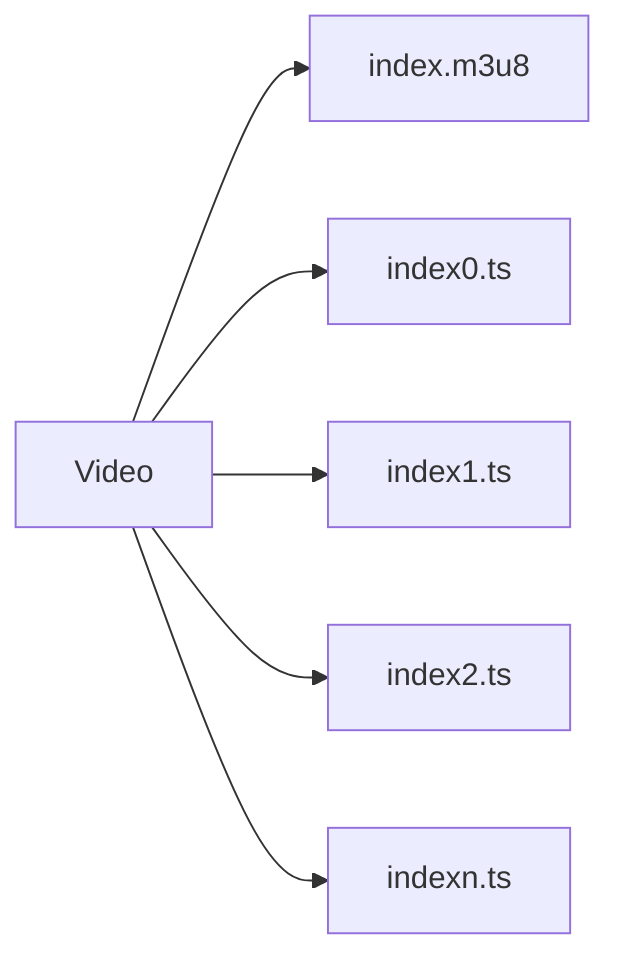
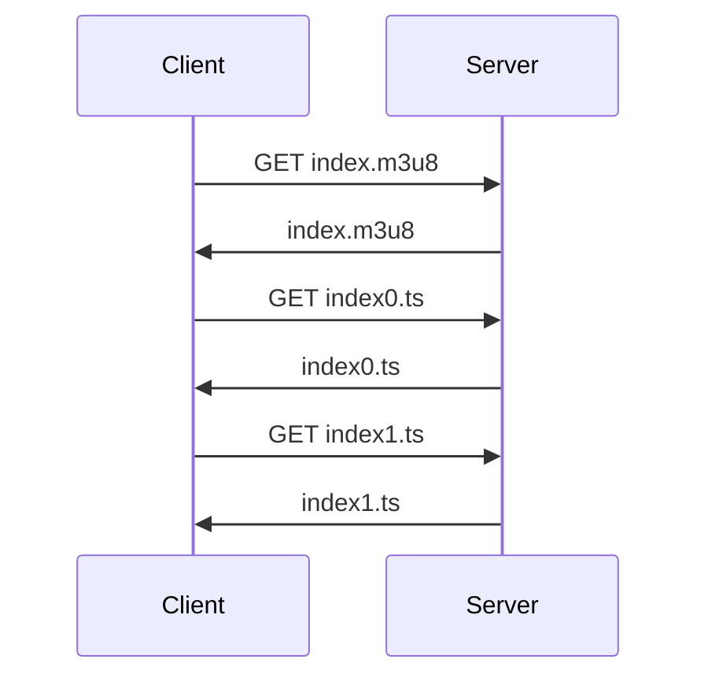

Casi todos las aplicaciones web modernas realizan algún tipo de streaming, desde las plataformas de video, hasta aquellas de streaming en vivo. En esta entrada te explico como funciona de una manera tan simplificada que sacará tu purista interior. 

## Introducción al streaming

Como ya sabes, los videos y los audios contienen muchísima información codificada, por lo que su manejo y descarga impacta fuertemente el uso y ancho de banda de cualquier servidor.

El streaming es un proceso que nos permite el envío continuo de pequeñas cantidades de información, en el caso de audio o video, estas pueden estar almacenadas o ser generadas mediante una cámara web o micrófono en tiempo real.

### ¿Qué tiene de malo el protocolo HTTP para reproducir videos y audios?

Los usuarios normales no miran los materiales audiovisuales completos, sí, tú te brincas la publicidad paga de tus influencers favoritos y a veces solo vez 10 segundos del video de algunos tutoriales de internet. Si usaramos el protocolo HTTP a secas, el usuario normal descargaría un archivo enorme, solo para ver una fracción de este. Y además tendría que esperar a que la descarga se realice completamente antes de empezar a reproducirlo.

Enviar el video completo a todos los usuarios sería un sin sentido y consumiría cantidades enormes de ancho de banda y apuesto a que no quieres volver más ricos a tus proveedores de cloud.

¿La solución? Streaming; un modelo de uso bajo demanda, donde cada usuario reciba solo lo que va consumiendo del material audio visual. ¿no? 

## Protocolos de streaming

Para realizar el streaming de multimedia existen varios protocolos:

* RTSP
* RTP
* RTCP
* HLS
* MPEG-DASH
* HDS

Cada protocolo tiene sus particularidades en las que puedes ahondar por tu cuenta.

Yo te voy a explicar HLS, ¿por qué? Porque HLS usa el protocolo HTTP, por lo que no requiere servidores especializados, además es compatible con cualquier dispositivo que se conecte a internet. Por último, le sumamos que últimamente es un protocolo bastante popular.

## El protocolo HLS

El protocolo HLS es un protocolo basado en HTTP, por lo que cualquier dispositivo que se pueda conectar a internet será compatible con este protocolo. HLS usa TCP por debajo para enviar la información, evitando la pérdida de paquetes de su contraparte, UDP.

## Preparación de los archivos para HLS en el servidor

Si quieres usar tu servidor directamente para realizar streaming usando el protocolo HLS puedes hacerlo sin problema, pues usa HTTP para funcionar, cualquier servidor puede serte útil para eso. Incluso puedes procesar tu mismo los videos, y servir el contenido estático. Otra opción a consaiderar es usar un CDN que se encargue de los pormenores.

Para implementar el protocolo en el lado del servidor necesitamos dos pasos:

* Codificación
* Particionado

### Codificación

Primero necesitamos codificar nuestro archivo multimedia usando H.264 o H.265 (bastante populares hoy en día), para que cualquier dispositivo los pueda leer. Si tu fuente no se encuentra en esa codificación, puedes echar mano de herramientas como [ffmpeg](https://ffmpeg.org/).



### Particionar y crear un índice para HLS

A continuación, el video o audio que necesitamos colocar en streaming se divide en varias partes, generalmente con unos segundos de duración y, para saber en que orden va cada parte se creará también un índice.



El particionado para HLS también puede llevarse a cabo con ffmpeg

``` bash
ffmpeg -i <tu-video>.mp4 -profile:v baseline -level 3.0 -start_number 0 -hls_time 10 -hls_list_size 0 -f hls index.m3u8
```

El índice que guarda el orden de cada fragmento generado es un archivo con terminación *m3u8* que luce más o menos así:

``` bash
#EXTM3U
#EXT-X-VERSION:3
#EXT-X-TARGETDURATION:13
#EXT-X-MEDIA-SEQUENCE:0
#EXTINF:10.333333,
index0.ts
#EXTINF:9.750000,
index1.ts
#EXTINF:13.458333,
index2.ts
#EXTINF:9.083333,
index3.ts
#EXTINF:9.208333,
index4.ts
#EXTINF:8.333333,
# ... RESTO DE FRAGMENTOS ...
#EXTINF:2.416667,
index24.ts
#EXT-X-ENDLIST
```

Cada fragmento del video está numerado de manera ascendente, cada uno con una extensión *ts* de manera que se sepa a donde pertenece.

## HLS en el cliente

Eso fue lo más dificil, ahora solo necesitamos pasarle el índice a nuestro cliente y el dispositivo del cliente descargará el índice, lo leerá y, mediante javascript, se encargará de ir ensamblando el video o audio de la manera en la que el índice le índique, descargando un fragmento cada vez.


Mira este ejemplo super sencillo:

``` html
<script src="https://cdn.jsdelivr.net/npm/hls.js@latest"></script>
<!-- Cargamos la librería mediante un CDN o tu propio servidor -->
<video controls id="video"></video>
<!-- Cargamos la etiqueta de video -->
```

Y ahora procedemos a cargar el índice, o de otra manera, el archivo

``` javascript
  var video = document.getElementById('video');
  if(Hls.isSupported()) {
    var hls = new Hls();
    hls.loadSource('http://tuservidor.com/ruta/index.m3u8');
    hls.attachMedia(video);
    hls.on(Hls.Events.MANIFEST_PARSED,function() {
      video.play();
  });
 } else if (video.canPlayType('application/vnd.apple.mpegurl')) {
    video.src = 'http://tuservidor.com/ruta/stream';
    video.addEventListener('loadedmetadata',function() {
      video.play();
    });
  }
```

Si examinarás el navegador verías que el video se va cargando poco a poco, y conforme se necesita, el navegador solicita el siguiente video y lo añade automáticamente a la reproducción.

