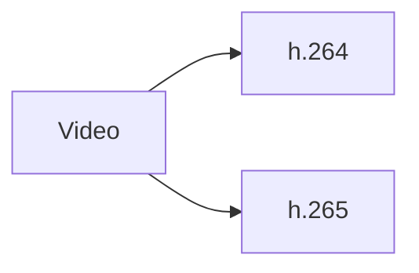
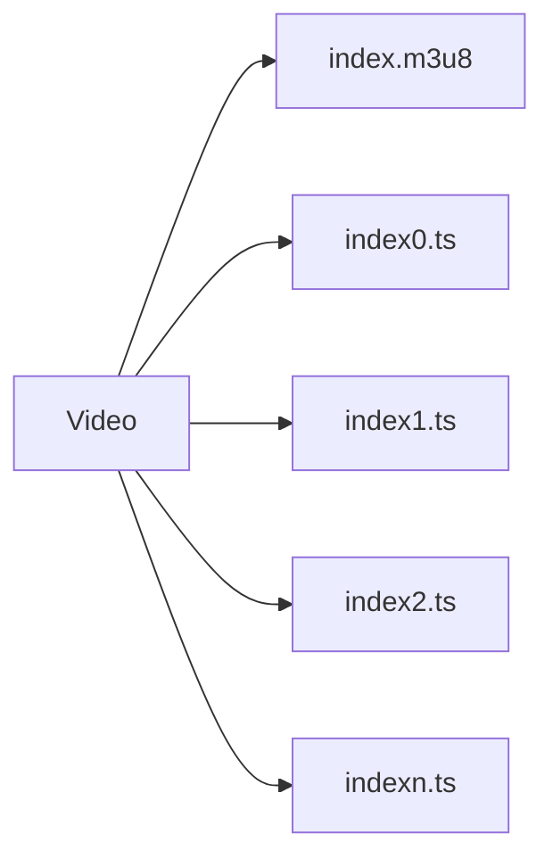
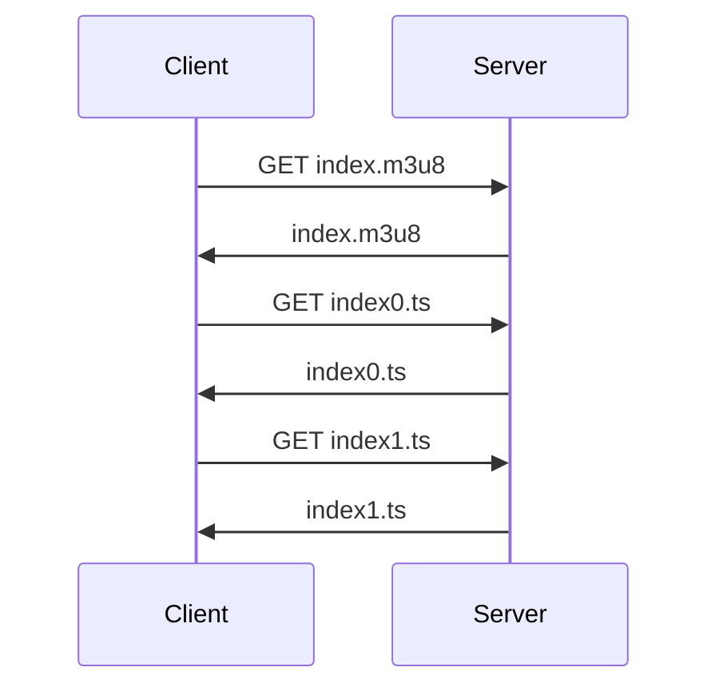
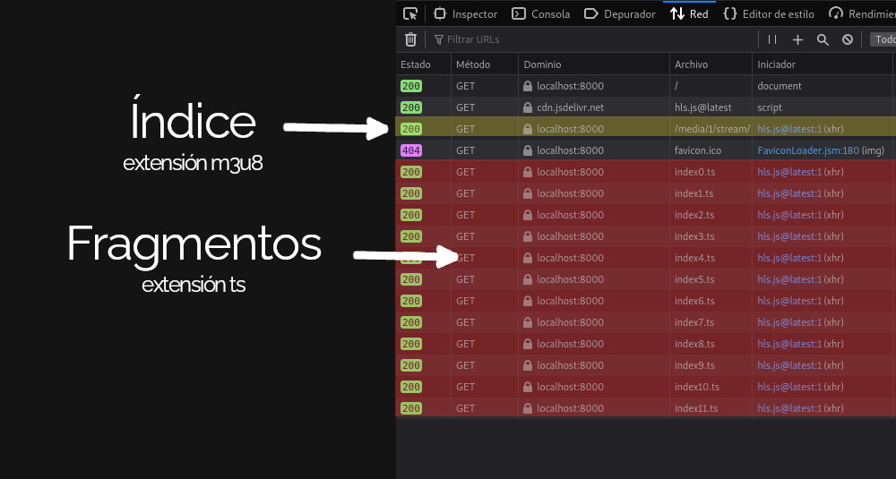

Casi todos las aplicaciones web modernas realizan algún tipo de streaming, desde las plataformas de video, hasta aquellas de streaming en vivo. En esta entrada te explico como funciona el streaming con HLS de una manera tan simplificada que sacará tu purista interior. 

Te dejo un ejemplo mínimo de streaming en Go aquí en [mi repositorio en github](https://github.com/EduardoZepeda/go-hls-streaming-example), por si quieres ver el código.

## Introducción al streaming

Los videos y los audios contienen muchísima información codificada, por lo que su manejo y descarga impacta fuertemente el uso y ancho de banda de cualquier servidor.

El streaming es un proceso que nos permite el envío continuo de pequeñas cantidades de información, en el caso de audio o video, estas pueden estar almacenadas o ser generadas mediante una cámara web o micrófono en tiempo real.

### ¿Qué tiene de malo el protocolo HTTP para reproducir videos y audios?

Los usuarios normales no miran los materiales audiovisuales completos, sí, incluso tú te brincas la publicidad paga de tus influencers favoritos y a veces solo vez 10 segundos del video de algunos tutoriales de internet. Si usaramos el protocolo HTTP a secas, el usuario normal descargaría un archivo enorme, solo para ver una fracción de este. Y además tendría que esperar a que la descarga se realice completamente antes de empezar a reproducirlo.

Como seguramente ya sabrás, enviar el video completo a todos los usuarios sería un sin sentido y consumiría cantidades enormes de ancho de banda y apuesto a que no quieres volver más ricos a tus proveedores de cloud.

¿La solución? Streaming; un modelo de uso bajo demanda, donde cada usuario reciba solo lo que va consumiendo del material audio visual, un poco a la vez y si el usuario cierra el video no le enviamos el resto.

## Protocolos de streaming

Antes de empezar debes saber que existen bastantes protocolos de streaming, cada uno con sus particularidades en las que puedes ahondar por tu cuenta:

* RTSP
* RTP
* RTCP
* HLS
* MPEG-DASH
* HDS

Yo te voy a explicar HLS, ¿por qué? Porque HLS usa el protocolo HTTP, por lo que no requiere servidores especializados, además es compatible con cualquier dispositivo que se conecte a internet. Por último, le sumamos que últimamente es un protocolo bastante popular para el streaming de video.

## El protocolo HLS

El protocolo HLS es un protocolo basado en HTTP, desarrollado por Apple (sí, la misma de la manzanita), por lo que cualquier dispositivo que se pueda conectar a internet será compatible con este protocolo. HLS usa TCP por debajo para enviar la información, evitando la potencial pérdida de paquetes de su contraparte, UDP. Y, como cereza del pastel, HLS reaccionar a cambios en la velocidad de internet y priorizar el envío de versiones más ligeras de nuestros achivos (con calidad menor, por supuesto). El reproductor en conjunción con la librería de HLS se encargan de esto de manera automática y tú no tienes que preocuparte de los detalles.

## Preparación de los archivos para HLS en el servidor

La transmisión de video usando HLS se lleva a cabo en varios pasos. Primero, se codifica el video y se divide en segmentos de duración fija. Luego, estos segmentos se suben a un servidor HTTP y se proporcionan al reproductor multimedia del usuario a través de un índice de reproducción, un arrchivo con extensión M3U8, que es un archivo de texto simple que contiene información sobre los segmentos de video disponibles. Los segmentos pueden subirse a un CDN para obtener un mayor rendimiento, inclusive algunos CDN pueden encargarse de todo el proceso de codificación y segmentación de tu video.

Para implementar el protocolo en el lado del servidor necesitamos dos pasos:

* Codificación
* Particionado

### Codificación

HLS requiere que nuestros archivos se encuentren en una codificación específica, por lo que primeramente necesitamos codificar nuestro archivo multimedia a H.264 o H.265 (bastante populares hoy en día), lo anterior para que cualquier dispositivo los pueda leer.



Si tu archivo original no se encuentra en esa codificación, puedes echar mano de herramientas como [ffmpeg](https://ffmpeg.org/) para convertirlo.

``` bash
ffmpeg -i <input> -vcodec libx264 -acodec aac <output.mp4>
```

### Particionar y crear un índice para HLS

A continuación, el video o audio que necesitamos colocar en streaming se divide en varias partes, generalmente con unos segundos de duración y, para saber en que orden va cada parte se creará también un índice.



El particionado para HLS también puede llevarse a cabo con ffmpeg.

``` bash
ffmpeg -i <tu-video>.mp4 -profile:v baseline -level 3.0 -start_number 0 -hls_time 10 -hls_list_size 0 -f hls index.m3u8
```

El índice que guarda el orden de cada segmento generado es un archivo con terminación *m3u8*, cuyo contenido luce más o menos así:

``` bash
#EXTM3U
#EXT-X-VERSION:3
#EXT-X-TARGETDURATION:13
#EXT-X-MEDIA-SEQUENCE:0
#EXTINF:10.333333,
index0.ts
#EXTINF:9.750000,
index1.ts
#EXTINF:13.458333,
index2.ts
#EXTINF:9.083333,
index3.ts
#EXTINF:9.208333,
index4.ts
#EXTINF:8.333333,
# ... RESTO DE FRAGMENTOS ...
#EXTINF:2.416667,
index24.ts
#EXT-X-ENDLIST
```

Cada segmento del video está numerado de manera ascendente, cada uno con una extensión *ts* de manera que se sepa a donde pertenece.

## HLS en el cliente

Eso fue lo más dificil, ahora solo necesitamos pasarle el índice a nuestro cliente y el dispositivo del cliente hará lo siguiente:
1. Descargará el índice, 
2. Leerá el índice
3. Obtendrá el segmento que requiere para el video de acuerdo al índice
4. Lo añadirá a la cola de reproducción
5. Leerá nuevamente el índice para obtener el siguiente segmento y se repetirá el proceso

Todo lo anterior con Javascript, la librería del HLS player ya está desarrollada y se encarga de todo esto de manera automática.



### Ejemplo de HLS en el cliente

Mira este ejemplo super sencillo:

``` html
<script src="https://cdn.jsdelivr.net/npm/hls.js@latest"></script>
<!-- Cargamos la librería mediante un CDN o tu propio servidor -->
<video controls id="video"></video>
<!-- Cargamos la etiqueta de video -->
```

Y ahora procedemos a cargar el índice, o de otra manera, el archivo

``` javascript
  var video = document.getElementById('video');
  if(Hls.isSupported()) {
    // Si soporta HlS 
    var hls = new Hls();
    hls.loadSource('http://tuservidor.com/ruta/index.m3u8');
    // carga el índice
    hls.attachMedia(video);
    //Una vez cargado el índice reproduce el video
    hls.on(Hls.Events.MANIFEST_PARSED,function() {
      video.play();
  });
 } else if (video.canPlayType('application/vnd.apple.mpegurl')) {
    video.src = 'http://tuservidor.com/ruta/stream';
    video.addEventListener('loadedmetadata',function() {
      video.play();
    });
  }
```

Si examinarás el navegador verías que el video se va cargando poco a poco, y conforme se necesita, el navegador solicita el siguiente segmento video y lo añade automáticamente a la reproducción.



## Preprocesado de videos para HLS en el servidor

Si tú mismo te encargarás de procesar los videos quizás quieras implementar un servicio que se encargue de la codificación de los videos a h.264 o h.265 y que, posteriormente los divida en segmentos. Tras lo anterior quizás quieras ligarlos a un sistema de notificaciones que le deje saber a tu aplicación que el procesado del video ha terminado y ya puede reproducirse. 

También puede que quieras tener variantes del video con diferente calidad, para que sean usadas en caso de una conexión más lenta en el cliente.

Por supuesto que todo lo anterior ya depende de tus necesidades de arquitectura.

``` bash
#EXTM3U
#EXT-X-VERSION:6
#EXT-X-STREAM-INF:BANDWIDTH=1210000,RESOLUTION=480x360,CODECS="avc1.640015,mp4a.40.2"
index-360p.m3u8

#EXT-X-STREAM-INF:BANDWIDTH=2283600,RESOLUTION=640x480,CODECS="avc1.64001e,mp4a.40.2"
index-480p.m3u8

#EXT-X-STREAM-INF:BANDWIDTH=3933600,RESOLUTION=1280x720,CODECS="avc1.64001f,mp4a.40.2"
index-720p.m3u8
```

Con esto tienes lo mínimo para crear un ejemplo básico y a partir de ahí ir por tu cuenta.